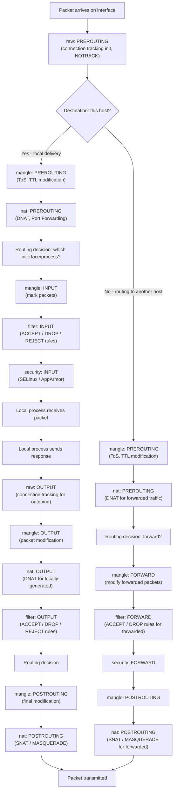
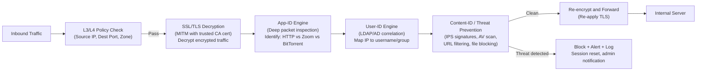

---
title: "Firewalls - Packet Filtering, Stateful Inspection, NGFW"
subject: "Computer Networks"
module: "07 - Network Security & Cryptography"
difficulty: "Advanced"
prerequisites:
  - "IP Addressing and Subnetting"
  - "TCP - Three-Way Handshake, Flow Control, Congestion Control"
  - "Transport Layer Security - TLS 1.2 vs TLS 1.3 Handshake"
  - "DNS - Resolution, Records, and Caching"
related:
  - "Distributed Denial of Service - DDoS Attack Vectors and Mitigations"
  - "Man-in-the-Middle - MitM, ARP Spoofing, DNS Cache Poisoning"
  - "Transport Layer Security - TLS 1.2 vs TLS 1.3 Handshake"
  - "Zero Trust Network Architecture - Microsegmentation, mTLS"
aliases:
  - "Firewall"
  - "Packet filtering"
  - "Stateful firewall"
  - "NGFW"
  - "Next-generation firewall"
  - "WAF"
  - "Web application firewall"
  - "iptables"
  - "nftables"
  - "eBPF XDP"
  - "ModSecurity"
tags:
  - network-security
  - firewall
  - iptables
  - nftables
  - ngfw
  - waf
  - ebpf
  - xdp
  - modsecurity
  - owasp-crs
  - aws-security-group
  - packet-filtering
status: "complete"
---

# Firewalls — Packet Filtering, Stateful Inspection, and NGFW

## Mental Model

A firewall is a **traffic inspector at a building entrance**. The simplest version (packet filter) is a security guard who checks only ID type and destination floor — "no one with a red badge goes past floor 3." Stateful inspection adds memory — "this visitor signed in at 9am and was expected on floor 3; now at 11am, this response from floor 3 going back to them is legitimate." NGFW is a full background-check security team — they know WHO you are (user identity), WHAT application you're running (App-ID), inspect your bag contents (SSL decryption + DPI), and match you against a known-threat database before you pass.

The evolution: **Packet Filter → Stateful Inspection → NGFW → eBPF XDP** reflects the arms race between attackers who move threats deeper into application layers and defenders who must inspect correspondingly deeper.

---

## Core Concepts / Architecture

### Firewall Generation Comparison

| Generation | Inspection Layer | State | Speed | Bypass Vectors |
|-----------|-----------------|-------|-------|---------------|
| Packet Filter (ACL) | L3/L4 headers only | Stateless | Very fast (~line rate) | Source port spoofing, fragmentation |
| Stateful Firewall | L3/L4 + connection tracking | Full session state | Fast | App-layer evasion, encrypted traffic |
| Application Firewall | L7 protocol decode | Session + app state | Medium | Tunneling over HTTP, obfuscation |
| NGFW | L3-L7, App-ID, User-ID, Threat | Deep state | Slower (SSL decrypt) | Zero-day exploits, novel protocols |
| eBPF/XDP | L3/L4, custom programs | Stateless/custom | Fastest (kernel bypass) | Not designed for L7 app inspection |

### iptables Architecture — 5 Tables and 5 Chains

```
Tables (processed in order):
  raw       → mangle → nat → filter → security

Chains per table:
  raw:      PREROUTING, OUTPUT
  mangle:   PREROUTING, INPUT, FORWARD, OUTPUT, POSTROUTING
  nat:      PREROUTING, INPUT, OUTPUT, POSTROUTING
  filter:   INPUT, FORWARD, OUTPUT        ← Most rules here
  security: INPUT, FORWARD, OUTPUT        ← SELinux/AppArmor mandatory access
```

---

## Visual Diagram

### iptables 5-Table Packet Lifecycle



### NGFW Inspection Pipeline



---

## Deep Dive

### 1. Packet Filtering (Stateless ACLs)

```bash
# Basic packet filter logic:
# Rule matched sequentially, first match wins.

# Simple ACL (router extended ACL syntax):
# permit tcp any host 203.0.113.1 eq 443    # Allow HTTPS to web server
# permit tcp any host 203.0.113.1 eq 80     # Allow HTTP to web server
# deny   ip  any any                        # Deny everything else

# iptables packet filter equivalent:
iptables -P INPUT DROP                # Default policy: DROP everything
iptables -P FORWARD DROP
iptables -P OUTPUT ACCEPT

# Allow established connections (stateless interpretation):
iptables -A INPUT -p tcp --tcp-flags SYN SYN -j ACCEPT    # Allow SYN (new connections)
# PROBLEM: Stateless cannot distinguish new vs established flow!
# This is why stateful (conntrack) is needed.
```

### 2. Stateful Inspection — Connection Tracking (conntrack)

```bash
# Linux connection tracking (Netfilter conntrack) maintains state table:
# State machine for TCP:
#   NEW:         SYN seen, no corresponding SYN-ACK yet
#   ESTABLISHED: 3-way handshake complete; bidirectional data flowing
#   RELATED:     FTP data connection related to FTP control connection
#   INVALID:     Does not match any known connection state
#   CLOSE_WAIT:  FIN received from server
#   TIME_WAIT:   Connection fully closed, waiting for late packets

# Proper stateful firewall rules:
iptables -A INPUT -m conntrack --ctstate ESTABLISHED,RELATED -j ACCEPT
iptables -A INPUT -m conntrack --ctstate INVALID -j DROP
iptables -A INPUT -p tcp --dport 443 -m conntrack --ctstate NEW -j ACCEPT
iptables -A INPUT -p tcp --dport 22 -m conntrack --ctstate NEW \
  -s 10.0.0.0/8 -j ACCEPT   # SSH only from internal network

# View conntrack table:
conntrack -L
# tcp      6 431999 ESTABLISHED src=192.168.1.10 dst=93.184.216.34 sport=52341 dport=443
#          src=93.184.216.34 dst=192.168.1.10 sport=443 dport=52341 [ASSURED] mark=0 use=1

# Conntrack table limits (DoS vector!):
cat /proc/sys/net/nf_conntrack_max          # Default: ~131072
cat /proc/sys/net/netfilter/nf_conntrack_count  # Current count

# Tune for high-traffic servers:
sysctl -w net.nf_conntrack_max=2000000
sysctl -w net.netfilter.nf_conntrack_tcp_timeout_established=300  # Default: 432000s (5 days!)
```

### 3. nftables vs iptables

```bash
# nftables is the modern replacement for iptables (Linux 3.13+, default in Debian 10+)
# Single tool replaces: iptables, ip6tables, arptables, ebtables
# Better performance (JIT compilation of rules), atomic rule updates

# iptables equivalent in nftables:
table inet filter {
    chain input {
        type filter hook input priority 0; policy drop;
        
        # Allow established/related:
        ct state established,related accept
        ct state invalid drop
        
        # Allow loopback:
        iifname lo accept
        
        # Allow ICMP ping:
        icmp type echo-request accept
        icmpv6 type echo-request accept
        
        # Allow SSH from internal:
        tcp dport 22 ip saddr 10.0.0.0/8 ct state new accept
        
        # Allow HTTPS:
        tcp dport { 80, 443 } ct state new accept
    }
    
    chain forward {
        type filter hook forward priority 0; policy drop;
    }
    
    chain output {
        type filter hook output priority 0; policy accept;
    }
}

# Apply nftables config:
nft -f /etc/nftables.conf
nft list ruleset    # View current ruleset
nft flush ruleset   # Clear all rules (CAREFUL!)
```

---

### 4. Next-Generation Firewall (NGFW) Deep Dive

#### App-ID (Application Identification)

NGFW identifies applications regardless of port number by analyzing packet content:

```
Traditional firewall:
  Port 80 = HTTP (assumption)
  Port 443 = HTTPS (assumption)
  
NGFW App-ID:
  Port 443 traffic => SSL decrypt => inspect application layer
  Decoded as: Zoom video call (proprietary protocol over 443)
  Apply policy: "Block Zoom for non-IT department users"
  
  Or:
  Port 443 traffic => App-ID signature match => detected as Tor (even without decryption)
  Apply policy: BLOCK (regardless of port)

App-ID signature types:
  - Application signatures: Byte patterns in payload (e.g., Zoom's DTLS fingerprint)
  - Protocol decoders: Full protocol parsers (HTTP, DNS, TLS, SIP)
  - Behavioral: Traffic pattern analysis (packet size distribution, timing)
  - Heuristics: ML-based classification for novel protocols
```

#### SSL/TLS Decryption (Forward Proxy)

```
NGFW acts as SSL forward proxy:
  1. Client connects to www.bank.com:443
  2. NGFW intercepts at SSL layer
  3. NGFW establishes SEPARATE TLS connection to www.bank.com (as "client")
  4. NGFW issues its OWN certificate for www.bank.com, signed by corporate CA
  5. Corporate CA cert installed in employee browser trust stores
  6. NGFW now sees plaintext HTTP between decrypted sessions
  7. NGFW applies App-ID, Threat Prevention, URL filtering to plaintext
  8. NGFW re-encrypts and forwards to www.bank.com (NGFW acts as real client)

Certificate pinning break:
  Problem: Apps that pin certificates (mobile banking apps, some APIs) will FAIL
  because NGFW's re-signed cert doesn't match pinned cert.
  Solution: SSL decryption bypass for pinned-cert applications.
  
Privacy concern: Corporate NGFW can decrypt employee personal banking traffic.
  Policy: Create decryption bypass for financial and healthcare sites.
  Log: All decrypted URLs logged (data retention, legal considerations).

Palo Alto NGFW decryption zones configuration:
  Source zone: internal-users
  Destination: any
  URL Category: financial-services, health-and-medicine
  Action: No Decrypt (bypass)
```

---

### 5. WAF (Web Application Firewall)

#### OWASP Core Rule Set (CRS) Pipeline

```
ModSecurity + OWASP CRS pipeline for incoming HTTP request:
  
  Phase 1: Connection/IP validation
    - IP reputation (known bad IPs from blocklists)
    - Rate limiting (too many requests per minute)
    - Geo-blocking (block high-risk countries if applicable)
    
  Phase 2: Request Headers analysis
    - Check Content-Type validity
    - Detect anomalous headers (SQLi in User-Agent, XSS in Referer)
    - Validate Content-Length (too large = block)
    
  Phase 3: Request Body analysis
    - Parse JSON/XML/form bodies
    - SQLi detection: UNION SELECT, OR 1=1, etc.
    - XSS detection: <script>, javascript:, event handlers
    - Command injection: ; cat /etc/passwd, | rm -rf, etc.
    - Path traversal: ../../../etc/passwd, %2e%2e%2f
    - LFI/RFI: file:// includes, remote PHP includes
    
  Phase 4: Response Headers analysis
    - Check for information disclosure (Server: Apache/2.2.15)
    - Remove sensitive headers from responses
    
  Phase 5: Response Body analysis
    - Credit card number leakage detection
    - PII pattern detection (SSNs, etc.)
    - Error message disclosure
```

#### ModSecurity Directive Syntax

```apache
# ModSecurity in nginx (with ModSecurity-nginx connector):
# /etc/nginx/conf.d/modsecurity.conf

modsecurity on;
modsecurity_rules_file /etc/modsecurity/modsecurity.conf;
modsecurity_rules_file /usr/share/modsecurity-crs/crs-setup.conf;
modsecurity_rules_file /usr/share/modsecurity-crs/rules/*.conf;

# Core ModSecurity rules (modsecurity.conf):
SecRuleEngine On              # Enforce rules (DetectionOnly = log only, don't block)
SecRequestBodyAccess On       # Inspect request bodies
SecResponseBodyAccess On      # Inspect response bodies
SecAuditEngine RelevantOnly   # Log only relevant transactions
SecAuditLog /var/log/modsecurity/audit.log

# Paranoia level (1=low false-positives, 4=maximum detection):
SecAction "id:900000,phase:1,nolog,pass,t:none,setvar:tx.paranoia_level=2"

# Example custom rule — block SQLi in URL parameter:
SecRule ARGS "@detectSQLi" \
    "id:1001,phase:2,deny,status:403,log,\
     msg:'SQL Injection Attack Detected',\
     logdata:'Matched Data: %{TX.0} found within %{MATCHED_VAR_NAME}: %{MATCHED_VAR}',\
     tag:'attack-sqli',\
     severity:'CRITICAL'"

# Whitelist legitimate traffic that triggers false positives:
SecRule REQUEST_URI "@beginsWith /api/search" \
    "id:1002,phase:1,nolog,pass,\
     ctl:ruleRemoveById=942100"   # Remove SQLi rule for search endpoint

# Rate limiting with ModSecurity:
SecAction "id:900700,phase:1,nolog,pass,\
           setvar:ip.request_rate+1,\
           expirevar:ip.request_rate=60"

SecRule IP:REQUEST_RATE "@gt 100" \
    "id:900710,phase:1,deny,status:429,\
     msg:'Rate limit exceeded',log"
```

---

### 6. eBPF XDP — High-Performance Packet Filtering

```
XDP (eXpress Data Path):
  - Runs eBPF programs at NIC driver level, BEFORE kernel networking stack
  - Processes packets in DRIVER receive function (RX path)
  - Can process 20+ Mpps per CPU core (vs ~1-3 Mpps for iptables)
  - No socket buffer allocation for dropped packets (zero-copy drop)
  - Used by Cloudflare, Facebook, Google for DDoS mitigation

XDP actions:
  XDP_DROP     = Drop packet at driver level (fastest, no allocation)
  XDP_PASS     = Pass to normal kernel networking stack
  XDP_TX       = Transmit back out same interface (for reflection attacks)
  XDP_REDIRECT = Redirect to another interface or CPU queue
  XDP_ABORTED  = Drop with error (for debugging)
```

```c
// Minimal XDP program in eBPF C (drop all UDP port 11211 = anti-Memcached DDoS):
#include <linux/bpf.h>
#include <linux/if_ether.h>
#include <linux/ip.h>
#include <linux/udp.h>

SEC("xdp")
int xdp_memcached_drop(struct xdp_md *ctx) {
    void *data = (void *)(long)ctx->data;
    void *data_end = (void *)(long)ctx->data_end;
    
    struct ethhdr *eth = data;
    if ((void *)(eth + 1) > data_end) return XDP_PASS;
    if (eth->h_proto != htons(ETH_P_IP)) return XDP_PASS;
    
    struct iphdr *ip = (void *)(eth + 1);
    if ((void *)(ip + 1) > data_end) return XDP_PASS;
    if (ip->protocol != IPPROTO_UDP) return XDP_PASS;
    
    struct udphdr *udp = (void *)ip + (ip->ihl * 4);
    if ((void *)(udp + 1) > data_end) return XDP_PASS;
    
    // Drop UDP traffic to/from port 11211 (Memcached):
    if (udp->dest == htons(11211) || udp->source == htons(11211))
        return XDP_DROP;
    
    return XDP_PASS;
}
```

```bash
# Compile and load XDP program:
clang -O2 -target bpf -c xdp_drop.c -o xdp_drop.o

# Attach to network interface:
ip link set dev eth0 xdp obj xdp_drop.o sec xdp

# Verify XDP program attached:
ip link show eth0 | grep xdp

# Using bpftool to inspect loaded programs:
bpftool prog list
bpftool prog show id <prog_id>
bpftool map dump id <map_id>   # View BPF maps (packet counters, blocklists)

# Remove XDP program:
ip link set dev eth0 xdp off
```

---

## Production Example: Full iptables Web Server Ruleset

```bash
#!/bin/bash
# Production iptables ruleset for a web server
# WEB_IP="203.0.113.1"    # Server's public IP
# MGMT_NETWORK="10.0.0.0/24"  # Internal management network

# Flush all existing rules:
iptables -F
iptables -X
iptables -t nat -F
iptables -t nat -X
iptables -t mangle -F
iptables -t mangle -X

# Default policies: DROP everything; allow outgoing:
iptables -P INPUT DROP
iptables -P FORWARD DROP
iptables -P OUTPUT ACCEPT

# Allow loopback:
iptables -A INPUT -i lo -j ACCEPT

# Allow established and related connections (CRITICAL - return traffic):
iptables -A INPUT -m conntrack --ctstate ESTABLISHED,RELATED -j ACCEPT

# Drop invalid packets (broken TCP state, fragment issues):
iptables -A INPUT -m conntrack --ctstate INVALID -j DROP

# Allow ICMP ping (rate limited to prevent ICMP flood):
iptables -A INPUT -p icmp --icmp-type echo-request \
  -m limit --limit 1/s --limit-burst 10 -j ACCEPT

# Allow SSH from management network only:
iptables -A INPUT -p tcp --dport 22 -s 10.0.0.0/24 \
  -m conntrack --ctstate NEW -j ACCEPT

# Allow HTTP and HTTPS from anywhere:
iptables -A INPUT -p tcp --dport 80 -m conntrack --ctstate NEW -j ACCEPT
iptables -A INPUT -p tcp --dport 443 -m conntrack --ctstate NEW -j ACCEPT

# SYN flood protection (SYN cookies + rate limit):
iptables -A INPUT -p tcp --syn \
  -m limit --limit 25/s --limit-burst 50 -j ACCEPT
iptables -A INPUT -p tcp --syn -j DROP  # Drop excess SYNs

# Port scan protection (log and drop Christmas tree packets):
iptables -A INPUT -p tcp --tcp-flags ALL ALL -j LOG \
  --log-prefix "XMAS_SCAN: " --log-level 4
iptables -A INPUT -p tcp --tcp-flags ALL ALL -j DROP
iptables -A INPUT -p tcp --tcp-flags ALL NONE -j DROP  # NULL scan

# Log and drop everything else:
iptables -A INPUT -j LOG --log-prefix "DROPPED: " --log-level 4
iptables -A INPUT -j DROP

# Save rules (persist across reboots):
iptables-save > /etc/iptables/rules.v4
ip6tables-save > /etc/iptables/rules.v6

echo "Firewall rules applied successfully"
iptables -L -n -v   # Verify
```

### AWS Security Group vs NACL Comparison

| Feature | Security Group | Network ACL |
|---------|---------------|-------------|
| State | Stateful | Stateless |
| Scope | ENI (instance level) | Subnet level |
| Direction | Inbound + Outbound | Inbound + Outbound (separate) |
| Rule evaluation | All rules evaluated | Numbered rules, first match wins |
| Default | Deny all inbound, allow all outbound | Allow all (default NACL) |
| Return traffic | Automatically allowed | Must explicitly allow return traffic |
| Protocol | TCP, UDP, ICMP, all | TCP, UDP, ICMP, all |
| Best for | Instance-level policy | Subnet-level coarse blocking |

```bash
# AWS Security Group: Allow HTTPS from anywhere, SSH from VPN:
aws ec2 create-security-group \
  --group-name web-server-sg \
  --description "Web server security group" \
  --vpc-id vpc-12345678

aws ec2 authorize-security-group-ingress \
  --group-id sg-12345678 \
  --protocol tcp --port 443 --cidr 0.0.0.0/0

aws ec2 authorize-security-group-ingress \
  --group-id sg-12345678 \
  --protocol tcp --port 22 --cidr 10.0.0.0/8   # VPN/internal only

# AWS NACL: Block a known attacker /24 at subnet level (stateless — must add for both directions):
aws ec2 create-network-acl-entry \
  --network-acl-id acl-12345678 \
  --ingress \
  --rule-number 50 \
  --protocol -1 \
  --cidr-block 198.51.100.0/24 \
  --rule-action deny

# Remember: NACL is stateless — if you allow inbound TCP 443,
# you must ALSO allow outbound ephemeral ports (1024-65535) for return traffic!
aws ec2 create-network-acl-entry \
  --network-acl-id acl-12345678 \
  --egress \
  --rule-number 100 \
  --protocol tcp \
  --port-range From=1024,To=65535 \
  --cidr-block 0.0.0.0/0 \
  --rule-action allow
```

---

## Failure Modes / Trade-offs

1. **Asymmetric Routing Breaks Stateful Inspection**
   - Problem: In multi-path networks (ECMP, BGP load balancing), a TCP SYN goes through firewall A, but the SYN-ACK returns through firewall B. Firewall B has no connection state for this session, drops the packet as INVALID. Service outage.
   - Mitigation: Session synchronization between firewall cluster nodes (Palo Alto HA, Cisco FWSM state sync); OR force symmetric routing via policy-based routing; OR stateless filtering at NGFW for ECMP deployments

2. **Connection Tracking Table Overflow**
   - Problem: High connection rate (DDoS, many short-lived connections) fills conntrack table. When full: new connections dropped with "connection tracking failed" errors even for legitimate traffic
   - Mitigation: `sysctl -w net.nf_conntrack_max=2000000`; reduce TCP timeouts (`tcp_established=300` vs default 432000); enable SYN cookies to avoid tracking SYN-only connections; rate limit new connection attempts per source IP

3. **NGFW SSL Decryption Performance**
   - Problem: SSL/TLS decryption adds 30-60% CPU overhead on NGFW hardware; at peak traffic, latency spikes and throughput drops significantly
   - Mitigation: Purpose-built SSL inspection ASIC (Palo Alto SP3, Fortinet NP7); selective decryption policy (exclude low-risk categories); hardware SSL offload cards; scale horizontally with NGFW cluster

4. **WAF False Positives Block Legitimate Traffic**
   - Problem: OWASP CRS paranoia level 3-4 blocks legitimate API calls containing SQL-like parameters, JSON with special characters, or large payloads. Business disruption from blocked requests
   - Mitigation: Start in Detection-Only mode; baseline legitimate traffic patterns; add targeted exclusion rules for specific rules+URIs (not global exclusions); use scoring mode (anomaly threshold) instead of individual-rule blocking

5. **Firewall-as-Chokepoint for East-West Traffic**
   - Problem: Routing all internal east-west traffic through a centralized firewall creates bottleneck at high traffic volumes (inter-service calls within data center)
   - Mitigation: Distributed firewalling via host-based iptables/nftables; Kubernetes NetworkPolicy; service mesh (Istio) mTLS AuthorizationPolicy for east-west; reserve NGFW for north-south and DMZ

6. **Certificate Pinning Breaking NGFW SSL Inspection**
   - Problem: Mobile apps, some APIs, and Chromium bypass NGFW SSL inspection due to certificate pinning — attacker traffic on mobile bypasses corporate WAF/NGFW
   - Mitigation: Maintain bypass list for pinned-cert applications; use mobile MDM to deploy corporate CA cert to device trust store (overrides some implementations); evaluate endpoint agents (Palo Alto GlobalProtect, Zscaler Client Connector) for mobile visibility

7. **eBPF XDP Cannot Inspect L7 Application Data**
   - Problem: XDP runs before kernel socket layer; it cannot access socket context, HTTP headers, or TLS-decrypted payloads. Only L3/L4 header inspection possible at XDP
   - Mitigation: Use XDP for initial high-rate L3/L4 filtering (DDoS mitigation); hand surviving packets to kernel stack for L7 inspection via WAF/NGFW; layer XDP + ModSecurity for complementary coverage

---

## Active-Recall Prompts

1. **Explain the difference between stateless packet filtering and stateful inspection. Give a concrete example where stateless filtering fails.**
   *(Answer: Stateless filtering checks each packet independently against ACL rules (src/dst IP, protocol, port). It has no memory of prior packets. Stateful inspection tracks connection state via conntrack — it knows if a packet is part of an established session or is a new connection attempt. Failure example: Stateless filter allows TCP port 80 inbound. An attacker sends a TCP ACK to port 80 with no prior SYN — stateless filter passes it (looks like legitimate traffic). Stateful filter DROPS it (no conntrack entry for this source:port pair — INVALID state).)*

2. **Trace a packet through the iptables 5-table processing pipeline for an inbound HTTPS request to a web server.**
   *(Answer: (1) raw:PREROUTING — connection tracking init; (2) mangle:PREROUTING — ToS/TTL changes if any; (3) nat:PREROUTING — DNAT check (is there a port-forward rule?); (4) Routing: local delivery since dst IP = server; (5) mangle:INPUT — packet marking; (6) filter:INPUT — check rules: -m conntrack ESTABLISHED,RELATED ACCEPT, or NEW tcp dport 443 ACCEPT; (7) security:INPUT — SELinux check; (8) Process receives packet. Response: filter:OUTPUT ACCEPT (return traffic), mangle:POSTROUTING, nat:POSTROUTING SNAT if needed, transmit.)*

3. **How does NGFW App-ID identify applications that run over HTTPS, where the payload is encrypted?**
   *(Answer: Several techniques: (1) SSL/TLS Fingerprinting — before decryption, the TLS ClientHello contains JA3 fingerprint (cipher suites, extensions, elliptic curves offered) — each application has a characteristic JA3 signature. (2) Certificate SNI — the TLS SNI field contains the hostname in plaintext even before decryption. (3) SSL Decryption — NGFW acts as SSL forward proxy, decrypts traffic, inspects HTTP payload, identifies application by content. (4) Network behavioral analysis — packet size distribution, timing, connection patterns. (5) IP reputation + Domain categorization — resolve SNI to categories without decryption.)*

4. **A web server behind a WAF receives a request with the URL: /search?q=1' OR '1'='1. Describe the OWASP CRS detection pipeline for this request.**
   *(Answer: Phase 2 (Request Body/URL analysis): (1) URL decoded: /search?q=1' OR '1'='1 (URL percent-decoding applied). (2) SQLi detection engine invokes: ModSecurity operator @detectSQLi or pattern match against OWASP CRS rule 942100 (SQLI_COMMON). (3) Pattern matches: single quote ('), OR keyword, comparison clause '1'='1 — classic OR-based SQL injection signature. (4) CRS anomaly score incremented by rule severity (CRITICAL = +5). (5) If cumulative anomaly score exceeds threshold (default 5 for CRITICAL): transaction blocked, 403 returned. (6) Audit log entry: matched rule ID, matched data, client IP, request URI, timestamp.)*

---

## Related Notes

- [[Distributed Denial of Service - DDoS Attack Vectors and Mitigations]]
- [[Man-in-the-Middle - MitM, ARP Spoofing, DNS Cache Poisoning]]
- [[Transport Layer Security - TLS 1.2 vs TLS 1.3 Handshake]]
- [[Zero Trust Network Architecture - Microsegmentation, mTLS]]
- [[IPv4 Addressing - Classful, Classless, CIDR, and Subnetting]]
- [[Transmission Control Protocol - TCP Header, Features, and Invariants]]

---

> **Interview Question**: *You are designing the network security architecture for a new three-tier web application (load balancer, application servers, database). Describe the complete firewall/security-group strategy, justifying each decision with specific threat mitigations.*
>
> **Model Answer**: **Tier 1 — Load Balancer (Public-facing)**: AWS Security Group allows TCP 80 and 443 from 0.0.0.0/0. DDoS protection via AWS Shield Advanced + WAF (rate limiting, CRS rules, geo-blocking for high-risk regions). NACL adds subnet-level IP blocklist for known bad ASNs (coarse, fast). Load balancer terminates TLS (SSL offload). **Tier 2 — Application Servers (Private subnet)**: Security Group allows TCP 8080 ONLY from load balancer security group ID (not IP range — SG references prevent IP spoofing across VPC). Allows TCP 22 from VPN/bastion host SG only. Denies all other inbound. NGFW or host-based WAF (ModSecurity on nginx) for L7 inspection: blocks OWASP Top 10 at application level. Outbound: allow TCP 5432 to database SG only; allow HTTPS to known APT/package repos and secrets manager; deny all other egress. **Tier 3 — Database (Isolated private subnet)**: Security Group allows TCP 5432 ONLY from application server security group. No public subnet access. No NAT gateway in this subnet (fully isolated). VPC Endpoint for AWS Secrets Manager (no internet traversal for credentials). Audit logging: all DBA connections logged to CloudTrail + CloudWatch. Encryption at rest (RDS AES-256) + in transit (SSL/TLS required, `require_ssl=true`). **Cross-cutting**: VPC Flow Logs enabled for all subnets → SIEM. CloudWatch alarms on anomalous traffic patterns. AWS Security Hub for compliance monitoring. Quarterly penetration testing of the architecture.

---
*Last updated: 2026-08-18 | Status: Complete | Module 7 — Network Security & Cryptography*
