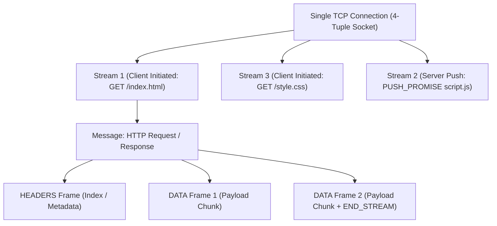
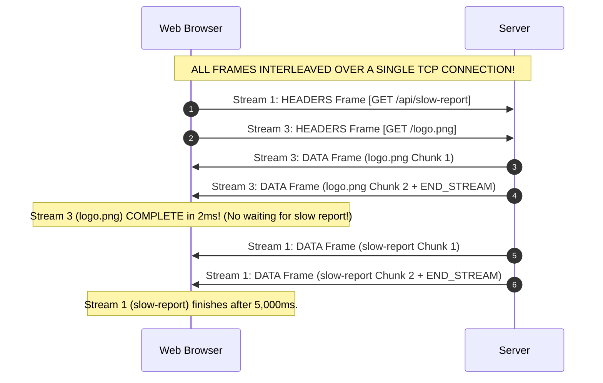
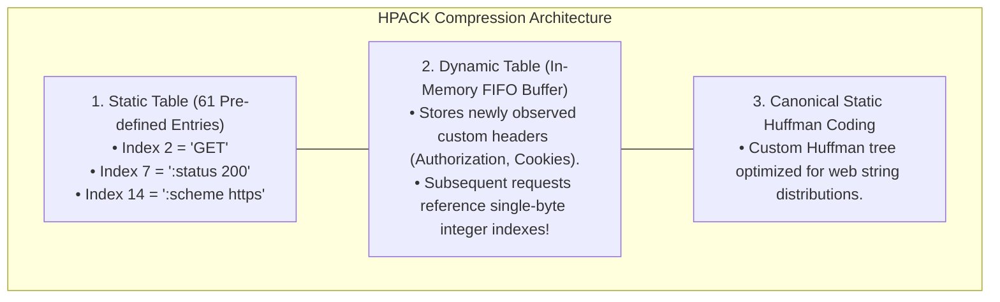
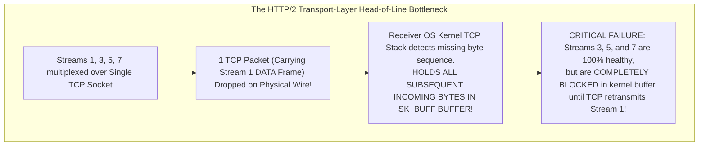

# HTTP/2: Binary Framing Layer, Stream Multiplexing, HPACK, and Transport Bottlenecks

> [!abstract] Mental Model
> - **The Multi-Track High-Speed Railway**: HTTP/1.1 was a single-lane road plagued by ASCII text parsing overhead, domain sharding, and FIFO Head-of-Line blocking.
> - **HTTP/2 (RFC 7540 / RFC 9113)** introduces a foundational **Binary Framing Layer** that breaks requests and responses into discrete binary frames, multiplexing thousands of concurrent bidirectional streams over a **single persistent TCP connection**.

---

## 1. The Core Hierarchy: Connection, Stream, Message, and Frame



---

## 2. The 9-Byte Binary Frame Header Format

```
 0                   1                   2                   3
 0 1 2 3 4 5 6 7 8 9 0 1 2 3 4 5 6 7 8 9 0 1 2 3 4 5 6 7 8 9 0 1
+-+-+-+-+-+-+-+-+-+-+-+-+-+-+-+-+-+-+-+-+-+-+-+-+-+-+-+-+-+-+-+-+
|                 Length (24 Bits)              |  Type (8b)    |
+-+-+-+-+-+-+-+-+-+-+-+-+-+-+-+-+-+-+-+-+-+-+-+-+-+-+-+-+-+-+-+-+
|   Flags (8b)  |R|              Stream Identifier (31 Bits)    |
+-+-+-+-+-+-+-+-+-+-+-+-+-+-+-+-+-+-+-+-+-+-+-+-+-+-+-+-+-+-+-+-+
|                     Frame Payload (Variable)                  |
+-+-+-+-+-+-+-+-+-+-+-+-+-+-+-+-+-+-+-+-+-+-+-+-+-+-+-+-+-+-+-+-+
```

### Field Specifications & Standard Frame Types

| Field / Frame Type | Bit Width | Technical Mechanics & Protocol Invariants |
| :--- | :---: | :--- |
| **Length** | $24\text{ Bits}$ | Payload size in bytes (default max $16,384\text{B} = 16\text{ KB}$, configurable up to $16\text{ MB}$). |
| **Type** | $8\text{ Bits}$ | `DATA (0x0)`, `HEADERS (0x1)`, `PRIORITY (0x2)`, `RST_STREAM (0x3)`, `SETTINGS (0x4)`, `PUSH_PROMISE (0x5)`, `PING (0x6)`, `GOAWAY (0x7)`, `WINDOW_UPDATE (0x8)`, `CONTINUATION (0x9)`. |
| **Flags** | $8\text{ Bits}$ | Modifiers: `END_STREAM (0x1)` (last chunk), `END_HEADERS (0x4)`, `ACK (0x1)`. |
| **Stream ID** | $31\text{ Bits}$ | `0`: Connection-level control.<br/>**Odd IDs**: Client-initiated.<br/>**Even IDs**: Server-initiated (Push). |

---

## 3. Full Multiplexing & Frame Interleaving

HTTP/2 interleaves binary frames from different streams across the wire concurrently, eliminating HTTP/1.1 application HoL blocking:



---

## 4. HPACK: High-Performance Header Compression (RFC 7541)

In HTTP/1.1, repetitive headers (`User-Agent`, `Cookie`, `Authorization`) wasted 1KB+ per request. **HPACK** reduces header overhead by $85\% - 95\%$:



---

## 5. Stream Prioritization & Flow Control

1. **Stream Priority Dependency Trees**:
   - Clients define a dependency tree where streams have a parent dependency and an integer weight ($1 - 256$).
   - Servers allocate CPU and bandwidth proportionally according to the weight tree (e.g. Critical CSS receives $80\%$ bandwidth; background telemetry receives $5\%$).
2. **Dual-Level Credit-Based Flow Control**:
   - Both the **Connection** and each **Individual Stream** have separate credit windows regulated via `WINDOW_UPDATE` frames. Prevents a single fast stream from exhausting server receive memory.

---

## 6. The Remaining Bottleneck: TCP Transport-Layer Head-of-Line Blocking



> [!important] The Transition to HTTP/3
> While HTTP/2 solved **Application-Layer** HoL blocking, its reliance on a single TCP connection made it vulnerable to **Transport-Layer** HoL blocking over lossy networks (Wi-Fi/Cellular). This single flaw drove the development of **[[HTTP-3 and QUIC - UDP-Based Transport, Head-of-Line Blocking Elimination|HTTP/3 on top of QUIC / UDP]]**.

---

## Production Diagnostics & Protocol Inspection

```bash
# 1. Test HTTP/2 Handshake & Negotiation via ALPN with curl:
curl -I --http2 -v https://example.com/

# Output:
# * ALPN: offers h2, http/1.1
# * ALPN: server accepted h2
# * Using HTTP2, server supports multiplexing
# < HTTP/2 200
# < content-type: text/html; charset=UTF-8
# < server: ECS (phd/FD69)

# 2. Inspect Live HTTP/2 Binary Frames via nghttp CLI:
nghttp -nv https://nghttp2.org/

# Output:
# [  0.012] send SETTINGS frame <length=12, flags=0x00, stream_id=0>
# [  0.015] send HEADERS frame <length=39, flags=0x05, stream_id=1>
#           ; END_STREAM | END_HEADERS
#           (padlen=0) :method: GET
#           :path: /
# [  0.028] recv SETTINGS frame <length=0, flags=0x01, stream_id=0> ; ACK
# [  0.030] recv HEADERS frame <length=142, flags=0x04, stream_id=1>
#           :status: 200
```

---

## Active Recall & Interview Perspective

### Reasoning Prompts
1. *How does the Binary Framing Layer in HTTP/2 eliminate the Application-Layer Head-of-Line (HoL) blocking of HTTP/1.1?*
   - **Answer**: In HTTP/1.1, messages were transmitted as uninterrupted monolithic streams of ASCII text, requiring the entire response for Request #1 to finish before Response #2 could begin on that connection. HTTP/2 inserts a **Binary Framing Layer** that slices every request and response message into small, self-contained binary frames tagged with a **31-bit Stream Identifier**. Because each frame is an independent unit, the sender can interleave frames from hundreds of concurrent streams over a single TCP socket. A large or slow response (Stream 1) emits frames intermittently without blocking frames of a fast static asset (Stream 3), allowing Stream 3 to complete immediately without waiting for Stream 1.
2. *How does HPACK header compression differ from generic gzip/deflate compression, and why was a specialized algorithm created?*
   - **Answer**: Generic compression algorithms like gzip/deflate use LZ77 and Huffman coding, which compress data by referencing repeated byte patterns across the entire stream. In 2012, researchers discovered the **CRIME vulnerability (Compression Ratio Info-leak Made Easy)**: an attacker could inject plaintext into an HTTPS request and observe subtle changes in the compressed message length to deduce secret headers like session cookies byte-by-byte. **HPACK (RFC 7541)** was designed specifically to eliminate CRIME side-channel vulnerabilities while maximizing efficiency: it isolates header names and values, maintains strict **Static and Dynamic indexing tables** across request lifetimes, and applies **Canonical Static Huffman Coding** without cross-field LZ77 string matching.
3. *Why does packet loss on a high-latency network degrade HTTP/2 performance worse than HTTP/1.1 with domain sharding?*
   - **Answer**: In HTTP/1.1 with domain sharding, the browser opens 6 independent TCP connections. If a packet is dropped on Connection #1, only Connection #1 stalls while the remaining 5 TCP connections continue transmitting data unaffected. In HTTP/2, all streams are multiplexed over a **single TCP socket**. Because TCP enforces a strict, ordered byte stream at Layer 4, a single dropped packet forces the receiver's kernel TCP stack to buffer all subsequent incoming packets until the missing packet is retransmitted (Transport-Layer HoL blocking). Consequently, **all multiplexed HTTP/2 streams on that connection are completely frozen simultaneously**, causing severe latency degradation on lossy networks ($1\% - 2\%$ packet loss).

---

## Key Takeaways
- HTTP/2 uses a **9-Byte Binary Frame Header** (`Length`, `Type`, `Flags`, `Stream ID`).
- **Stream Multiplexing** interleaves frames from hundreds of requests over a single TCP socket.
- **HPACK (RFC 7541)** compresses headers using **Static/Dynamic tables** and **Huffman coding**.
- **Transport HoL Blocking**: A single TCP packet drop halts *all* multiplexed streams, necessitating HTTP/3.

---

## Related Notes
- [[Computer Networks MOC]] — Master table of contents for Computer Networks.
- [[Transmission Control Protocol - TCP Header, Features, and Invariants]] — Underlying transport foundation.
- [[TCP Flow Control - Sliding Window and Silly Window Syndrome]] — Window updates vs HTTP/2 flow control.
- [[Hypertext Transfer Protocol - HTTP 1.0, 1.1, Pipelining, Persistent Connections]] — Predecessor protocol comparison.
- [[HTTP-3 and QUIC - UDP-Based Transport, Head-of-Line Blocking Elimination]] — Eliminates TCP transport HoL blocking.
- [[gRPC and Protocol Buffers]] — Built natively on HTTP/2 binary framing and multiplexing.
- [[Transport Layer Security - TLS 1.2 vs TLS 1.3 Handshake]] — ALPN negotiation for HTTP/2.
