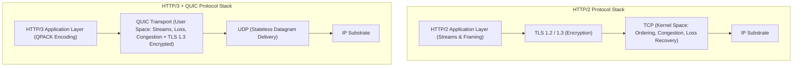
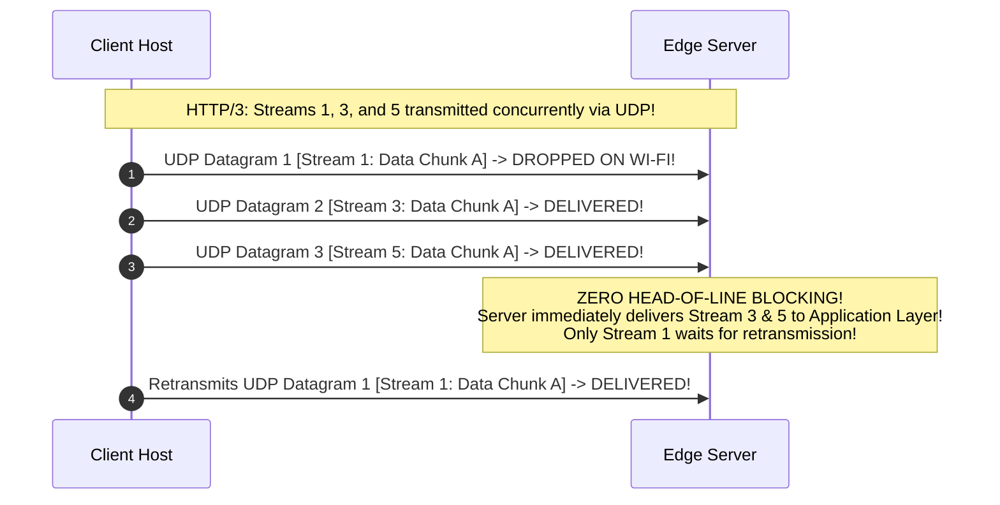
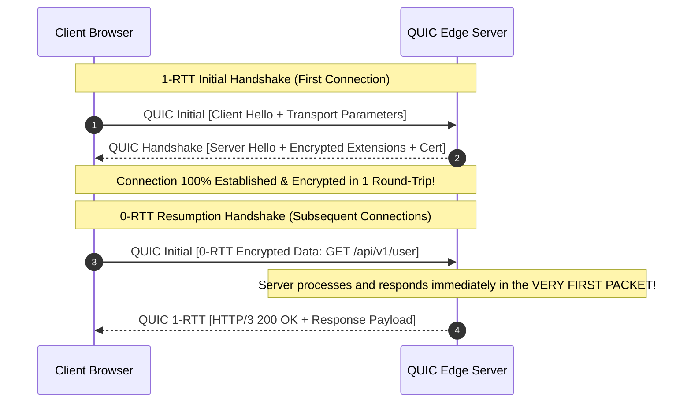
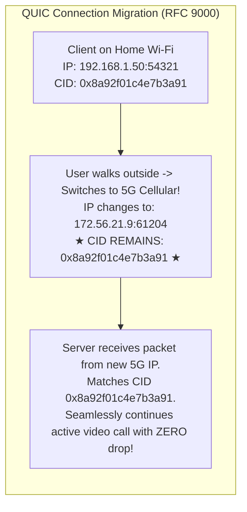
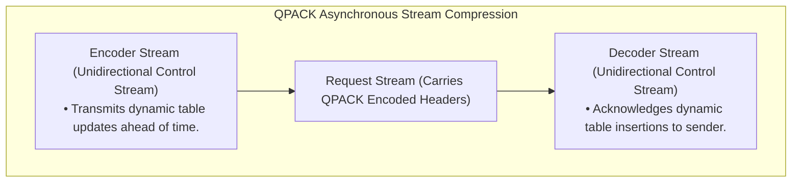

# HTTP/3 and QUIC: UDP-Based Transport, 0-RTT, Connection Migration, and QPACK

> [!abstract] Mental Model
> - **The User-Space Cryptographic Transport Paradigm**: Decades of middlebox ossification trapped TCP in kernel space, rendering protocol upgrades impossible and saddling HTTP/2 with Transport-Layer Head-of-Line blocking.
> - **QUIC (RFC 9000)** and **HTTP/3 (RFC 9114)** abandon TCP entirely, constructing a high-speed, multiplexed, encrypted transport layer directly on top of **raw UDP**. It provides **True Independent Stream Isolation**, **0-RTT Handshakes**, **Seamless Connection Migration** across IP/Wi-Fi transitions, and out-of-order **QPACK compression**.

---

## 1. The Protocol Stack Architectural Inversion



---

## 2. Elimination of Transport-Layer Head-of-Line (HoL) Blocking

In HTTP/2, stream multiplexing was managed at Layer 7 while Layer 4 TCP treated all traffic as a single byte stream. In **QUIC**, streams are native first-class Layer 4 transport primitives:



---

## 3. 0-RTT Connection Establishment

By integrating the transport handshake and TLS 1.3 cryptographic key negotiation into a single protocol pass, QUIC reduces connection establishment to zero overhead on reconnects:



---

## 4. Connection Migration via 64-Bit Connection IDs (CIDs)

### The TCP Invariant Failure:
TCP binds socket identity to the 4-tuple (`Src IP, Src Port, Dst IP, Dst Port`). When a user steps out of their home, transitioning from Wi-Fi to 5G cellular, their local IP changes, causing all active TCP connections to crash with `ECONNRESET`.



---

## 5. QPACK: Header Compression for Out-of-Order Transports (RFC 9204)

HPACK (HTTP/2) required strict sequential order to update its dynamic compression table. Because QUIC streams arrive out-of-order over UDP, HPACK would cause transport stalls.



---

## 6. Monotonically Increasing Packet Numbers & Total Wire Encryption

1. **Elimination of Retransmission Ambiguity**:
   - In TCP, a retransmitted packet carries the identical Sequence Number.
   - In QUIC, **every UDP packet receives a strictly increasing Packet Number**, even when retransmitting identical payload data. Eliminates Karn's ambiguity completely!
2. **Total Wire Encryption**:
   - Unlike TCP headers (which are plaintext and inspected/modified by middleboxes), QUIC headers, packet numbers, flags, and payload are **100% encrypted and authenticated** via TLS 1.3 AEAD ciphers. Middleboxes cannot tamper with or ossify QUIC.

---

## Production Diagnostics & Protocol Verification

```bash
# 1. Inspect HTTP/3 Negotiation via Alt-Svc Header with curl:
curl -I -v https://cloudflare.com/

# Output:
# < HTTP/2 200
# < alt-svc: h3=":443"; ma=86400, h3-29=":443"; ma=86400

# 2. Execute Direct Native HTTP/3 Request over UDP Port 443:
curl --http3 -I -v https://cloudflare-quic.com/

# Output:
# * Connect to cloudflare-quic.com port 443 via UDP
# * Using HTTP3, server supports multiplexing
# * QUIC connection established (TLS 1.3 / AES-128-GCM)
# < HTTP/3 200
# < content-type: text/html; charset=UTF-8

# 3. Capture QUIC UDP Traffic via tcpdump:
sudo tcpdump -i eth0 -nn "udp port 443"
```

---

## Active Recall & Interview Perspective

### Reasoning Prompts
1. *Why was UDP selected as the underlying transport protocol for QUIC and HTTP/3 instead of designing a new Layer 4 protocol (like SCTP)?*
   - **Answer**: The global internet infrastructure suffers from severe **middlebox ossification**: millions of residential NAT routers, corporate firewalls, and ISP deep-packet inspection (DPI) appliances hardcode support strictly for IP protocols 6 (TCP) and 17 (UDP). Any attempt to deploy a novel IP protocol number (such as SCTP / Protocol 132) results in $>90\%$ packet drop rates across transit networks. By encapsulating QUIC inside standard **UDP datagrams (Port 443)**, QUIC traverses all existing internet middleboxes without modification, while user-space client and server applications retain full autonomy to innovate and evolve transport algorithms.
2. *How does QUIC Connection Migration eliminate the connection drops that plague TCP when mobile devices switch between Wi-Fi and Cellular?*
   - **Answer**: In TCP, a connection's kernel state is strictly anchored to the physical network 4-tuple (`Src IP, Src Port, Dst IP, Dst Port`). When a mobile device switches from Wi-Fi to Cellular, its source IP address changes instantly, rendering the old TCP socket invalid and causing active streams to crash with `ECONNRESET`. QUIC decouples transport identity from the network IP address by embedding an opaque **64-bit Connection ID (CID)** inside every QUIC packet header. When the client's network interface switches, it transmits UDP packets from its new cellular IP carrying the existing CID. The server inspects the CID, verifies path ownership via a lightweight cryptographic `PATH_CHALLENGE`/`PATH_RESPONSE` frame exchange, and transparently migrates the active session without restarting handshakes or dropping application state.
3. *Why was QPACK designed to replace HPACK for HTTP/3, and what catastrophic failure would occur if HPACK were used over QUIC?*
   - **Answer**: HPACK relies on the invariant that all HTTP/2 binary frames are delivered in strict, reliable FIFO order over a single TCP connection. When a sender inserts a new header into its dynamic table, it immediately references that table entry in subsequent frames. Over QUIC, however, UDP datagrams may be reordered or lost independently across different streams. If HPACK were used, a packet on Stream 3 referencing a dynamic table entry created on Stream 1 would be forced to block and stall if Stream 1's packet were dropped or delayed on the network. This would re-introduce **Transport-Layer Head-of-Line Blocking** into HTTP/3. **QPACK (RFC 9204)** solves this by utilizing dedicated, unidirectional **Encoder and Decoder control streams** to synchronize table modifications asynchronously and allow streams to decode headers without blocking on unrelated streams.

---

## Key Takeaways
- **HTTP/3 + QUIC** runs over **UDP Port 443**, moving transport and congestion control to user space.
- **Stream Isolation**: A dropped packet on Stream 1 causes **zero latency stalls** on Streams 3, 5, or 7.
- **0-RTT Handshakes** combine transport and TLS 1.3 security into a single pass.
- **Connection Migration (CID)** maintains sessions across Wi-Fi $\leftrightarrow$ 5G mobile IP changes.
- **QPACK (RFC 9204)** delivers asynchronous out-of-order header compression.

---

## Related Notes
- [[Computer Networks MOC]] — Master table of contents for Computer Networks.
- [[User Datagram Protocol - UDP Architecture and Checksum]] — Foundation for QUIC datagrams.
- [[Transmission Control Protocol - TCP Header, Features, and Invariants]] — TCP comparison.
- [[HTTP-2 - Binary Framing, Multiplexing, Stream Priorities, HPACK]] — Predecessor protocol comparison.
- [[Transport Layer Security - TLS 1.2 vs TLS 1.3 Handshake]] — Integrated cryptographic engine in QUIC.
- [[Dynamic Routing of Web Traffic - Anycast, CDN Architecture, Edge Computing]] — CDN Anycast deployment of HTTP/3.
