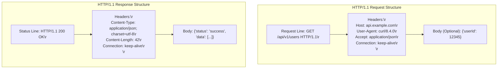
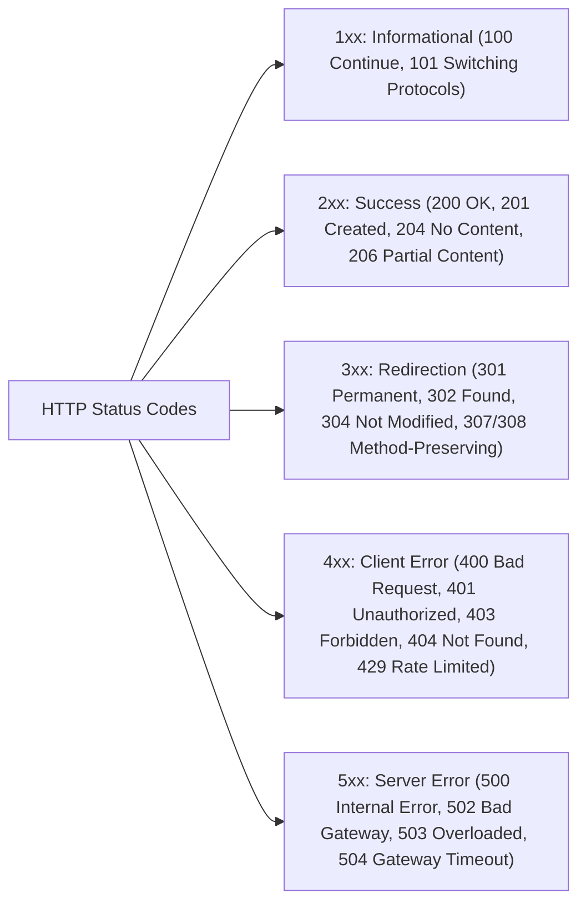
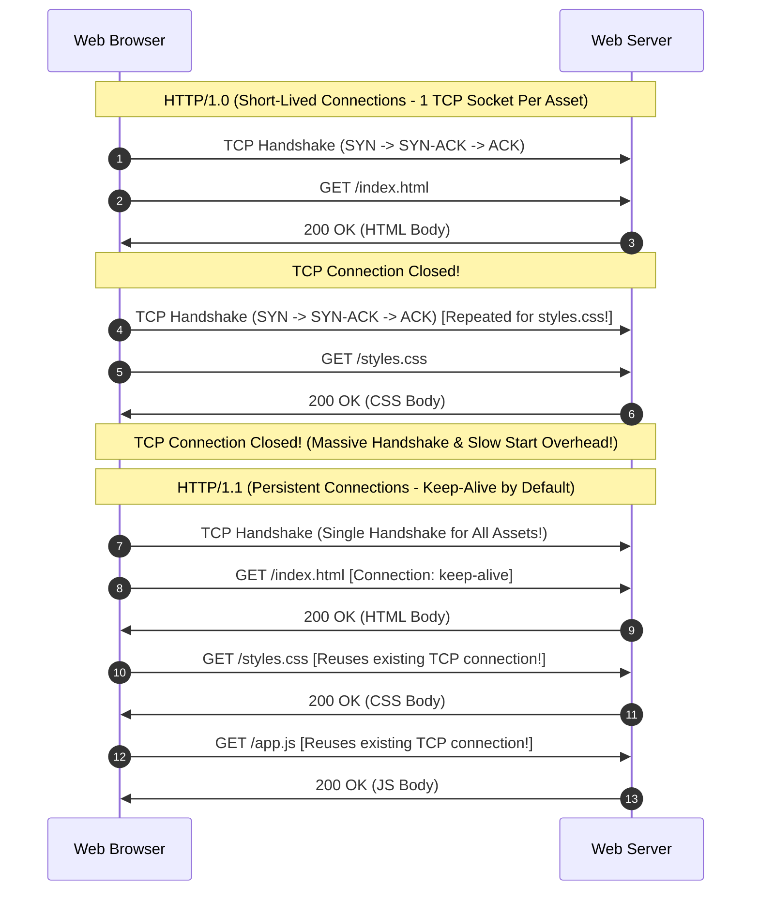
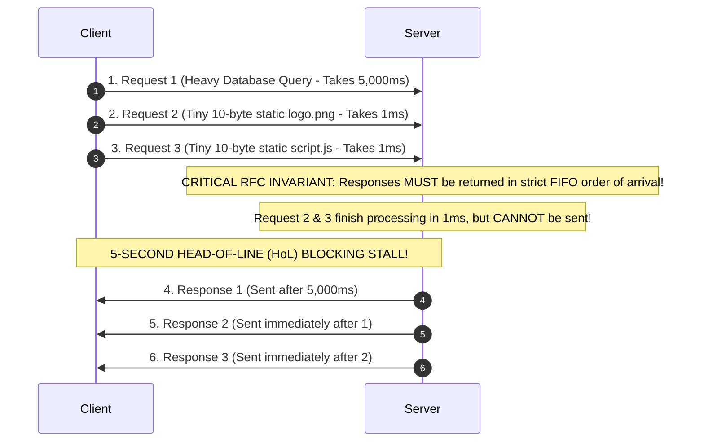

# Hypertext Transfer Protocol (HTTP): HTTP/1.0, HTTP/1.1, Persistent Connections, and Head-of-Line Blocking

> [!abstract] Mental Model
> - **The Request-Response Web Standard**: An ASCII-based application protocol governing how clients fetch resources from servers over a reliable transport stream.
> - **HTTP/1.0** established single-shot request-response exchanges that suffered massive TCP handshake overhead. **HTTP/1.1** introduced **Persistent Connections (`keep-alive`)**, **Chunked Transfer Encoding**, and mandatory **Host headers**, but remained fatally crippled by **Application-Layer Head-of-Line (HoL) Blocking**.

---

## 1. Anatomy of an HTTP Message (RFC 7230 / RFC 9112)

Every HTTP/1.x transaction consists of human-readable ASCII text terminated by CRLF (`\r\n`):



---

## 2. HTTP Methods, Safety, and Idempotency

| Method | Safe? ($f(x) \implies \text{No Side Effects}$) | Idempotent? ($f(f(x)) = f(x)$) | Canonical Semantic Purpose |
| :--- | :---: | :---: | :--- |
| **`GET`** | **Yes** | **Yes** | Retrieve resource representation without state mutation. |
| **`HEAD`** | **Yes** | **Yes** | Identical to `GET` but returns response headers only (no body). |
| **`OPTIONS`**| **Yes** | **Yes** | Queries supported HTTP methods (CORS preflight). |
| **`PUT`** | No | **Yes** | Complete replacement/creation of resource at target URI. |
| **`DELETE`** | No | **Yes** | Deletes resource at target URI (multiple deletes $\implies$ same outcome). |
| **`POST`** | No | **No** | Creates subordinate resource or processes data (submitting twice creates 2 records!). |
| **`PATCH`** | No | **No** (RFC 5789) | Partial modification of resource (e.g. JSON Patch operations). |

---

## 3. Status Code Taxonomy ($1xx - 5xx$)



---

## 4. HTTP/1.0 vs HTTP/1.1 Architecture



---

### Core Innovations in HTTP/1.1 (RFC 2616 / 7230)
1. **Mandatory `Host` Header**: Enables **Name-Based Virtual Hosting** (multiple domain names like `siteA.com` and `siteB.com` sharing a single public IP address).
2. **Chunked Transfer Encoding (`Transfer-Encoding: chunked`)**: Allows servers to stream dynamically generated data in variable-sized hex-prefixed chunks without knowing the final `Content-Length` in advance.
3. **Range Requests (`Range: bytes=0-1024`)**: Enables resumable file downloads and video seek streaming (`206 Partial Content`).
4. **Advanced Cache Validation**: `ETag` (entity hashes) + `If-None-Match` returning `304 Not Modified` with zero body transfer.

---

## 5. HTTP Pipelining & The Head-of-Line (HoL) Blocking Bottleneck

### The Pipelining Concept:
To reduce latency, HTTP/1.1 introduced **Pipelining**: a client can send Requests 1, 2, and 3 without waiting for the response to Request 1.



### The Industry Consequence:
Because a single slow upstream request stalls all subsequent responses on that TCP socket, browser vendors (Chrome, Firefox) **disabled HTTP Pipelining by default**. Instead, browsers opened **6 parallel TCP connections per domain** (**Domain Sharding**), which overwhelmed server memory and led directly to the creation of **[[HTTP-2 - Binary Framing, Multiplexing, Stream Priorities, HPACK|HTTP/2]]**.

---

## Production Diagnostics & Protocol Inspection

```bash
# 1. Inspect Full HTTP/1.1 Request/Response Exchange via curl:
curl -v -H "Host: example.com" http://example.com/

# Output:
# > GET / HTTP/1.1
# > Host: example.com
# > User-Agent: curl/8.4.0
# > Accept: */*
# > 
# < HTTP/1.1 200 OK
# < Content-Type: text/html; charset=UTF-8
# < Content-Length: 1256
# < Connection: keep-alive
# < ETag: "3147526947"
# < Cache-Control: max-age=604800

# 2. Test Chunked Transfer Encoding Stream:
curl -i -N http://httpbin.org/stream/3
# Transfer-Encoding: chunked

# 3. Test Range Request for Resumable Download:
curl -i -H "Range: bytes=0-100" http://example.com/
# HTTP/1.1 206 Partial Content
# Content-Range: bytes 0-100/1256
```

---

## Active Recall & Interview Perspective

### Reasoning Prompts
1. *Why is the `Host` header mandatory in HTTP/1.1 but was optional in HTTP/1.0?*
   - **Answer**: In HTTP/1.0, the request line contained only the relative path (e.g. `GET /index.html HTTP/1.0`), and the server determined the target website solely from the destination IP address of the underlying TCP packet. As the web expanded, hosting providers needed to host thousands of distinct websites on a single server sharing a single IP address (**Name-Based Virtual Hosting**). In HTTP/1.1, the **`Host` header** was made strictly mandatory: the client transmits `Host: example.com`, allowing the web server / reverse proxy (Nginx/Apache) to inspect the hostname and route the request to the correct virtual host block before reading the request URI.
2. *What is the difference between an Idempotent HTTP method and a Safe HTTP method?*
   - **Answer**: A **Safe method** (`GET`, `HEAD`, `OPTIONS`) is strictly read-only from the client's perspective and causes no state mutation on the server. An **Idempotent method** (`GET`, `HEAD`, `PUT`, `DELETE`, `OPTIONS`) satisfies the mathematical property $f(f(x)) = f(x)$: executing the operation multiple times with identical parameters results in the exact same server state as executing it once. For example, `PUT /users/1` with payload `{"name": "Alice"}` will leave the user's name as "Alice" regardless of whether the network sends it once or retransmits it ten times. In contrast, `POST` is **neither safe nor idempotent**: submitting a payment form via `POST /orders` five times will create five distinct orders and charge the customer five times.
3. *What is Application-Layer Head-of-Line (HoL) Blocking in HTTP/1.1, and why did HTTP Pipelining fail to solve it?*
   - **Answer**: In HTTP/1.1, multiple requests sharing a single persistent TCP connection must have their responses returned in the **strict FIFO sequence** in which the requests were received. While HTTP Pipelining allowed a client to transmit multiple requests in flight without waiting for each response, the server was legally prohibited from returning Response #2 before Response #1 finished transmitting. If Request #1 triggered a long-running computation (e.g. a 5-second report generation) while Request #2 was a 1-millisecond static CSS file, Response #2 was stuck waiting in the server buffer behind Response #1. This **Head-of-Line Blocking** caused severe unpredictable latency spikes, leading all major web browsers to abandon pipelining in favor of opening up to 6 separate TCP connections per domain.

---

## Key Takeaways
- **HTTP/1.0** suffered high latency due to **short-lived, 1-shot TCP connections**.
- **HTTP/1.1** introduced **Persistent Connections (`keep-alive`)**, **Mandatory `Host`**, and **Chunked Encoding**.
- **Safe methods** mutate zero state; **Idempotent methods** can be retried infinitely with identical state outcome.
- **HTTP Pipelining** failed due to **FIFO Head-of-Line (HoL) Blocking**, driving the development of HTTP/2.

---

## Related Notes
- [[Computer Networks MOC]] — Master table of contents for Computer Networks.
- [[Transmission Control Protocol - TCP Header, Features, and Invariants]] — Transport layer foundation.
- [[TCP Three-Way Handshake and Connection Termination]] — Handshake cost mitigated by Keep-Alive.
- [[Domain Name System - DNS Hierarchy, Recursive Resolution, EDNS, DNSSEC]] — Host lookup preceding HTTP connect.
- [[HTTP-2 - Binary Framing, Multiplexing, Stream Priorities, HPACK]] — Solves HTTP/1.1 HoL blocking via binary frames.
- [[HTTP-3 and QUIC - UDP-Based Transport, Head-of-Line Blocking Elimination]] — Solves transport HoL blocking via UDP.
- [[WebSockets and Server-Sent Events - SSE]] — Full-duplex persistent alternative to HTTP polling.
- [[Transport Layer Security - TLS 1.2 vs TLS 1.3 Handshake]] — HTTPS security encapsulation.
