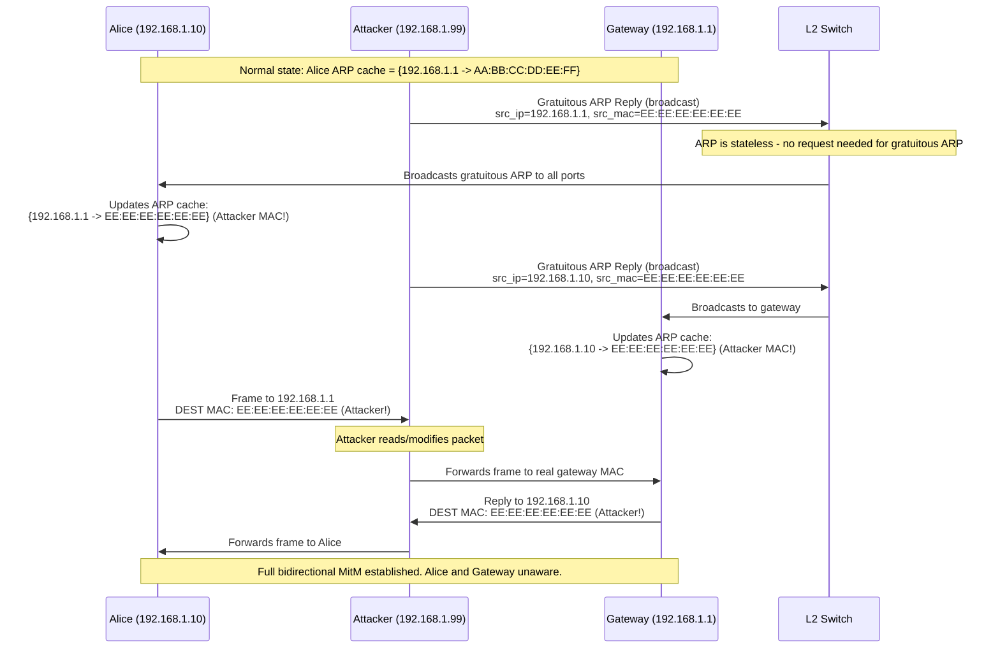
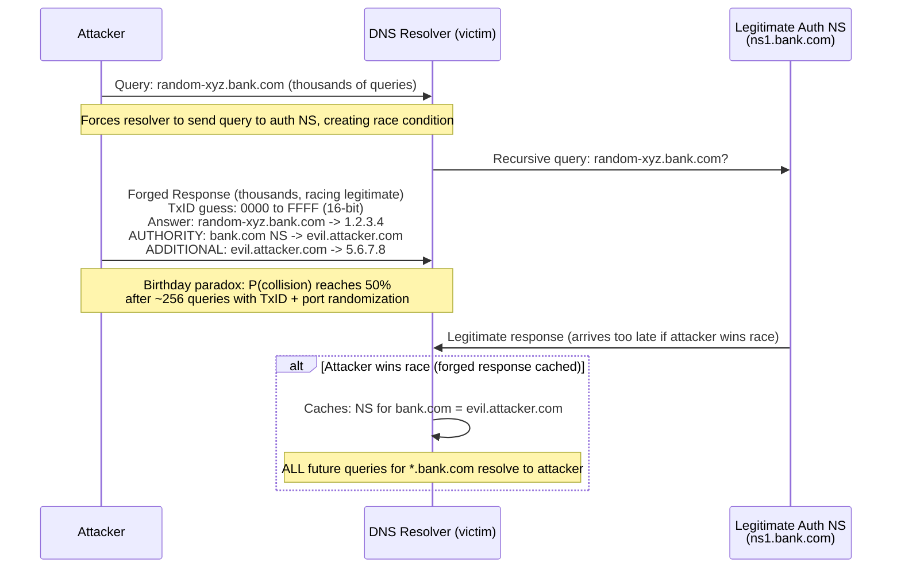

# Man-in-the-Middle (MitM) — ARP Spoofing, DNS Cache Poisoning, and Defenses

## Mental Model

A Man-in-the-Middle attack is like a dishonest postal worker who intercepts your letters, reads them, potentially modifies them, and re-sends them to the recipient — all while both parties believe they are communicating directly. The postal worker exploits the fact that the mail system (network protocols) was designed for convenience and trust, not adversarial environments. Every MitM variant exploits a different **trust assumption** baked into a protocol: ARP trusts anyone who claims an IP-to-MAC mapping; DNS trusts the first valid response that arrives; BGP trusts routing announcements from peer ASes. Defenses work by **authenticating these trust relationships** — DAI for ARP, DNSSEC for DNS, RPKI for BGP.

---

## Core Concepts / Architecture

### MitM Attack Taxonomy

| Attack Vector | Protocol Abused | Trust Assumption Violated | Scope |
|--------------|----------------|--------------------------|-------|
| ARP Spoofing | ARP (L2) | Gratuitous ARP replies accepted by default | LAN only |
| DNS Cache Poisoning | DNS (L7) | First valid response accepted; birthday paradox | Resolver scope |
| SSL Stripping | HTTP redirect | HTTPS upgrade trusts user's first request | Network path |
| BGP Hijacking | BGP (L3) | Peer AS route announcements trusted | Internet-wide |
| HTTPS Downgrade | TLS | Weak cipher fallback (POODLE, BEAST) | Connection |
| DHCP Spoofing | DHCP | First DHCP offer accepted | LAN segment |

---

## Visual Diagram

### ARP Spoofing — Gratuitous ARP Poisoning



### DNS Kaminsky Attack — Cache Poisoning



---

## Deep Dive

### 1. ARP Spoofing

#### ARP Protocol Fundamentals
```
ARP Request  (broadcast): "Who has 192.168.1.1? Tell 192.168.1.10"
ARP Reply    (unicast):   "192.168.1.1 is at AA:BB:CC:DD:EE:FF"
Gratuitous ARP (broadcast, unsolicited): "192.168.1.1 is at XX:XX:XX:XX:XX:XX"
```

**Why ARP is vulnerable**:
- No authentication — any host can claim any IP-to-MAC mapping
- Stateless — hosts update ARP cache even without prior ARP request
- Gratuitous ARPs accepted unconditionally (designed for IP changes/failover)

#### Attack Execution
```bash
# Using arpspoof (dsniff toolkit):
# Enable IP forwarding (so attacker relays packets and stays invisible):
echo 1 > /proc/sys/net/ipv4/ip_forward

# Poison Alice's ARP cache (tell Alice that gateway MAC = attacker MAC):
arpspoof -i eth0 -t 192.168.1.10 192.168.1.1

# Poison Gateway's ARP cache (tell gateway that Alice MAC = attacker MAC):
arpspoof -i eth0 -t 192.168.1.1 192.168.1.10

# Now intercept and analyze traffic with Wireshark or tcpdump:
tcpdump -i eth0 -n host 192.168.1.10
```

---

### 2. DNS Cache Poisoning — The Kaminsky Attack (2008)

#### Pre-Kaminsky DNS Poisoning
```
Old DNS (pre-2008):
  - Fixed source port 53 for queries
  - 16-bit Transaction ID space: 65,536 possibilities
  - Attacker needed to guess only TxID to poison
  - Expected queries to brute-force: ~128 (birthday paradox)
  
Post-BIND patch (2009):
  - Randomized source port: 16 more bits
  - Combined entropy: 32 bits (4 billion possibilities)
  - But: Kaminsky attack still works via NS record injection
```

#### Kaminsky Attack — Birthday Probability Math

The key insight: attacker exploits the **delegation** (AUTHORITY) section of DNS responses.

```
Standard query:
  Resolver queries auth NS for: A record of www.bank.com

Kaminsky twist:
  Attacker floods resolver with queries for RANDOM subdomains:
    xyz123.bank.com, abc456.bank.com, etc.
  
  For each query, attacker sends thousands of forged responses:
    ANSWER:    xyz123.bank.com -> 1.2.3.4 (bait)
    AUTHORITY: bank.com NS -> evil-ns.attacker.com   (the real payload!)
    ADDITIONAL: evil-ns.attacker.com -> 5.6.7.8

  If ANY forged response is accepted:
    All future *.bank.com queries go to attacker's NS!
```

**Birthday Paradox Probability Calculation**:
```
With 16-bit TxID only (old DNS):
  P(success in n attempts) = 1 - (65536-1/65536)^n
  P >= 0.5 when n ~= 45,000 attempts (achievable in seconds)

With TxID + port randomization (modern DNS):
  Combined entropy: 16 + 16 = 32 bits = 4,294,967,296 possibilities
  P >= 0.5 when n ~= 2^31 ~= 2.1 billion attempts
  At 100,000 responses/sec: ~6 hours (still feasible for dedicated attacker!)

DNSSEC defeats this entirely:
  Response includes cryptographic signature over RRset
  Attacker cannot forge valid RRSIG without zone private key
```

---

### 3. SSL Stripping

#### Attack Mechanics
```
Normal HTTPS flow:
  1. User types "bank.com" (no https://)
  2. Browser sends: HTTP GET http://bank.com/
  3. Server responds: 301 Redirect -> https://bank.com/
  4. Browser follows redirect over HTTPS

SSL Stripping (Moxie Marlinspike, 2009):
  1. Attacker positions as MitM (via ARP spoofing or rogue WiFi)
  2. Attacker intercepts user HTTP GET to http://bank.com/
  3. Attacker opens HTTPS connection to real bank.com (attacker acts as TLS client)
  4. Attacker serves plain HTTP to victim (no TLS!)
  5. Victim sees no HTTPS; all credentials sent in plaintext to attacker
```

```
Attack flow:
  Victim <--HTTP--> Attacker <--HTTPS--> Bank
  Victim sends password in HTTP → Attacker reads it → Attacker forwards over HTTPS to Bank
```

#### HSTS Defense (HTTP Strict Transport Security)

```http
# Server response header:
Strict-Transport-Security: max-age=31536000; includeSubDomains; preload

# Browser behavior after first HTTPS visit:
# - Stores HSTS policy for domain (1 year in this example)
# - ALL future requests to this domain FORCED to HTTPS internally
# - Attacker cannot strip TLS because browser never sends plain HTTP

# HSTS Preload (defeats even first-visit attack):
# Submit domain to https://hstspreload.org/
# Browser ships with hardcoded list of preloaded domains
# NO HTTP request ever sent to these domains, even on first visit
```

**HSTS Bypass Attack**: If attacker intercepts the very first HTTP visit before HSTS header cached, stripping still works. Preload list eliminates this.

---

### 4. BGP Hijacking

#### How BGP Routing Works
```
BGP (Border Gateway Protocol) connects autonomous systems (ASes):
  - Each AS announces the IP prefixes it owns
  - Peers propagate announcements; most specific prefix wins
  - No cryptographic authentication by default (trust on BGP session level only)
```

#### BGP Prefix Hijacking
```
Legitimate routing:
  AS 64500 (Bank) announces: 198.51.100.0/24
  Entire internet routes traffic for 198.51.100.0/24 to AS 64500

Prefix hijacking:
  Attacker (AS 99999) announces: 198.51.100.0/24 (same prefix!)
  Some ISPs prefer attacker's path (AS path length, local preference)
  Attacker receives some fraction of traffic destined for bank

More-specific hijack (more effective):
  Attacker announces: 198.51.100.0/25 AND 198.51.100.128/25
  More specific /25 always wins over /24 in BGP selection
  Attacker intercepts ALL traffic to 198.51.100.0/24!
```

#### Famous BGP Hijack Incidents
| Incident | Year | Impact |
|----------|------|--------|
| Pakistan Telecom hijacks YouTube | 2008 | YouTube unavailable globally for 2 hours |
| Rostelecom hijacks financial prefixes | 2020 | MasterCard, VISA, Cloudflare traffic diverted |
| China Telecom hijacks US government | 2010 | Government traffic routed via China for 18 min |
| Indosat hijack | 2014 | 320,000 routes hijacked globally |

#### RPKI Defense (Resource Public Key Infrastructure)

```bash
# RPKI creates cryptographically signed Route Origin Authorizations (ROAs):
# ROA = "AS 64500 is authorized to originate 198.51.100.0/24"

# ROA structure:
{
  "prefix": "198.51.100.0/24",
  "max_length": 24,
  "origin_asn": 64500,
  "expires": "2027-01-01T00:00:00Z"
}

# Router with RPKI validation (INVALID = drop):
# 198.51.100.0/25 from AS 99999 -> INVALID (wrong AS + more-specific than ROA)
# 198.51.100.0/24 from AS 64500 -> VALID (matches ROA)
# 10.0.0.0/8      from AS 99999 -> UNKNOWN (no ROA exists)

# Check RPKI validity of a prefix:
# https://rpki-validator.ripe.net/

# Major ISPs with RPKI validation:
# AT&T, Cloudflare, Telia, NTT, Cogent (as of 2023)
```

---

## Production Example: Detecting ARP Spoofing

### Using arpwatch

```bash
# arpwatch monitors ARP activity and alerts on changes:
# Install:
apt-get install arpwatch   # Debian/Ubuntu

# Configure:
# /etc/arpwatch.conf
# interface eth0
# mail-to security@company.com

# Start:
systemctl start arpwatch

# Log entry when ARP spoofing detected:
# Aug 18 10:23:01 server arpwatch: changed ethernet address
#   192.168.1.1 AA:BB:CC:DD:EE:FF (was EE:EE:EE:EE:EE:EE)
#   eth0

# arpwatch emails:
# Subject: changed ethernet address (192.168.1.1)
# Body: hostname: server
#       ip address: 192.168.1.1
#       ethernet address: aa:bb:cc:dd:ee:ff
#       old ethernet address: ee:ee:ee:ee:ee:ee
#       timestamp: Monday, August 18, 2026 10:23:1 +0000
```

### Using tcpdump to Detect ARP Anomalies

```bash
# Capture only ARP packets:
tcpdump -i eth0 -n arp

# Output during normal operation:
# ARP, Request who-has 192.168.1.1 tell 192.168.1.10, length 28
# ARP, Reply 192.168.1.1 is-at aa:bb:cc:dd:ee:ff, length 28

# Output during ARP spoofing:
# ARP, Reply 192.168.1.1 is-at ee:ee:ee:ee:ee:ee, length 28  (UNSOLICITED!)
# ARP, Reply 192.168.1.1 is-at ee:ee:ee:ee:ee:ee, length 28  (Repeated!)

# Detect gratuitous ARP floods (indicator of ARP spoofing attack):
tcpdump -i eth0 -n 'arp[6:2] == 2 and arp[14] == arp[24]' 
# This captures ARP replies where sender IP == target IP (gratuitous ARP)
```

### Dynamic ARP Inspection (DAI) — Cisco Switch Configuration

```
DAI validates ARP packets against DHCP Snooping binding table:
  Binding table: {IP -> MAC -> Port -> VLAN} (built by watching DHCP exchanges)
  DAI drops ARP packets where sender IP/MAC does not match binding table.

! Cisco IOS:
ip dhcp snooping
ip dhcp snooping vlan 10,20,30
no ip dhcp snooping information option   ! Remove option 82 for simplicity

ip arp inspection vlan 10,20,30

! Mark uplink/trunk ports as trusted (DAI not applied):
interface GigabitEthernet0/1
 description Uplink to Core Switch
 ip arp inspection trust
 ip dhcp snooping trust

! Access ports (users) are untrusted by default:
! Rate-limit ARP on access ports to prevent ARP flood:
interface GigabitEthernet0/10
 description User PC port
 ip arp inspection limit rate 100   ! Max 100 ARP packets/second
```

### DNSSEC Validation

```bash
# Check DNSSEC chain of trust:
dig +dnssec A cloudflare.com
# Look for: ad flag in response (Authenticated Data)
# Look for: RRSIG record in ANSWER section

# Verify DNSSEC chain manually:
# 1. Root zone KSK (Key Signing Key) is hardcoded in resolvers
# 2. Root zone signs .com zone key (DS record)
# 3. .com zone signs cloudflare.com zone key (DS record)
# 4. cloudflare.com zone signs A records (RRSIG record)

dig DS cloudflare.com @8.8.8.8
# Returns: cloudflare.com. 3569 IN DS 2371 13 2 <hash>

dig DNSKEY cloudflare.com @8.8.8.8
# Returns: Zone Signing Key (ZSK) and Key Signing Key (KSK)

# Test DNSSEC with intentionally broken domain:
dig A sigfail.verteiltesysteme.net +dnssec
# SERVFAIL (resolver rejects invalid signature) = DNSSEC working correctly
```

---

## Failure Modes / Trade-offs

1. **HSTS Only Protects After First Visit**
   - Problem: HSTS header received on first HTTPS visit; if first visit intercepted, SSL stripping works
   - Mitigation: HSTS Preload list (hstspreload.org) — browsers ship with hardcoded domain list; no HTTP ever sent

2. **DAI Breaks Legitimate Gratuitous ARP (HA Failover)**
   - Problem: High-availability systems (VRRP, HSRP, Keepalived) use gratuitous ARP for IP failover; DAI blocks these
   - Mitigation: Configure HA gateway ports as `ip arp inspection trust`; or pre-populate static ARP entries in binding table

3. **DNSSEC Key Rollover Complexity**
   - Problem: Zone operators must carefully time KSK/ZSK rollovers; mistimed rollover causes SERVFAIL for all queries in zone
   - Mitigation: Follow RFC 6781 key rollover procedures; use pre-published keys (double-sign during transition); monitor DNSSEC chain with Zonemaster

4. **RPKI Covers Only Route Origin, Not AS Path**
   - Problem: RPKI ROAs only validate the originating AS for a prefix; AS path manipulation (route leak) not detected
   - Mitigation: BGPsec (RFC 8205) provides path-level authentication but has very low adoption due to performance overhead

5. **DNS Cache Poisoning with Short TTLs**
   - Problem: Very short TTLs mean resolver re-queries frequently; each query is another attack opportunity
   - Mitigation: DNSSEC renders cache poisoning cryptographically impossible regardless of TTL; DO NOT rely on long TTLs as a defense

6. **ARP Spoofing on IPv6 Networks (NDP Spoofing)**
   - Problem: IPv6 uses Neighbor Discovery Protocol (NDP) instead of ARP; similar vulnerabilities exist (RA spoofing, NA spoofing)
   - Mitigation: RA Guard (RFC 6105); SEND (Secure Neighbor Discovery) RFC 3971; IPv6 ND Inspection on switches

7. **BGP Hijacking via Route Leaks**
   - Problem: Route leaks (accidentally announcing transit routes to all peers) can cause massive traffic disruption even without malicious intent
   - Mitigation: Prefix filtering at peering boundaries; IRR-based route filters; RFC 9234 BGP roles attribute

---

## Active-Recall Prompts

1. **Why does ARP Spoofing work even when no ARP request was sent? What property of ARP enables this?**
   *(Answer: ARP is stateless and accepts gratuitous ARP replies — unsolicited announcements of IP-to-MAC mappings. Operating systems update their ARP cache on ANY valid ARP reply, regardless of whether they sent a request. This is by design (for IP mobility/failover) but enables poisoning.)*

2. **Describe the Kaminsky DNS Attack. Why does randomizing the source port help, and why is it still insufficient without DNSSEC?**
   *(Answer: Kaminsky floods resolver with queries for random subdomains, then races to inject forged responses containing a malicious NS record in the AUTHORITY section. Port randomization increases entropy from 16-bit TxID to ~32 bits combined, requiring ~2 billion guesses. Still insufficient because: at 100K responses/sec, attack succeeds in ~6 hours, and multiple concurrent attack processes can parallelize. DNSSEC signs responses with zone's private key — forged responses have no valid RRSIG and are rejected regardless of TxID match.)*

3. **How does HSTS Preload protect against SSL stripping on the very first visit to a site, and what is required for a domain to be included?**
   *(Answer: Preload list is shipped inside the browser binary (Chromium, Firefox); browser never sends HTTP to preloaded domains. Requirements: must serve valid HTTPS, HSTS header with max-age >= 31536000, includeSubDomains, and preload directives, all subdomains must be HTTPS-capable, submit to hstspreload.org.)*

4. **What is a BGP more-specific prefix hijack and why is it more effective than same-prefix hijacking?**
   *(Answer: BGP longest-prefix match means /25 always beats /24 in routing decisions. By announcing two /25s covering a victim's /24, attacker captures 100% of traffic because every BGP router prefers the more-specific route, regardless of AS path length or preference. Same-prefix hijack depends on attacker having better path attributes in some ISPs' BGP tables — only captures partial traffic.)*

---

## Related Notes

- [[Distributed Denial of Service - DDoS Attack Vectors and Mitigations]]
- [[Transport Layer Security - TLS 1.2 vs TLS 1.3 Handshake]]
- [[PKI, X.509 Certificates, and Certificate Authorities]]
- [[Firewalls - Packet Filtering, Stateful Inspection, NGFW]]
- [[Zero Trust Network Architecture - Microsegmentation, mTLS]]
- [[Domain Name System - DNS Hierarchy, Recursive Resolution, EDNS, DNSSEC]]

---

> **Interview Question**: *You are the security engineer for a financial services company. A junior engineer tells you that a user on your LAN is receiving HTTP traffic instead of HTTPS and suspects a MitM attack. Walk through your investigation and remediation steps, covering both the immediate incident response and long-term hardening.*
>
> **Model Answer**: (1) **Immediate triage** — Run `arpwatch` alert review and `tcpdump -i eth0 -n arp` on the affected VLAN segment. Look for unsolicited ARP replies and MAC address changes for gateway IPs. (2) **Confirm ARP spoofing** — Compare ARP cache on victim machine (`arp -n`) with known-good gateway MAC from switch MAC address table (`show mac address-table`). Discrepancy confirms ARP spoofing. (3) **Isolate attacker** — Identify attacker MAC address from ARP cache; trace MAC to switch port (`show mac address-table address <MAC>`); shut down port immediately. (4) **Flush ARP caches** — On all hosts in VLAN: `arp -d 192.168.1.1` (force re-ARP to clean gateway MAC). (5) **Immediate L7 remediation** — Verify HSTS headers on all production servers; check if attacker captured credentials (check authentication logs for anomalous sessions). Force session invalidation. (6) **Long-term hardening** — Enable DHCP Snooping + Dynamic ARP Inspection on all access switches; configure DAI rate limiting to 100 ARP/sec per port; add HSTS Preload for all customer-facing domains; deploy 802.1X port authentication to prevent unauthorized devices on LAN; deploy network IDS (Suricata) with ARP spoofing detection signatures.

---
*Last updated: 2026-08-18 | Status: Complete | Module 7 — Network Security & Cryptography*
