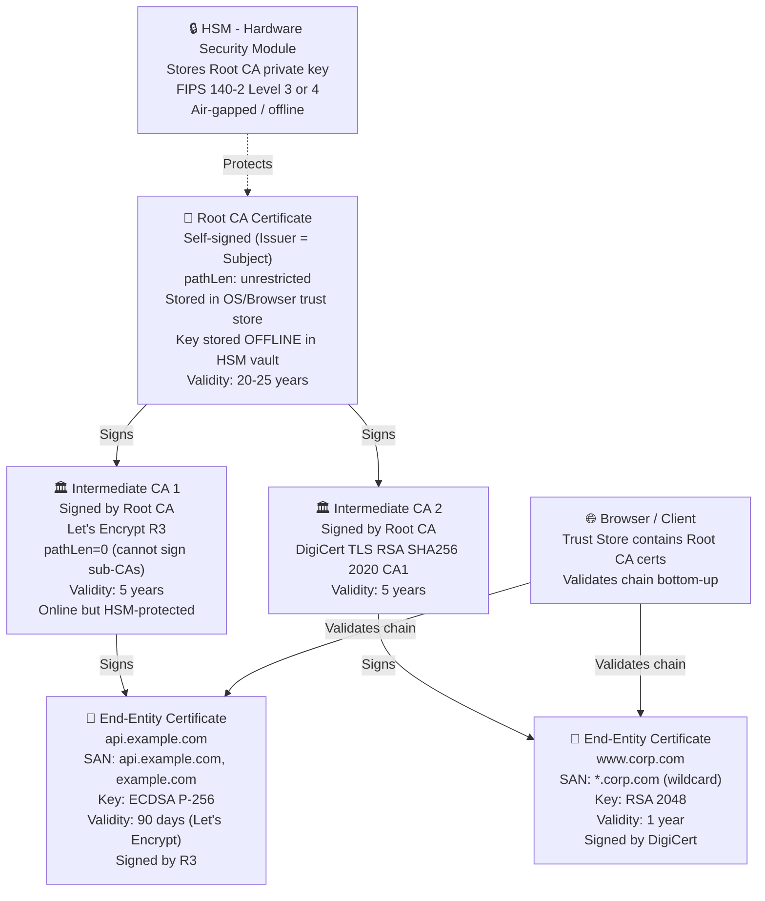
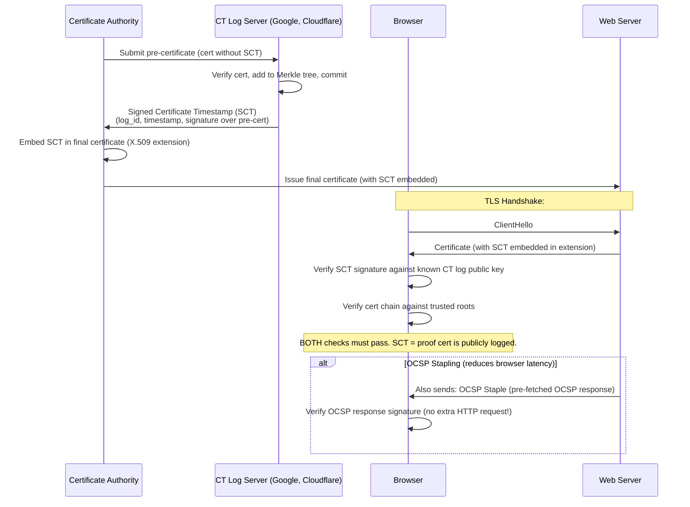

---
title: "PKI, X.509 Certificates, and Certificate Authorities"
subject: "Computer Networks"
module: "07 - Network Security & Cryptography"
difficulty: "Advanced"
prerequisites:
  - "Transport Layer Security - TLS 1.2 vs TLS 1.3 Handshake"
  - "Symmetric vs Asymmetric Encryption"
related:
  - "Transport Layer Security - TLS 1.2 vs TLS 1.3 Handshake"
  - "Zero Trust Network Architecture - Microsegmentation, mTLS"
  - "Man-in-the-Middle - MitM, ARP Spoofing, DNS Cache Poisoning"
  - "Firewalls - Packet Filtering, Stateful Inspection, NGFW"
aliases:
  - "PKI"
  - "Public Key Infrastructure"
  - "X.509"
  - "Certificate Authority"
  - "CA"
  - "OCSP"
  - "CRL"
  - "Certificate Transparency"
  - "ACME protocol"
  - "Let's Encrypt"
  - "cert-manager"
tags:
  - network-security
  - pki
  - x509
  - certificate-authority
  - ocsp-stapling
  - certificate-transparency
  - acme
  - lets-encrypt
  - hsm
  - cert-manager
  - dnssec
status: "complete"
---

# PKI, X.509 Certificates, and Certificate Authorities

## Mental Model

Public Key Infrastructure (PKI) is a **chain of trust** — like a notary system for the internet. You trust the notary (Root CA) completely. The notary vouches for subordinate notaries (Intermediate CAs), and they vouch for individual businesses (end-entity certificates). When you connect to your bank's website, your browser verifies: "Did a notary I trust vouch for this certificate?" The chain of signatures is cryptographically verifiable. If any link breaks — a CA is compromised, a cert is forged, or a cert is revoked — the entire chain fails verification.

The hard problem PKI solves: **how do you know that a public key actually belongs to the person who claims it?** Without PKI, you have no way to distinguish a legitimate server's public key from an attacker's. PKI provides signed certificates that bind a public key to an identity, with that binding backed by a trusted third party.

---

## Core Concepts / Architecture

### X.509 Certificate Fields (RFC 5280)

| Field | Description | Example |
|-------|-------------|---------|
| Version | Certificate format version (v3 standard) | v3 |
| Serial Number | Unique identifier within CA's namespace | 0x03A7F8B2C... |
| Signature Algorithm | Algorithm used to sign the cert | SHA256withRSA |
| Issuer | CA's Distinguished Name (DN) | CN=Let's Encrypt R3, O=Let's Encrypt, C=US |
| Validity | Not Before / Not After timestamps | 2026-08-18 to 2026-11-16 |
| Subject | Entity the cert is issued to | CN=www.example.com |
| Subject Public Key Info | Algorithm + public key bits | RSA 2048-bit or ECDSA P-256 |
| Extensions | SAN, Key Usage, EKU, CDP, AIA, CT SCT | See below |
| Signature | CA's signature over all above fields | 256-byte RSA signature |

### Critical X.509 v3 Extensions

```
SubjectAltName (SAN) — RFC 2818 mandates this for hostname verification:
  DNS:www.example.com
  DNS:example.com
  IP:93.184.216.34
  URI:spiffe://cluster.local/ns/app/sa/service   (for mTLS SPIFFE IDs)

KeyUsage:
  digitalSignature    = May sign data (TLS handshake signature)
  keyEncipherment     = May encrypt symmetric key (RSA key exchange, deprecated in TLS 1.3)
  keyCertSign         = May sign certificates (CA certificates only!)
  cRLSign             = May sign CRLs

ExtendedKeyUsage (EKU):
  serverAuth (1.3.6.1.5.5.7.3.1)  = TLS server certificate
  clientAuth (1.3.6.1.5.5.7.3.2)  = TLS client certificate (mTLS)
  codeSigning                       = Code signing
  emailProtection                   = S/MIME email

AuthorityInfoAccess (AIA):
  OCSP: http://r3.o.lencr.org      = Where to check revocation status
  CA Issuers: http://r3.i.lencr.org/cert = Where to download issuer cert

CRLDistributionPoints:
  URI: http://crl.example.com/crl.crl  = CRL download location

BasicConstraints:
  CA: FALSE                  (end-entity cert — cannot sign other certs)
  CA: TRUE, pathLen=0        (intermediate CA, max chain length = 1 more)
  CA: TRUE, pathLen=1        (intermediate CA, can sign sub-intermediates)
```

---

## Visual Diagram

### CA Hierarchy and Certificate Chain Validation



### Certificate Transparency Log and SCT Embedding



---

## Deep Dive

### 1. Certificate Transparency (CT) Logs

#### Why CT Was Created
In 2011, **DigiNotar** (Dutch CA) was compromised. Attackers issued fraudulent certificates for google.com, *.google.com, and hundreds of other high-value domains. Users connecting to Google with these fake certs would see valid certificate verification. DigiNotar was only caught because a user in Iran noticed the certificate issuer was wrong. The compromise had likely been occurring for months undetected.

CT logs solve this: **every certificate issued must be publicly logged before browsers trust it**.

```
CT Log Properties:
  - Append-only Merkle tree (RFC 6962)
  - Signed Tree Head (STH): Current root hash, signed by log
  - Inclusion proof: Prove a specific cert is in the tree (O(log n) hashes)
  - Consistency proof: Prove new tree includes all old entries
  - Public and auditable: Anyone can monitor for mis-issued certs
  
SCT (Signed Certificate Timestamp):
  - Timestamp: When log received the cert
  - log_id: Which CT log (by log's public key hash)
  - signature: Log signs the timestamp + pre-cert hash
  
  Purpose: Cryptographic proof that cert was submitted to a public log.
  If CA issues cert without logging it: no SCT => Chrome rejects (since 2018).
```

#### Certificate Monitoring with CT

```bash
# Monitor your domains in CT logs:
# certspotter.com API - alerts when new cert issued for your domain:
curl "https://api.certspotter.com/v1/issuances?domain=example.com&include_subdomains=true&expand=dns_names,issuer" \
  -H "Authorization: Bearer <CERTSPOTTER_API_KEY>"

# crt.sh search (free, no auth):
curl "https://crt.sh/?q=%.example.com&output=json" | jq '.[].name_value' | sort -u

# Google Transparency Report:
# https://transparencyreport.google.com/https/certificates

# Self-hosted certificate monitoring with certificate-transparency-go:
ct-monitor --log https://ct.googleapis.com/logs/us1/argon2024 \
           --domain example.com \
           --alert-webhook https://hooks.slack.com/...
```

---

### 2. OCSP and CRL — Certificate Revocation

#### Why Revocation Exists
A private key can be compromised. A certificate can be mis-issued. In these cases, the cert must be **revoked** even before its expiry date — browsers must be told not to trust it.

#### Certificate Revocation List (CRL)

```
CRL = Signed list of revoked serial numbers, published by CA.

CRL Entry:
  Serial Number: 0x03A7F8B2
  Revocation Date: 2026-08-01
  Reason: keyCompromise (private key stolen)

Problems with CRLs:
  - CRLs can be megabytes in size (millions of revoked certs)
  - Clients must download entire CRL even to check one cert
  - CRL update frequency: typically hours to days (stale data)
  
Delta CRLs:
  - Only changes since last full CRL
  - Smaller download; still suffers from staleness
  
CRL Distribution Point (CDP) in cert:
  http://crl3.digicert.com/DigiCertTLSRSASHA2562020CA1-4.crl
```

#### OCSP (Online Certificate Status Protocol)

```
OCSP Request/Response:
  Client sends: {issuer_name_hash, issuer_key_hash, serial_number}
  Server returns: {good | revoked | unknown}
                 + {this_update, next_update} timestamps
                 + CA signature

Problems with vanilla OCSP:
  1. Privacy: CA learns every site you visit (IP + serial number)
  2. Latency: Extra HTTP request on every TLS handshake
  3. Availability: If OCSP server down, browsers "soft-fail" (accept cert anyway!)
  4. Tracking: Correlation between your IP and site visits
```

#### OCSP Stapling (RFC 6066)

```
OCSP Stapling moves OCSP from client to server:
  1. Server pre-fetches OCSP response from CA's OCSP responder
  2. Server caches OCSP response (valid for hours/days per next_update)
  3. During TLS handshake, server INCLUDES the OCSP response (Certificate Status extension)
  4. Client verifies OCSP response signature (CA's signature, not server's)
  5. No extra HTTP request from client; no privacy leak; no OCSP responder latency

nginx OCSP Stapling config:
  ssl_stapling on;
  ssl_stapling_verify on;
  ssl_trusted_certificate /etc/ssl/certs/ca-bundle.pem;  # CA cert for OCSP verification
  resolver 8.8.8.8 1.1.1.1 valid=300s;
  resolver_timeout 5s;
```

#### OCSP Must-Staple

```
Problem with OCSP soft-fail:
  If OCSP server unreachable, browsers accept cert without revocation check.
  Attacker with compromised cert can block OCSP traffic => cert accepted!
  
OCSP Must-Staple (RFC 7633):
  X.509 extension in certificate:
    TLS Feature: status_request (must_staple)
  
  Effect: Browser REQUIRES OCSP staple in TLS handshake for this cert.
          No staple = connection rejected (hard-fail, not soft-fail).
  
  Risk: If your server fails to refresh OCSP staple before it expires,
        ALL connections to your server are rejected. High operational risk.
  
  Recommendation: Only enable OCSP Must-Staple with robust staple refresh monitoring.
```

---

### 3. Wildcard vs SAN Certificates

```
Single-domain cert:
  Subject: CN=www.example.com
  SAN: DNS:www.example.com
  Covers: ONLY www.example.com

Wildcard cert:
  Subject: CN=*.example.com
  SAN: DNS:*.example.com
  Covers: www.example.com, api.example.com, mail.example.com
  Does NOT cover: example.com itself, *.sub.example.com (no multi-level wildcard)
  Security risk: One cert, one private key => compromise affects ALL subdomains

SAN cert (Multi-Domain / UCC):
  Subject: CN=example.com
  SAN: DNS:example.com, DNS:www.example.com, DNS:api.example.com, DNS:mail.example.com
  Covers: All explicitly listed names
  Advantage: Different private keys per service possible; explicit authorization of each name

Best practice (2026):
  - Prefer SAN over wildcard for production services
  - Use automation (ACME) to issue individual short-lived certs per service
  - Wildcard acceptable for internal/staging environments with good key management
```

---

### 4. ACME Protocol — Automated Certificate Issuance (RFC 8555)

The ACME (Automatic Certificate Management Environment) protocol lets servers prove domain ownership and obtain certificates without human intervention. Let's Encrypt uses ACME.

#### ACME Flow

```
1. Account Registration:
   Client generates ACME account key pair (ECDSA P-256 or RSA 2048)
   Client POSTs account key to ACME server => gets account URL

2. Order Creation:
   Client POSTs: {identifiers: [{type: "dns", value: "example.com"}]}
   Server returns: {status: "pending", authorizations: [auth_url], finalize: finalize_url}

3. Domain Validation (choose one):
   
   HTTP-01 Challenge:
     Client places token at: http://example.com/.well-known/acme-challenge/<token>
     Token content: <token>.<account_key_thumbprint>
     ACME server fetches URL, verifies token => domain validated
     
   DNS-01 Challenge (required for wildcards):
     Client creates TXT record: _acme-challenge.example.com = base64url(sha256(key_auth))
     ACME server queries DNS for TXT record => domain validated
     Advantage: Works for wildcard certs; works without HTTP
     
   TLS-ALPN-01 Challenge:
     Client serves special TLS cert with ACME OID on port 443
     ACME server connects, checks cert => domain validated

4. Certificate Signing Request (CSR):
   Client generates key pair for the cert (separate from ACME account key)
   Client creates CSR: {subject, SAN, public key}
   Client signs CSR with cert private key

5. Finalization:
   Client POSTs CSR to finalize_url
   ACME server issues certificate, returns download URL

6. Certificate Download:
   Client downloads PEM certificate chain

7. Renewal (automated):
   Repeat every 60-75 days for 90-day Let's Encrypt certs
```

---

### 5. HSM (Hardware Security Module) Key Protection

```
HSM = Tamper-resistant hardware device that:
  - Generates key material inside hardware (never exported in plaintext)
  - Performs cryptographic operations (signing, decryption) inside hardware
  - Zeroizes keys on physical tamper detection
  - FIPS 140-2 Level 3/4 certified

Where HSMs are used in PKI:
  - Root CA private key: ALWAYS in offline HSM (Thales Luna, nCipher, AWS CloudHSM)
  - Intermediate CA private key: Online HSM (CloudHSM, Azure Dedicated HSM)
  - TLS server private key: Software (acceptable for leaf certs, rotated frequently)

HSM Access Model for CA Signing:
  1. CSR arrives at CA software
  2. CA software sends "sign this hash" command to HSM
  3. HSM signs hash using private key (key never leaves hardware)
  4. HSM returns signature
  5. CA constructs certificate with signature

AWS CloudHSM example:
  # Initialize CloudHSM cluster, create crypto user:
  /opt/cloudhsm/bin/cloudhsm_mgmt_util /opt/cloudhsm/etc/cloudhsm_mgmt_util.cfg
  > loginHSM PRECO admin password
  > createUser CU crypto_user Password1234!
  
  # Use PKCS#11 or JCE API to sign with HSM-backed key:
  # Java: com.amazonaws.cloudhsm.jce.provider.CloudHsmProvider
  # Python: pkcs11 library with CloudHSM PKCS#11 library path
```

---

## Production Example: Let's Encrypt with certbot and cert-manager

### certbot ACME HTTP-01 Challenge

```bash
# Install certbot (Debian/Ubuntu):
apt-get install certbot python3-certbot-nginx

# Issue certificate for domain with automatic nginx configuration:
certbot --nginx -d example.com -d www.example.com \
  --email admin@example.com \
  --agree-tos \
  --non-interactive

# certbot stores cert at:
# /etc/letsencrypt/live/example.com/fullchain.pem  (cert + intermediate)
# /etc/letsencrypt/live/example.com/privkey.pem    (private key)
# /etc/letsencrypt/live/example.com/cert.pem       (cert only)
# /etc/letsencrypt/live/example.com/chain.pem      (intermediate only)

# Automatic renewal via cron (certbot installs this automatically):
# 0 */12 * * * root certbot renew --quiet --post-hook "systemctl reload nginx"

# DNS-01 challenge for wildcard cert (Route53 example):
certbot certonly --dns-route53 \
  -d "*.example.com" \
  -d "example.com" \
  --email admin@example.com \
  --agree-tos \
  --non-interactive

# View certificate details:
certbot certificates
openssl x509 -in /etc/letsencrypt/live/example.com/cert.pem -noout -text | \
  grep -E "Subject:|Not After:|DNS:"
```

### cert-manager in Kubernetes (ACME Issuer)

```yaml
# Install cert-manager:
# kubectl apply -f https://github.com/cert-manager/cert-manager/releases/latest/download/cert-manager.yaml

# ClusterIssuer (Let's Encrypt production):
apiVersion: cert-manager.io/v1
kind: ClusterIssuer
metadata:
  name: letsencrypt-prod
spec:
  acme:
    server: https://acme-v02.api.letsencrypt.org/directory
    email: admin@example.com
    privateKeySecretRef:
      name: letsencrypt-prod-account-key
    solvers:
      - http01:
          ingress:
            class: nginx       # Use nginx ingress for HTTP-01 challenge
      - dns01:                 # DNS-01 for wildcard certs
          route53:
            region: us-east-1
            hostedZoneID: Z1234567ABCDEF

---
# Certificate resource (auto-issues and auto-renews):
apiVersion: cert-manager.io/v1
kind: Certificate
metadata:
  name: example-com-tls
  namespace: production
spec:
  secretName: example-com-tls-secret    # Where to store the cert+key
  issuerRef:
    name: letsencrypt-prod
    kind: ClusterIssuer
  commonName: example.com
  dnsNames:
    - example.com
    - www.example.com
    - api.example.com
  duration: 2160h       # 90 days (Let's Encrypt max)
  renewBefore: 360h     # Renew 15 days before expiry

---
# Ingress (cert-manager auto-creates Certificate from annotation):
apiVersion: networking.k8s.io/v1
kind: Ingress
metadata:
  name: example-ingress
  annotations:
    cert-manager.io/cluster-issuer: letsencrypt-prod
spec:
  tls:
    - hosts:
        - example.com
      secretName: example-com-tls-secret
  rules:
    - host: example.com
      http:
        paths:
          - path: /
            pathType: Prefix
            backend:
              service:
                name: web-service
                port:
                  number: 80
```

```bash
# Monitor certificate status:
kubectl get certificate -n production
# NAME               READY   SECRET                  AGE
# example-com-tls    True    example-com-tls-secret  30d

kubectl describe certificate example-com-tls -n production | grep -A5 "Conditions:"
# Type    Status  Reason      Message
# Ready   True    Ready       Certificate is up to date and has not expired
```

---

## Failure Modes / Trade-offs

1. **DigiNotar Incident — CA Compromise and Mis-Issuance**
   - Problem (2011): DigiNotar CA was compromised; attackers issued valid certs for google.com, cia.gov, and 500+ other domains. Users connecting to fraudulent servers saw "valid certificate" in browsers
   - Mitigation: Certificate Transparency (CT) logs make all cert issuance public and auditable; OCSP Must-Staple ensures revoked certs are rejected; monitor crt.sh for unexpected certs for your domain

2. **OCSP Soft-Fail Allows Revoked Certs**
   - Problem: If OCSP responder unreachable (DDoS, outage), browsers "soft-fail" and accept certificate without revocation check. Attacker with revoked cert can block OCSP traffic
   - Mitigation: OCSP Stapling eliminates client-side OCSP dependency; OCSP Must-Staple enforces hard-fail; short cert lifetimes (90 days) limit revocation window

3. **Wildcard Certificate Blast Radius**
   - Problem: One wildcard cert (*.example.com) + one private key protects all subdomains. Compromise of any system holding the key (web server, CDN, load balancer) exposes ALL subdomains
   - Mitigation: Use per-service SAN certs with automation; if wildcard required, store private key in HSM; rotate certs frequently (90-day ACME certs limit exposure window)

4. **ACME Rate Limits**
   - Problem: Let's Encrypt enforces rate limits: 50 certs/domain/week, 5 failures/account/hour. During outages or misconfigurations, rate limits can prevent emergency cert renewal
   - Mitigation: Use staging environment (acme-staging-v02.api.letsencrypt.org) for testing; implement exponential backoff in cert-manager; maintain cert validity buffer (renewBefore = 15+ days)

5. **CRL/OCSP Staleness**
   - Problem: CRLs and OCSP responses have validity windows (hours to days). Between revocation and client cache expiry, revoked certs can be used
   - Mitigation: Short cert lifetimes (90 days) make revocation less critical; OCSP Must-Staple + frequent staple refresh; monitor for cert compromise indicators

6. **Key Ceremony Complexity for Root CA**
   - Problem: Root CA key generation requires formal ceremony (multiple key custodians, HSM initialization, physical security controls). Mistakes during ceremony cannot be undone
   - Mitigation: Follow formal key ceremony procedures (RFC 2527, NIST SP 800-57); video recording; multiple witnesses; hardware tokens for key custodians (M-of-N quorum)

7. **CT Log Key Compromise**
   - Problem: If CT log's signing key is compromised, attacker can create fraudulent SCTs proving a cert is logged when it is not
   - Mitigation: Require SCTs from MULTIPLE independent logs (Chrome requires 2+ SCTs for certificates > 180 days); CT log key rotation procedures

---

## Active-Recall Prompts

1. **A web server presents a certificate. Describe the full chain of cryptographic verification a browser performs before trusting the connection.**
   *(Answer: (1) Parse cert chain from TLS handshake. (2) For each cert in chain (leaf -> intermediate -> root): verify the signature using the issuer's public key. (3) Verify Subject matches Issuer of the cert signed by it (chain linkage). (4) Check each cert's validity period (Not Before / Not After) against current time. (5) Verify leaf cert SAN matches the hostname connected to (RFC 2818). (6) Check KeyUsage and EKU: server must have serverAuth. (7) Verify root cert is in OS/browser trust store. (8) Check CT: verify embedded SCTs against known CT log public keys. (9) Check revocation: OCSP staple in handshake (preferred) or online OCSP request or CRL.)*

2. **What is OCSP Stapling and how does it solve the privacy and latency problems of traditional OCSP?**
   *(Answer: Traditional OCSP: client sends OCSP request to CA's OCSP responder for each TLS connection — CA learns every site you visit (privacy); adds 50-200ms latency. OCSP Stapling: server pre-fetches OCSP response from CA, caches it, and includes it in the TLS Certificate Status extension during handshake. Client verifies the OCSP response's CA signature directly — no separate HTTP request, no privacy leak to CA, no OCSP responder availability dependency.)*

3. **Explain Certificate Transparency. What problem does it solve, and what would have been different about the DigiNotar incident if CT existed at the time?**
   *(Answer: CT requires all publicly-trusted CAs to submit every certificate to public, append-only, cryptographically-auditable logs before browsers will trust the cert. Anyone can monitor these logs for unexpected certificates (e.g., unexpected cert for google.com from DigiNotar). With CT: the fraudulent google.com certs would have appeared in public logs within seconds of issuance. Google's automated CT monitoring would have detected certs from DigiNotar for google.com within minutes, triggering immediate investigation. Today Chrome requires valid SCTs from 2+ independent CT logs — certs not logged are rejected with ERR_CERTIFICATE_TRANSPARENCY_REQUIRED.)*

4. **What is the ACME HTTP-01 challenge and why can DNS-01 be required for wildcard certificates?**
   *(Answer: HTTP-01: ACME server challenges client to place a token at http://domain/.well-known/acme-challenge/TOKEN. Since only the domain owner controls what HTTP server returns, serving the correct token proves domain control. DNS-01: Create a TXT record _acme-challenge.domain with a value derived from the challenge token. DNS-01 is required for wildcards (*.example.com) because HTTP-01 can only prove control of a specific FQDN; it cannot prove you own ALL possible subdomains. DNS-01 proves ownership of the DNS zone itself (which controls all subdomains).)*

---

## Related Notes

- [[Transport Layer Security - TLS 1.2 vs TLS 1.3 Handshake]]
- [[Zero Trust Network Architecture - Microsegmentation, mTLS]]
- [[Man-in-the-Middle - MitM, ARP Spoofing, DNS Cache Poisoning]]
- [[Firewalls - Packet Filtering, Stateful Inspection, NGFW]]
- [[Domain Name System - DNS Hierarchy, Recursive Resolution, EDNS, DNSSEC]]

---

> **Interview Question**: *Your company's internal PKI intermediate CA certificate expires in 48 hours and you just discovered it. You have a root CA key ceremony that normally takes 2 weeks to schedule. Walk through your emergency response.*
>
> **Model Answer**: This is a P0 incident. (1) **Assess blast radius**: Identify ALL certificates signed by the expiring intermediate CA — enumerate from your CMDB/cert-manager; identify which services they protect; determine which expire within the 48-hour window vs which expire after (those signed by the expiring CA may stop chain validation even if the leaf cert is still valid!). (2) **Immediate mitigation**: Cross-sign the new intermediate CA using the existing root CA with an emergency key ceremony (abbreviated version with minimum required key custodians present or via hardware token quorum). If root CA is offline/air-gapped, initiate emergency transport now. (3) **Issue new intermediate**: Once root CA signs new intermediate, distribute its certificate to all web servers as part of their certificate chain. Services can serve the new intermediate + old leaf certs temporarily (chain is valid as long as intermediate is valid). (4) **Re-issue leaf certs**: For any leaf certs expiring within 7 days, use automated ACME/cert-manager to re-issue immediately signed by the new intermediate. (5) **Trust distribution**: Push new intermediate CA cert to all internal trust stores (application keystores, OS trust stores, custom CA bundles). (6) **Root certificate bundle update**: If new root CA certificate needed, this requires coordinated rollout across all clients. (7) **Post-incident**: Implement cert expiry monitoring (Prometheus `x509_cert_expiry` exporter); set alerts at 60, 30, 14, 7, 3 day thresholds; automate all cert renewal via cert-manager; document emergency key ceremony procedure for future use.

---
*Last updated: 2026-08-18 | Status: Complete | Module 7 — Network Security & Cryptography*
