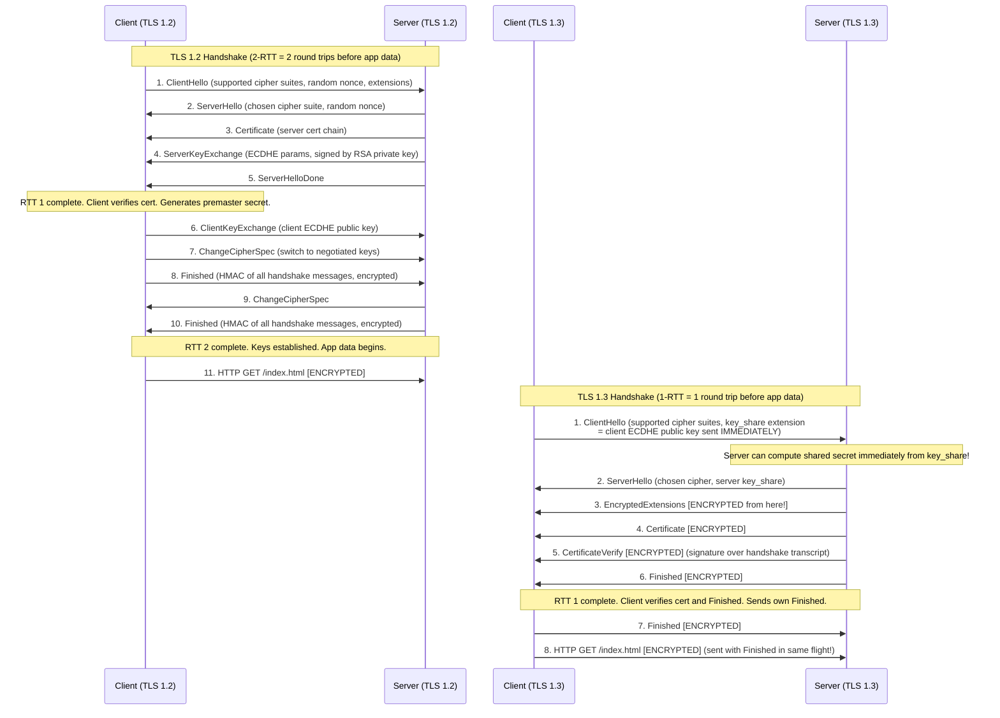
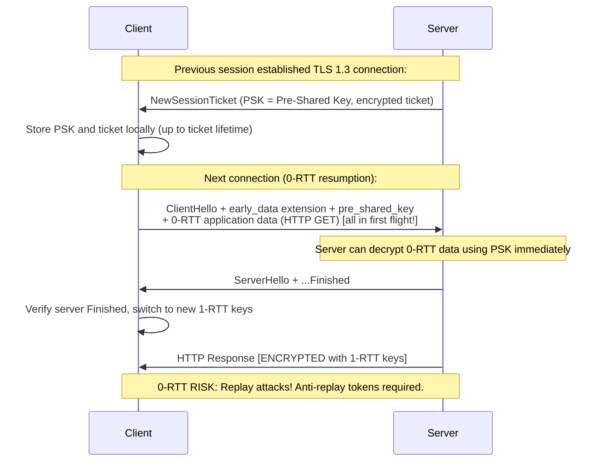

# Transport Layer Security (TLS) — TLS 1.2 vs TLS 1.3 Handshake Deep Dive

## Mental Model

TLS is a **cryptographic handshake protocol** that does three things before your first byte of application data travels: (1) **Authentication** — confirm you are talking to the real server (via its certificate), (2) **Key exchange** — agree on a shared secret without ever transmitting it (Diffie-Hellman magic), (3) **Encryption** — all subsequent traffic is encrypted with symmetric keys derived from that shared secret.

Think of TLS like renting a secure meeting room. You verify the room attendant's ID badge (certificate verification), then together you perform a secret ritual that results in both of you independently deriving the same padlock combination (key exchange), and then every document you exchange is locked with that padlock. TLS 1.3 does this in **one round-trip** (1-RTT) rather than TLS 1.2's two (2-RTT), and it eliminates the weakest padlock designs from the catalog entirely.

---

## Core Concepts / Architecture

### TLS Version Comparison

| Feature | TLS 1.2 (RFC 5246) | TLS 1.3 (RFC 8446) |
|---------|-------------------|-------------------|
| Handshake RTT | 2-RTT (full) / 1-RTT (resumed) | 1-RTT (full) / 0-RTT (resumed) |
| Key Exchange | RSA, ECDHE, DHE, PSK | ECDHE, DHE, PSK only (RSA removed!) |
| Authentication | RSA, ECDSA, DSA | RSA, ECDSA, EdDSA |
| Cipher suite | Configurable (many weak options) | Hardcoded secure options only |
| Symmetric encryption | AES-CBC, AES-GCM, RC4, 3DES | AES-GCM, ChaCha20-Poly1305 only |
| MAC | HMAC-SHA1, SHA256, SHA384 | AEAD (authentication built into cipher) |
| Forward Secrecy | Optional (RSA key exchange has none) | Mandatory (all modes use ephemeral keys) |
| Encrypted Handshake | Only app data encrypted | ServerHello onwards encrypted! |
| 0-RTT resumption | No | Yes (with replay risk) |
| Compression | Allowed (CRIME attack!) | Removed |
| Renegotiation | Possible (TRIPLE-HANDSHAKE attack) | Removed |
| Downgrade protection | SCSV fallback (partial) | Downgrade sentinels in ServerRandom |

### Cipher Suite Anatomy: ECDHE-RSA-AES256-GCM-SHA384 Decoded

```
ECDHE-RSA-AES256-GCM-SHA384

  ECDHE      = Key Exchange algorithm
               Elliptic Curve Diffie-Hellman Ephemeral
               "Ephemeral" = new key pair per session => Forward Secrecy
               
  RSA        = Authentication algorithm
               Server's certificate public key type
               Used to sign the ECDHE key exchange parameters
               
  AES256     = Symmetric encryption algorithm
               AES with 256-bit key
               
  GCM        = Block cipher mode
               Galois/Counter Mode = AEAD (Authenticated Encryption with Associated Data)
               Provides both confidentiality AND integrity in one operation
               
  SHA384     = PRF / MAC hash function
               Used in TLS 1.2 PRF for key derivation
               In GCM: also used as HMAC for handshake verification (Finished message)

TLS 1.3 cipher suites (much simpler — key exchange ALWAYS ephemeral, separately negotiated):
  TLS_AES_256_GCM_SHA384
  TLS_AES_128_GCM_SHA256
  TLS_CHACHA20_POLY1305_SHA256
  
  Format: TLS_<AEAD>_<HASH>   (key exchange not in suite name — always ECDHE/DHE)
```

---

## Visual Diagram

### TLS 1.3 (1-RTT) vs TLS 1.2 (2-RTT) Side-by-Side



### TLS 1.3 0-RTT Resumption (Session Ticket / PSK)



---

## Deep Dive

### 1. Key Derivation — HKDF in TLS 1.3 vs PRF in TLS 1.2

#### TLS 1.2 PRF (Pseudorandom Function)
```
TLS 1.2 uses a PRF based on HMAC-SHA256 or HMAC-SHA384:

master_secret = PRF(pre_master_secret, "master secret",
                    ClientHello.random + ServerHello.random, 48 bytes)

key_material = PRF(master_secret, "key expansion",
                   ServerHello.random + ClientHello.random,
                   key_material_length)

Derived keys from key_material (split sequentially):
  client_write_MAC_key  (for HMAC integrity on client data)
  server_write_MAC_key  (for HMAC integrity on server data)
  client_write_key      (AES symmetric key for client->server)
  server_write_key      (AES symmetric key for server->client)
  client_write_IV       (initialization vector)
  server_write_IV       (initialization vector)
```

#### TLS 1.3 HKDF (HMAC-based Key Derivation Function, RFC 5869)

TLS 1.3 uses a rigorous **key schedule** with labeled HKDF-Extract + HKDF-Expand at each stage:

```
Step 1: Early Secret (for 0-RTT):
  early_secret = HKDF-Extract(0, PSK or 0)

Step 2: Handshake Secret (for handshake encryption):
  handshake_secret = HKDF-Extract(HKDF-Expand(early_secret, "derived", ""),
                                   ECDHE_shared_secret)

  client_handshake_traffic_secret = HKDF-Expand-Label(handshake_secret,
                                      "c hs traffic", transcript_hash, hash_len)
  server_handshake_traffic_secret = HKDF-Expand-Label(handshake_secret,
                                      "s hs traffic", transcript_hash, hash_len)

Step 3: Application Secret (for application data):
  master_secret = HKDF-Extract(HKDF-Expand(handshake_secret, "derived", ""), 0)
  
  client_application_traffic_secret = HKDF-Expand-Label(master_secret,
                                        "c ap traffic", transcript_hash, hash_len)
  server_application_traffic_secret = HKDF-Expand-Label(master_secret,
                                        "s ap traffic", transcript_hash, hash_len)

Key advantage: Each phase uses the TRANSCRIPT HASH up to that point.
  => Even if early secret is compromised, handshake + app keys remain secure.
  => Separation of concerns prevents cross-phase key leakage.
```

---

### 2. TLS Record Layer Format

```
TLS Record Header (5 bytes):
+--------+--------+--------+--------+--------+
| Type   | Major  | Minor  | Length (2 bytes)|
| (1B)   | (1B)   | (1B)   |                 |
+--------+--------+--------+--------+--------+

Content Types:
  0x14 = ChangeCipherSpec (20) - TLS 1.2 only
  0x15 = Alert             (21) - Fatal or warning alerts
  0x16 = Handshake         (22) - All handshake messages
  0x17 = ApplicationData   (23) - Encrypted app data
  0x18 = Heartbeat         (24) - RFC 6520 (Heartbleed bug!)

TLS Version in Record Header:
  TLS 1.0: 0x03 0x01 (legacy - even TLS 1.3 uses this for compatibility!)
  TLS 1.2: 0x03 0x03
  TLS 1.3: 0x03 0x03 (TLS 1.3 uses 0x0304 only in supported_versions extension)

Maximum Record Length: 2^14 = 16,384 bytes (16KB)
TLS 1.3 adds: AEAD tag (16 bytes) + content type byte at end of each record
```

---

### 3. 0-RTT Replay Attack and Anti-Replay

#### The Replay Attack
```
0-RTT data sent in the first ClientHello flight is:
  - Encrypted with PSK (Pre-Shared Key from previous session)
  - NOT protected by server's random nonce (server hasn't replied yet!)
  
Attack scenario:
  1. Attacker captures victim's 0-RTT ClientHello flight (contains HTTP POST /buy)
  2. Attacker replays the EXACT same bytes to the server 100 times
  3. Server processes 100 purchase requests from victim's account
```

#### Anti-Replay Mechanisms
```
Server-side anti-replay (RFC 8446, Section 8):
  Option A: Single-use session tickets
    Server stores ticket nonce; on first use, mark as consumed; reject replays.
    Problem: Doesn't work for distributed servers (would need shared cache).
  
  Option B: Time-based window (recommended for distributed systems):
    Server tracks seen PSK binder nonces within a time window (e.g., 1 ClientHello per second per key).
    Window size = max clock skew + max network RTT (typically 5-10 seconds).
    Replay outside window: ticket expired (reject).
    Replay inside window: check Bloom filter / Redis SET of seen nonces.

  Option C: Application-level idempotency (simplest):
    Only use 0-RTT for SAFE, IDEMPOTENT requests (GET, HEAD).
    Reject 0-RTT for POST, PUT, DELETE (server returns early_data_rejected).
    
Nginx 0-RTT configuration:
  ssl_early_data on;                          # Enable 0-RTT
  add_header Early-Data $ssl_early_data;      # Tell app if request was 0-RTT
  # Application checks $ssl_early_data header and rejects non-idempotent ops
```

---

### 4. Session Tickets vs PSK Resumption

```
TLS 1.2 Session Resumption (two mechanisms):
  
  Session ID (server-side state):
    Server stores master_secret indexed by session_id.
    Client sends session_id in ClientHello.
    Server looks up master_secret, skips certificate exchange.
    Problem: Server must maintain session state (memory per session).
    
  Session Ticket (client-side state):
    Server encrypts master_secret + metadata with server-only key => session ticket.
    Client stores ticket; sends in subsequent ClientHello.
    Server decrypts ticket, extracts master_secret.
    Problem: If server ticket encryption key compromised, ALL past sessions decryptable.
             (No forward secrecy for resumed sessions!)

TLS 1.3 PSK (Pre-Shared Key) resumption:
  After TLS 1.3 handshake, server sends NewSessionTicket:
    - ticket: Opaque blob (encrypted resumption_master_secret + ticket_age_add)
    - ticket_lifetime: Max age (usually 7 days)
    - ticket_age_add: Random value to obfuscate actual ticket age (prevent tracking)
    
  On resumption:
    Client sends PSK identity (the ticket) + binder (HMAC proving knowledge of PSK).
    Server decrypts ticket, derives PSK, verifies binder.
    Forward secrecy: PSK is derived from resumption_master_secret, which came from
    ephemeral ECDHE keys. Those ECDHE keys are long gone. Past sessions safe even if
    PSK is later compromised (because ECDHE keys not stored).
```

---

### 5. Certificate Pinning and HPKP Deprecation

```
Certificate Pinning:
  Application hardcodes expected certificate or public key hash.
  Even if attacker has valid CA-signed cert, pinning rejects it.
  
  Types:
    Pin to leaf cert:   Pin exact server certificate. Breaks on cert renewal!
    Pin to public key:  Pin SubjectPublicKeyInfo hash. Survives cert renewal if same key.
    Pin to CA cert:     Pin intermediate or root CA. More flexible, less secure.

HPKP (HTTP Public Key Pinning) — DEPRECATED 2018:
  Response header: Public-Key-Pins: pin-sha256="<hash>"; max-age=5184000
  Problem: If admin loses private key or makes mistake, site is DoS'd for max-age!
           Called "HPKP Suicide" — multiple high-profile sites accidentally locked out.
  Google Chrome removed HPKP support in Chrome 72 (Jan 2019).
  
  Replacement: Certificate Transparency (CT logs) + Expect-CT header.

Modern pinning (mobile apps):
  Android OkHttp:
    CertificatePinner pinner = new CertificatePinner.Builder()
      .add("api.example.com", "sha256/AAAAAAAAAAAAAAAAAAAAAAAAAAAAAAAAAAAAAAAAAAA=")
      .build();
  iOS:
    Use SecTrustEvaluate + compare SubjectPublicKeyInfo bytes.
  
  Best practice:
    - Pin to intermediate CA public key (not leaf)
    - Always include backup pins (at least 2)
    - Set short expiry + update mechanism before rolling
```

---

## Production Example

### 1. Inspecting TLS with openssl s_client

```bash
# Full TLS handshake trace to cloudflare.com:
openssl s_client -connect cloudflare.com:443 \
  -tls1_3 \
  -servername cloudflare.com \
  -showcerts \
  -tlsextdebug \
  -msg \
  2>&1 | head -100

# Key output sections to examine:
# SSL-Session:
#     Protocol  : TLSv1.3
#     Cipher    : TLS_AES_256_GCM_SHA384
#     Session-ID: <session ticket data>
#     TLS session ticket lifetime hint: 64800 (seconds)
#     Master-Key: <key material, hex>

# Check certificate chain:
openssl s_client -connect api.example.com:443 -showcerts 2>/dev/null | \
  openssl x509 -noout -text | grep -E "Subject:|Issuer:|Not After:|SAN"

# Test specific TLS version support:
openssl s_client -connect example.com:443 -tls1_2 -cipher AES256  # TLS 1.2
openssl s_client -connect example.com:443 -tls1   # TLS 1.0 (should FAIL on modern servers)

# Get supported cipher suites from server:
nmap --script ssl-enum-ciphers -p 443 example.com
```

### 2. Wireshark TLS Filter

```
# Capture and decrypt TLS traffic in Wireshark:

# Capture filter (Berkeley Packet Filter):
tcp port 443

# Wireshark display filters for TLS analysis:
tls                                          # All TLS packets
tls.handshake.type == 1                      # ClientHello only
tls.handshake.type == 2                      # ServerHello only
tls.handshake.type == 11                     # Certificate message
tls.record.content_type == 23               # Application data (encrypted)
tls.handshake.ciphersuite == 0x1302         # TLS_AES_256_GCM_SHA384

# Decrypt TLS with session keys (requires key log file):
# Set environment variable before launching browser:
export SSLKEYLOGFILE=~/tls_keys.log
google-chrome --ssl-key-log-file=~/tls_keys.log

# In Wireshark: Edit -> Preferences -> Protocols -> TLS
# Set "(Pre)-Master-Secret log filename" to ~/tls_keys.log
# TLS traffic now decrypted in real-time!
```

### 3. nginx TLS Production Configuration

```nginx
server {
    listen 443 ssl;
    listen [::]:443 ssl;
    server_name api.example.com;

    # Certificate and private key:
    ssl_certificate     /etc/ssl/certs/api.example.com.fullchain.pem;
    ssl_certificate_key /etc/ssl/private/api.example.com.key;

    # TLS versions — disable 1.0 and 1.1:
    ssl_protocols TLSv1.2 TLSv1.3;

    # Cipher suites (TLS 1.2 only; TLS 1.3 suites are non-configurable):
    ssl_ciphers 'ECDHE-ECDSA-AES256-GCM-SHA384:ECDHE-RSA-AES256-GCM-SHA384:ECDHE-ECDSA-AES128-GCM-SHA256';
    ssl_prefer_server_ciphers off;  # Client preference for TLS 1.3

    # ECDHE curve (P-256 for compatibility, X25519 for performance):
    ssl_ecdh_curve X25519:P-256;

    # Session resumption:
    ssl_session_timeout 1d;
    ssl_session_cache shared:SSL:50m;   # ~200K sessions
    ssl_session_tickets off;            # Disable tickets (use session cache for FS)

    # TLS 1.3 0-RTT:
    ssl_early_data on;
    add_header Early-Data $ssl_early_data;

    # OCSP Stapling (reduces client latency for cert validity check):
    ssl_stapling on;
    ssl_stapling_verify on;
    ssl_trusted_certificate /etc/ssl/certs/ca-bundle.pem;
    resolver 8.8.8.8 1.1.1.1 valid=300s;

    # HSTS (1 year, subdomains, preload):
    add_header Strict-Transport-Security "max-age=31536000; includeSubDomains; preload" always;
    
    # Security headers:
    add_header X-Content-Type-Options nosniff always;
    add_header X-Frame-Options DENY always;
    add_header Content-Security-Policy "default-src 'self'" always;
}
```

---

## Failure Modes / Trade-offs

1. **POODLE Attack (TLS 1.0 / SSL 3.0 Padding Oracle)**
   - Problem: CBC mode padding oracle in SSL 3.0 allows decryption of 1 byte per 256 requests; requires protocol downgrade
   - Mitigation: Disable SSL 3.0 and TLS 1.0/1.1 entirely; TLS 1.3 removes CBC; use `ssl_protocols TLSv1.2 TLSv1.3;`

2. **BEAST Attack (TLS 1.0 CBC IV Prediction)**
   - Problem: TLS 1.0 CBC uses predictable IV (previous block's ciphertext); allows chosen-plaintext attack on JavaScript-injected data
   - Mitigation: TLS 1.2+ (randomized IVs); RC4 (workaround at time) is now banned (RFC 7465); upgrade to AES-GCM (AEAD, no IV issue)

3. **CRIME / BREACH Compression Attacks**
   - Problem: CRIME: TLS record compression leaks plaintext length via chosen-plaintext oracle. BREACH: HTTP compression leaks session tokens byte-by-byte
   - Mitigation: CRIME: TLS record-layer compression REMOVED in TLS 1.3 (and disable in TLS 1.2: `ssl_compression off;`). BREACH: Disable HTTP response compression for sensitive endpoints, or randomize response padding

4. **DROWN Attack (SSLv2 Cross-Protocol)**
   - Problem: If ANY server on the same IP or sharing same private key supports SSLv2, TLS 1.2 sessions can be decrypted using SSLv2 export-grade crypto
   - Mitigation: Disable SSLv2 globally; never share private keys across services; use separate certs per service

5. **0-RTT Replay Risk**
   - Problem: 0-RTT data can be replayed by a network attacker — not safe for non-idempotent operations
   - Mitigation: Only allow 0-RTT for GET/HEAD; check `Early-Data` header and reject POST/PUT in application layer; server-side nonce tracking with Redis

6. **Certificate Pinning Key Loss (HPKP Suicide)**
   - Problem: HPKP with long max-age; if private key lost, site DoS'd for the duration
   - Mitigation: HPKP deprecated; use CT monitoring + Expect-CT; for mobile apps, pin to intermediate CA + always ship backup pins

7. **Weak Diffie-Hellman (Logjam Attack)**
   - Problem: Export-grade 512-bit DH or 1024-bit "common" DH groups susceptible to precomputation attacks; 512-bit breakable in real-time
   - Mitigation: TLS 1.3 requires FFDHE groups >= 2048-bit; prefer ECDHE (P-256, X25519) over finite-field DH; `ssl_dhparam /etc/nginx/dhparam4096.pem;`

---

## Active-Recall Prompts

1. **Why does TLS 1.3 complete in 1-RTT while TLS 1.2 requires 2-RTT? What specific message change enables this?**
   *(Answer: In TLS 1.2, the client must wait for ServerHello to learn the chosen cipher/group, then send ClientKeyExchange. In TLS 1.3, the client includes key_share extensions in ClientHello with its ECDHE public key(s) for the most likely key groups — the server picks one and can immediately compute the shared secret, sending EncryptedExtensions + Certificate + Finished in one flight. The client simultaneously receives the server's reply and can send its Finished + application data in one more flight.)*

2. **Decode the cipher suite ECDHE-RSA-AES256-GCM-SHA384 field-by-field. Why was RSA key exchange deprecated in TLS 1.3?**
   *(Answer: ECDHE=key exchange algorithm (ephemeral ECDH), RSA=authentication (server signs ECDHE params with RSA private key), AES256=symmetric cipher (256-bit key), GCM=AEAD mode, SHA384=PRF/MAC hash. RSA key exchange (non-ECDHE) was deprecated in TLS 1.3 because it lacks forward secrecy: if server's RSA private key is later compromised, ALL past sessions encrypted with RSA key exchange can be decrypted from PCAP. ECDHE generates ephemeral per-session keys that are deleted after use.)*

3. **Explain TLS 1.3 HKDF key schedule. Why does TLS 1.3 separate early_secret, handshake_secret, and master_secret into distinct derivation phases?**
   *(Answer: Each phase derives keys from both the previous phase's material and new input (PSK or ECDHE shared secret). Separation ensures: (1) If PSK (early_secret) is compromised, handshake and application keys are still bound to ephemeral ECDHE material. (2) 0-RTT keys (early_secret) are cryptographically isolated from 1-RTT keys — replay of 0-RTT data cannot affect 1-RTT keys. (3) Each phase includes the transcript hash up to that point, binding keys to the specific handshake exchange, preventing cross-session substitution attacks.)*

4. **What is the 0-RTT replay attack in TLS 1.3, and what are the three mitigation strategies?**
   *(Answer: 0-RTT early_data is encrypted with PSK but lacks server randomness (server hasn't responded yet). A network attacker who captures the first ClientHello flight can retransmit it to the server multiple times. Mitigations: (1) Server-side single-use tickets: mark ticket as consumed in shared cache, reject replays — not scalable for distributed servers. (2) Time-window + nonce tracking: track seen binder nonces in a Bloom filter/Redis SET within a time window matching max clock skew + RTT. (3) Application-level idempotency: only send GET/HEAD as 0-RTT; application checks Early-Data header and rejects non-idempotent operations.)*

---

## Related Notes

- [[PKI, X.509 Certificates, and Certificate Authorities]]
- [[Zero Trust Network Architecture - Microsegmentation, mTLS]]
- [[Man-in-the-Middle - MitM, ARP Spoofing, DNS Cache Poisoning]]
- [[Firewalls - Packet Filtering, Stateful Inspection, NGFW]]
- [[Hypertext Transfer Protocol - HTTP 1.0, 1.1, Pipelining, Persistent Connections]]
- [[Distributed Denial of Service - DDoS Attack Vectors and Mitigations]]

---

> **Interview Question**: *A senior engineer proposes enabling TLS 1.3 0-RTT on your REST API to reduce latency for mobile clients. What are the security implications, and how would you design the system to mitigate them while still benefiting from reduced RTT?*
>
> **Model Answer**: 0-RTT eliminates one full round-trip for resumed sessions, reducing latency by ~50-150ms for geographically distant clients — significant for mobile. Security concern: 0-RTT early_data is vulnerable to replay attacks. An attacker who captures a TLS session resumption ClientHello can replay it, potentially replaying HTTP requests within it. Design mitigation: (1) Enable 0-RTT at the TLS layer (`ssl_early_data on` in nginx). (2) Tag all 0-RTT requests via the `Early-Data: 1` request header (nginx sets `$ssl_early_data`). (3) Implement an application-layer gate: read the Early-Data header; if present and request method is POST/PUT/DELETE/PATCH, return `425 Too Early` (RFC 8470) forcing the client to retry over 1-RTT. Allow GET/HEAD through 0-RTT since they are safe and idempotent. (4) For GET endpoints that trigger expensive side effects (analytics writes, rate-limit counters), make them idempotent in design. (5) Implement server-side nonce tracking: add PSK binder hash to a Redis SET with TTL matching the anti-replay window (10 seconds); reject seen nonces. This gives: mobile clients benefit from 0-RTT GET speedup, no replay risk for state-modifying operations, and distributed anti-replay protection without requiring sticky sessions.

---
*Last updated: 2026-08-18 | Status: Complete | Module 7 — Network Security & Cryptography*
