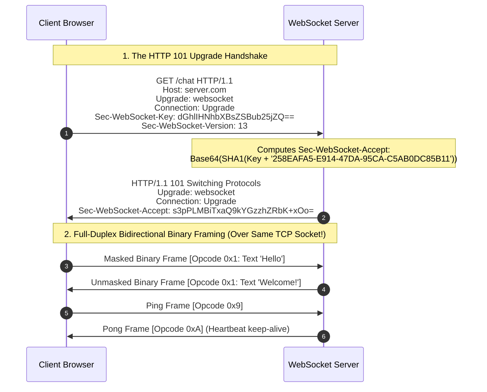
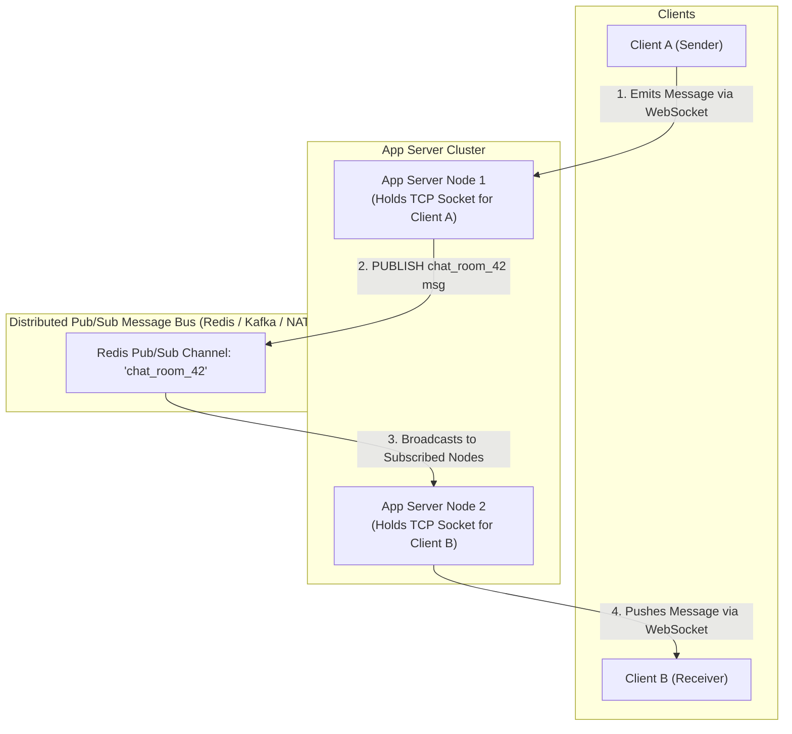

# Real-Time Protocols: WebSockets, Server-Sent Events (SSE), and Distributed Pub/Sub Backplanes

> [!abstract] Mental Model
> - **Escaping the Request-Response Prison**: Standard HTTP is fundamentally unidirectional—clients ask, servers answer. Real-time apps (chat, trading desks, multiplayer gaming) historically polled servers repeatedly, wasting bandwidth on empty HTTP headers.
> - **WebSocket (RFC 6455)** upgrades an HTTP connection into a **persistent, bidirectional, message-framed full-duplex TCP stream**.
> - **Server-Sent Events (SSE)** provides a lightweight, **unidirectional (Server $\to$ Client) text stream** over standard HTTP with native browser reconnection and event IDs.

---

## 1. The WebSocket Protocol Architecture (RFC 6455)



---

## 2. The WebSocket Binary Frame Layout

```
 0                   1                   2                   3
 0 1 2 3 4 5 6 7 8 9 0 1 2 3 4 5 6 7 8 9 0 1 2 3 4 5 6 7 8 9 0 1
+-+-+-+-+-------+-+-------------+-------------------------------+
|F|R|R|R| opcode|M| Payload len |    Extended payload length    |
|I|S|S|S|  (4b) |A|     (7b)    |             (16/64)           |
|N|V|V|V|       |S|             |   (if payload len==126/127)   |
| |1|2|3|       |K|             |                               |
+-+-+-+-+-------+-+-------------+ - - - - - - - - - - - - - - - +
|     Masking-key (32 bits, if MASK set - Client to Server)     |
+-------------------------------+-------------------------------+
| Payload Data (Unmasked if from Server; XOR-masked from Client)|
+---------------------------------------------------------------+
```

### Critical Field Rules & Opcodes:
- **`MASK` Bit (1 bit)**: **Client-to-Server frames MUST be masked** with a 32-bit random key (prevents intermediate transparent HTTP proxies from misinterpreting payloads as cached HTTP requests!). Server-to-Client frames **MUST NOT** be masked.
- **Opcodes (4 bits)**:
  - `0x1`: Text Frame (UTF-8).
  - `0x2`: Binary Frame (Raw bytes / Protobuf).
  - `0x8`: Connection Close.
  - `0x9`: Ping (Heartbeat probe).
  - `0xA`: Pong (Heartbeat response).

---

## 3. Server-Sent Events (SSE - WHATWG Standard)

SSE provides a simple, unidirectional (Server $\to$ Client) text stream running directly over standard HTTP/1.1 or HTTP/2:

```http
HTTP/1.1 200 OK
Content-Type: text/event-stream
Cache-Control: no-cache
Connection: keep-alive

event: stock_tick
id: 1042
retry: 5000
data: {"symbol": "NVDA", "price": 128.50}

event: stock_tick
id: 1043
data: {"symbol": "NVDA", "price": 128.75}
```

### Built-in SSE Invariants:
1. **Automatic Browser Reconnect**: If the network drops, the browser automatically reconnects after the specified `retry` interval (default $3\text{ seconds}$).
2. **Event Resumption (`Last-Event-ID`)**: On reconnect, the browser transmits `Last-Event-ID: 1043`, allowing the server to replay missed events seamlessly.

---

## 4. Architectural Comparison Matrix

| Architectural Dimension | Short Polling | Long Polling | Server-Sent Events (SSE) | WebSockets (RFC 6455) |
| :--- | :--- | :--- | :--- | :--- |
| **Communication Direction** | Unidirectional | Half-Duplex | **Unidirectional (Server $\to$ Client)** | **Full-Duplex (Bidirectional)** |
| **Underlying Protocol** | HTTP/1.1 | HTTP/1.1 | Standard HTTP/1.1 or HTTP/2 | TCP (via HTTP 101 Upgrade) |
| **Header Overhead** | Massive (~1KB/req) | High (~1KB/req) | Minimal (HTTP headers sent once) | **Ultralight (2 to 10 Bytes/frame)** |
| **Data Format** | Text / JSON | Text / JSON | **UTF-8 Text Only** | **Text & Raw Binary** |
| **Auto-Reconnect** | Manual app logic | Manual app logic | **Built-in Browser Native** | Manual app logic |
| **HTTP/2 Multiplexing** | Yes | Yes | **Yes (Shares single TCP pipe!)** | No (Occupies dedicated TCP socket) |
| **Firewall / Proxy Traversal**| Flawless (Standard HTTP)| Flawless | Flawless (Standard HTTP) | Can be blocked by strict proxies |

---

## 5. Horizontal Scaling: Distributed Pub/Sub Backplanes

Because WebSocket connections are **stateful, long-lived TCP sockets**, two clients connected to different server instances cannot communicate directly without a distributed message backplane:



---

## Production Diagnostics & CLI Inspection

```bash
# 1. Connect and Interact with a Live WebSocket Server using wscat:
wscat -c wss://echo.websocket.events

# Output:
# Connected (press CTRL+C to quit)
# > {"action": "subscribe", "channel": "orders"}
# < {"status": "subscribed", "channel": "orders"}

# 2. Inspect a Server-Sent Events (SSE) Stream using curl:
curl -N -H "Accept: text/event-stream" https://httpbin.org/stream/5

# Output:
# HTTP/1.1 200 OK
# Content-Type: text/event-stream
# data: {"id": 0, "value": "chunk-0"}
# data: {"id": 1, "value": "chunk-1"}
```

---

## Active Recall & Interview Perspective

### Reasoning Prompts
1. *Why does the WebSocket specification mandate that clients MUST mask all frames sent to the server, while the server MUST NOT mask frames sent to the client?*
   - **Answer**: Masking is an essential security defense against **Cache Poisoning and Proxy Desynchronization attacks**. Transparent intermediate HTTP proxies that do not understand the WebSocket protocol might inspect raw client byte streams. If an attacker sends a malicious HTTP response (e.g. `HTTP/1.1 200 OK ... <script>evil</script>`) inside an unmasked WebSocket frame, an intermediate caching proxy might mistakenly parse that payload as a legitimate HTTP response and store it in cache, serving the malicious script to subsequent users requesting valid web pages. Requiring the client to XOR-mask the payload with an unpredictable 32-bit random key ensures that the byte stream on the wire is completely scrambled and will never accidentally match valid HTTP syntax. Servers do not need to mask because the browser client is not an intermediate proxy and cannot be tricked into poisoning downstream caches.
2. *When is Server-Sent Events (SSE) a technically superior architectural choice over WebSockets?*
   - **Answer**: **SSE is superior when communication is primarily unidirectional (Server to Client)**—such as live stock price tickers, social media notification feeds, sports score updates, or LLM AI token streaming (e.g. ChatGPT response generation). SSE runs over standard HTTP, allowing it to: **(1)** traverse corporate firewalls and standard load balancers effortlessly with zero special configuration; **(2)** multiplex multiple event streams across a single connection over HTTP/2; **(3)** provide built-in native browser automatic reconnects with zero custom JavaScript code; and **(4)** support built-in event resumption via the `Last-Event-ID` header. WebSockets introduce unnecessary operational complexity (custom framing, manual heartbeat ping/pong, proxy upgrades, and dedicated TCP sockets) when client-to-server data transmission is infrequent.
3. *How do you solve the C10K/C1000K stateful connection scaling bottleneck for WebSockets in a microservice architecture?*
   - **Answer**: Unlike stateless HTTP where any server node can handle any request, WebSockets are long-lived stateful TCP connections pinned to a specific application process. To scale horizontally: **(1) Distributed Backplane**: Decouple connection management from message routing by placing a high-throughput **Pub/Sub Message Bus (Redis Pub/Sub, Kafka, or NATS)** behind the application tier so that server nodes can broadcast events across the entire cluster; **(2) OS Kernel Tuning**: Expand file descriptor limits (`ulimit -n 1048576`), tune `net.ipv4.ip_local_port_range`, and optimize TCP socket memory (`tcp_rmem` / `tcp_wmem`) so that a single server instance can sustain 100,000+ idle connections without exhausting kernel RAM; **(3) Connection Offloading**: Offload TLS termination and raw WebSocket connection state to edge reverse proxies (such as Envoy, Nginx, or AWS API Gateway) to free backend application services from managing millions of idle TCP connections.

---

## Key Takeaways
- **WebSocket (RFC 6455)**: Upgrades HTTP via `101 Switching Protocols` to **Full-Duplex TCP**.
- **Client Masking**: 32-bit XOR masking protects against **Proxy Cache Poisoning**.
- **SSE (WHATWG)**: Unidirectional **Server $\to$ Client text stream** with native auto-reconnect.
- **Horizontal Scaling**: Stateful WebSocket sockets require a **Distributed Pub/Sub Backplane** (Redis/Kafka).

---

## Related Notes
- [[Computer Networks MOC]] — Master table of contents for Computer Networks.
- [[Transmission Control Protocol - TCP Header, Features, and Invariants]] — Transport layer connection.
- [[Hypertext Transfer Protocol - HTTP 1.0, 1.1, Pipelining, Persistent Connections]] — HTTP 101 Upgrade mechanism.
- [[HTTP-2 - Binary Framing, Multiplexing, Stream Priorities, HPACK]] — SSE multiplexing over HTTP/2.
- [[gRPC and Protocol Buffers]] — Alternative bidirectional streaming RPC architecture.
- [[Dynamic Routing of Web Traffic - Anycast, CDN Architecture, Edge Computing]] — Edge termination of WebSockets.
