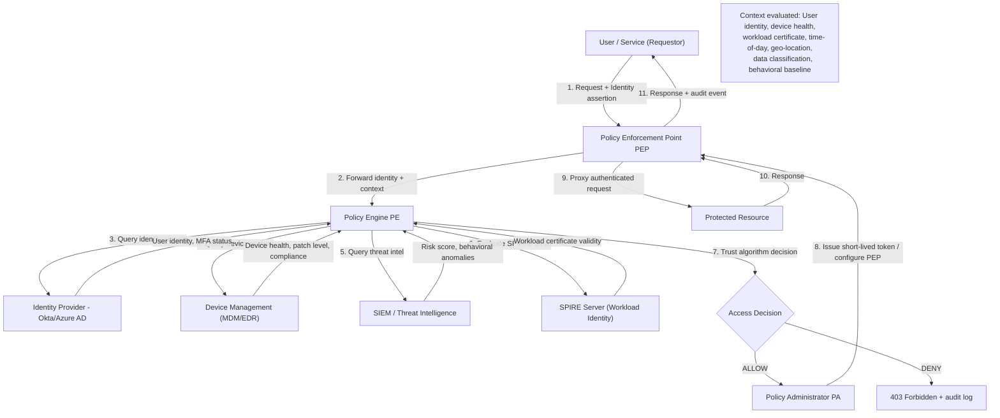
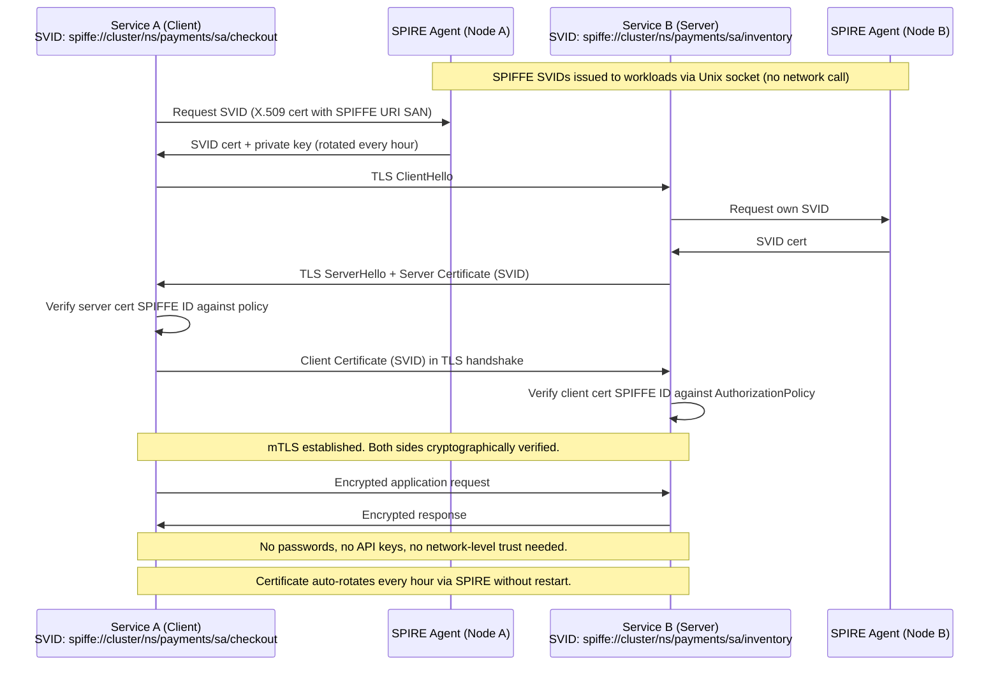

---
title: "Zero Trust Network Architecture - Microsegmentation, mTLS"
subject: "Computer Networks"
module: "07 - Network Security & Cryptography"
difficulty: "Advanced"
prerequisites:
  - "Transport Layer Security - TLS 1.2 vs TLS 1.3 Handshake"
  - "PKI, X.509 Certificates, and Certificate Authorities"
  - "Firewalls - Packet Filtering, Stateful Inspection, NGFW"
  - "IP Addressing and Subnetting"
related:
  - "Man-in-the-Middle - MitM, ARP Spoofing, DNS Cache Poisoning"
  - "Transport Layer Security - TLS 1.2 vs TLS 1.3 Handshake"
  - "PKI, X.509 Certificates, and Certificate Authorities"
  - "Distributed Denial of Service - DDoS Attack Vectors and Mitigations"
aliases:
  - "Zero Trust"
  - "ZTA"
  - "ZTNA"
  - "Microsegmentation"
  - "mTLS"
  - "Mutual TLS"
  - "BeyondCorp"
  - "SPIFFE"
  - "SPIRE"
  - "Service Mesh"
tags:
  - network-security
  - zero-trust
  - microsegmentation
  - mtls
  - spiffe
  - spire
  - service-mesh
  - istio
  - beyondcorp
  - nist-800-207
  - kubernetes
status: "complete"
---

# Zero Trust Network Architecture (ZTA) — Microsegmentation and mTLS

## Mental Model

Traditional network security is like a medieval castle: thick walls (perimeter firewall), moat (DMZ), and once you are inside, everyone trusts you. The problem: once an attacker breaches the perimeter (via phishing, VPN compromise, or insider threat), they move laterally through the interior freely — the "crown jewels" are unprotected east-west.

**Zero Trust** tears down the castle model. Every corridor inside the castle now has its own lock, guard, and ID check. The principle: **"Never trust, always verify"** — it does not matter whether a request comes from inside the corporate network or the open internet. Every access request must be authenticated, authorized, and continuously validated. Network location is no longer a proxy for trust.

---

## Core Concepts / Architecture

### Zero Trust Principles (NIST SP 800-207)

| Principle | Description | Traditional Alternative |
|-----------|-------------|------------------------|
| Never trust, always verify | All resources accessed as if on internet | Trust internal network implicitly |
| Least-privilege access | Access granted per-session, minimal scope | Broad VLAN-level access |
| Assume breach | Design assuming attacker already inside | Perimeter = primary defense |
| Verify explicitly | Authenticate + authorize every request | Authenticate once at VPN entry |
| Micro-segmentation | Fine-grained east-west traffic controls | Flat internal network |
| Continuous validation | Re-evaluate trust on every request | Long-lived sessions, no re-auth |

### ZTA Components (NIST SP 800-207 Architecture)

| Component | Function | Examples |
|-----------|----------|---------|
| Policy Engine (PE) | Decides whether to grant access (trust algorithm) | OPA (Open Policy Agent), Cedar |
| Policy Administrator (PA) | Communicates decisions to Policy Enforcement Points | Envoy control plane, SPIRE server |
| Policy Enforcement Point (PEP) | Enforces access decisions inline on data path | Envoy sidecar, NGINX, Cloudflare Access |
| Identity Provider (IdP) | Source of truth for user/workload identity | Okta, Azure AD, Google Workspace |
| PKI / SPIFFE | Issues cryptographic workload identities | SPIRE, cert-manager, Vault |
| SIEM / Analytics | Behavioral analysis, anomaly detection | Splunk, Elastic SIEM, Chronicle |

---

## Visual Diagram

### ZTA Request Flow Through Policy Engine



### mTLS Mutual Authentication Flow



---

## Deep Dive

### 1. SPIFFE / SPIRE — Workload Identity

#### SPIFFE (Secure Production Identity Framework For Everyone)

SPIFFE solves: *"How does Service A prove its identity to Service B without using passwords or long-lived API keys?"*

```
SPIFFE Identity: SPIFFE Verifiable Identity Document (SVID)
  - X.509 certificate with SPIFFE URI as Subject Alternative Name (SAN):
    spiffe://<trust_domain>/<path>
    Example: spiffe://cluster.local/ns/payments/sa/checkout-service

SVID Properties:
  - Short-lived (default: 1 hour, auto-rotated)
  - Issued by SPIRE (SPIFFE Runtime Environment)
  - Delivered via Unix domain socket (no network exposure)
  - Unique per workload instance / pod
```

#### SPIRE Architecture

```
SPIRE Server:
  - Central CA / signing authority
  - Maintains node and workload attestation policies
  - Issues SVIDs on demand

SPIRE Agent (runs on each node):
  - Attests workload identity (Kubernetes ServiceAccount, process UID, Docker labels)
  - Caches SVIDs locally
  - Serves SVIDs via Unix socket (/run/spire/sockets/agent.sock)

Workload API:
  - gRPC API workload calls to get its own SVID
  - No privileged access needed; agent verifies workload identity by PID/namespace
```

```yaml
# SPIRE Workload registration entry (Kubernetes workload):
apiVersion: spire.spiffe.io/v1alpha1
kind: ClusterSPIFFEID
metadata:
  name: checkout-service
spec:
  spiffeIDTemplate: >
    spiffe://cluster.local/ns/{{ .PodMeta.Namespace }}/sa/{{ .PodSpec.ServiceAccountName }}
  podSelector:
    matchLabels:
      app: checkout
```

---

### 2. Mutual TLS (mTLS) Mechanics

#### Standard TLS vs mTLS

```
Standard TLS (one-way authentication):
  Server presents certificate -> Client verifies it
  Client identity: Not verified by server (uses cookies/tokens at app layer)

mTLS (mutual authentication):
  Server presents certificate -> Client verifies it    (same as TLS)
  Client presents certificate -> Server verifies it    (ADDITIONAL STEP)
  Both sides cryptographically proven before any application data exchanged
```

#### TLS Certificate Anatomy for mTLS

```
Service A's SVID certificate (X.509 v3):
  Subject: CN=checkout, O=payments
  Subject Alternative Name (SAN):
    URI: spiffe://cluster.local/ns/payments/sa/checkout   ← SPIFFE Identity
  Issuer: SPIRE Intermediate CA
  Not Before: 2026-08-18T09:00:00Z
  Not After:  2026-08-18T10:00:00Z   ← 1 hour validity!
  Key Usage: Digital Signature, Key Encipherment
  Extended Key Usage: TLS Web Client Authentication, TLS Web Server Authentication
  
  Public Key: ECDSA P-256
  Signature: SHA-256 with ECDSA (signed by SPIRE intermediate CA)
```

#### mTLS Certificate Verification Policy

```
Server-side verification:
  1. Is client cert signed by a trusted CA (from trust bundle)?
  2. Is cert not expired?
  3. Is SPIFFE URI in SAN allowed by AuthorizationPolicy?
     (e.g., only checkout-service SVID may call inventory-service)

Client-side verification:
  1. Is server cert signed by a trusted CA?
  2. Is cert not expired?
  3. Does SPIFFE URI match expected server identity?
```

---

### 3. Microsegmentation

#### East-West vs North-South Traffic

```
Traditional perimeter security:
  North-South:  Client (Internet) -> Datacenter  [Firewall enforces policy]
  East-West:    Service A -> Service B (internal) [No controls; flat network!]
  
  Problem: Attacker inside network can reach ANY internal service.
  Example: Compromised marketing server talks to payment DB directly.

Microsegmentation:
  East-West traffic ALSO controlled by fine-grained policy.
  Every service-to-service communication requires explicit allow rule.
  Default: DENY ALL east-west traffic.
```

#### Kubernetes NetworkPolicy

```yaml
# Default deny all ingress and egress in namespace:
apiVersion: networking.k8s.io/v1
kind: NetworkPolicy
metadata:
  name: default-deny-all
  namespace: payments
spec:
  podSelector: {}   # Applies to all pods in namespace
  policyTypes:
    - Ingress
    - Egress

---
# Explicit allow: checkout-service can call inventory-service on port 8080:
apiVersion: networking.k8s.io/v1
kind: NetworkPolicy
metadata:
  name: allow-checkout-to-inventory
  namespace: payments
spec:
  podSelector:
    matchLabels:
      app: inventory   # This policy applies to inventory pods (INGRESS)
  policyTypes:
    - Ingress
  ingress:
    - from:
        - podSelector:
            matchLabels:
              app: checkout    # Only allow from checkout pods
      ports:
        - protocol: TCP
          port: 8080
```

**Note**: Kubernetes NetworkPolicy operates at L3/L4 (IP + port). It does NOT verify workload identity cryptographically. An attacker who compromises a pod with label `app: checkout` can bypass this. **mTLS + SPIFFE provides cryptographic identity enforcement** at L7.

---

### 4. BeyondCorp — Google's ZTA Implementation

```
BeyondCorp (2014, Google):
  Problem: All Google employees worked from untrusted networks (airports, coffee shops)
           as much as from the corporate office. VPN was a choke point.
  
  Solution: Abolish the concept of "trusted corporate network".
            ALL traffic goes through internet-facing proxies.
            Access based on: User identity + Device certificate + Context.

BeyondCorp Components:
  1. Access Proxy (equivalent to PEP):
     - All corporate apps served through access proxy
     - No direct internal network access even on office network
  
  2. Device Inventory DB:
     - Tracks every corporate device, its certificate, patch level
     - Devices get certificates via enrollment (equivalent to SPIRE for devices)
  
  3. Trust Inferer:
     - Combines user role, device inventory, request context
     - Assigns trust tier (e.g., Tier 2 = MFA + managed device)
  
  4. Access Control Engine (equivalent to PE):
     - Policy: "Tier 2 required to access customer data"
     - Decision made at proxy layer for every request

BeyondCorp Trust Tiers:
  Tier 0: Public resources (marketing website)
  Tier 1: Low-sensitivity internal tools (require corp account)
  Tier 2: Sensitive data (require corp account + managed device)
  Tier 3: Critical systems (require corp account + managed device + MFA + location)
```

---

## Production Example: Istio mTLS — PeerAuthentication + AuthorizationPolicy

### Step 1 — Install Istio and Enable mTLS

```bash
# Install Istio in strict mTLS mode:
istioctl install --set profile=production \
  --set values.meshConfig.mtls.enabled=true

# OR apply MeshConfig:
kubectl apply -f - <<EOF
apiVersion: install.istio.io/v1alpha1
kind: IstioOperator
spec:
  meshConfig:
    defaultConfig:
      holdApplicationUntilProxyStarts: true   # Don't start app until sidecar ready
    mtls:
      enabled: true
EOF
```

### Step 2 — Enforce Strict mTLS in Namespace

```yaml
# PeerAuthentication: ALL traffic to services in 'payments' namespace must use mTLS.
# Permissive mode: accept both plaintext and mTLS (migration period).
# Strict mode: ONLY mTLS accepted.
apiVersion: security.istio.io/v1beta1
kind: PeerAuthentication
metadata:
  name: default
  namespace: payments
spec:
  mtls:
    mode: STRICT   # Reject all non-mTLS traffic (including plaintext from other namespaces)
```

### Step 3 — Fine-Grained Authorization Policy

```yaml
# AuthorizationPolicy: Only checkout-service (verified by SPIFFE SVID) can call
# inventory-service on GET /api/items. All other callers get 403.
apiVersion: security.istio.io/v1beta1
kind: AuthorizationPolicy
metadata:
  name: inventory-authz
  namespace: payments
spec:
  selector:
    matchLabels:
      app: inventory
  action: ALLOW
  rules:
    - from:
        - source:
            principals:
              # SPIFFE identity of allowed caller (from mTLS client cert):
              - "cluster.local/ns/payments/sa/checkout"
      to:
        - operation:
            methods: ["GET"]
            paths: ["/api/items*"]
---
# Deny all other traffic to inventory by default:
apiVersion: security.istio.io/v1beta1
kind: AuthorizationPolicy
metadata:
  name: inventory-deny-all
  namespace: payments
spec:
  selector:
    matchLabels:
      app: inventory
  action: DENY
  rules:
    - {}   # Empty rule matches all traffic not matched by ALLOW policy
```

### Step 4 — Certificate Rotation Verification

```bash
# Check SVID certificate currently held by sidecar:
istioctl proxy-config secret deploy/checkout -n payments

# Output:
# RESOURCE NAME         TYPE           STATUS     VALID CERT  SERIAL NUMBER          NOT AFTER
# default               Cert Chain     ACTIVE     true        284938471829384        2026-08-18T11:00:00Z
# ROOTCA                CA             ACTIVE     true        <root cert serial>     2036-08-18T00:00:00Z

# Verify mTLS is enforced (should reject plaintext):
kubectl exec -n payments deploy/attacker-pod -- \
  curl -k http://inventory:8080/api/items
# Expected: Istio returns "Connection reset by peer" (TLS required)

# Verify mTLS works from authorized pod:
kubectl exec -n payments deploy/checkout -- \
  curl --cacert /var/run/secrets/istio/root-cert.pem \
       --cert /var/run/secrets/workload-spiffe-credentials/certificates.pem \
       --key /var/run/secrets/workload-spiffe-credentials/private_key.pem \
       https://inventory:8080/api/items
# Expected: 200 OK with item list
```

### Step 5 — cert-manager for Automated Certificate Management

```yaml
# cert-manager issues and rotates TLS certs in Kubernetes automatically:
apiVersion: cert-manager.io/v1
kind: Certificate
metadata:
  name: inventory-tls
  namespace: payments
spec:
  secretName: inventory-tls-cert
  duration: 1h            # Certificate valid for 1 hour
  renewBefore: 10m        # Renew 10 minutes before expiry
  subject:
    organizations:
      - payments-team
  dnsNames:
    - inventory.payments.svc.cluster.local
  uris:
    - spiffe://cluster.local/ns/payments/sa/inventory  # SPIFFE ID in SAN
  issuerRef:
    name: spire-issuer    # Delegate to SPIRE for signing
    kind: ClusterIssuer
```

---

## Failure Modes / Trade-offs

1. **mTLS Certificate Expiry Cascade**
   - Problem: If SPIRE server goes down or certificate rotation fails, all SVIDs expire (default 1h) causing service-wide communication failure — cascading 503s across entire service mesh
   - Mitigation: SPIRE HA deployment (multiple server replicas with shared datastore); monitor cert expiry proactively; configure graceful degradation period; set `renewBefore` to 20% of cert lifetime

2. **AuthorizationPolicy Misconfiguration Blast Radius**
   - Problem: Overly permissive policy (empty `from:` field) accidentally allows ALL principals; overly restrictive policy silently blocks legitimate traffic
   - Mitigation: Start with `AUDIT` mode (log but don't deny) before `DENY`; use `istioctl experimental authz check` to test policies; canary policy rollout; detailed Envoy access logs with principal info

3. **Permissive mTLS Mode as Permanent Config**
   - Problem: Teams enable `mode: PERMISSIVE` during migration and never switch to `STRICT`; plaintext traffic continues indefinitely, providing no security
   - Mitigation: Policy: PERMISSIVE is time-limited (max 30 days); automated compliance checks (`kubectl get pa --all-namespaces | grep PERMISSIVE`); enforce STRICT in production

4. **East-West Traffic Volume Overhead**
   - Problem: mTLS adds TLS handshake overhead to every service call; Envoy sidecar adds ~1-2ms latency and ~50MB memory per pod
   - Mitigation: TLS session resumption (PSK); ALPN multiplexing; HTTP/2 connection reuse across requests; HBONE (HTTP-Based Overlay Network Encapsulation) for Ambient Mesh (sidecar-free mTLS)

5. **NetworkPolicy Without mTLS is IP-Based Only**
   - Problem: Kubernetes NetworkPolicy enforces L3/L4 rules (IP + port); attacker can bypass by compromising a pod that has the allowed label and IP
   - Mitigation: Combine NetworkPolicy (defense-in-depth) with mTLS + SPIFFE + AuthorizationPolicy for cryptographic identity verification at L7

6. **Trust Domain Compromise**
   - Problem: If SPIRE root CA is compromised, ALL SVIDs in trust domain are invalid; attacker can forge any workload identity
   - Mitigation: Protect SPIRE CA private key in HSM; use SPIRE federation for cross-cluster trust (separate trust domains); rotate root CA periodically; monitor anomalous certificate issuance

7. **BeyondCorp Access Proxy as Single Point of Failure**
   - Problem: If access proxy goes down, ALL internal application access fails for all employees
   - Mitigation: Multi-region HA proxy deployment; circuit breakers; emergency break-glass procedures for critical infrastructure

---

## Active-Recall Prompts

1. **What are the three core principles of Zero Trust, and how does each one differ from traditional perimeter security?**
   *(Answer: (1) Never trust, always verify — traditional security implicitly trusts internal network; ZTA authenticates every request regardless of source. (2) Least-privilege access — traditional grants broad VLAN-level access; ZTA grants per-session, minimal-scope access. (3) Assume breach — traditional treats perimeter as primary defense; ZTA designs for attacker already being inside the network.)*

2. **Explain the role of SPIFFE SVIDs in mTLS. Why is a SPIFFE URI in the SAN field better than just using the pod IP or hostname for workload identity?**
   *(Answer: IP addresses and hostnames change (pod restarts, rolling deployments, IP recycling) and are not cryptographically bound to the workload. SPIFFE SVIDs are X.509 certificates with a SPIFFE URI (spiffe://trust-domain/path) in the SAN field, signed by a trusted CA (SPIRE). The SPIFFE URI encodes semantic identity (namespace, service account, cluster) not ephemeral addressing. Certificates are short-lived (1h) and auto-rotated by SPIRE, requiring no manual intervention. The private key never leaves the workload — only the SPIRE agent, running on the same node, can deliver it.)*

3. **What is the difference between PeerAuthentication and AuthorizationPolicy in Istio's ZTA implementation?**
   *(Answer: PeerAuthentication controls TRANSPORT-level mTLS mode — does this service accept plaintext, require mTLS, or accept either? It validates that a TLS connection exists with a valid client cert. AuthorizationPolicy controls AUTHORIZATION — given a valid mTLS client cert with a known SPIFFE identity, is this specific caller allowed to make this specific HTTP request (method + path) to this service? PeerAuthentication = authentication (who are you?). AuthorizationPolicy = authorization (what are you allowed to do?).)*

4. **In the BeyondCorp model, why is a user connecting from the corporate office network given NO additional trust compared to connecting from a coffee shop?**
   *(Answer: BeyondCorp treats the corporate network as equally untrusted as the internet. Trust is based on USER IDENTITY (cryptographic authentication via IdP + MFA) and DEVICE IDENTITY (certificate issued to managed, enrolled device) — not network location. This eliminates the "moat" model where physical or VPN presence grants implicit trust. An attacker who compromises a machine on the corporate LAN gets no additional access to resources compared to attacking from outside.)*

---

## Related Notes

- [[Transport Layer Security - TLS 1.2 vs TLS 1.3 Handshake]]
- [[PKI, X.509 Certificates, and Certificate Authorities]]
- [[Man-in-the-Middle - MitM, ARP Spoofing, DNS Cache Poisoning]]
- [[Firewalls - Packet Filtering, Stateful Inspection, NGFW]]
- [[Distributed Denial of Service - DDoS Attack Vectors and Mitigations]]

---

> **Interview Question**: *Your company is migrating from a traditional VPN + flat internal network to Zero Trust. You have 200 microservices in Kubernetes and 500 employees. Describe your migration plan, including the sequence of steps, tooling choices, and how you handle the transition period without breaking production.*
>
> **Model Answer**: Phase 1 — **Inventory and baseline** (Week 1-2): Map all service-to-service communication flows using Istio in `PERMISSIVE` mode with access logs enabled. Identify all user-to-application flows. Export current VPN ACLs as baseline policy. Phase 2 — **Identity foundation** (Week 2-4): Deploy SPIRE in HA mode. Enable Istio sidecar injection namespace-by-namespace starting with non-critical services. Enable `PERMISSIVE` mTLS — services now ACCEPT mTLS but don't REQUIRE it. Verify SVIDs are being issued correctly. Phase 3 — **AuthorizationPolicy rollout** (Week 4-8): Create ALLOW AuthorizationPolicies based on observed traffic flows (from Istio access logs). Start with `action: AUDIT` to log denials without blocking. Review logs for false positives. Graduate to `action: DENY` per namespace starting with lowest-risk services. Phase 4 — **STRICT mTLS enforcement** (Week 8-10): Switch namespaces from PERMISSIVE to STRICT one-by-one. Monitor for 503 errors indicating services calling without mTLS. Fix non-mesh clients (migrate to Istio or add explicit cert handling). Phase 5 — **User access via ZTNA** (Week 10-16): Deploy Cloudflare Access or Google BeyondCorp Enterprise as access proxy for all internal apps. Enroll employee devices into MDM and issue device certificates. Migrate applications from VPN-accessible to access-proxy-protected. Decommission VPN for standard employees. Phase 6 — **Continuous validation** (Ongoing): Set up automated policy drift detection; enforce cert expiry monitoring; quarterly access reviews; red team exercises targeting east-west lateral movement.

---
*Last updated: 2026-08-18 | Status: Complete | Module 7 — Network Security & Cryptography*
