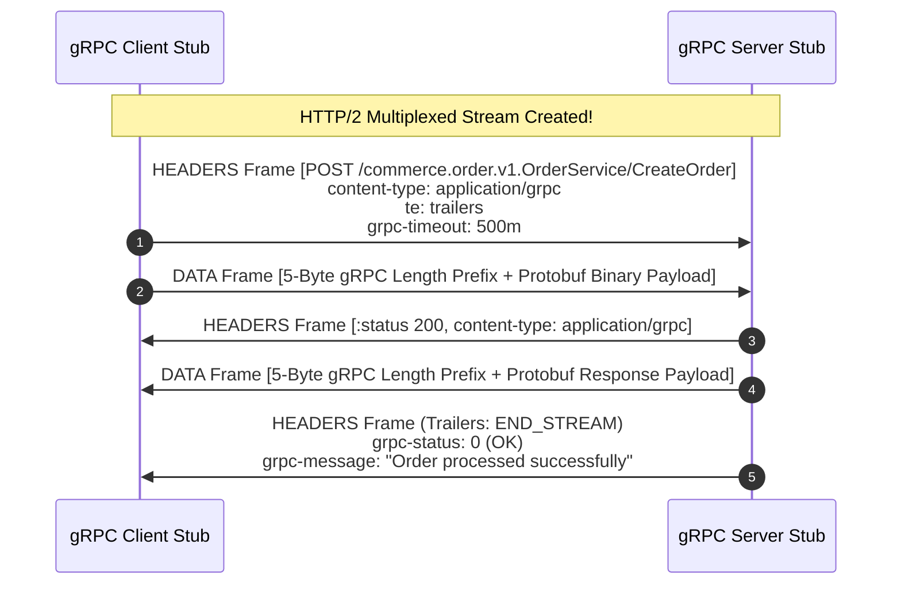

# gRPC and Protocol Buffers: Binary Wire Serialization, HTTP/2 Transport, and Streaming RPCs

> [!abstract] Mental Model
> - **The Hyperscaler Microservice Substrate**: REST/JSON over HTTP/1.1 is hindered by verbose ASCII string parsing, dynamic typing fragility, and lack of strict contract enforcement.
> - **gRPC** couples with **Protocol Buffers (Proto3)** to establish rigid, strongly-typed interface contracts compiled into high-performance stubs across 10+ languages, transmitting compressed binary serialized messages across multiplexed **HTTP/2 streams**.

---

## 1. Protocol Buffers (Proto3) IDL & Schema Compilation

```protobuf
syntax = "proto3";

package commerce.order.v1;

// Service Contract Definition
service OrderService {
  // 1. Unary RPC
  rpc CreateOrder (CreateOrderRequest) returns (OrderResponse);
  
  // 2. Server-Streaming RPC
  rpc StreamOrderUpdates (OrderStreamRequest) returns (stream OrderStatusUpdate);
  
  // 3. Client-Streaming RPC
  rpc UploadTelemetry (stream SensorBatch) returns (TelemetryAck);
  
  // 4. Bidirectional-Streaming RPC
  rpc ChatSession (stream ChatMessage) returns (stream ChatMessage);
}

message CreateOrderRequest {
  string user_id = 1;       // Field Tag 1 (Wire Type 2: Length-delimited)
  int64 item_id = 2;        // Field Tag 2 (Wire Type 0: Varint)
  double amount = 3;        // Field Tag 3 (Wire Type 1: 64-bit)
  repeated string tags = 4; // Field Tag 4 (Repeated array)
}
```

---

## 2. Protobuf Binary Wire Encoding: Varints & Tag-Length-Value (TLV)

Every Protobuf field on the wire is encoded as a **Key-Value Pair**:

$$\mathbf{\text{Field Tag Key} = (\text{Field Number} \ll 3) \mid \text{Wire Type}}$$

| Wire Type | Type ID | Numeric Formats | Wire Structure |
| :--- | :---: | :--- | :--- |
| **Varint** | `0` | `int32`, `int64`, `uint32`, `bool`, `enum` | Variable-length 7-bit chunks with MSB continuation. |
| **64-bit** | `1` | `fixed64`, `sfixed64`, `double` | Fixed 8 bytes (Little-Endian). |
| **Length-delimited** | `2` | `string`, `bytes`, embedded messages, repeated | Varint Length + Raw payload bytes. |
| **32-bit** | `5` | `fixed32`, `sfixed32`, `float` | Fixed 4 bytes (Little-Endian). |

---

### Varints & ZigZag Encoding Mechanics:
1. **Varints (Variable-Length Quantities)**: Numbers $< 128$ occupy **1 single byte**. Numbers $\ge 128$ use the Most Significant Bit (MSB = `1`) as a continuation flag.
2. **ZigZag Encoding (`sint32` / `sint64`)**: In standard two's complement, small negative numbers like `-1` have all 32/64 bits set (consuming 10 bytes in a varint). ZigZag maps signed integers to positive space:
   $$\text{ZigZag}(n) = (n \ll 1) \oplus (n \gg 31)$$
   - `0` $\to$ `0`, `-1` $\to$ `1`, `1` $\to$ `2`, `-2` $\to$ `3`. Compacts small negative integers to 1 byte!

---

## 3. gRPC Transport Mapping over HTTP/2



---

### The 5-Byte gRPC Message Framing Prefix:
```
+--------------------+-----------------------------------------------+
| Compressed-Flag(1B)|       Message-Length (4 Bytes / 32-bit uint)  |
+--------------------+-----------------------------------------------+
|                 Binary Protobuf Serialized Payload                |
+-------------------------------------------------------------------+
```

---

## 4. The 4 gRPC Streaming Archetypes

```mermaid
flowchart TD
    subgraph Unary ["1. Unary RPC (1 Req -> 1 Resp)"]
        U_C["Client: Single Request"] --> U_S["Server: Single Response"]
    end

    subgraph ServerStream ["2. Server-Streaming RPC (1 Req -> Stream Resp)"]
        SS_C["Client: Subscribe Order 42"] --> SS_S["Server: Emits Status Stream (Cooking -> Dispatched -> Delivered)"]
    end

    subgraph ClientStream ["3. Client-Streaming RPC (Stream Req -> 1 Resp)"]
        CS_C["Client: Streams 1,000 GPS Coords"] --> CS_S["Server: Returns Summary Distance Ack"]
    end

    subgraph BiStream ["4. Bidirectional-Streaming RPC (Stream Req <-> Stream Resp)"]
        BS_C["Client: Concurrent Audio Input"] <--> BS_S["Server: Concurrent Translated Audio Output"]
    end
```



---

## 5. Enterprise Microservice Invariants: Deadlines & Rich Status

1. **Deadline Propagation (`grpc-timeout`)**:
   - A client initiates a call with a 500ms timeout budget.
   - When calling Service A $\to$ Service B $\to$ Service C, each hop automatically decrements elapsed latency. If the deadline expires at Service B, Service C is never invoked and resources are instantly reclaimed.
2. **Canonical gRPC Status Codes**:
   - `0 OK`: Success.
   - `1 CANCELLED`: Client aborted call.
   - `3 INVALID_ARGUMENT`: Bad request / validation failure.
   - `4 DEADLINE_EXCEEDED`: Timeout reached before completion.
   - `5 NOT_FOUND`: Resource missing.
   - `14 UNAVAILABLE`: Server overloaded or transient network failure (safe to retry with exponential backoff).

---

## 6. Performance Benchmark: REST/JSON vs gRPC/Protobuf

| Metric | REST over HTTP/1.1 (JSON) | gRPC over HTTP/2 (Protobuf) | Performance Advantage |
| :--- | :--- | :--- | :--- |
| **Payload Size** | Verbose ASCII strings ($1.2\text{ KB}$) | Compact Binary ($240\text{ Bytes}$) | **$60\% - 80\%$ smaller** |
| **Serialization CPU** | CPU-intensive string parsing & regex | Direct memory struct offsets | **$5\times - 10\times$ faster** |
| **Network Multiplexing**| 1 Request per TCP socket | Thousands of multiplexed streams | **Zero connection churn** |
| **Contract Rigor** | Loose OpenAPI / Swagger docs | Compiled strongly-typed `.proto` stubs | **Compile-time type safety** |
| **Browser Compatibility**| 100% Native Browser JS | Requires `grpc-web` proxy (Envoy) | REST wins in public browsers |

---

## Production Diagnostics & gRPC CLI Tooling

```bash
# 1. Discover Services and Methods on a Remote gRPC Server via Reflection:
grpcurl -plaintext localhost:50051 list
# commerce.order.v1.OrderService
# grpc.reflection.v1alpha.ServerReflection

# 2. Inspect Service RPC Signatures:
grpcurl -plaintext localhost:50051 describe commerce.order.v1.OrderService.CreateOrder

# 3. Execute a Live Unary RPC via CLI:
grpcurl -plaintext -d '{"user_id": "usr_991", "item_id": 402, "amount": 99.50}' \
  localhost:50051 commerce.order.v1.OrderService/CreateOrder

# Output:
# {
#   "order_id": "ord_881923",
#   "status": "CONFIRMED"
# }
```

---

## Active Recall & Interview Perspective

### Reasoning Prompts
1. *Why does Protocol Buffers encode field numbers on the wire instead of field names, and how does this guarantee backward compatibility?*
   - **Answer**: In JSON or XML, every message must transmit full text field names (e.g. `{"user_identification_number": 12345}`), resulting in massive bandwidth waste. Protobuf maps every field to a compact integer **Field Number (Tag)** in the `.proto` definition. On the wire, the field is represented by a single byte containing the field number and wire type (`(field_number << 3) | wire_type`). This achieves complete **Backward and Forward Compatibility**: if a new client sends a field number that an older server does not recognize, the server does not fail or crash—it simply reads the length, skips the unknown field, and stores it in an `unknownFields` buffer so it can be preserved across round-trips.
2. *Why does gRPC transmit HTTP/2 Trailers (`grpc-status`) in a second HEADERS frame at the end of the stream rather than in the initial response headers?*
   - **Answer**: In unary and especially streaming RPCs (Server-Streaming and Bidirectional-Streaming), the final business status of the call cannot be known when the server begins transmitting data. The server sends initial HTTP/2 `HEADERS` (`:status 200, content-type: application/grpc`) to establish the stream, followed by multiple `DATA` frames. If a database error or application exception occurs midway through generating stream items, the server cannot alter the initial headers already received by the client. By sending the `grpc-status` code (e.g. `grpc-status: 13 INTERNAL`) and `grpc-message` in trailing HTTP/2 **Trailers** marked with the `END_STREAM` flag, the server can communicate errors that occurred during real-time stream execution.
3. *What is Deadline Propagation in gRPC, and how does it prevent cascading microservice outages?*
   - **Answer**: In a deep microservice call graph ($A \to B \to C \to D$), if Client A sets a 1-second timeout and Service C hangs due to a database deadlock, Client A will abort after 1 second. In traditional REST architectures, Services B, C, and D would remain unaware of the client cancellation and continue wasting CPU and database connections processing a request whose response will be immediately discarded. In gRPC, the client attaches a **`grpc-timeout`** header. Each downstream service decrements the remaining budget by its own processing latency and passes the reduced deadline downstream. If the deadline expires, the context is cancelled across all hops simultaneously via `DEADLINE_EXCEEDED`, preventing thread pool exhaustion and cascading distributed system collapse.

---

## Key Takeaways
- **Protobuf (Proto3)**: Compact binary encoding using **Varints**, **ZigZag**, and **TLV Keys**.
- **HTTP/2 Transport**: Mapped via `POST /Package.Service/Method` with a 5-byte message prefix.
- **Trailers**: `grpc-status` and `grpc-message` delivered at the end of the stream.
- **4 Streaming Models**: Unary, Server-Streaming, Client-Streaming, Bidirectional-Streaming.
- **Deadline Propagation**: Prevents wasted CPU and cascading thread pool exhaustion.

---

## Related Notes
- [[Computer Networks MOC]] — Master table of contents for Computer Networks.
- [[Transmission Control Protocol - TCP Header, Features, and Invariants]] — L4 transport substrate.
- [[HTTP-2 - Binary Framing, Multiplexing, Stream Priorities, HPACK]] — Direct transport layer of gRPC.
- [[HTTP-3 and QUIC - UDP-Based Transport, Head-of-Line Blocking Elimination]] — Emerging gRPC over QUIC architectures.
- [[WebSockets and Server-Sent Events - SSE]] — Alternative real-time streaming mechanisms.
- [[Transport Layer Security - TLS 1.2 vs TLS 1.3 Handshake]] — mTLS authentication in gRPC.
