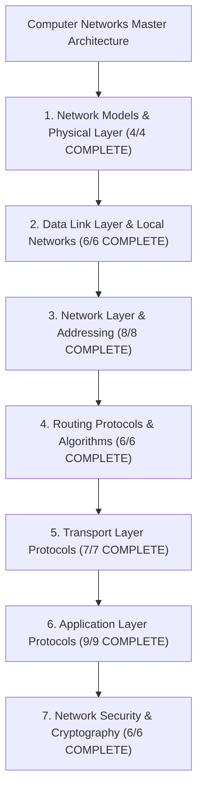

# Computer Networks Map of Content (MOC)

> [!abstract] Architectural Mission
> This Map of Content organizes the complete **Computer Networks** knowledge base, structured strictly from physical hardware bitstreams up through global distributed application layers and cryptosystems.

---

## 1. Network Models & Physical Layer (100% COMPLETE)
- [[OSI vs TCP-IP Model]] — The 7-layer theoretical taxonomy vs the pragmatic 4-layer internet stack, "Rough consensus and running code", and the End-to-End Principle.
- [[Encapsulation, De-encapsulation, and Protocol Data Units - PDUs]] — Packet encapsulation mechanics, PDU taxonomy, MTU/MSS sizing, and PMTUD.
- [[Physical Layer - Transmission Media, Bandwidth, and Latency]] — Copper vs Fiber (SMF vs MMF), Nyquist & Shannon-Hartley capacity limits, latency decomposition, and Bandwidth-Delay Product (BDP).

---

## 2. Data Link Layer & Local Networks (100% COMPLETE)
- [[Data Link Layer Framing and Error Detection - CRC, Checksum, Parity]] — Frame delineation (bit/byte stuffing), mathematics of CRC-32 in $GF(2)$, Internet checksum, parity guarantees, and NIC hardware offloading.
- [[Flow Control - Stop-and-Wait, Go-Back-N, Selective Repeat]] — Sliding window protocols, ARQ error recovery, bandwidth-delay efficiency collapse ($\eta = \frac{1}{1+2a}$), and TCP SACK.
- [[Media Access Control - CSMA-CD, CSMA-CA, ALOHA]] — Shared channel arbitration, Pure/Slotted ALOHA, CSMA 1-persistent, CSMA/CD minimum frame size invariant ($64\text{B}$), Exponential Backoff, CSMA/CA, and Hidden/Exposed terminals.
- [[Ethernet Protocol and IEEE 802.3 Frame Format]] — Ethernet II (DIX) frame format, EtherType vs Length, preamble & SFD synchronization, MAC addressing, runt/giant frames, and Jumbo Frames ($9000\text{B}$).
- [[MAC Addressing and Address Resolution Protocol - ARP]] — 48-bit EUI-48 physical addresses, RFC 826 ARP packet format, Gratuitous ARP (GARP) for VIP failovers, ARP Cache Poisoning, and Dynamic ARP Inspection (DAI).
- [[Switches and VLANs - 802.1Q, Trunking, Spanning Tree Protocol STP]] — Transparent L2 bridging, CAM table learning/forwarding/flooding, 802.1Q VLAN tagging, Spanning Tree Protocol (IEEE 802.1D / RSTP 802.1w), and BPDU Guard.

---

## 3. Network Layer & Addressing (100% COMPLETE)
- [[Network Layer - Packet Forwarding vs Routing]] — Control Plane (RIB in software) vs Data Plane (FIB in ASIC), Longest Prefix Match (LPM), TCAM $O(1)$ hardware lookups, and crossbar switching fabrics.
- [[IPv4 Addressing - Classful, Classless, CIDR, and Subnetting]] — 32-bit address space, Classful obsolescence, CIDR bitmask math, VLSM allocation, `/31` point-to-point links (RFC 3021), and RFC 1918 private ranges.
- [[IPv4 Header Format and Packet Fragmentation]] — 20-to-60-byte header format, Identification, DF/MF flags, Fragment Offset in 8-byte units, TTL loop prevention, and RFC 8900 fragmentation hazards.
- [[IPv6 Architecture - 128-bit Addressing, Header Format, Transition]] — 128-bit address space ($3.4 \times 10^{38}$), RFC 5952 compression rules, fixed 40-byte base header (no checksum, no router fragmentation), Extension Headers, Neighbor Discovery Protocol (NDP), SLAAC, Dual-Stack, and NAT64/DNS64.
- [[Network Address Translation - NAT, PAT, CGNAT]] — Static NAT, Dynamic NAT, Port Address Translation (PAT / NAT Overload), Linux kernel `nf_conntrack` connection tracking, Carrier-Grade NAT (CGNAT RFC 6598 `100.64.0.0/10`), and STUN/TURN/ICE traversal.
- [[Dynamic Host Configuration Protocol - DHCP]] — UDP 67/68 client-server protocol, 4-step DORA handshake (Discover, Offer, Request, ACK), standard TLV Options, lease renewal timers ($T_1 = 50\%$, $T_2 = 87.5\%$), DHCP Relay Agents (`giaddr`), and DHCP Snooping switch defenses.
- [[Internet Control Message Protocol - ICMP and Traceroute]] — RFC 792 network diagnostic reporting, Type/Code structure, 8-byte original payload reflection, Traceroute TTL incrementing mechanics, and Path MTU Discovery (PMTUD) Black Hole outages.
- [[Virtual Private Networks - IPsec, WireGuard, GRE]] — Private cryptographic overlay tunneling across the public internet, GRE unencrypted encapsulation, IPsec AH vs ESP, Transport vs Tunnel modes, IKEv2 key exchange, and modern WireGuard Noise protocol with Cryptokey Routing.

---

## 4. Routing Protocols & Algorithms (100% COMPLETE)
- [[Routing Algorithms - Distance Vector vs Link State vs Path Vector]] — Distance Vector (Bellman-Ford, Count-to-Infinity, Split Horizon, Poison Reverse) vs Link State (Dijkstra SPF, global LSDB) vs Path Vector (BGP AS_PATH loop immunity).
- [[Dijkstra's Shortest Path and Bellman-Ford Algorithms]] — Graph algorithmic mechanics, priority queues min-heaps, $O((V+E)\log V)$ complexity, edge relaxations, negative weight cycle detection, and ECMP multipath extensions.
- [[Open Shortest Path First - OSPF and Link State Advertisements]] — IP Protocol 89, 7-step neighbor state machine, DR/BDR election over `224.0.0.6`, Area 0 Backbone hierarchy, LSA Types 1 to 5, and reference bandwidth cost tuning.
- [[Border Gateway Protocol - BGP, AS, BGP Peering, Path Attributes]] — TCP Port 179 peering, eBGP vs iBGP, Well-Known Mandatory/Discretionary Path Attributes, 13-step best-path selection algorithm, Gao-Rexford peering economics, and RPKI ROA cryptographic hijacking defenses.
- [[Multiprotocol Label Switching - MPLS]] — 32-bit Layer 2.5 shim header, PUSH/SWAP/POP label operations, Penultimate Hop Popping (PHP Label 3), and MPLS Layer 3 VPNs with VRFs, Route Distinguishers, and MP-BGP.
- [[Software-Defined Networking - SDN and OpenFlow]] — Control plane and data plane disaggregation, Northbound/Southbound REST and OpenFlow APIs, multi-table Match-Action pipelines, P4 programmable data planes, and hyperscaler traffic engineering (Google B4, OVS, AWS Nitro).

---

## 5. Transport Layer Protocols (100% COMPLETE)
- [[Transport Layer Fundamentals - Multiplexing, Demultiplexing, Ports]] — Port taxonomy ($0-65535$), UDP 2-tuple vs TCP 4-tuple (`ehash` table in Linux kernel), `SO_REUSEPORT` multi-core scaling, and Ephemeral Port Exhaustion (`EADDRNOTAVAIL`).
- [[User Datagram Protocol - UDP Architecture and Checksum]] — Minimalist 8-byte header, Pseudo-Header checksum mathematics, Optional in IPv4 vs Mandatory in IPv6, hardware offloading, `UdpRcvbufErrors` buffer drop outages, and QUIC/HTTP-3 foundation.
- [[Transmission Control Protocol - TCP Header, Features, and Invariants]] — 20-to-60-byte header format, Sequence & Cumulative ACK numbers, Data Offset (HLEN), 9 Control Flags, Window Scale (expanding up to 1GB for high BDP pipes), MSS, and SACK Permitted.
- [[TCP Three-Way Handshake and Connection Termination]] — 3-Way SYN/SYN-ACK/ACK handshake, Cryptographic ISN generation, SYN Cookies defense (RFC 4987), 4-Way teardown with Half-Close, and the $2 \times \text{MSL} = 120\text{s}$ `TIME_WAIT` invariant.
- [[TCP Reliability - Sequence Numbers, ACKs, Retransmission, SACK]] — Byte-level numbering, Jacobson/Karels adaptive RTO math ($\text{RTO} = \text{SRTT} + 4 \cdot \text{RTTVAR}$), Karn's algorithm exponential backoff, 3-Dup-ACK Fast Retransmit, and SACK surgical multi-hole repair.
- [[TCP Flow Control - Sliding Window and Silly Window Syndrome]] — Receiver window `rwnd` enforcement, Zero Window probes via Persist Timers, Silly Window Syndrome (Clark's solution vs Nagle's algorithm), and the $40\text{ms}$ Nagle vs Delayed-ACK deadlock solved via `TCP_NODELAY`.
- [[TCP Congestion Control - AIMD, Slow Start, Reno, CUBIC, BBR]] — Congestion window `cwnd`, Slow Start exponential growth, Chiu-Jain AIMD convergence proof, TCP CUBIC cubic time curves (RFC 8312), Google BBR model-based pacing eliminating Bufferbloat, and ECN (RFC 3168).

---

## 6. Application Layer Protocols (100% COMPLETE)
- [[Domain Name System - DNS Hierarchy, Recursive Resolution, EDNS, DNSSEC]]
- [[Hypertext Transfer Protocol - HTTP 1.0, 1.1, Pipelining, Persistent Connections]]
- [[HTTP-2 - Binary Framing, Multiplexing, Stream Priorities, HPACK]]
- [[HTTP-3 and QUIC - UDP-Based Transport, Head-of-Line Blocking Elimination]]
- [[WebSockets and Server-Sent Events - SSE]]
- [[gRPC and Protocol Buffers]]
- [[Email Protocols - SMTP, IMAP, POP3]]
- [[File Transfer Protocols - FTP, SFTP, TFTP]]
- [[Dynamic Routing of Web Traffic - Anycast, CDN Architecture, Edge Computing]]

---

## 7. Network Security & Cryptography (100% COMPLETE — 6/6)
- [[Transport Layer Security - TLS 1.2 vs TLS 1.3 Handshake]]
- [[PKI, X.509 Certificates, and Certificate Authorities]]
- [[Firewalls - Packet Filtering, Stateful Inspection, NGFW]]
- [[Distributed Denial of Service - DDoS Attack Vectors and Mitigations]]
- [[Man-in-the-Middle - MitM, ARP Spoofing, DNS Cache Poisoning]]
- [[Zero Trust Network Architecture - Microsegmentation, mTLS]]
