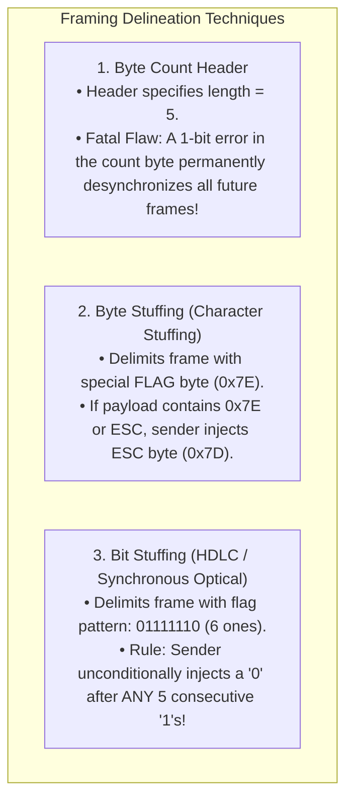
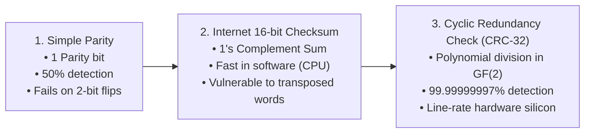
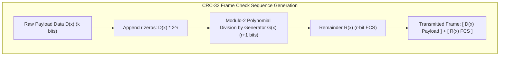

# Data Link Layer Framing and Error Detection: CRC, Checksum, Parity

> [!abstract] Mental Model
> The Data Link Layer (Layer 2) solves two fundamental physical challenges:
> 1. **Framing (Where does a packet start and end?)**: Converting an unstructured stream of raw electromagnetic voltages or laser pulses into distinct, synchronized message boundaries (**Byte and Bit Stuffing**).
> 2. **Error Detection (Did thermal noise corrupt the bits?)**: Appending a mathematical tamper-evident wax seal (**CRC-32 / Frame Check Sequence**) that the receiver's NIC hardware calculates in real-time silicon at line speed.

---

## 1. Frame Delineation (Framing)

Because the physical layer is an asynchronous stream of raw bits, the receiver must reliably detect frame start and end boundaries:



---

### Bit Stuffing Walkthrough (HDLC Protocol):
- **Frame Delimiter Flag**: `01111110` ($6$ consecutive ones).
- **Sender Rule**: Scan the payload bitstream. Whenever **five consecutive `1`s** are encountered (`11111`), immediately insert a **`0` bit**:
  - Original Data: `011011111101111100`
  - Stuffed Data: `011011111`**`0`**`1011111`**`0`**`00`
- **Receiver Rule**: If five consecutive `1`s are followed by `0`, strip the `0`. If followed by `10`, it is a valid Frame Flag!

---

## 2. Error Detection Mathematics



---

## The Cyclic Redundancy Check (CRC) Mechanics

CRC treats binary bitstrings as algebraic polynomials with coefficients in **Galois Field $GF(2)$**, where addition and subtraction are identical and equivalent to the **bitwise XOR operation ($\oplus$) without carries or borrows**:

$$1 \oplus 1 = 0, \quad 0 \oplus 0 = 0, \quad 1 \oplus 0 = 1, \quad 0 \oplus 1 = 1$$



---

### Manual Modulo-2 Division Trace:
Let Data $D = \mathbf{110101}$ ($6$ bits), and Generator Polynomial $G = \mathbf{1011}$ ($r = 3$ bits, degree 3):

1. Append $r=3$ zeros to $D$: $D \cdot 2^3 = \mathbf{110101000}$.
2. Perform long division using bitwise XOR:

```
        1 1 1 0 0 1  (Quotient - Discarded)
      ---------------
1011 | 1 1 0 1 0 1 0 0 0
     ^ 1 0 1 1
       -------
       0 1 1 0 0
       ^ 1 0 1 1
         -------
         0 1 1 1 1
         ^ 1 0 1 1
           -------
           0 1 0 0 0
           ^ 0 0 0 0
             -------
             1 0 0 0 0
             1 0 1 1 0
             ---------
               0 1 1 0  <-- Remainder R = 110 (FCS)
```

3. Transmitted Frame on wire: $\mathbf{110101110}$.
4. **Receiver Verification**: Divides the received bitstream by $G$. If the remainder is **$000$**, the frame is error-free!

---

## Error Detection Capabilities of CRC-32

The IEEE 802.3 Ethernet standard uses **CRC-32**:
$$G(x) = x^{32} + x^{26} + x^{23} + x^{22} + x^{16} + x^{12} + x^{11} + x^{10} + x^8 + x^7 + x^5 + x^4 + x^2 + x + 1$$

| Error Type | Detection Guarantee | Mathematical Reason |
| :--- | :---: | :--- |
| **Single-bit errors** | **$100\%$** | Generator $G(x)$ contains at least two non-zero terms ($x^{32}$ and $1$). |
| **Double-bit errors** | **$100\%$** | $G(x)$ does not divide $x^k + 1$ for all standard frame lengths. |
| **Any odd number of errors** | **$100\%$** | $G(x)$ contains $(x+1)$ as a prime factor. |
| **Burst errors of length $\le 32$ bits** | **$100\%$** | Remainder width $r = 32$ bits spans the entire burst window. |
| **Burst errors of length $> 33$ bits** | **$99.99999997\%$** | Probability of undetected error is $1 - 2^{-32} = \frac{1}{4,294,967,296}$. |

---

## Production Diagnostics & CRC Error Analysis

```bash
# 1. Inspect Hardware NIC CRC / FCS Drop Counters:
sudo ethtool -S eth0 | grep -iE "crc|fcs|drop|err"

# Output:
# rx_crc_errors: 4120           <- (Indicates physical copper fault or optical attenuation!)
# rx_frame_errors: 0
# rx_dropped: 4120

# 2. Inspect Interface Packet Drop Rates via iproute2:
ip -s link show eth0

# 3. Check Kernel Ring Buffer for Physical Framing Faults:
dmesg -T | grep -iE "eth0|crc|carrier"
# [Sun Aug 18 12:00:00 2026] igb 0000:01:00.0 eth0: PCIe link lost / RX CRC error storm
```

---

## Active Recall & Interview Perspective

### Reasoning Prompts
1. *Why does Ethernet place CRC calculation into hardware silicon on the NIC while TCP uses a software checksum in the kernel?*
   - **Answer**: The Data Link Layer (Ethernet) must validate frames at line rate (e.g. $100\text{ Gbps}$ = $148.8\text{ million frames/sec}$) across noisy physical cables. Implementing **CRC-32 in dedicated ASIC hardware shift registers** using parallel XOR logic allows the NIC to verify the Frame Check Sequence (FCS) in nanoseconds as bits flow off the transceiver, dropping bad frames before they ever pollute host DRAM or interrupt the CPU. In contrast, the **Transport Layer (TCP)** uses a simple 1's complement 16-bit checksum because it must execute end-to-end in CPU software across diverse operating systems and network interfaces.
2. *How does Bit Stuffing prevent false frame delimiters from appearing in raw payload data?*
   - **Answer**: In bit-oriented protocols (like HDLC), the bit pattern `01111110` (six consecutive `1`s) is reserved exclusively as a frame delimiter flag. To prevent user data from accidentally containing this exact pattern, the transmitting hardware monitors the bitstream and **unconditionally injects a `0` bit immediately after any five consecutive `1`s (`111110`)**. The receiving hardware reverses this by checking any sequence of five `1`s: if the sixth bit is `0`, it strips it as a stuffed bit; if the sixth bit is `1` (followed by `0`), it recognizes the official Frame Boundary Flag.
3. *Why can a standard 16-bit Internet Checksum fail to detect data corruption that CRC-32 easily catches?*
   - **Answer**: The Internet Checksum (used in IPv4, TCP, UDP) is based on **1's complement addition of 16-bit integers**. Addition is commutative and associative: if two 16-bit words swap positions, or if one bit flips from $0 \to 1$ while an equal-weight bit in another word flips from $1 \to 0$, the arithmetic sum remains completely unchanged, causing the checksum to validate corrupted data. **CRC-32** is based on non-commutative polynomial long division where every bit's position determines high-order terms ($x^k$), guaranteeing that bit swaps and burst errors produce distinct non-zero remainders.

---

## Key Takeaways
- **Framing** delineates packets via **Byte Stuffing (`ESC`)** or **Bit Stuffing (`01111110`)**.
- **CRC-32** uses polynomial modulo-2 XOR division in $GF(2)$, catching **$100\%$ of single/double bit and short burst errors**.
- NIC hardware drops invalid CRC frames instantly, reflected in `ethtool -S` `rx_crc_errors`.

---

## Related Notes
- [[Computer Networks MOC]] — Master table of contents for Computer Networks.
- [[Encapsulation, De-encapsulation, and Protocol Data Units - PDUs]] — FCS trailer placement.
- [[Physical Layer - Transmission Media, Bandwidth, and Latency]] — Physical noise and attenuation.
- [[Ethernet Protocol and IEEE 802.3 Frame Format]] — Ethernet II FCS field.
- [[Flow Control - Stop-and-Wait, Go-Back-N, Selective Repeat]] — Retransmission on CRC drop.
