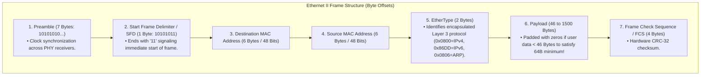
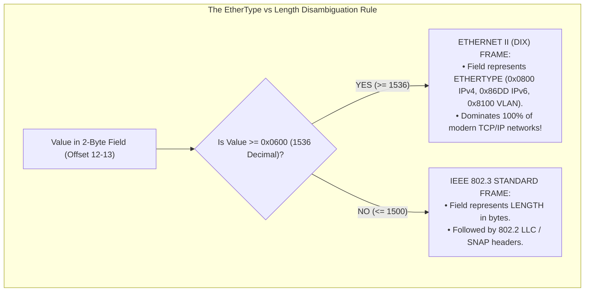
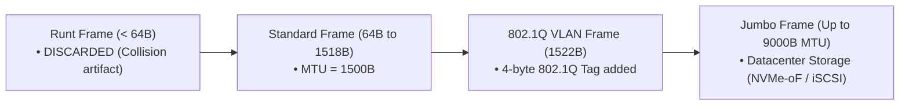
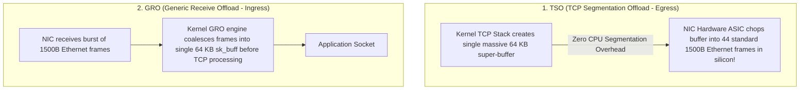

# Ethernet Protocol and IEEE 802.3 Frame Format

> [!abstract] Mental Model
> Ethernet is **the universal shipping container of local area networks**:
> - Invented in 1973 by Bob Metcalfe at Xerox PARC, Ethernet evolved from $10\text{ Mbps}$ shared coaxial cables to $400\text{ Gbps}$ optical datacenter fabrics.
> - While physical speeds multiplied by $40,000\times$, the **Ethernet Frame Format** has remained virtually identical: a 14-byte Header, a 46-to-1500 byte Payload, and a 4-byte CRC-32 Trailer.
> - Modern datacenters utilize **Jumbo Frames ($9000\text{B}$)** and **NIC Hardware Offloads (TSO/GRO)** to scale packet throughput to millions of frames per second.

---

## Ethernet II (DIX) Frame Anatomy

The de facto standard used in all TCP/IP networks worldwide:

```
+-------------------+--------------------+-------------------+-------------------+-----------------------------+---------------+
| Preamble (7B)     | SFD (1B)           | Dest MAC (6B)     | Src MAC (6B)      | EtherType (2B)              | Payload       | FCS (4B)      |
| 10101010...       | 10101011           | 00:1A:2B:3C:4D:5E | 00:11:22:33:44:55 | 0x0800 (IPv4) / 0x86DD(IPv6)| (46 - 1500 B) | CRC-32        |
+-------------------+--------------------+-------------------+-------------------+-----------------------------+---------------+
|<-- Phys Sync ---->|<----------------------- Standard 64 to 1518 Byte Frame --------------------------------------------------------->|
```



---

## Ethernet II vs IEEE 802.3 LLC/SNAP



---

## Frame Sizing Invariants: Min, Max, and Jumbo Frames



---

### Why Jumbo Frames ($9000\text{B}$ MTU) Dominate Enterprise Clouds:
For a $10\text{ Gbps}$ storage replication stream:
- **Standard $1500\text{B}$ MTU**:
  $$\text{Packet Rate} = \frac{10\text{ Gbps}}{1518\text{ Bytes} \times 8} \approx \mathbf{823,450\text{ Frames / Second}}$$
  *(CPU suffers high interrupt overhead and per-packet cache invalidation).*
- **Jumbo $9000\text{B}$ MTU**:
  $$\text{Packet Rate} = \frac{10\text{ Gbps}}{9018\text{ Bytes} \times 8} \approx \mathbf{138,610\text{ Frames / Second}}$$
  *(**$83.2\%$ reduction in packet processing interrupts** and memory allocations!)*

---

## NIC Hardware Offloading (TSO and GRO)

Modern high-speed network interfaces (10GbE / 100GbE) offload packet fragmentation and reassembly to dedicated ASIC silicon:



---

## Production Diagnostics & Ethernet Link Inspection

```bash
# 1. Inspect Hardware NIC Offload Features (TSO, GRO, LRO, Checksumming):
sudo ethtool -k eth0 | grep -E "tcp-segmentation|generic-receive|rx-checksumming"

# Output shows:
# rx-checksumming: on
# tx-checksumming: on
# tcp-segmentation-offload: on (TSO Active)
# generic-receive-offload: on (GRO Active)

# 2. Configure 9000-byte Jumbo Frames on Linux:
sudo ip link set dev eth0 mtu 9000

# 3. Verify Interface Frame Statistics and Drop Errors:
sudo ethtool -S eth0 | grep -iE "runt|giant|drop|align|crc"

# Output on healthy interface:
# rx_oversize_packets: 0 (Giants)
# rx_undersize_packets: 0 (Runts)
# rx_crc_errors: 0
```

---

## Active Recall & Interview Perspective

### Reasoning Prompts
1. *Why does Ethernet require a minimum payload size of 46 bytes, and what happens if an upper layer sends only 10 bytes?*
   - **Answer**: In CSMA/CD half-duplex Ethernet, the minimum frame size across the wire is strictly $64\text{ bytes}$ ($512\text{ bits}$) to ensure that transmitting stations do not finish sending before a worst-case collision signal returns. An Ethernet frame header is $14\text{ bytes}$ (6B Dest MAC + 6B Src MAC + 2B EtherType) and the FCS trailer is $4\text{ bytes}$, leaving $64 - (14 + 4) = \mathbf{46\text{ bytes}}$ for the minimum payload. If an upper layer (like ARP or an interactive TCP keystroke) sends only $10\text{ bytes}$, the transmitting network driver or NIC hardware automatically appends **$36\text{ bytes}$ of zero-padding** to pad the payload to $46\text{ bytes}$, satisfying the $64\text{-byte}$ minimum constraint.
2. *How do TCP Segmentation Offload (TSO) and Generic Receive Offload (GRO) prevent CPU saturation on 100 GbE network links?*
   - **Answer**: On a $100\text{ GbE}$ link, handling $1500\text{B}$ standard frames in software requires the Linux kernel to allocate, route, and execute TCP state machines for over **$8\text{ million packets per second}$**, burning multiple CPU cores in interrupt handling alone. **TSO** allows the kernel to bypass per-packet segmentation by passing a massive $64\text{ KB}$ TCP buffer directly to the NIC hardware, which splits it into individual Ethernet frames at wire speed in ASIC silicon. Conversely, **GRO** coalesces incoming sequences of consecutive Ethernet frames at the driver layer into a single $64\text{ KB}$ `sk_buff` before passing it to the kernel TCP stack, reducing kernel execution overhead by over $80\%$.
3. *What is the difference between a "Runt Frame" and a "Giant / Oversize Frame" in network switches?*
   - **Answer**: A **Runt Frame** is any Ethernet frame that is smaller than the minimum legal size of $64\text{ bytes}$ (excluding preamble), usually caused by a collision fragment in half-duplex links or a malfunctioning NIC transmitter; switches automatically drop runts. A **Giant (or Oversize) Frame** is a frame exceeding the maximum legal MTU (e.g. $> 1518\text{ bytes}$ on standard links or $> 9018\text{ bytes}$ on jumbo networks), typically caused by MTU misconfigurations where an upstream host sends Jumbo frames into a switch port configured for standard $1500\text{B}$ MTU.

---

## Key Takeaways
- **Ethernet II** uses a **14-byte Header** ($6\text{B DMAC} + 6\text{B SMAC} + 2\text{B EtherType}$) and **4-byte CRC-32 FCS**.
- Frames must be between **$64\text{ Bytes}$** (padded if $< 46\text{B}$) and **$1518\text{ Bytes}$** ($1522\text{B}$ with VLAN).
- **Jumbo Frames ($9000\text{B}$)** and **TSO/GRO Offloading** are critical for saturating $10\text{GbE}\dots 100\text{GbE}$ enterprise links.

---

## Related Notes
- [[Computer Networks MOC]] — Master table of contents for Computer Networks.
- [[Encapsulation, De-encapsulation, and Protocol Data Units - PDUs]] — Encapsulation overhead.
- [[Physical Layer - Transmission Media, Bandwidth, and Latency]] — Media serialization speed.
- [[Data Link Layer Framing and Error Detection - CRC, Checksum, Parity]] — CRC-32 FCS mechanics.
- [[Media Access Control - CSMA-CD, CSMA-CA, ALOHA]] — 64-byte minimum frame size origin.
- [[MAC Addressing and Address Resolution Protocol - ARP]] — MAC address resolution.
- [[Switches and VLANs - 802.1Q, Trunking, Spanning Tree Protocol STP]] — 802.1Q 4-byte VLAN tagging.
