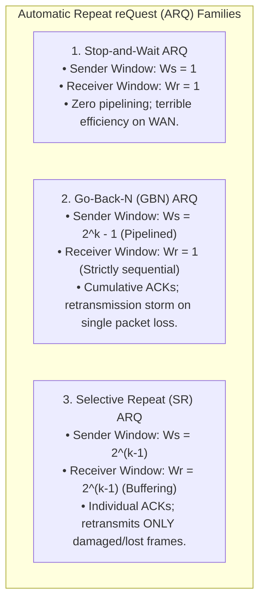
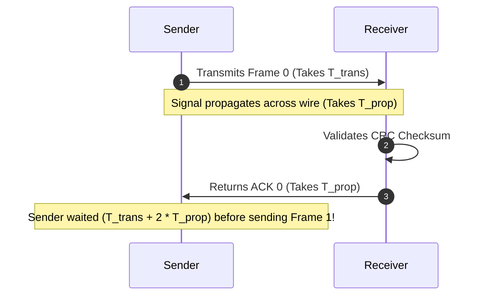
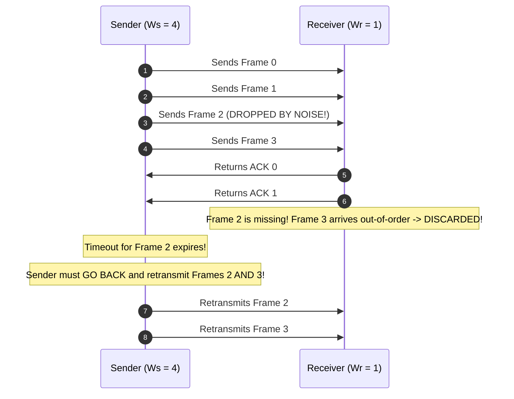
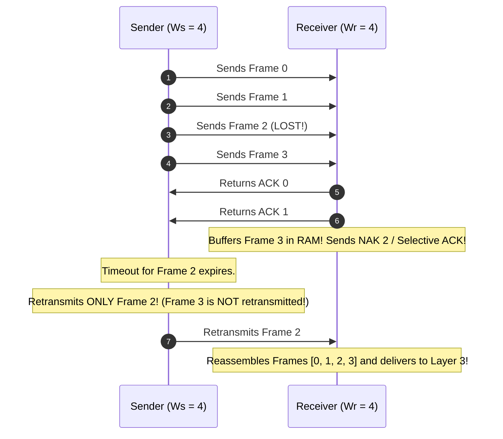

# Flow Control: Stop-and-Wait, Go-Back-N, and Selective Repeat

> [!abstract] Mental Model
> Flow Control is **the protocol between a fast pitcher and a catcher with a finite glove basket**:
> - **Stop-and-Wait (Single Ball Pitch)**: The pitcher throws 1 ball and freezes until the catcher shouts "Caught!". On long-distance links, the pitcher stands idle $99\%$ of the time.
> - **Go-Back-N (Numbered Continuous Pitching with Strict Catcher)**: The pitcher throws a burst of 7 balls. If ball 3 is dropped, the catcher throws away balls 4, 5, 6, and forces the pitcher to re-pitch everything from ball 3 onward.
> - **Selective Repeat (Continuous Pitching with Storage Bins)**: The catcher has numbered storage slots. If ball 3 is dropped, the catcher holds balls 4, 5, 6 in memory and asks the pitcher to re-pitch **only ball 3**.

---

## The Three Canonical ARQ Protocols Compared



---

## 1. Stop-and-Wait ARQ & The Efficiency Bottleneck



### Mathematical Utilization Formula:
$$\mathbf{\eta = \frac{T_{\text{trans}}}{T_{\text{trans}} + 2 T_{\text{prop}}} = \frac{1}{1 + 2a} \quad \text{where } a = \frac{T_{\text{prop}}}{T_{\text{trans}}}}$$

- If $T_{\text{prop}} = 50\text{ ms}$ and $T_{\text{trans}} = 1\text{ ms}$ ($a = 50$):
  $$\eta = \frac{1}{1 + 2(50)} = \frac{1}{101} \approx \mathbf{0.99\% \text{ Link Utilization!}}$$
  *(The link is completely idle $99.01\%$ of the time!)*

---

## 2. Go-Back-N (GBN) ARQ

GBN pipelines up to $W_s$ frames into the wire before blocking. The receiver **accepts frames ONLY in strict sequential order**:



---

### The GBN Window Size Constraint:
For $k$-bit sequence numbers (sequence numbers $0 \dots 2^k - 1$):
$$\mathbf{W_s \le 2^k - 1}, \quad W_r = 1$$

> **Why can't $W_s = 2^k$?**
> If $k=2$ (sequence numbers $0, 1, 2, 3$) and $W_s = 4$:
> 1. Sender transmits frames $0, 1, 2, 3$.
> 2. Receiver accepts all and sends ACKs $0, 1, 2, 3$.
> 3. **All 4 ACKs are lost in transit.**
> 4. Sender times out and retransmits Frame 0.
> 5. The receiver expects the *new* Frame 0 of the next batch and accepts the duplicate as fresh data!

---

## 3. Selective Repeat (SR) ARQ

Selective Repeat eliminates retransmission storms by giving the receiver an **out-of-order resequencing buffer**:



---

### The Selective Repeat Window Size Constraint:
$$\mathbf{W_s = W_r \le 2^{k-1}}$$
*(Window size must not exceed half the total sequence number space to prevent overlapping receiver acceptance windows on lost ACKs).*

---

## Technical Comparison Matrix

| Architectural Feature | Stop-and-Wait | Go-Back-N (GBN) | Selective Repeat (SR) |
| :--- | :--- | :--- | :--- |
| **Sender Window ($W_s$)** | $1$ | $\mathbf{2^k - 1}$ | $\mathbf{2^{k-1}}$ |
| **Receiver Window ($W_r$)**| $1$ | $\mathbf{1}$ | $\mathbf{2^{k-1}}$ |
| **Acknowledgment Type** | Individual ACK | **Cumulative ACK** | **Individual / SACK** |
| **Receiver Buffering** | None | None (Discards out-of-order) | **Yes (Reordering Buffer)** |
| **Retransmissions** | Single lost frame | **Entire window from lost frame** | **Only the lost frame** |
| **Bandwidth Efficiency ($\eta$)**| $\frac{1}{1 + 2a}$ | $\frac{W_s}{1 + 2a}$ (High on low loss) | $\frac{W_s}{1 + 2a}$ (High on noisy links) |
| **Implementation Complexity**| Trivial | Low | High (Sorting timers & buffers) |

---

## Modern Real-World Evolution: TCP SACK (RFC 2018)

Standard TCP originally used Go-Back-N cumulative acknowledgments. Today, $100\%$ of production internet traffic uses **TCP Selective Acknowledgment (SACK)**:

```bash
# Verify TCP Selective Acknowledgment is enabled in Linux Kernel:
sysctl net.ipv4.tcp_sack
# net.ipv4.tcp_sack = 1 (1 = Enabled)

# Inspect TCP SACK recovery events across all active connections:
netstat -s | grep -iE "sack|retrans"
# 14,291 fast retransmits
# 12,042 SACKs received
# 890 SACK retransmits (Only missing segment re-sent!)
```

---

## Active Recall & Interview Perspective

### Reasoning Prompts
1. *Why does Go-Back-N experience catastrophic throughput collapse on noisy or high-loss wireless connections?*
   - **Answer**: In Go-Back-N, the receiver window size is strictly $1$ ($W_r = 1$). If a single frame (e.g. Frame 2) is corrupted and dropped by physical noise, the receiver unconditionally discards all subsequent frames ($3, 4, 5, 6$) even if they arrive in pristine condition without bit errors. When the sender's retransmission timer expires, it is forced to retransmit the entire window of frames from Frame 2 onward. On noisy links with frequent single-frame losses, the sender spends most of its bandwidth repeatedly retransmitting already-received frames (**Retransmission Storms**), collapsing effective goodput.
2. *Why must the maximum window size in Selective Repeat ARQ satisfy $W_s + W_r \le 2^k$ (i.e. $W_s \le 2^{k-1}$ for symmetric windows)?*
   - **Answer**: If the window size exceeds $2^{k-1}$ (for example, if $k=2$, sequence numbers are $0, 1, 2, 3$ and $W_s = W_r = 3$), an ambiguous overlap occurs when acknowledgments are lost. If the sender transmits frames $0, 1, 2$ and the receiver accepts them, advancing its window to $[3, 0, 1]$, but all ACKs are lost in transit, the sender will time out and retransmit Frame 0. The receiver's new window contains $0$ (intended for the *next* cycle), so it mistakenly accepts the duplicate old Frame 0 as new data, causing undetected silent data corruption.
3. *How does TCP combine the benefits of both Go-Back-N and Selective Repeat?*
   - **Answer**: TCP uses a hybrid approach: its baseline acknowledgment field in the 20-byte TCP header is **Cumulative (like Go-Back-N)**, acknowledging all contiguous bytes received up to $N$. However, through the **TCP SACK Option (RFC 2018)** in the TCP options header, the receiver can report up to 4 non-contiguous block ranges of out-of-order bytes currently stored in its buffer (like **Selective Repeat**). This allows the sender to retransmit *only* the specific missing byte segments while preserving simple cumulative sequence state.

---

## Key Takeaways
- **Stop-and-Wait** wastes bandwidth on high-BDP links ($\eta = \frac{1}{1+2a}$).
- **Go-Back-N ($W_s \le 2^k - 1, W_r = 1$)** uses cumulative ACKs but retransmits all frames on loss.
- **Selective Repeat ($W_s = W_r \le 2^{k-1}$)** buffers out-of-order frames and retransmits only lost packets (the foundation of modern **TCP SACK**).

---

## Related Notes
- [[Computer Networks MOC]] — Master table of contents for Computer Networks.
- [[Physical Layer - Transmission Media, Bandwidth, and Latency]] — Propagation delay ($T_{\text{prop}}$).
- [[Data Link Layer Framing and Error Detection - CRC, Checksum, Parity]] — Frame error detection.
- [[Ethernet Protocol and IEEE 802.3 Frame Format]] — Data link transport.
- [[TCP Reliability - Sequence Numbers, ACKs, Retransmission, SACK]] — Transport layer ARQ.
- [[TCP Flow Control - Sliding Window and Silly Window Syndrome]] — TCP sliding window mechanisms.
