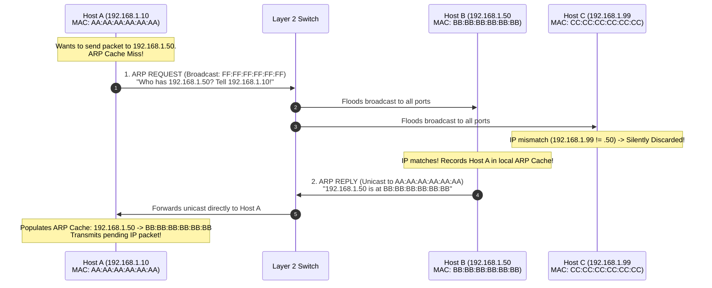
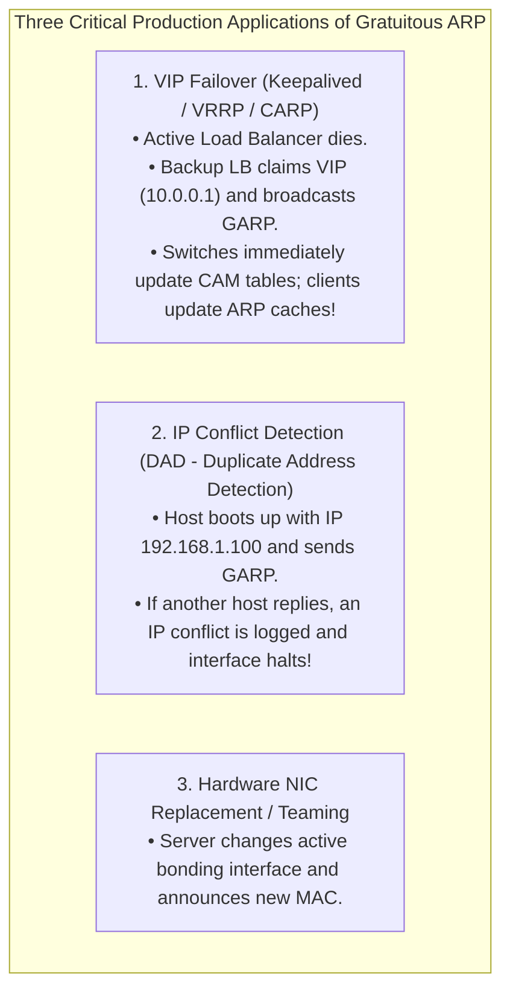
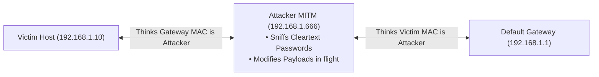

# MAC Addressing and Address Resolution Protocol (ARP)

> [!abstract] Mental Model
> - **IP Address is your legal mailing address** (logical, assigned hierarchically by network topology, changes whenever you connect to a new Wi-Fi network).
> - **MAC Address is your biometric DNA / Fingerprint** (physical 48-bit identifier permanently burned into your Network Interface Card silicon).
> - **ARP (Address Resolution Protocol - RFC 826)** is **the local phonebook directory**: when a host knows the destination IP (`192.168.1.50`) but cannot send raw electrical signals without a destination physical hardware address, ARP asks: *"Who has IP 192.168.1.50? Tell me your physical MAC address!"*

---

## 1. MAC Address Anatomy (IEEE EUI-48)

A 48-bit ($6\text{-byte}$) hex string permanently burned into ROM/EEPROM (Burned-In Address - BIA):

```
+-----------------------------------+-----------------------------------+
|     OUI (Vendor Prefix) 24 Bits   |   NIC Serial Number 24 Bits       |
|            00 : 1A : 2B           |            3C : 4D : 5E           |
+-----------------------------------+-----------------------------------+
  ^ ^
  | +-- Bit 1 (U/L Bit): 0 = Globally Unique (OUI) | 1 = Locally Administered (VM/Cloud)
  +---- Bit 0 (I/G Bit): 0 = Individual (Unicast)  | 1 = Group (Multicast / Broadcast)
```

- **Broadcast MAC**: `FF:FF:FF:FF:FF:FF` (all 48 bits set to $1$).
- **IPv4 Multicast MAC Range**: `01:00:5E:00:00:00` to `01:00:5E:7F:FF:FF` (low 23 bits mapped from IP multicast).

---

## 2. The ARP Resolution Lifecycle



---

## 3. ARP 28-Byte Packet Structure (RFC 826)

```
 0                   1                   2                   3
 0 1 2 3 4 5 6 7 8 9 0 1 2 3 4 5 6 7 8 9 0 1 2 3 4 5 6 7 8 9 0 1
+-+-+-+-+-+-+-+-+-+-+-+-+-+-+-+-+-+-+-+-+-+-+-+-+-+-+-+-+-+-+-+-+
|       Hardware Type (1=Eth)   |     Protocol Type (0x0800 IPv4)|
+-+-+-+-+-+-+-+-+-+-+-+-+-+-+-+-+-+-+-+-+-+-+-+-+-+-+-+-+-+-+-+-+
| Hardware Size | Protocol Size |          Opcode (1=Req, 2=Rep)|
+-+-+-+-+-+-+-+-+-+-+-+-+-+-+-+-+-+-+-+-+-+-+-+-+-+-+-+-+-+-+-+-+
|                     Sender MAC Address (Bytes 0-3)            |
+-+-+-+-+-+-+-+-+-+-+-+-+-+-+-+-+-+-+-+-+-+-+-+-+-+-+-+-+-+-+-+-+
|  Sender MAC (Bytes 4-5)       |    Sender IP Address (Bytes 0-1)
+-+-+-+-+-+-+-+-+-+-+-+-+-+-+-+-+-+-+-+-+-+-+-+-+-+-+-+-+-+-+-+-+
|  Sender IP (Bytes 2-3)        |     Target MAC Address (Bytes 0-1)
+-+-+-+-+-+-+-+-+-+-+-+-+-+-+-+-+-+-+-+-+-+-+-+-+-+-+-+-+-+-+-+-+
|                     Target MAC Address (Bytes 2-5)            |
+-+-+-+-+-+-+-+-+-+-+-+-+-+-+-+-+-+-+-+-+-+-+-+-+-+-+-+-+-+-+-+-+
|                     Target IP Address (Bytes 0-3)             |
+-+-+-+-+-+-+-+-+-+-+-+-+-+-+-+-+-+-+-+-+-+-+-+-+-+-+-+-+-+-+-+-+
```

---

## 4. Gratuitous ARP (GARP) & Production High Availability

A **Gratuitous ARP (GARP)** is an unprompted ARP broadcast where **$\text{Sender IP} = \text{Target IP}$**:



---

## 5. Security Threat: ARP Poisoning / Spoofing & Defenses

Because ARP is **stateless and lacks cryptographic authentication**, any host can send unsolicited fake ARP replies to hijack traffic:



### Mitigations:
1. **Dynamic ARP Inspection (DAI)**: Managed enterprise switches snoop DHCP traffic and drop any ARP reply where the IP-to-MAC mapping does not match the switch's verified DHCP binding table.
2. **Static ARP Tables**: Permanently binding critical router MAC addresses in host kernels.
3. **802.1X Network Access Control**: Authenticating physical switch ports before granting network access.

---

## Production Diagnostics & ARP Table Management

```bash
# 1. Inspect Linux Kernel Neighbor / ARP Cache:
ip neighbor show
# 192.168.1.1 dev eth0 lladdr 00:1a:2b:3c:4d:5e REACHABLE
# 192.168.1.50 dev eth0 lladdr 52:54:00:12:34:56 STALE

# 2. Trigger an ARP Ping and Check Layer 2 Connectivity:
sudo arping -I eth0 -c 3 192.168.1.1
# ARPING 192.168.1.1 from 192.168.1.10 eth0
# Unicast reply from 192.168.1.1 [00:1A:2B:3C:4D:5E]  0.842ms

# 3. Manually Broadcast a Gratuitous ARP to Force VIP Update:
sudo arping -U -c 3 -I eth0 192.168.1.100

# 4. Flush and Clear Corrupted ARP Cache:
sudo ip neighbor flush dev eth0

# 5. Capture Live ARP Packets with tcpdump:
sudo tcpdump -i eth0 -nn -vv arp
# ARP, Request who-has 192.168.1.1 tell 192.168.1.10, length 28
# ARP, Reply 192.168.1.1 is-at 00:1a:2b:3c:4d:5e, length 28
```

---

## Active Recall & Interview Perspective

### Reasoning Prompts
1. *Why is an ARP Request sent as a Broadcast (`FF:FF:FF:FF:FF:FF`), but the ARP Reply sent as a Unicast?*
   - **Answer**: The sender does not know which physical machine owns the target IP address, nor does it know that machine's MAC address. Therefore, the **ARP Request must be sent to the Layer 2 Broadcast address (`FF:FF:FF:FF:FF:FF`)** so that every physical host on the local Ethernet broadcast domain receives and inspects the payload. However, inside the ARP Request packet, the sender includes its own MAC address (`Sender MAC`). The target host extracts this information; when it generates the **ARP Reply**, it already knows the sender's exact physical MAC address, allowing it to send the reply as a direct **Unicast frame**, avoiding unnecessary network chatter across other hosts.
2. *How does Keepalived / VRRP use Gratuitous ARP to achieve sub-second Virtual IP (VIP) failover in high-availability clusters?*
   - **Answer**: In a high-availability active/passive cluster, a floating Virtual IP (VIP) is shared between two nodes. When the master node crashes, the backup node claims the VIP on its local network interface. However, upstream Layer 2 switches still have their CAM (Content Addressable Memory) tables pointing the VIP's MAC address to the old dead server's physical port. The newly promoted backup node immediately broadcasts a **Gratuitous ARP (GARP)** announcing that the VIP is now associated with its own physical MAC address. This forces all intermediate switches to instantly update their port forwarding tables and all client machines to flush and update their ARP caches, restoring traffic routing in milliseconds.
3. *What is "ARP Cache Poisoning" (ARP Spoofing) and how does Dynamic ARP Inspection (DAI) prevent it?*
   - **Answer**: ARP Cache Poisoning is a Man-in-the-Middle (MitM) attack where an attacker sends forged, unsolicited ARP replies to a victim and default gateway, binding its own attacker MAC address to the gateway's IP and the victim's IP. Because ARP accepts replies without verifying requests, both machines poison their ARP tables and funnel all traffic through the attacker. **Dynamic ARP Inspection (DAI)** is a switch-level security feature that intercepts all ARP packets on untrusted switch ports, validating their IP-to-MAC bindings against a trusted database (built automatically by **DHCP Snooping**). If an ARP packet contains an IP-MAC pair that does not match the switch's authenticated lease database, the switch drops the packet immediately.

---

## Key Takeaways
- **MAC Address (48 bits / EUI-48)** is physical identity; **IP Address (32/128 bits)** is topological routing.
- **ARP** translates Layer 3 IP $\to$ Layer 2 MAC via **Broadcast Request $\to$ Unicast Reply**.
- **Gratuitous ARP (GARP)** is essential for **VIP Failover (VRRP/Keepalived)** and IP conflict detection.
- Unprotected ARP is vulnerable to **ARP Spoofing**, mitigated by switch-level **Dynamic ARP Inspection (DAI)**.

---

## Related Notes
- [[Computer Networks MOC]] — Master table of contents for Computer Networks.
- [[Encapsulation, De-encapsulation, and Protocol Data Units - PDUs]] — MAC and IP header encapsulation.
- [[Ethernet Protocol and IEEE 802.3 Frame Format]] — Ethernet II EtherType `0x0806` (ARP).
- [[Switches and VLANs - 802.1Q, Trunking, Spanning Tree Protocol STP]] — CAM table forwarding.
- [[IPv4 Addressing - Classful, Classless, CIDR, and Subnetting]] — Subnet broadcasting boundaries.
- [[Dynamic Host Configuration Protocol - DHCP]] — DHCP Snooping binding tables for DAI.
- [[Man-in-the-Middle - MitM, ARP Spoofing, DNS Cache Poisoning]] — Security attack vectors.
