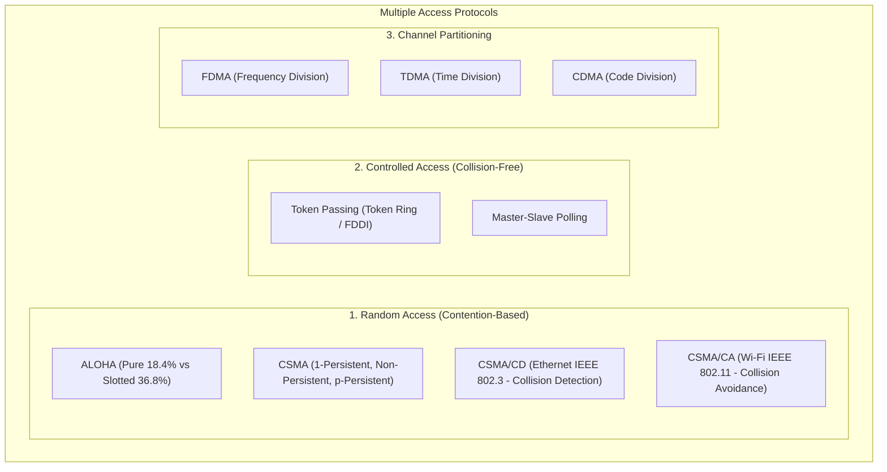
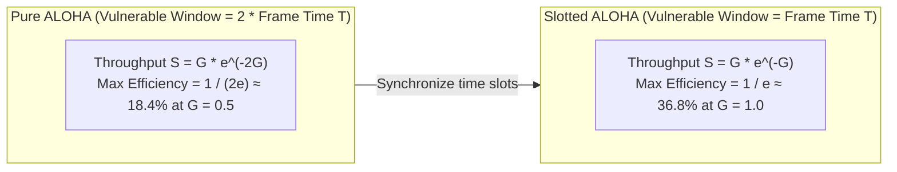
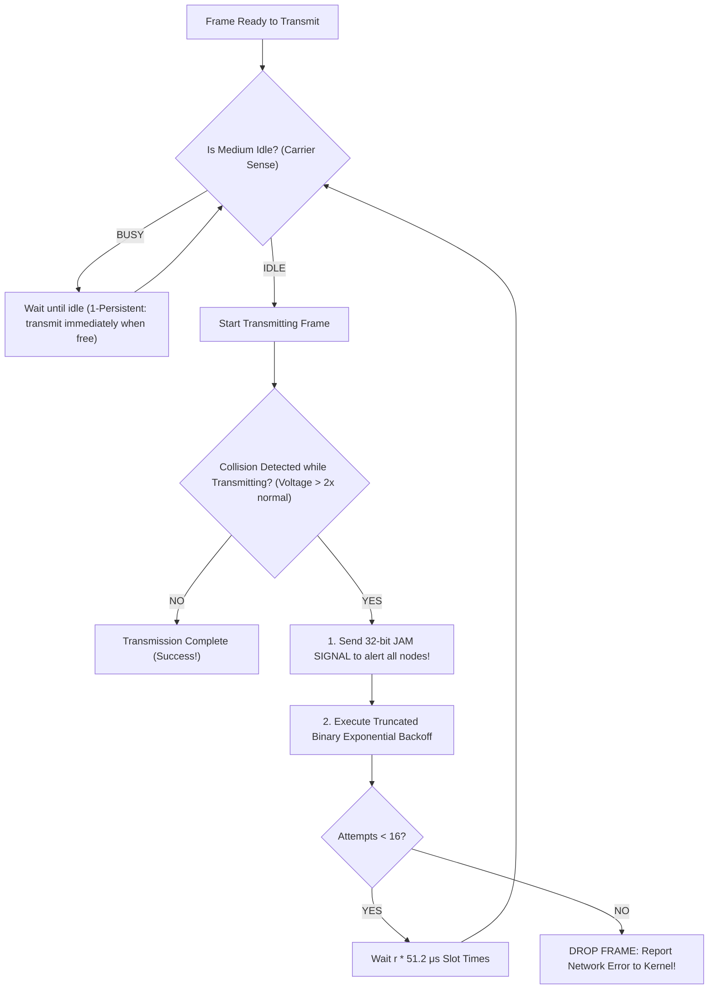
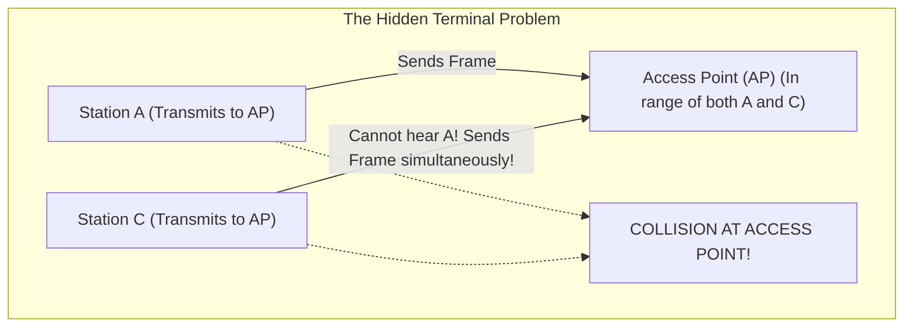
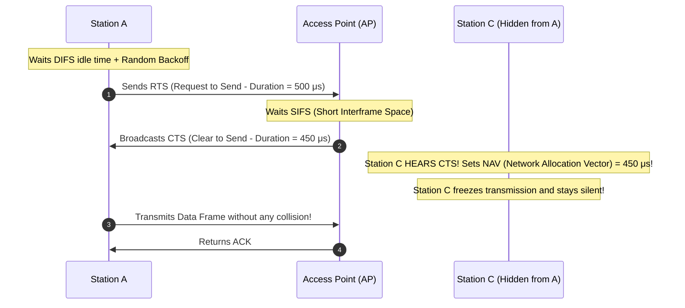

# Media Access Control: CSMA/CD, CSMA/CA, and ALOHA

> [!abstract] Mental Model
> Media Access Control (MAC) is **the conversation etiquette in a crowded room with a single microphone**:
> - **Pure ALOHA (Anarchy)**: Speak whenever you feel like it. If someone talks at the same time, your voices collide into gibberish; wait a random time and retry ($18.4\%$ max efficiency).
> - **CSMA/CD (Ethernet - "Listen While Speaking")**: Listen before talking. If two people start speaking simultaneously, detect the audio clash, yell a **Jam Signal**, stop immediately, and roll a die (**Binary Exponential Backoff**) before retrying.
> - **CSMA/CA (Wi-Fi - "Listen Before Speaking + Reservations")**: In wireless radio, your own megaphone is so loud you cannot hear others while transmitting. You must reserve airtime in advance (**RTS/CTS**) to avoid stepping on unseen neighbors (**Hidden Terminal Problem**).

---

## MAC Protocol Taxonomy



---

## 1. ALOHA Protocols & Mathematical Limits

In 1970, Norman Abramson created **ALOHA** at the University of Hawaii for packet radio broadcasting:



---

## 2. CSMA/CD (Carrier Sense Multiple Access with Collision Detection)

Used in legacy shared-medium Ethernet (coaxial hubs and half-duplex links):



---

### The Fundamental Minimum Frame Size Invariant (64 Bytes):
For a transmitting node to reliably detect a collision before it finishes sending, **transmission time must exceed the worst-case round-trip propagation time**:

$$\mathbf{T_{\text{transmission}} \ge 2 \cdot T_{\text{propagation}} \iff \frac{\text{Min Frame Size (bits)}}{\text{Bandwidth } R} \ge 2 \cdot \frac{\text{Max Cable Length}}{s}}$$

> **Why is minimum Ethernet frame size $64\text{ bytes}$ ($512\text{ bits}$)?**
> On original $10\text{ Mbps}$ Ethernet with a maximum span of $2.5\text{ km}$ ($2\tau \approx 51.2\text{ }\mu\text{s}$ round trip):
> $$\text{Min Frame Size} = 10\text{ Mbps} \times 51.2\text{ }\mu\text{s} = \mathbf{512\text{ bits} = 64\text{ Bytes}}$$
> If a frame were smaller (e.g. 30 bytes), the sender would finish transmitting and clear its buffers before the collision signal bounced back, causing **undetected silent frame corruption!**

---

### Truncated Binary Exponential Backoff Algorithm:
- After collision number $n$:
  1. Let $k = \min(n, 10)$.
  2. Pick random integer $r$ from uniform range: $r \in [0, 2^k - 1]$.
  3. Wait backoff duration: $\text{Wait Time} = r \times 51.2\text{ }\mu\text{s}$ (Slot Time).
  4. If $n = 16$ collisions $\to$ abort and drop packet.

---

## 3. CSMA/CA (Collision Avoidance) & The Hidden Terminal Problem

In wireless networks (Wi-Fi 802.11), **Collision Detection is physically impossible** because the station's own local RF transmission power is $100,000\times$ stronger than any incoming distant signal (drowning out collision reception). Wi-Fi must use **Collision Avoidance (CSMA/CA)**:



---

### The RTS / CTS Solution (Virtual Carrier Sensing):



---

## Technical Comparison Matrix

| Protocol | Medium | Collision Handling | Max Efficiency | Minimum Frame Size Required? | Key Mechanism |
| :--- | :--- | :--- | :---: | :---: | :--- |
| **Pure ALOHA** | Wireless Radio | Retransmit on timeout | $18.4\%$ | No | Completely uncoordinated |
| **Slotted ALOHA** | Satellite / RF | Retransmit on timeout | $36.8\%$ | No | Synchronized global time slots |
| **CSMA/CD** | **Wired Ethernet** (Coax/Hub) | **Collision Detection (Abort & Jam)** | **$\sim 85\%$** | **Yes ($64\text{ Bytes}$)** | Binary Exponential Backoff |
| **CSMA/CA** | **Wireless Wi-Fi** (802.11) | **Collision Avoidance (Pre-reservation)**| **$\sim 65\%$** | No | **RTS/CTS & NAV Timers** |

---

## Production Diagnostics & Collision Inspection

```bash
# 1. Inspect Ethernet Collision Counters on Linux Interface:
sudo ethtool -S eth0 | grep -iE "collis|late"

# Output on full-duplex switched network:
# tx_single_collision_frames: 0
# tx_multiple_collisions: 0
# tx_late_collisions: 0        <- (Non-zero indicates duplex mismatch or cable exceeding length limits!)

# 2. Inspect Wi-Fi Station Retry Counters and Packet Drops:
iw dev wlan0 station dump

# Output:
# tx retries: 1420             <- (High retries indicates RF interference or hidden terminals)
# tx failed: 12
# signal: -68 dBm
```

---

## Active Recall & Interview Perspective

### Reasoning Prompts
1. *Why does full-duplex switched Ethernet completely eliminate the need for CSMA/CD?*
   - **Answer**: CSMA/CD was designed for half-duplex shared media (such as 10BASE5 coax or multiport hubs) where all connected machines shared a single physical electrical wire. In modern **switched full-duplex Ethernet**, every host has a dedicated point-to-point twisted-pair or fiber connection to a dedicated switch port with separate physical transmit ($TX$) and receive ($RX$) pairs. Because transmission and reception occur over independent electrical channels and frame queuing is handled in switch RAM, physical packet collisions on the wire are physically impossible, rendering CSMA/CD obsolete.
2. *Why is Collision Detection (CSMA/CD) not used in Wi-Fi (802.11) networks?*
   - **Answer**: In wireless radio transmission, the **dynamic range problem** prevents collision detection. A Wi-Fi transceiver radiates electromagnetic energy locally at high power (e.g. $+20\text{ dBm}$), which completely saturates its own antenna and receiver front-end. Any collision occurring at a distant receiver arrives attenuated by path loss to microscopic levels (e.g. $-80\text{ dBm}$, $100\text{ million times weaker}$). The transmitter cannot detect this tiny signal disturbance while actively broadcasting, making collision detection impossible and forcing Wi-Fi to use **Collision Avoidance (CSMA/CA)** via RTS/CTS and random backoff slots.
3. *What is a "Late Collision" in Ethernet and what causes it in production networks?*
   - **Answer**: In CSMA/CD Ethernet, all legitimate collisions must occur within the first $64\text{ bytes}$ ($512\text{ bits}$ / Slot Time) of transmission. A **Late Collision** occurs when a collision is detected *after* the transmitting host has already pushed the 64th byte onto the wire. Late collisions indicate an architectural violation of the network's physical design constraints: either **the physical cable length exceeds maximum specifications** ($> 100\text{ meters}$ for Cat6), exceeding propagation limits, or there is a **Duplex Mismatch** where one end is configured for full-duplex (ignores carrier sense) while the other end is half-duplex.

---

## Key Takeaways
- **ALOHA** is uncoordinated ($18.4\%/36.8\%$ efficiency); **CSMA** senses the carrier before speaking.
- **CSMA/CD (Ethernet)** requires **$\text{Frame Size} \ge 64\text{ bytes}$** to guarantee collision detection before transmission ends.
- **CSMA/CA (Wi-Fi)** uses **RTS/CTS and NAV timers** to solve the **Hidden Terminal Problem**.

---

## Related Notes
- [[Computer Networks MOC]] — Master table of contents for Computer Networks.
- [[Physical Layer - Transmission Media, Bandwidth, and Latency]] — Propagation delay constraints.
- [[Data Link Layer Framing and Error Detection - CRC, Checksum, Parity]] — Frame formatting.
- [[Ethernet Protocol and IEEE 802.3 Frame Format]] — 64-byte minimum frame padding.
- [[Switches and VLANs - 802.1Q, Trunking, Spanning Tree Protocol STP]] — Elimination of collision domains via microsegmentation.
