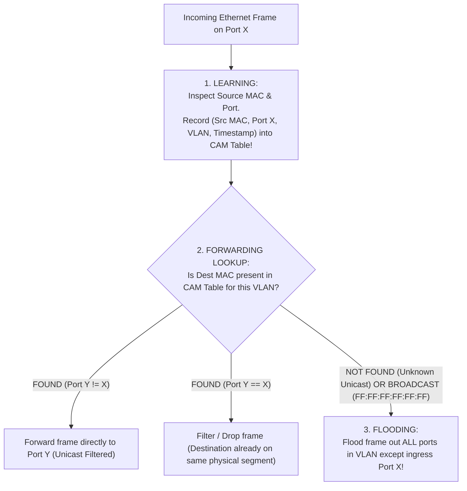
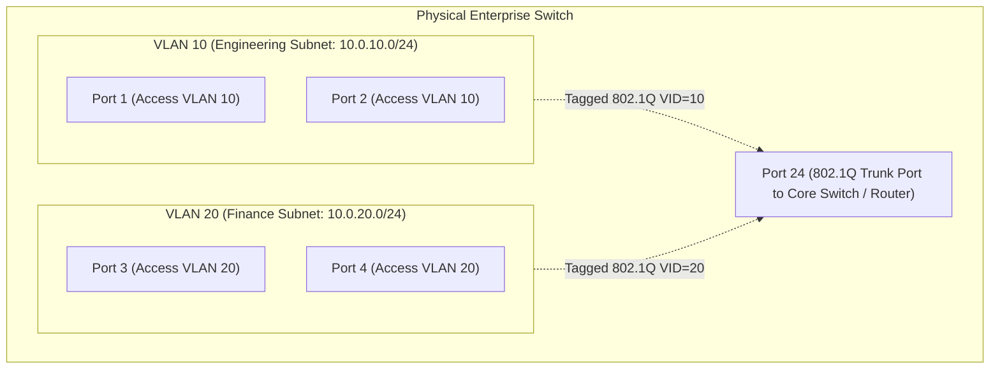
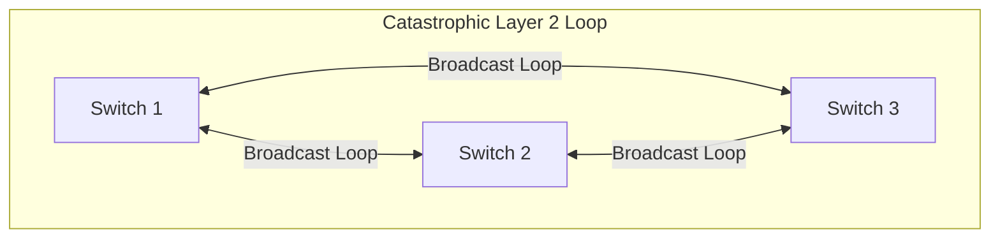

# Switches, VLANs (802.1Q), and Spanning Tree Protocol (STP)

> [!abstract] Mental Model
> - **A Hub is a Megaphone**: Anything yelled into one port echoes out every other port (one massive collision domain and broadcast domain).
> - **A Switch is a Traffic Cop with Photographic Memory**: It inspects incoming frame source MACs to learn which port hosts each machine (**CAM Table**), creating **isolated collision domains per port** while maintaining a single shared broadcast domain.
> - **VLANs (802.1Q) are Soundproof Office Cubicles**: They slice a single physical switch into isolated logical broadcast domains.
> - **Spanning Tree Protocol (STP) is the Emergency Tree-Trimmer**: Because Layer 2 Ethernet frames **have no TTL**, redundant network cables cause catastrophic, infinite **Broadcast Storms**. STP dynamically detects loops and disables redundant links, restoring them instantly if an active line fails.

---

## 1. Transparent Switching & CAM Table Mechanics

A Layer 2 Switch executes three core hardware operations in **Content Addressable Memory (CAM)**:



---

### Security Exploitation: CAM Table Overflow Attack
- **Attack**: A rogue host generates millions of randomized fake source MAC addresses per second.
- **Consequence**: The switch's finite CAM hardware table fills to capacity ($32\text{k} - 128\text{k}$ entries).
- **Failure Mode**: The switch degrades into a **"Fail-Open Hub"**, flooding all subsequent confidential unicast frames to *every* port, enabling network sniffing!
- **Defense**: **Port Security** (limiting maximum MAC addresses learned per port to $1-2$ and shutting down violating interfaces).

---

## 2. Virtual LANs (VLANs) & IEEE 802.1Q Tagging

VLANs isolate broadcast domains without requiring separate physical switches:



---

### The IEEE 802.1Q 4-Byte Tag Insertion:
Inserted directly between the Source MAC Address and the EtherType field:

```
+---------------+---------------+-------------------+-------------------+-------------------+
| Dest MAC (6B) | Src MAC (6B)  | 802.1Q Tag (4B)   | EtherType (2B)    | Payload + FCS     |
+---------------+---------------+-------------------+-------------------+-------------------+
                                  |
    +-----------------------------+-----------------------------+
    | TPID (2 Bytes = 0x8100)     | TCI (2 Bytes / 16 Bits)     |
    +-----------------------------+-----------------------------+
                                  |
        +-------------------------+-------------------------+
        | PCP (3 Bits) | DEI (1 Bit) | VLAN ID / VID (12 Bits)  |
        +-------------------------+-------------------------+
```
- **TPID (Tag Protocol Identifier)**: `0x8100` signals an 802.1Q tagged frame.
- **PCP (Priority Code Point)**: 3-bit Class of Service (CoS) for 802.1p Quality of Service.
- **DEI (Drop Eligible Indicator)**: 1-bit indicator for packets that can be dropped under congestion.
- **VID (VLAN Identifier)**: 12 bits supporting **$4094\text{ distinct VLANs}$** ($1 \dots 4094$, where 0 and 4095 are reserved).

---

## 3. The Broadcast Storm Disaster & Spanning Tree Protocol (STP)

### Why Loops Destroy Layer 2 Networks:
Unlike Layer 3 IP packets (which have a `TTL` field decremented at each hop), **Layer 2 Ethernet frames have NO TTL field**. If a broadcast frame (`ARP Request`) enters a loop with redundant switches, it multiplies exponentially and circulates endlessly at wire speed (**Broadcast Storm**), saturating $100\%$ of switch CPU and bandwidth in milliseconds.



---

### The IEEE 802.1D / RSTP 802.1w STP Solution:
STP creates a loop-free logical tree topology by dynamically blocking redundant backup links:

```mermaid
flowchart TD
    subgraph STPTree ["Spanning Tree Protocol (STP) Active Topology"]
        Root["ROOT BRIDGE<br/>(Lowest Bridge ID = Priority 4096 + MAC)"]
        
        SW2["Switch B<br/>(Root Port RP Active)"]
        SW3["Switch C<br/>(Root Port RP Active)"]
        
        Root ===|Designated Port DP| SW2
        Root ===|Designated Port DP| SW3
        SW2 -.-x|BLOCKED / DISCARDING PORT (Alternate Port)| SW3
    end
```

---

### STP Operation & Port State Progression:
1. **Root Bridge Election**: All switches broadcast **Bridge Protocol Data Units (BPDUs)**. The switch with the **Lowest Bridge ID ($\text{Priority} + \text{MAC}$)** becomes the Root Bridge.
2. **Port Role Assignment**:
   - **Root Port (RP)**: The single port on each non-root switch with the lowest root path cost.
   - **Designated Port (DP)**: The port on each link segment that forwards traffic toward the root.
   - **Blocked / Alternate Port (AP)**: The redundant port disabled to break the loop.

| STP Standard | Convergence Time | Port States |
| :--- | :---: | :--- |
| **Legacy 802.1D STP** | **$30 - 50\text{ Seconds}$** | `Blocking (20s)` $\to$ `Listening (15s)` $\to$ `Learning (15s)` $\to$ `Forwarding` |
| **Rapid STP (RSTP 802.1w)**| **$< 1\text{ Second}$ (Sub-second)** | `Discarding` $\to$ `Learning` $\to$ `Forwarding` (Handshake sync) |

---

## Production Diagnostics & Linux Bridge Inspection

```bash
# 1. Inspect Linux Software Bridge Forwarding Database (CAM Table):
bridge fdb show

# Output shows learned MACs:
# 52:54:00:12:34:56 dev vnet0 vlan 1 master br0 permanent
# 00:1a:2b:3c:4d:5e dev eth0 vlan 10 master br0
# ff:ff:ff:ff:ff:ff dev eth0 master br0 permanent (Broadcast)

# 2. Inspect 802.1Q VLAN Interfaces and Sub-Interfaces:
ip -d link show type vlan
# eth0.10@eth0: <BROADCAST,MULTICAST,UP> mtu 1500 id 10 protocol 802.1Q

# 3. Check Linux Bridge STP Status and Port States:
bridge link show
# 2: eth0: <BROADCAST,MULTICAST,UP> mtu 1500 master br0 state forwarding priority 32 cost 4
# 3: eth1: <BROADCAST,MULTICAST,UP> mtu 1500 master br0 state blocking priority 32 cost 4

# 4. Capture 802.1Q VLAN Tags and STP BPDUs with tcpdump:
sudo tcpdump -i eth0 -nn -e vlan or stp
# 12:00:00.123456 00:1a:2b:3c:4d:5e > 01:80:c2:00:00:00, 802.1Q vlan 10, p 0, STP 802.1w, Rapid STP, Flags [Learn, Forward]
```

---

## Active Recall & Interview Perspective

### Reasoning Prompts
1. *Why does a loop in a Layer 2 switched network cause an immediate network meltdown (Broadcast Storm), whereas a loop in a Layer 3 routed network does not?*
   - **Answer**: In Layer 3, every IP packet header contains a **Time-To-Live (TTL)** field (or Hop Limit in IPv6). Every router that forwards the packet decrements the TTL by 1; if TTL reaches 0, the router drops the packet and emits an `ICMP Time Exceeded` error, guaranteeing that looped packets die after a finite number of hops. In Layer 2, **Ethernet frames have NO TTL or hop count field**. When a broadcast or unknown unicast frame enters a physical switching loop, every switch floods it out all other ports, multiplying the frame copies infinitely. The frames circulate forever at line rate, saturating the switch switching backplanes, exhausting CAM memory, and crashing connected hosts within seconds.
2. *What is the difference between an Access Port and a Trunk Port in 802.1Q VLAN architecture?*
   - **Answer**: An **Access Port** belongs to a single VLAN and transmits/receives standard, **untagged Ethernet frames**. It connects end-user devices (servers, PCs, printers) that are unaware of VLAN tagging. The switch automatically stamps incoming frames on an access port with that port's configured VLAN ID internally, and strips the tag when transmitting out to the device. A **Trunk Port (IEEE 802.1Q)** is configured to carry traffic for multiple VLANs concurrently across a single physical link (such as switch-to-switch links or switch-to-hypervisor links), inserting a **4-byte 802.1Q Tag header** into every frame to identify which VLAN the frame belongs to.
3. *What is RSTP (802.1w) "Edge Port" (Cisco PortFast) and why is BPDU Guard paired with it?*
   - **Answer**: In standard STP, a port transitioning from link-up to `Forwarding` state must wait 30 seconds (`Listening` + `Learning` timers) to verify no loop exists. An **Edge Port** (or PortFast) is configured on ports connected directly to end-user hosts/servers, allowing the port to transition **immediately to the Forwarding state ($0\text{ ms}$)** without delay, preventing DHCP timeouts. However, if a rogue user plugs an unauthorized switch or looped cable into an Edge Port, it could cause a broadcast storm. **BPDU Guard** is a safety mechanism: if the switch receives any STP BPDU packet on an Edge Port, it instantly shuts down the port (`err-disable`), protecting the STP tree from corruption.

---

## Key Takeaways
- **Switches** isolate collision domains using **CAM Tables** ($O(1)$ hardware lookups); **VLANs (802.1Q)** isolate broadcast domains.
- **802.1Q tags** add $4\text{ Bytes}$ containing a **12-bit VLAN ID** ($1 \dots 4094$).
- Layer 2 frames have **No TTL**; **Spanning Tree Protocol (STP/RSTP)** prevents fatal **Broadcast Storms** by disabling redundant loop paths.

---

## Related Notes
- [[Computer Networks MOC]] — Master table of contents for Computer Networks.
- [[Physical Layer - Transmission Media, Bandwidth, and Latency]] — Link speed and media.
- [[Data Link Layer Framing and Error Detection - CRC, Checksum, Parity]] — Frame CRC validation.
- [[Ethernet Protocol and IEEE 802.3 Frame Format]] — 802.1Q 1522-byte frame expansion.
- [[MAC Addressing and Address Resolution Protocol - ARP]] — CAM table learning from ARP.
- [[Network Layer - Packet Forwarding vs Routing]] — Layer 3 routing between VLANs (Inter-VLAN routing).
- [[Virtual Private Networks - IPsec, WireGuard, GRE]] — L2 tunneling (VXLAN / GRE).
