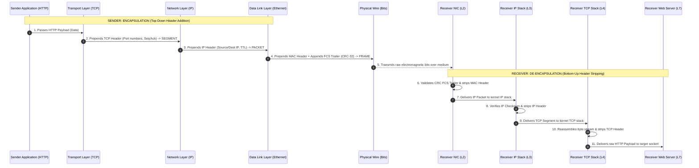
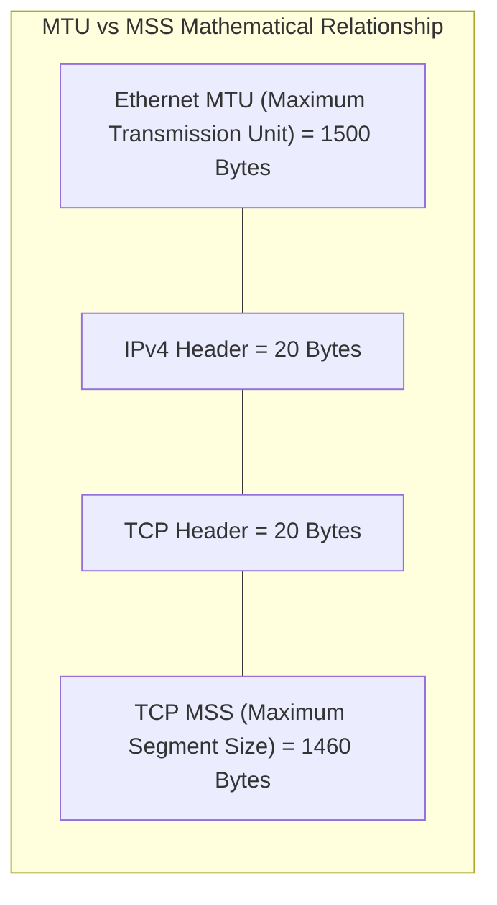

# Encapsulation, De-encapsulation, and Protocol Data Units (PDUs)

> [!abstract] Mental Model
> Encapsulation is **Russian Matryoshka dolls & international postal shipping**:
> - An application writes a letter (**Application Message / Data**).
> - It is sealed in an envelope with apartment unit numbers (**Transport Layer Header $\to$ Segment**).
> - That envelope is placed in a shipping box with street addresses and customs routing (**Network Layer Header $\to$ Packet**).
> - The shipping box is placed in a cargo container with physical barcode seals (**Data Link Header & Trailer $\to$ Frame**).
> - The cargo container is converted into physical energy pulses traversing a physical medium (**Physical Layer $\to$ Bits**).
> - At each receiving hop, outer layers are stripped (**De-encapsulation**) until the original payload reaches the destination process.

---

## The Encapsulation / De-encapsulation Pipeline



---

## Protocol Data Unit (PDU) Taxonomy & Header Offsets

```
+-----------------------------------------------------------------------------------------------+
|                                    ETHERNET FRAME (Layer 2)                                   |
|                                                                                               |
| +-------------------+ +---------------------------------------------------------------------+ |
| |  Ethernet Header  | |                        IP PACKET (Layer 3)                          | |
| |     (14 Bytes)    | |                                                                     | |
| |                   | | +-------------------+ +-------------------------------------------+ | |
| | - Dest MAC (6B)   | | |     IP Header     | |           TCP SEGMENT (Layer 4)           | | |
| | - Src MAC  (6B)   | | |    (20 Bytes)     | |                                           | | |
| | - EtherType (2B)  | | |                   | | +-------------------+ +-----------------+ | | |
| +-------------------+ | | - Src IP   (4B)   | | |    TCP Header     | |   DATA / MSG    | | | |
|                       | | - Dest IP  (4B)   | | |    (20 Bytes)     | |   (Layer 7)     | | | |
|                       | | - TTL      (1B)   | | |                   | |                 | | | |
|                       | | - Protocol (1B)   | | | - Src Port  (2B)  | |   HTTP / TLS    | | | |
|                       | | - Flags    (2B)   | | | - Dest Port (2B)  | |   Application   | | | |
|                       | +-------------------+ | | - Seq / Ack (8B)  | |     Payload     | | | |
|                       |                       | | - Flags     (2B)  | |                 | | | |
|                       |                       | +-------------------+ +-----------------+ | | |
|                       |                       +-------------------------------------------+ | |
|                       +---------------------------------------------------------------------+ |
|                                                                             +---------------+ |
|                                                                             |  FCS Trailer  | |
|                                                                             |   (4 Bytes)   | |
|                                                                             | - CRC-32 (4B) | |
|                                                                             +---------------+ |
+-----------------------------------------------------------------------------------------------+
```

---

## Encapsulation Overhead & Wire Efficiency

### The Tiny Payload Hazard (e.g. 1-Byte SSH Keystroke):
If an interactive SSH or Telnet session sends a single ASCII keystroke ($1\text{ byte}$):

$$\text{Ethernet Header (14B)} + \text{IPv4 Header (20B)} + \text{TCP Header (20B)} + \text{Payload (1B)} + \text{FCS Trailer (4B)} = \mathbf{59\text{ Bytes}}$$
- Adding standard physical wire overhead ($7\text{B Preamble} + 1\text{B SFD} + 12\text{B Inter-Packet Gap}$), **$79\text{ bytes}$ of physical wire capacity are consumed to transmit $1\text{ byte}$ of useful data** ($98.7\%$ protocol overhead!).
- Solutions: **Nagle's Algorithm** and **TCP Delayed ACKs**.

---

## Network Sizing: MTU vs MSS & Path MTU Discovery (PMTUD)



$$\mathbf{\text{MSS} = \text{MTU} - (\text{IP Header} + \text{TCP Header}) = 1500 - 20 - 20 = 1460\text{ Bytes}}$$

---

### The PMTUD (Path MTU Discovery) Mechanism:

```mermaid
sequenceDiagram
    autonumber
    participant HostA as Sender Host (MTU 1500)
    participant R1 as Router 1 (Tunnel / VPN MTU 1400)
    participant HostB as Destination Server

    HostA->>R1: Sends 1500-byte IP Packet with DF=1 (Don't Fragment)
    Note over R1: Packet is 1500B, but outgoing tunnel interface is MTU 1400!<br/>DF=1 forbids fragmentation!
    R1->>HostA: DROPS PACKET & returns ICMP Type 3 Code 4:<br/>"Fragmentation Needed and DF set; Next-Hop MTU = 1400"
    HostA->>HostA: Adjusts socket Path MTU cache to 1400 (MSS = 1360)
    HostA->>HostB: Retransmits payload in 1400-byte packets successfully!
```

> [!CAUTION] The "PMTUD Black Hole" Outage
> If misconfigured network firewalls drop all ICMP traffic, the sender never receives the `ICMP Fragmentation Needed` packet. The TCP connection establishes successfully (small SYN packets pass), but **freezes indefinitely as soon as large data payloads are transferred**, causing mysterious connection hangs!

---

## Production Diagnostics & Packet Header Inspection

```bash
# 1. Capture Full Encapsulated Frames (Hex + ASCII) with tcpdump:
sudo tcpdump -XX -nn -c 1 -i eth0 port 80

# Output shows:
# 0x0000:  001a 2b3c 4d5e 5254 0012 3456 0800 4500  ..+<M^RT..4V..E.   <- (0800=IPv4, 45=IPv4 len 20)
# 0x0010:  003c 1a2b 4000 4006 d8a1 c0a8 0102 c0a8  .<.+@.@.........   <- (4006=TCP protocol 6)
# 0x0020:  0101 e120 0050 7a12 3456 0000 0000 a002  ... .Pz.4V......   <- (e120=Port 57632, 0050=Port 80)

# 2. Test Path MTU with DF bit set (ICMP payload 1472 + 8B ICMP + 20B IP = 1500B):
ping -M do -s 1472 8.8.8.8
# 1480 bytes from 8.8.8.8: icmp_seq=1 ttl=118 time=14.2 ms (Passes!)

# 3. Detect Path MTU Failure (Exceeding 1500B with DF=1):
ping -M do -s 1473 8.8.8.8
# ping: local error: message too long, mtu=1500
```

---

## Active Recall & Interview Perspective

### Reasoning Prompts
1. *Why is the Data Link Layer (Layer 2) the only layer in the TCP/IP stack that appends both a Header AND a Trailer (FCS)?*
   - **Answer**: Layer 2 frames must be validated by the receiver's physical Network Interface Card (NIC) hardware at wire speed as raw bits flow across the transceiver. Placing the **Frame Check Sequence (FCS / CRC-32)** at the *tail* of the frame allows the transmitting hardware to compute the checksum incrementally over the header and payload as they stream out, appending the final CRC calculation immediately at the end. The receiving NIC computes the CRC concurrently as bits arrive and compares it against the trailing FCS before delivering the frame to host RAM, immediately discarding corrupted frames in hardware without wasting CPU cycles.
2. *What is a "PMTUD Black Hole" and how do you diagnose it?*
   - **Answer**: Path MTU Discovery (PMTUD) relies on intermediate routers sending back **ICMP Type 3, Code 4 (Destination Unreachable - Fragmentation Needed)** messages when a packet with the `DF=1` (Don't Fragment) bit exceeds an interface's MTU (e.g. traversing an IPsec/GRE tunnel). A **PMTUD Black Hole** occurs when overly aggressive firewalls or cloud security groups drop all inbound ICMP packets. Small packets (like TCP 3-way handshakes) pass through, but large data packets exceeding the tunnel MTU are silently dropped by the router without notifying the sender, causing the client to hang endlessly waiting for ACKs. It is diagnosed by using `ping -M do -s <size>` to find the breaking packet threshold.
3. *What is the difference between MTU and MSS?*
   - **Answer**: **MTU (Maximum Transmission Unit)** is the largest size of a Layer 2 Data Link frame payload (typically $1500\text{ bytes}$ for standard Ethernet) including IP headers, TCP headers, and payload. **MSS (Maximum Segment Size)** is strictly a Transport Layer (Layer 4) parameter representing the maximum amount of pure *application data* that can be packed into a single TCP segment. MSS is derived by subtracting the IP header ($20\text{ bytes}$) and TCP header ($20\text{ bytes}$) from the MTU: $\text{MSS} = \text{MTU} - 40 = 1460\text{ bytes}$.

---

## Key Takeaways
- **Encapsulation** adds headers top-down; **De-encapsulation** strips headers bottom-up.
- **PDU Taxonomy**: Application = **Data**, Transport = **Segment**, Network = **Packet**, Data Link = **Frame**, Physical = **Bits**.
- **$\text{MSS} = \text{MTU} - 40\text{ Bytes}$**; blocking ICMP causes fatal **PMTUD Black Holes**.

---

## Related Notes
- [[Computer Networks MOC]] — Master table of contents for Computer Networks.
- [[OSI vs TCP-IP Model]] — Layer abstractions and responsibilities.
- [[Physical Layer - Transmission Media, Bandwidth, and Latency]] — Physical transmission.
- [[Data Link Layer Framing and Error Detection - CRC, Checksum, Parity]] — Frame CRC mechanics.
- [[IPv4 Header Format and Packet Fragmentation]] — IP header fields and fragmentation offsets.
- [[Transmission Control Protocol - TCP Header, Features, and Invariants]] — TCP sequence numbers and MSS options.
