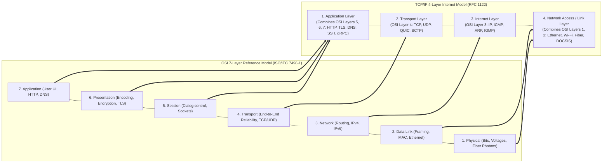
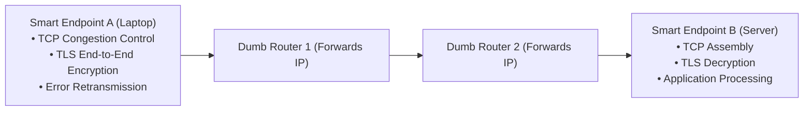
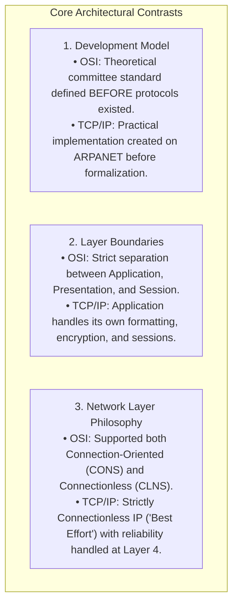

# OSI vs TCP/IP Model

> [!abstract] Mental Model
> - **The OSI Model (The Theoretical Diplomatic Treaty)**: A 7-layer architectural framework created by ISO committee standards. Conceptually elegant and academically rigorous, but bloated with redundant layers (Session and Presentation) that were never widely implemented as standalone OS protocols.
> - **The TCP/IP Model (The Pragmatic Working Postal System)**: A 4-layer engineering architecture forged in the ARPANET trenches. Governed by the IETF philosophy: *"We reject: kings, presidents, and voting. We believe in: rough consensus and running code."* It powers $100\%$ of the modern global internet.

---

## Architectural Comparison Diagram



---

## Comprehensive Layer-by-Layer Breakdown

| OSI Layer | Name | Scope & Primary Function | Protocol Data Unit (PDU) | Canonical Protocols | Hardware / Software Entity |
| :---: | :--- | :--- | :---: | :--- | :--- |
| **7** | **Application** | Human-to-software network interface | **Data / Message** | HTTP/1.1, HTTP/2, HTTP/3, DNS, SSH, SMTP | User space browser, curl, Web server |
| **6** | **Presentation** | Data formatting, serialization, TLS encryption | **Data** | TLS 1.3, JSON, Protobuf, ASCII, UTF-8 | User space libraries (OpenSSL, libc) |
| **5** | **Session** | Connection lifecycle, auth tokens, dialog control| **Data** | NetBIOS, RPC session, POSIX sockets | User / OS socket API layer |
| **4** | **Transport** | **Process-to-process** end-to-end reliability & ports | **Segment (TCP) / Datagram (UDP)** | TCP, UDP, QUIC, SCTP | Operating System Kernel Network Stack |
| **3** | **Network** | **Host-to-host** logical addressing & global routing | **Packet / Datagram** | IPv4, IPv6, ICMP, OSPF, BGP | Core Routers, Layer 3 Switches, Kernel IP |
| **2** | **Data Link** | **Node-to-node** hop framing, MAC switching, error check | **Frame** | Ethernet (802.3), Wi-Fi (802.11), ARP, VLAN | Network Interface Card (NIC), L2 Switch |
| **1** | **Physical** | Raw unstructured electrical/optical bit transmission | **Bit / Symbol** | 1000BASE-T, NRZ, QAM-256, Fiber optics | Physical cables, transceivers, PHY chips |

---

## The End-to-End Principle (Saltzer, Reed, Clark, 1981)

The fundamental design philosophy that crowned TCP/IP over OSI:

> **The End-to-End Argument**: 
> Functions that can only be completely and correctly implemented with the help of the applications at the communication endpoints (e.g. error recovery, encryption, idempotency) **should not be built into the interior nodes of the network**.


- **The "Dumb Network, Smart Edges" Rule**: The core of the internet (routers) only inspects Layer 3 IP headers and forwards packets as fast as possible. All complex state machines (TCP retransmissions, TLS sessions, flow control) reside strictly in the end hosts.

---

## Key Differences: OSI vs TCP/IP



---

## Production Packet Traversal & Tooling Mapping

When you execute `curl https://example.com` on Linux, the request traverses the stack:

```bash
# 1. Inspect Layer 7 (Application) HTTP & TLS Handshake:
curl -vvv https://example.com

# 2. Inspect Layer 4 (Transport) Open Sockets & TCP States:
ss -tulpn | grep 443

# 3. Inspect Layer 3 (Network) Routing Table:
ip route show
# default via 192.168.1.1 dev eth0 proto dhcp metric 100

# 4. Inspect Layer 2 (Data Link) MAC Addresses & ARP Table:
ip neighbor show
# 192.168.1.1 dev eth0 lladdr 00:1a:2b:3c:4d:5e REACHABLE

# 5. Inspect Layer 1 (Physical) Ethernet Link Speed & Transceiver:
ethtool eth0 | grep -E "Speed|Duplex|Link detected"
# Speed: 10000Mb/s (10 GbE)
# Duplex: Full
# Link detected: yes
```

---

## Active Recall & Interview Perspective

### Reasoning Prompts
1. *Why did the pragmatic TCP/IP model triumph over the formal ISO OSI reference model in global deployment?*
   - **Answer**: The OSI model was developed by international standards committees before implementations existed, resulting in overly complex, redundant layers (such as Presentation and Session) that had significant CPU overhead and no distinct runtime boundaries. Conversely, TCP/IP was built using the **"rough consensus and running code"** methodology on ARPANET, prioritizing working software. Furthermore, TCP/IP adhered strictly to the **End-to-End Principle**, creating a lightweight, connectionless IP network layer ("dumb core") that allowed intermediate routers to scale massively while offloading reliability and encryption to end-host software.
2. *At which layer of the OSI and TCP/IP models does TLS (Transport Layer Security) operate?*
   - **Answer**: In the **OSI Model**, TLS conceptually spans the **Presentation Layer (Layer 6)** (data encryption, decryption, and formatting) and the **Session Layer (Layer 5)** (session resumption and handshake coordination). In the **TCP/IP Model**, TLS operates entirely within the **Application Layer (Layer 4 of TCP/IP)** as a user-space library (such as OpenSSL or BoringSSL) running on top of the Transport Layer (TCP Layer 3/4) before application payloads (HTTP/gRPC) are processed.
3. *What is the difference between "Host-to-Host" delivery and "Process-to-Process" delivery in networking?*
   - **Answer**: **Host-to-Host delivery** is the responsibility of the **Network Layer (Layer 3 / IP)**: it uses IP addresses to route a packet across intermediate networks and routers from the source physical machine to the destination physical machine. **Process-to-Process delivery** is the responsibility of the **Transport Layer (Layer 4 / TCP/UDP)**: once the packet arrives at the destination host, the transport layer uses **Port Numbers** (e.g. Port 80 for HTTP, Port 5432 for Postgres) to multiplex and demultiplex the payload directly to the specific executing operating system process/thread socket.

---

## Key Takeaways
- **OSI (7 layers)** is a conceptual model; **TCP/IP (4 layers)** is the real-world standard.
- The **End-to-End Principle** dictates that interior routers stay dumb (IP forwarding), while edge hosts manage complexity (TCP/TLS).
- Layer boundaries define the scope of communication: **Layer 2 = Node-to-Node**, **Layer 3 = Host-to-Host**, **Layer 4 = Process-to-Process**.

---

## Related Notes
- [[Computer Networks MOC]] — Master table of contents for Computer Networks.
- [[Encapsulation, De-encapsulation, and Protocol Data Units - PDUs]] — Packet header transformations across layers.
- [[Physical Layer - Transmission Media, Bandwidth, and Latency]] — Layer 1 physics and latency.
- [[Data Link Layer Framing and Error Detection - CRC, Checksum, Parity]] — Layer 2 mechanics.
- [[Network Layer - Packet Forwarding vs Routing]] — Layer 3 mechanics.
- [[Transport Layer Fundamentals - Multiplexing, Demultiplexing, Ports]] — Layer 4 mechanics.
