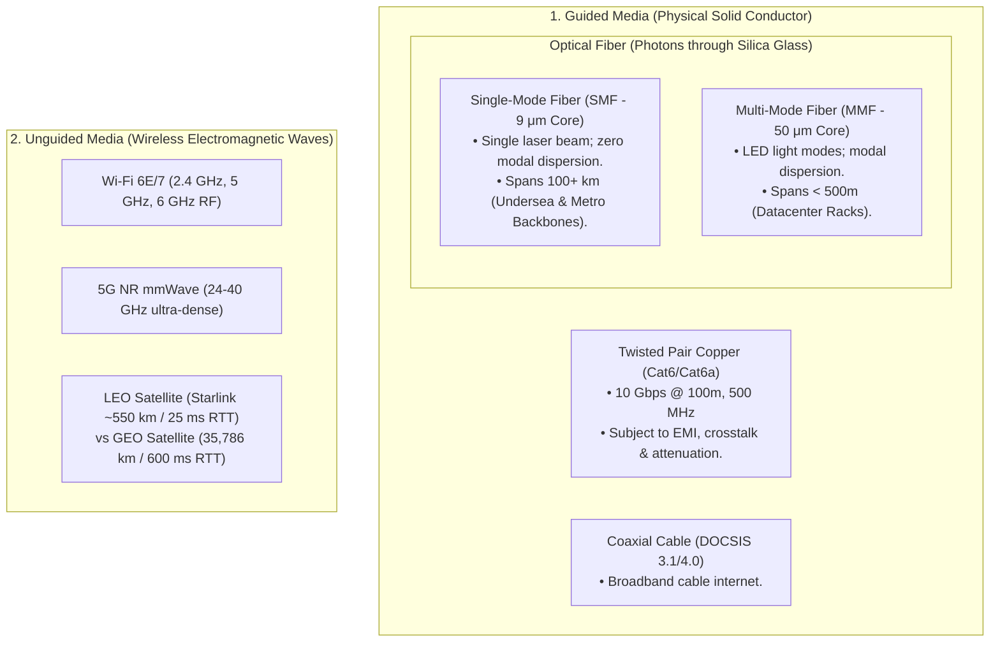
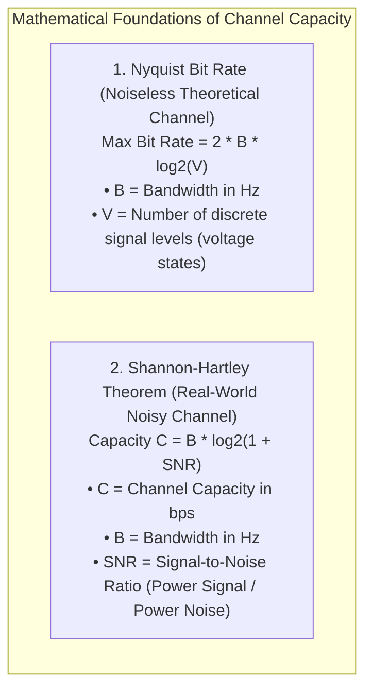

# Physical Layer: Transmission Media, Bandwidth, and Latency

> [!abstract] Mental Model
> - **Bandwidth is the width of a highway** (how many cars can enter per second).
> - **Latency is the speed limit of the highway** (the physical time it takes for a car to travel from NYC to London, strictly bound by the speed of light in glass).
> - You can lay 100 more fiber optic cables to multiply **Bandwidth** by $100\times$, but you **cannot beat the speed of light** ($200,000\text{ km/s}$ in optical fiber), making propagation latency an unyielding physical constant!

---

## Physical Transmission Media Taxonomy



---

## Theoretical Limits: Nyquist vs Shannon-Hartley



> **Takeaway**: To increase channel throughput, you can either **increase frequency spectrum bandwidth ($B$)** or **increase transmitter signal power relative to thermal noise ($\text{SNR}$)**.

---

## The 4 Fundamental Components of Network Latency

$$\mathbf{D_{\text{total}} = D_{\text{propagation}} + D_{\text{transmission}} + D_{\text{queuing}} + D_{\text{processing}}}$$

```mermaid
flowchart LR
    Host["Sender Host"] 
    -->|D_trans = L / R (Time to push bits)| Wire["Physical Cable"]
    -->|D_prop = d / s (Speed of light in medium)| Router["Intermediate Router"]
    -->|D_proc (ASIC lookup) + D_queue (Buffer wait)| Dest["Receiver Host"]
```

| Latency Component | Formula | Physical Cause | Order of Magnitude |
| :--- | :---: | :--- | :--- |
| **Propagation ($D_{\text{prop}}$)** | $\mathbf{\frac{d}{s}}$ | Physical speed of light in medium ($s \approx 200,000\text{ km/s}$ in silica fiber = $\mathbf{5\text{ }\mu\text{s / km}}$). | $\mathbf{1\text{ ms} - 100\text{ ms}}$ (Dominates WAN) |
| **Transmission ($D_{\text{trans}}$)**| $\mathbf{\frac{L}{R}}$ | Time to serialize packet of length $L$ bits onto link with bandwidth $R$ bps. | $\mathbf{1.2\text{ }\mu\text{s}}$ ($1500\text{B}$ on $10\text{Gbps}$ link) |
| **Queuing ($D_{\text{queue}}$)** | Dynamic | Time spent sitting in router FIFO buffers during traffic bursts. | $\mathbf{0\text{ ms} - 500\text{ ms}+}$ (**Bufferbloat!**) |
| **Processing ($D_{\text{proc}}$)** | Hardware | Time spent by router ASIC verifying checksums and route lookup (FIB). | $\mathbf{< 1\text{ }\mu\text{s} - 5\text{ }\mu\text{s}}$ |

---

## The Bandwidth-Delay Product (BDP)

The **Bandwidth-Delay Product (BDP)** defines the maximum amount of data that can be "in flight" on the network wire at any given moment:

$$\mathbf{\text{BDP} = \text{Bandwidth (bits/sec)} \times \text{Round-Trip Time (RTT in seconds)}}$$


### High-BDP Production Example (Transatlantic 10 Gbps Link):
- Bandwidth $R = 10\text{ Gbps} = 1.25\text{ GB/sec}$.
- Round-Trip Time $\text{RTT} = 100\text{ ms} = 0.1\text{ sec}$.
- $\mathbf{\text{BDP} = 1.25\text{ GB/s} \times 0.1\text{ s} = \mathbf{125\text{ Megabytes}}}$.

> [!IMPORTANT] Production Rule: TCP Buffer Sizing
> If the operating system TCP Receive Window (`SO_RCVBUF`) is smaller than the BDP (e.g. capped at default $64\text{ KB}$), the sender will exhaust its window and stall, utilizing **less than $0.05\%$ of the $10\text{ Gbps}$ connection!**

---

## Production Diagnostics & Link Analysis

```bash
# 1. Inspect Physical Transceiver, Link Speed, and Duplex Mode:
sudo ethtool eth0

# Output shows:
# Speed: 10000Mb/s (10 GbE)
# Duplex: Full
# Port: FIBRE (Single-Mode Fiber Transceiver)
# Auto-negotiation: on
# Link detected: yes

# 2. Inspect Interface Hardware Error Counters (Physical Layer Issues):
netstat -i
# (Look for non-zero RX-ERR, RX-DRP, or TX-ERR indicating faulty copper termination or fiber attenuation)

# 3. Decompose End-to-End Latency and Packet Loss per Hop with mtr:
mtr --report --report-cycles=10 1.1.1.1

# 4. Check Linux Kernel Automatic TCP Buffer Auto-Tuning Limits (BDP Tuning):
sysctl net.ipv4.tcp_rmem
# net.ipv4.tcp_rmem = 4096 131072 6291456 (Min, Default, Max = 6 MB)
```

---

## Active Recall & Interview Perspective

### Reasoning Prompts
1. *Why does upgrading a network connection from 1 Gbps to 10 Gbps have virtually zero impact on the ping latency between New York and London?*
   - **Answer**: Ping latency over long distances is dominated by **Propagation Delay ($D_{\text{prop}} = \frac{d}{s}$)**, which is strictly dictated by the speed of electromagnetic waves in optical fiber ($\sim 200,000\text{ km/s}$ in silica glass). The physical distance between New York and London is $\sim 5,500\text{ km}$, yielding an unavoidable speed-of-light minimum round-trip propagation time of $\sim 55\text{ ms}$. Upgrading link bandwidth from 1 Gbps to 10 Gbps only reduces **Transmission Delay ($D_{\text{trans}} = \frac{L}{R}$)** from $12\text{ }\mu\text{s}$ to $1.2\text{ }\mu\text{s}$ for a $1500\text{B}$ packet—a sub-microsecond gain that is completely imperceptible compared to the $55\text{ ms}$ propagation delay.
2. *What is the difference between Single-Mode Fiber (SMF) and Multi-Mode Fiber (MMF)?*
   - **Answer**: **Single-Mode Fiber (SMF)** has an extremely narrow core diameter ($\sim 9\text{ }\mu\text{m}$) that allows only a single spatial mode of laser light to propagate directly down the center axis. This completely eliminates **modal dispersion** (light rays bouncing at different angles arriving at different times), allowing SMF to carry multi-terabit signals over $100\text{ km}$ across metro and undersea spans. **Multi-Mode Fiber (MMF)** has a much wider core ($\sim 50\text{ - }62.5\text{ }\mu\text{m}$) using inexpensive LED/VCSEL light sources that bounce along multiple reflective paths, causing severe modal dispersion over distance and limiting its reach to $< 500\text{ meters}$ inside datacenter racks.
3. *What is the Bandwidth-Delay Product (BDP) and how does it directly affect TCP throughput in cloud infrastructure?*
   - **Answer**: The **Bandwidth-Delay Product ($\text{BDP} = \text{Bandwidth} \times \text{RTT}$)** represents the total capacity of the physical link "pipe" in transit. In TCP, the sender cannot send more unacknowledged data than the receiver's advertised window (`rwnd`) or congestion window (`cwnd`). If the TCP window size is configured smaller than the BDP, the sender will finish transmitting its permitted window and sit completely idle waiting for the receiver's acknowledgment to make the round trip, resulting in severe bandwidth underutilization regardless of how fast the physical line is.

---

## Key Takeaways
- **Bandwidth** is serialization capacity ($\text{bps}$); **Propagation Latency** is governed by the speed of light in silica ($5\text{ }\mu\text{s/km}$).
- Total Latency = $\mathbf{D_{\text{prop}} + D_{\text{trans}} + D_{\text{queue}} + D_{\text{proc}}}$.
- **BDP ($\text{Bandwidth} \times \text{RTT}$)** dictates the necessary TCP socket buffer size to saturate high-speed WAN connections.

---

## Related Notes
- [[Computer Networks MOC]] — Master table of contents for Computer Networks.
- [[OSI vs TCP-IP Model]] — Layer 1 vs Layer 4 boundaries.
- [[Encapsulation, De-encapsulation, and Protocol Data Units - PDUs]] — Packet transmission sizing.
- [[Data Link Layer Framing and Error Detection - CRC, Checksum, Parity]] — Layer 2 framing and bit timing.
- [[TCP Congestion Control - AIMD, Slow Start, Reno, CUBIC, BBR]] — BDP-based congestion algorithms (BBR).
