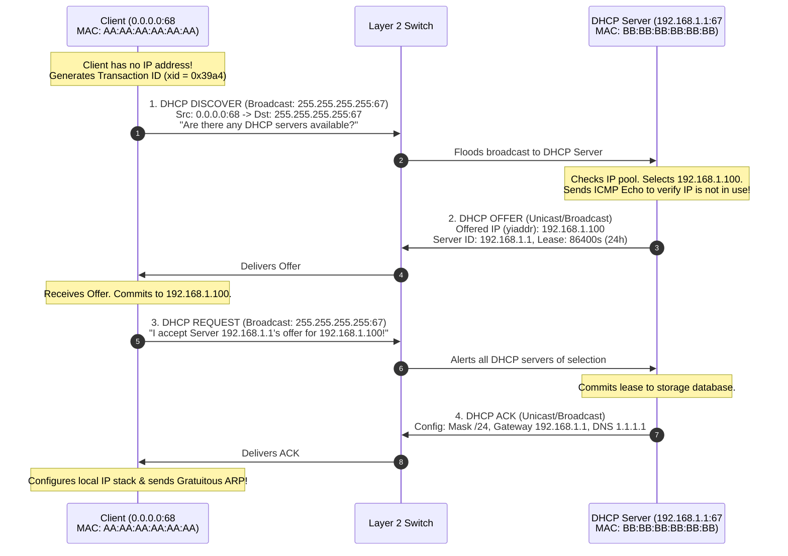
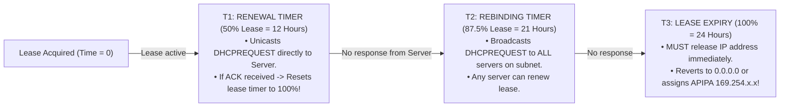
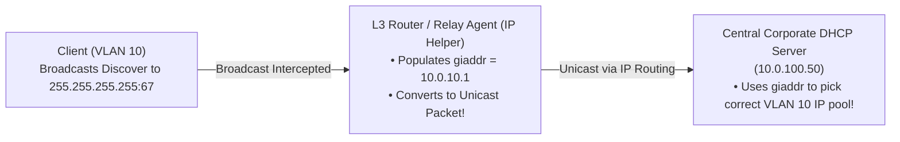
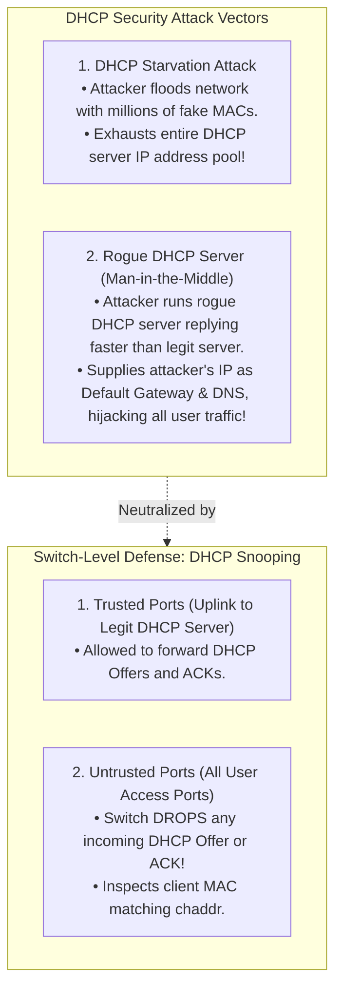

# Dynamic Host Configuration Protocol (DHCP)

> [!abstract] Mental Model
> DHCP is **the airport rental car checkout counter**:
> - A client plugs into a network with zero network identity (**`0.0.0.0`**).
> - It broadcasts an SOS request for configuration.
> - The DHCP server leases a temporary IP address, Subnet Mask, Default Gateway, and DNS servers for a finite time.
> - The client periodically renews its lease at **$50\%$ ($T_1$)** and **$87.5\%$ ($T_2$)** milestones; if it fails to renew before expiration, it must surrender the IP back to the pool.

---

## 1. The 4-Step DORA Handshake Protocol (RFC 2131)

Runs over **UDP** using **Server Port 67** and **Client Port 68**:



---

## 2. DHCP Message Format & Crucial TLV Options

```
 0                   1                   2                   3
 0 1 2 3 4 5 6 7 8 9 0 1 2 3 4 5 6 7 8 9 0 1 2 3 4 5 6 7 8 9 0 1
+-+-+-+-+-+-+-+-+-+-+-+-+-+-+-+-+-+-+-+-+-+-+-+-+-+-+-+-+-+-+-+-+
|   op (1=Req)  |  htype (1=Eth)|   hlen (6)    |   hops (0)    |
+-+-+-+-+-+-+-+-+-+-+-+-+-+-+-+-+-+-+-+-+-+-+-+-+-+-+-+-+-+-+-+-+
|                       Transaction ID (xid)                    |
+-+-+-+-+-+-+-+-+-+-+-+-+-+-+-+-+-+-+-+-+-+-+-+-+-+-+-+-+-+-+-+-+
|           secs        |flags (Bcast)|          reserved       |
+-+-+-+-+-+-+-+-+-+-+-+-+-+-+-+-+-+-+-+-+-+-+-+-+-+-+-+-+-+-+-+-+
|                          ciaddr (Client IP)                   |
+-+-+-+-+-+-+-+-+-+-+-+-+-+-+-+-+-+-+-+-+-+-+-+-+-+-+-+-+-+-+-+-+
|                          yiaddr ('Your' IP)                   |
+-+-+-+-+-+-+-+-+-+-+-+-+-+-+-+-+-+-+-+-+-+-+-+-+-+-+-+-+-+-+-+-+
|                          siaddr (Next Server IP)              |
+-+-+-+-+-+-+-+-+-+-+-+-+-+-+-+-+-+-+-+-+-+-+-+-+-+-+-+-+-+-+-+-+
|                          giaddr (Relay Agent IP)              |
+-+-+-+-+-+-+-+-+-+-+-+-+-+-+-+-+-+-+-+-+-+-+-+-+-+-+-+-+-+-+-+-+
|                     chaddr (Client MAC - 16 Bytes)            |
+-+-+-+-+-+-+-+-+-+-+-+-+-+-+-+-+-+-+-+-+-+-+-+-+-+-+-+-+-+-+-+-+
|                  Magic Cookie (0x63825363)                    |
+-+-+-+-+-+-+-+-+-+-+-+-+-+-+-+-+-+-+-+-+-+-+-+-+-+-+-+-+-+-+-+-+
|             Options (Type-Length-Value TLV Encoded)           |
+-+-+-+-+-+-+-+-+-+-+-+-+-+-+-+-+-+-+-+-+-+-+-+-+-+-+-+-+-+-+-+-+
```

---

### Standard Production DHCP Options (RFC 2132):

| Option Tag | Option Name | Type | Production Function |
| :---: | :--- | :---: | :--- |
| **53** | **DHCP Message Type** | 1 Byte | `1`=Discover, `2`=Offer, `3`=Request, `5`=ACK, `6`=NAK, `7`=Release. |
| **1** | **Subnet Mask** | 4 Bytes | E.g. `255.255.255.0` (`/24`). |
| **3** | **Router / Default Gateway** | 4 Bytes | Next-hop Layer 3 router IP (`192.168.1.1`). |
| **6** | **DNS Name Server** | List | Primary & Secondary DNS resolvers (`1.1.1.1`, `8.8.8.8`). |
| **51** | **IP Address Lease Time** | 4 Bytes | Duration of lease in seconds (e.g. `86400` = 24 hours). |
| **54** | **Server Identifier** | 4 Bytes | IP of the authoritative DHCP server. |
| **82** | **Relay Agent Information** | Structure | Sub-options inserted by switch/router (Circuit ID, Remote ID) for ISP subscriber mapping. |

---

## 3. The Lease Lifecycle & Renewal Timers



---

## 4. DHCP Relay Agents (RFC 3046 / IP Helper)

Because Layer 3 Routers **do not forward Layer 2 broadcasts (`255.255.255.255`)**, enterprise networks use **DHCP Relay Agents** to centralize DHCP servers across subnets:



---

## 5. Security Threat: Starvation, Rogue DHCP, and DHCP Snooping



---

## Production Diagnostics & DHCP Management

```bash
# 1. Manually Trigger Verbose DHCP Client Lease Acquisition on Linux:
sudo dhclient -v -r eth0   # (Releases existing lease)
sudo dhclient -v eth0      # (Initiates fresh DORA handshake)

# Output:
# DHCPDISCOVER on eth0 to 255.255.255.255 port 67 interval 3
# DHCPOFFER of 192.168.1.100 from 192.168.1.1
# DHCPREQUEST for 192.168.1.100 on eth0 to 255.255.255.255 port 67
# DHCPACK of 192.168.1.100 from 192.168.1.1
# bound to 192.168.1.100 -- renewal in 43200 seconds.

# 2. Inspect Client Active DHCP Lease Information File:
cat /var/lib/dhcp/dhclient.leases

# 3. Live Packet Capture of DHCP DORA Handshake with tcpdump:
sudo tcpdump -i eth0 -nn -vv "port 67 or port 68"
```

---

## Active Recall & Interview Perspective

### Reasoning Prompts
1. *Why is the DHCP Request packet (Step 3 in DORA) broadcast to `255.255.255.255` rather than unicast to the server that provided the offer?*
   - **Answer**: On enterprise networks with redundant DHCP servers, a client may receive multiple **DHCP Offer** packets (e.g. from Server A and Server B). When the client selects one offer (Server A), it broadcasts the **DHCP Request** to `255.255.255.255` containing the **Server Identifier (Option 54 = Server A)**. The broadcast serves two critical purposes: it confirms acceptance to Server A, while simultaneously informing Server B and other competing servers that their offers were declined, allowing them to immediately release their temporarily reserved IP addresses back into their active allocation pools.
2. *What is a DHCP Relay Agent and why is the `giaddr` field in the DHCP header essential for multi-subnet architectures?*
   - **Answer**: DHCP Discover messages are broadcast packets (`255.255.255.255`) that are dropped by Layer 3 routers by default, which would ordinarily require every single subnet/VLAN to have its own physical DHCP server. A **DHCP Relay Agent** (configured via `ip helper-address` on the router interface) intercepts the local broadcast, encapsulates it into a standard unicast IP packet, and populates the **`giaddr` (Gateway IP Address)** field with the router's local interface IP address (e.g. `10.0.10.1`). When the central DHCP server receives the unicast packet, it inspects `giaddr` to determine which specific subnet pool to draw the offered IP address from.
3. *How does DHCP Snooping prevent both Rogue DHCP attacks and DHCP Starvation attacks on enterprise switches?*
   - **Answer**: **DHCP Snooping** classifies switch ports into **Trusted Ports** (connected to authorized DHCP servers or upstream switches) and **Untrusted Ports** (connected to end-user devices). If a rogue machine on an untrusted port sends a `DHCPOFFER` or `DHCPACK` packet, the switch hardware drops it immediately, preventing rogue server hijacks. To prevent DHCP Starvation, DHCP Snooping verifies that the Layer 2 Ethernet Source MAC address matches the Client Hardware Address (`chaddr`) inside the DHCP payload, dropping spoofed packets, and enforces strict rate limits on DHCP requests per port.

---

## Key Takeaways
- **DORA Handshake**: **Discover (Bcast)** $\to$ **Offer (Unicast/Bcast)** $\to$ **Request (Bcast)** $\to$ **ACK (Unicast/Bcast)** on UDP Ports 67/68.
- Timers: **$T_1 = 50\%$ (Unicast Renew)**, **$T_2 = 87.5\%$ (Broadcast Rebind)**, **$T_3 = 100\%$ (Expiry)**.
- **DHCP Relay Agents** use `giaddr` across routers; **DHCP Snooping** blocks rogue servers.

---

## Related Notes
- [[Computer Networks MOC]] — Master table of contents for Computer Networks.
- [[MAC Addressing and Address Resolution Protocol - ARP]] — EUI-48 MAC matching.
- [[IPv4 Addressing - Classful, Classless, CIDR, and Subnetting]] — Subnet mask and default gateway options.
- [[Switches and VLANs - 802.1Q, Trunking, Spanning Tree Protocol STP]] — DHCP Snooping port security.
- [[Domain Name System - DNS Hierarchy, Recursive Resolution, EDNS, DNSSEC]] — Option 6 DNS resolvers.
- [[Network Address Translation - NAT, PAT, CGNAT]] — Gateway assignments.
