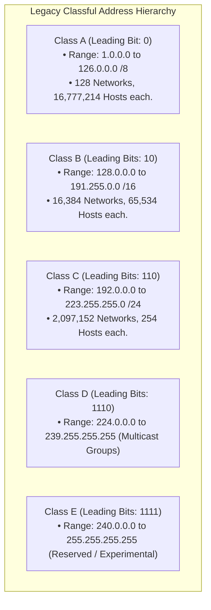
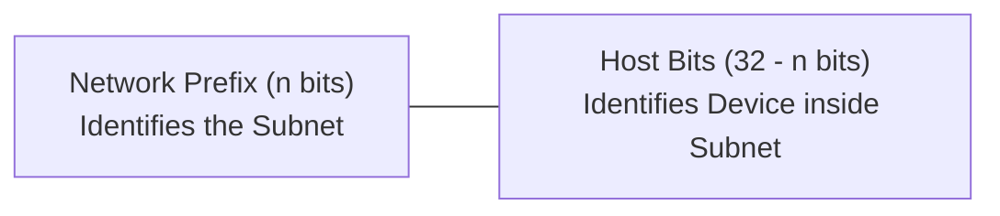
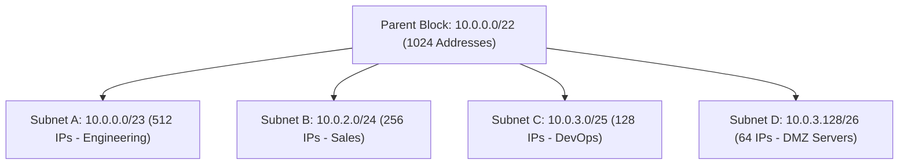

# IPv4 Addressing: Classful, Classless (CIDR), and Subnetting

> [!abstract] Mental Model
> - **Classful Addressing (1981 - Real Estate Anarchy)**: Real estate zoning that only sold land in 3 rigid plot sizes: 16-million-acre ranches (**Class A**), 65,000-acre estates (**Class B**), or 254-house subdivisions (**Class C**). A company needing 300 IP addresses was forced to take a Class B ($65,534$ addresses), wasting $99.5\%$ of the allocation and threatening total internet exhaustion by 1994!
> - **CIDR & Subnetting (1993 - Variable Slicing)**: Slicing address space with arbitrary bitmask precision (`/n`), allowing custom subnet sizing (**VLSM**) and shrinking global routing tables through route summarization (**Supernetting**).

---

## IPv4 Address Anatomy

An IPv4 address is a **32-bit binary integer** ($4\text{ bytes}$) written as four decimal octets:

```
Decimal:      192     .     168     .      1      .     130
Binary:    11000000   .  10101000   .  00000001   .  10000010
           |<--------- Network Prefix (25 bits) --------->|<- Host (7b) ->|
```

$$\mathbf{\text{Total Theoretical Addresses} = 2^{32} = 4,294,967,296}$$

---

## 1. Legacy Classful Addressing (RFC 791)



---

## 2. Classless Inter-Domain Routing (CIDR) & Subnetting Math

In 1993, **RFC 1519 (CIDR)** abolished class boundaries in favor of a variable prefix length notation (`/n`):



### Core Subnet Formulas:
$$\mathbf{\text{Total IP Addresses} = 2^{32 - n}}$$
$$\mathbf{\text{Usable Host Range} = 2^{32 - n} - 2}$$
*(Minus 2 because **All Zeros in Host Bits = Network ID** and **All Ones in Host Bits = Directed Broadcast Address**).*

---

### Step-by-Step Subnetting Calculation Trace:
Given IP **`192.168.1.130/26`**:
- Prefix length $n = 26$ bits $\implies$ Host bits $h = 32 - 26 = \mathbf{6\text{ bits}}$.
- Subnet Mask: $26$ ones $+ 6$ zeros $\to \mathbf{255.255.255.192}$.
- Total Addresses per subnet: $2^6 = \mathbf{64}$.
- Usable Hosts per subnet: $64 - 2 = \mathbf{62}$.
- Block Subnet Boundaries: Multiples of 64: `0`, `64`, `128`, `192`.
  - Subnet containing `.130` starts at **`192.168.1.128`**.
  - **Network Address**: `192.168.1.128`
  - **First Usable Host**: `192.168.1.129`
  - **Last Usable Host**: `192.168.1.190`
  - **Broadcast Address**: `192.168.1.191`

---

## Special Subnet Exceptions: /31 and /32

| CIDR Prefix | Subnet Mask | Usable Hosts | Production Application |
| :---: | :--- | :---: | :--- |
| **/30** | `255.255.255.252` | $2$ ($4-2$) | Legacy Point-to-Point Router links (wastes 2 IPs). |
| **/31** | `255.255.255.254` | **$2$ (RFC 3021)** | **Modern Point-to-Point Links** (No network/broadcast address reserved; $100\%$ efficiency!). |
| **/32** | `255.255.255.255` | **$1$ (Single Host)** | **Loopback interfaces, Anycast VIPs, Host routing rules**. |

---

## Variable Length Subnet Masking (VLSM)

**VLSM** allows an organization to recursively partition a single parent subnet into unequally sized chunks matching exact departmental needs:



---

## Reserved & Special IPv4 Address Ranges

| Range | CIDR Block | Standard RFC | Intended Purpose |
| :--- | :--- | :--- | :--- |
| **Private Class A** | `10.0.0.0/8` | RFC 1918 | Private corporate enterprise intranets |
| **Private Class B** | `172.16.0.0/12` | RFC 1918 | Private range (`172.16.0.0` - `172.31.255.255`) |
| **Private Class C** | `192.168.0.0/16`| RFC 1918 | Private home/office LANs (`192.168.0.0/24`) |
| **Loopback** | `127.0.0.0/8` | RFC 1122 | Inter-Process Communication on localhost |
| **APIPA (Link-Local)**| `169.254.0.0/16`| RFC 3927 | Auto-assigned when DHCP server fails |
| **Carrier-Grade NAT** | `100.64.0.0/10` | RFC 6598 | Shared ISP NAT space (CGNAT) |
| **Multicast** | `224.0.0.0/4` | RFC 5771 | OSPF, PIM, video streaming groups |

---

## Route Summarization (CIDR Supernetting)

Summarizing multiple contiguous routes into a single BGP advertisement to shrink global routing tables:

```
Route 1:  192.168.0.0/24   -> 11000000.10101000.000000 00.00000000
Route 2:  192.168.1.0/24   -> 11000000.10101000.000000 01.00000000
Route 3:  192.168.2.0/24   -> 11000000.10101000.000000 10.00000000
Route 4:  192.168.3.0/24   -> 11000000.10101000.000000 11.00000000
----------------------------------------------------------------------
Summarized Supernet Route:    192.168.0.0/22  (First 22 bits match!)
```

---

## Production Diagnostics & Subnetting Tools

```bash
# 1. Calculate Network, Broadcast, and Host Limits with ipcalc:
ipcalc 192.168.1.130/26

# Output:
# Address:   192.168.1.130        11000000.10101000.00000001.10 000010
# Netmask:   255.255.255.192 = 26 11111111.11111111.11111111.11 000000
# Wildcard:  0.0.0.63             00000000.00000000.00000000.00 111111
# =>
# Network:   192.168.1.128/26     11000000.10101000.00000001.10 000000
# HostMin:   192.168.1.129
# HostMax:   192.168.1.190
# Broadcast: 192.168.1.191
# Hosts/Net: 62                   (Class C)

# 2. Add a CIDR Subnet IP to a Linux Interface:
sudo ip addr add 10.0.0.1/24 dev eth0

# 3. View Interface CIDR Mask and Broadcast Address:
ip -4 addr show eth0
# inet 10.0.0.1/24 brd 10.0.0.255 scope global eth0
```

---

## Active Recall & Interview Perspective

### Reasoning Prompts
1. *Why was Classful Addressing abandoned in favor of CIDR (Classless Inter-Domain Routing) in the 1990s?*
   - **Answer**: Under Classful Addressing, IP space was allocated in rigid, disproportionate blocks: Class A ($16.7\text{ million}$ hosts), Class B ($65,534$ hosts), and Class C ($254$ hosts). Organizations requiring more than 254 addresses were granted entire Class B `/16` allocations, leaving tens of thousands of addresses permanently stranded and unused ($> 90\%$ address wastage). Furthermore, the explosion of Class C networks caused global internet routing tables to grow exponentially, threatening router memory exhaustion. **CIDR (RFC 1519)** solved both crises by decoupling network prefixes from byte boundaries (enabling arbitrary `/n` masks) and allowing **Route Aggregation (Supernetting)**, where thousands of individual routes are compressed into a single BGP prefix advertisement.
2. *Why does RFC 3021 allow `/31` subnets on point-to-point router links without wasting addresses on Network and Broadcast IDs?*
   - **Answer**: In standard multi-access networks (Ethernet LANs), two addresses per subnet are reserved: host bits all-zeros (the **Network ID**) and host bits all-ones (the **Directed Broadcast address**). On a dedicated point-to-point router link (such as a fiber connection between two core routers), there are exactly two endpoints. Directed broadcast is unnecessary because any packet sent across the link can only physically reach the single neighbor on the other side. **RFC 3021** defines `/31` subnets ($2^{32-31} = 2\text{ addresses}$ total) where `0` is assigned to Router A and `1` is assigned to Router B, saving millions of public IPv4 addresses on backbone transit links.
3. *What is the difference between RFC 1918 Private Addresses and APIPA (Link-Local) `169.254.0.0/16` addresses?*
   - **Answer**: **RFC 1918 Private Addresses** (`10.0.0.0/8`, `172.16.0.0/12`, `192.168.0.0/16`) are routable within private enterprise local area networks and corporate intranets, connecting to the public internet via Network Address Translation (NAT). **APIPA (Automatic Private IP Addressing - RFC 3927)** (`169.254.0.0/16`) is an unroutable Link-Local range. When a DHCP client boots up and fails to reach any DHCP server after multiple retries, the OS kernel randomly self-assigns an address in `169.254.0.0/16` to enable basic emergency communication strictly between devices on the immediate physical Layer 2 wire segment; routers never forward APIPA packets.

---

## Key Takeaways
- **CIDR (`/n`)** replaced rigid Classful addressing, saving IPv4 through arbitrary bit boundaries.
- **Usable Hosts = $2^{32-n} - 2$** (except **/31 point-to-point links** which provide 2 usable IPs).
- **RFC 1918** reserves `10.0.0.0/8`, `172.16.0.0/12`, and `192.168.0.0/16` for private networks.

---

## Related Notes
- [[Computer Networks MOC]] — Master table of contents for Computer Networks.
- [[Network Layer - Packet Forwarding vs Routing]] — Longest Prefix Match (LPM) lookups.
- [[IPv4 Header Format and Packet Fragmentation]] — IP header structure.
- [[IPv6 Architecture - 128-bit Addressing, Header Format, Transition]] — 128-bit address space.
- [[Network Address Translation - NAT, PAT, CGNAT]] — RFC 1918 address translation.
- [[Dynamic Host Configuration Protocol - DHCP]] — Automated IP lease assignment.
