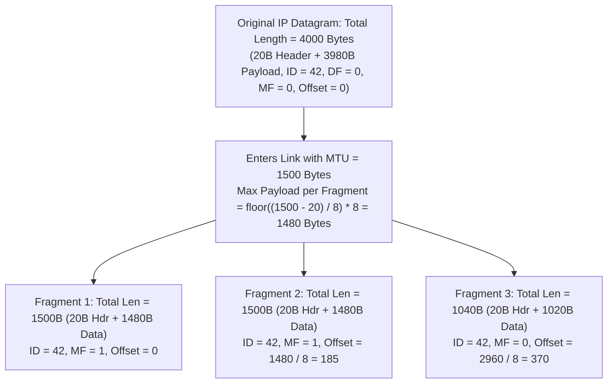
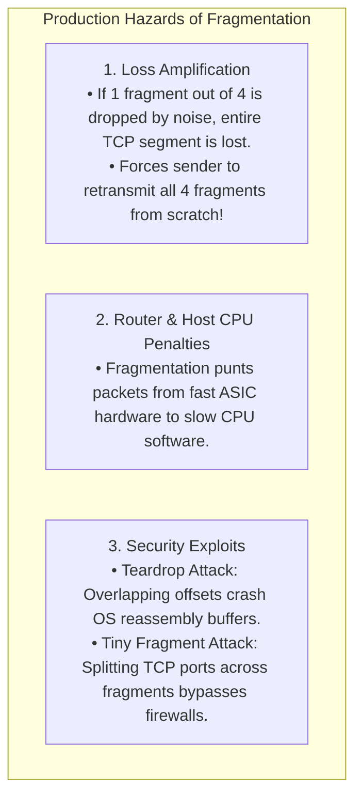

# IPv4 Header Format and Packet Fragmentation

> [!abstract] Mental Model
> - **The IPv4 Header (The International Customs Declaration)**: A 20-to-60-byte binary header prefixed to every IPv4 packet containing everything routers need to verify integrity, enforce hop limits (**TTL**), prioritize quality of service (**DSCP/ECN**), and route to destinations.
> - **Packet Fragmentation (The Oversized Furniture Dismantler)**: When a large IP packet encounters an intermediate link with a smaller **Maximum Transmission Unit (MTU)** and the Don't Fragment (**DF**) bit is $0$, the router chops the payload into smaller fragments. Each fragment receives its own IP header stamped with an **Identification number**, **More Fragments (MF)** flag, and **Fragment Offset**, leaving reassembly strictly to the destination end host.

---

## 1. IPv4 Header Bit-Field Layout (RFC 791)

```
 0                   1                   2                   3
 0 1 2 3 4 5 6 7 8 9 0 1 2 3 4 5 6 7 8 9 0 1 2 3 4 5 6 7 8 9 0 1
+-+-+-+-+-+-+-+-+-+-+-+-+-+-+-+-+-+-+-+-+-+-+-+-+-+-+-+-+-+-+-+-+
|Version|  IHL  |   DSCP    |ECN|         Total Length          |
+-+-+-+-+-+-+-+-+-+-+-+-+-+-+-+-+-+-+-+-+-+-+-+-+-+-+-+-+-+-+-+-+
|         Identification        |Flags|     Fragment Offset     |
+-+-+-+-+-+-+-+-+-+-+-+-+-+-+-+-+-+-+-+-+-+-+-+-+-+-+-+-+-+-+-+-+
|  Time to Live |    Protocol   |        Header Checksum        |
+-+-+-+-+-+-+-+-+-+-+-+-+-+-+-+-+-+-+-+-+-+-+-+-+-+-+-+-+-+-+-+-+
|                       Source IP Address                       |
+-+-+-+-+-+-+-+-+-+-+-+-+-+-+-+-+-+-+-+-+-+-+-+-+-+-+-+-+-+-+-+-+
|                    Destination IP Address                     |
+-+-+-+-+-+-+-+-+-+-+-+-+-+-+-+-+-+-+-+-+-+-+-+-+-+-+-+-+-+-+-+-+
|                    Options (0 to 40 Bytes)                    |
+-+-+-+-+-+-+-+-+-+-+-+-+-+-+-+-+-+-+-+-+-+-+-+-+-+-+-+-+-+-+-+-+
```

---

## Comprehensive Header Field Breakdown

| Bit Offset | Field Name | Width | Technical Function & Implementation Detail |
| :--- | :--- | :---: | :--- |
| **0 - 3** | **Version** | $4\text{ Bits}$ | Always `4` (`0100`) for IPv4. |
| **4 - 7** | **IHL (Internet Header Length)** | $4\text{ Bits}$ | Length of header in **32-bit (4-byte) words**. Minimum $= 5$ ($5 \times 4 = \mathbf{20\text{ Bytes}}$), Maximum $= 15$ ($60\text{ Bytes}$). |
| **8 - 13**| **DSCP (DiffServ Code Point)**| $6\text{ Bits}$ | Quality of Service (QoS) traffic classification (e.g. EF Expedited Forwarding for VoIP). |
| **14 - 15**| **ECN (Explicit Congestion Notification)**| $2\text{ Bits}$ | In-band router congestion signaling without packet dropping (`11` = Congestion Experienced). |
| **16 - 31**| **Total Length** | $16\text{ Bits}$| Total datagram size (Header + Data) in bytes. Theoretical maximum $= \mathbf{65,535\text{ Bytes}}$. |
| **32 - 47**| **Identification (IP ID)** | $16\text{ Bits}$| Unique identifier assigned by sender to reassemble fragments belonging to the same packet. |
| **48 - 50**| **Flags** | $3\text{ Bits}$ | • Bit 0: Reserved (`0`)<br/>• Bit 1: **DF (Don't Fragment)**: $1 = \text{Drop if larger than MTU}$<br/>• Bit 2: **MF (More Fragments)**: $1 = \text{More follow}$, $0 = \text{Last fragment}$ |
| **51 - 63**| **Fragment Offset** | $13\text{ Bits}$| Position of fragment data relative to original payload, measured in **8-byte units (64-bit blocks)**. |
| **64 - 71**| **Time to Live (TTL)** | $8\text{ Bits}$ | Hop counter ($0-255$). Decremented by 1 at each router; if $0$, packet dropped + ICMP Type 11 sent. |
| **72 - 79**| **Protocol** | $8\text{ Bits}$ | Identifies encapsulated L4 protocol: `0x06` = TCP, `0x11` = UDP, `0x01` = ICMP, `0x32` = ESP. |
| **80 - 95**| **Header Checksum** | $16\text{ Bits}$| 1's complement sum of header only. **Must be recomputed at EVERY router hop** because TTL changes! |
| **96 - 127**| **Source IP** | $32\text{ Bits}$| IPv4 address of originating host. |
| **128 - 159**| **Destination IP** | $32\text{ Bits}$| IPv4 address of final destination host. |

---

## 2. Packet Fragmentation Mechanics & Offset Math

When an IP datagram exceeds outgoing interface MTU (and $\text{DF}=0$), it is fragmented:



---

### Step-by-Step Mathematical Trace:
- **Total Payload**: $3980\text{ bytes}$.
- **Max Fragment Payload**: $1480\text{ bytes}$ (must be a multiple of $8$!).
- **Fragment 1**:
  - Payload range: Bytes $[0 \dots 1479]$ ($1480\text{B}$).
  - $\text{Total Length} = 1480 + 20 = 1500$.
  - $\text{Flags: MF} = 1, \text{DF} = 0$.
  - $\text{Fragment Offset} = \frac{0}{8} = \mathbf{0}$.
- **Fragment 2**:
  - Payload range: Bytes $[1480 \dots 2959]$ ($1480\text{B}$).
  - $\text{Total Length} = 1480 + 20 = 1500$.
  - $\text{Flags: MF} = 1, \text{DF} = 0$.
  - $\text{Fragment Offset} = \frac{1480}{8} = \mathbf{185}$.
- **Fragment 3 (Final Fragment)**:
  - Payload range: Bytes $[2960 \dots 3979]$ ($1020\text{B}$).
  - $\text{Total Length} = 1020 + 20 = 1040$.
  - $\text{Flags: MF} = 0$ (Signals end of packet).
  - $\text{Fragment Offset} = \frac{2960}{8} = \mathbf{370}$.

> [!NOTE] Invariant: Reassembly Scope
> **Intermediate routers NEVER reassemble fragments**. Fragments are routed independently and reassembled **only at the final destination host operating system**.

---

## 3. Why IP Fragmentation is Considered Harmful (RFC 8900)



---

## Production Diagnostics & Fragmentation Analysis

```bash
# 1. Inspect Linux Kernel IP Fragmentation and Reassembly Counters:
netstat -s | grep -iE "frag|reassembl"

# Output shows:
# 12,410 fragments received ok
# 4,120 fragments created
# 0 packet reassembles failed

# 2. Capture Fragmented Packets Live with tcpdump:
sudo tcpdump -i eth0 -nn -vv 'ip[6:2] & 0x3fff != 0'
# (Filters where Flags or Offset are non-zero)
# IP (flags [+], proto TCP (6), id 42, offset 0, length 1500)
# IP (flags [+], proto TCP (6), id 42, offset 185, length 1500)
# IP (flags [none], proto TCP (6), id 42, offset 370, length 1040)

# 3. Test Path MTU with DF bit set (Preventing fragmentation):
ping -M do -s 1472 8.8.8.8
```

---

## Active Recall & Interview Perspective

### Reasoning Prompts
1. *Why is the Fragment Offset field in the IPv4 header measured in units of 8-byte (64-bit) blocks rather than individual bytes?*
   - **Answer**: The maximum possible length of an IPv4 datagram is $65,535\text{ bytes}$, which would require $16\text{ bits}$ to represent every individual byte position offset. However, due to severe space constraints in the 20-byte base IPv4 header, only **$13\text{ bits}$** were allocated for the Fragment Offset field ($2^{13} = 8,192$ addressable units). By scaling each unit by **$8\text{ bytes}$** ($8,192 \times 8 = 65,536\text{ bytes}$), the 13-bit field can address any byte offset across the entire 64 KB datagram range. Consequently, all IP fragment payload lengths (except the final fragment) must strictly be integer multiples of 8 bytes.
2. *Why must an intermediate router recalculate the IPv4 Header Checksum for every forwarded packet, and why was this removed in IPv6?*
   - **Answer**: In IPv4, every router that forwards a packet must decrement the **Time to Live (TTL)** field by 1. Because the checksum covers the entire 20-byte IP header (including the TTL), altering the TTL invalidates the arithmetic 1's complement checksum, forcing every router along the path to recompute the checksum in software/hardware before transmission. In **IPv6**, standards designers recognized that Data Link layers (Ethernet CRC-32) and Transport layers (TCP/UDP checksums) already provide robust error checking, so they **completely eliminated the Header Checksum from the IPv6 base header**, dramatically reducing per-hop router forwarding overhead.
3. *What is a "Teardrop Attack" and how does modern kernel memory management defend against it?*
   - **Answer**: A Teardrop attack is a denial-of-service exploit where an attacker sends fragmented IP packets with overlapping, mismatched `Fragment Offset` and `Total Length` fields (e.g. Fragment 2 claims an offset that begins *inside* Fragment 1's byte range, but with a length smaller than the overlap). Older operating system kernels (Linux 2.0 / Windows NT) blindly allocated reassembly buffers using subtraction (`offset - previous_end`), resulting in negative length integer underflows and kernel memory panics/crashes. Modern kernels validate that all fragment offsets are strictly monotonically increasing and perform bound clipping before copying bytes into memory.

---

## Key Takeaways
- IPv4 Header is **20 to 60 Bytes**; **TTL** prevents infinite routing loops.
- **Fragmentation** uses **ID, DF, MF, and Offset (in 8-byte units)**; reassembly happens *only* at the destination host.
- Fragmentation amplifies packet loss and CPU load; modern networks enforce **PMTUD** with `DF=1`.

---

## Related Notes
- [[Computer Networks MOC]] — Master table of contents for Computer Networks.
- [[Encapsulation, De-encapsulation, and Protocol Data Units - PDUs]] — MTU and MSS sizing.
- [[Physical Layer - Transmission Media, Bandwidth, and Latency]] — Link MTU constraints.
- [[IPv4 Addressing - Classful, Classless, CIDR, and Subnetting]] — Logical IP addressing.
- [[IPv6 Architecture - 128-bit Addressing, Header Format, Transition]] — Elimination of IPv4 header bloat.
- [[Internet Control Message Protocol - ICMP and Traceroute]] — ICMP Type 3 Code 4 fragmentation needed.
