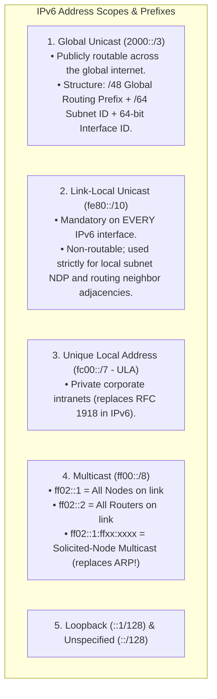
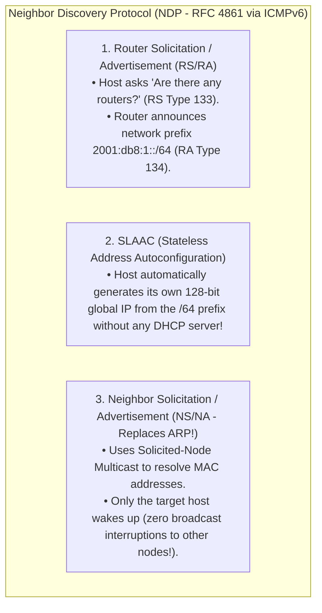
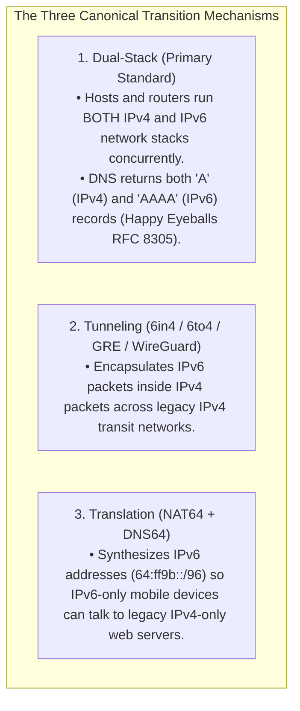

# IPv6 Architecture: 128-Bit Addressing, Fixed Header, and Transition

> [!abstract] Mental Model
> - **The Planetary Address Grid**: IPv4 provided $4.3\text{ billion}$ addresses (exhausted in 2011), requiring stateful NAT kludges that broke the End-to-End Principle. **IPv6 (RFC 8200)** expands the address space to **128 bits ($3.4 \times 10^{38}$ addresses)**—enough to assign $5 \times 10^{28}$ unique IP addresses to every human being alive.
> - **The Aerodynamic Freight Truck**: IPv6 is far more than larger numbers: it **streamlined router forwarding silicon** by eliminating the Header Checksum, fixing the base header to a clean $40\text{ bytes}$, killing broadcast in favor of multicast, and banning in-flight router fragmentation.

---

## 1. 128-Bit Hexadecimal Addressing & Notation Rules

An IPv6 address consists of 128 bits divided into eight 16-bit blocks (hextets) separated by colons:

```
Full Format:    2001 : 0db8 : 85a3 : 0000 : 0000 : 8a2e : 0370 : 7334
```

$$\mathbf{\text{Total IPv6 Addresses} = 2^{128} \approx 3.402823669 \times 10^{38}}$$

---

### Strict RFC 5952 Compression Rules:
1. **Rule 1 (Omit Leading Zeros)**: Leading zeros in any 16-bit hextet must be suppressed:
   - `:0042:` $\to$ `:42:`, `:0000:` $\to$ `:0:`
2. **Rule 2 (Double Colon `::` Zero Compression)**: The longest contiguous sequence of `:0:` blocks must be replaced with a single **`::`**:
   - `2001:0db8:0000:0000:0000:0000:0000:0001` $\implies$ **`2001:db8::1`**
   - **Critical Invariant**: `::` can appear **only once** per address to prevent mathematical ambiguity!

---

## Canonical IPv6 Address Scopes



---

## 2. The Fixed 40-Byte Base Header (RFC 8200)

```
 0                   1                   2                   3
 0 1 2 3 4 5 6 7 8 9 0 1 2 3 4 5 6 7 8 9 0 1 2 3 4 5 6 7 8 9 0 1
+-+-+-+-+-+-+-+-+-+-+-+-+-+-+-+-+-+-+-+-+-+-+-+-+-+-+-+-+-+-+-+-+
|Version| Traffic Class |           Flow Label                  |
+-+-+-+-+-+-+-+-+-+-+-+-+-+-+-+-+-+-+-+-+-+-+-+-+-+-+-+-+-+-+-+-+
|         Payload Length        |  Next Header  |   Hop Limit   |
+-+-+-+-+-+-+-+-+-+-+-+-+-+-+-+-+-+-+-+-+-+-+-+-+-+-+-+-+-+-+-+-+
|                                                               |
+                                                               +
|                                                               |
+                         Source Address                        +
|                           (128 Bits)                          |
+                                                               +
|                                                               |
+-+-+-+-+-+-+-+-+-+-+-+-+-+-+-+-+-+-+-+-+-+-+-+-+-+-+-+-+-+-+-+-+
|                                                               |
+                                                               +
|                                                               |
+                      Destination Address                      +
|                           (128 Bits)                          |
+                                                               +
|                                                               |
+-+-+-+-+-+-+-+-+-+-+-+-+-+-+-+-+-+-+-+-+-+-+-+-+-+-+-+-+-+-+-+-+
```

---

### IPv6 vs IPv4 Architectural Enhancements:

| Field | Width | IPv6 Optimization over IPv4 |
| :--- | :---: | :--- |
| **Version** | $4\text{ Bits}$ | Always `6` (`0110`). |
| **Traffic Class** | $8\text{ Bits}$ | Replaces IPv4 DSCP + ECN (Quality of Service). |
| **Flow Label** | **$20\text{ Bits}$** | **Enables hardware ASIC ECMP load balancing** without opening/inspecting inner TCP/UDP port headers. |
| **Payload Length**| $16\text{ Bits}$ | Length of payload *after* the 40B base header (including Extension Headers). |
| **Next Header** | $8\text{ Bits}$ | Replaces IPv4 Protocol field; chains **Extension Headers** or specifies L4 (`6` TCP, `17` UDP). |
| **Hop Limit** | $8\text{ Bits}$ | Replaces IPv4 TTL. Decremented by 1 at each router. |
| **Source / Dest IP**| **$128\text{ Bits}$ each** | Full end-to-end global addressing. |
| **NO Checksum!** | **$0\text{ Bits}$** | **Completely eliminated!** Routers no longer burn CPU recalculating checksums on every hop. |
| **NO Frag Fields!**| **$0\text{ Bits}$** | **Routers NEVER fragment!** Sender must enforce Path MTU Discovery (PMTUD). |

---

## 3. Extension Headers (Chained Architecture)

Optional features are chained via the `Next Header` pointer, processed only by endpoints:

```
[ IPv6 Base Header ] -> [ Hop-by-Hop (0) ] -> [ Routing (43) ] -> [ Fragment (44) ] -> [ TCP (6) ] -> [ Data ]
  (Next Hdr = 0)          (Next Hdr = 43)       (Next Hdr = 44)      (Next Hdr = 6)
```

---

## 4. Neighbor Discovery Protocol (NDP) & SLAAC

> **Broadcast is 100% Dead in IPv6**: Broadcast storms cannot exist in IPv6 because there is no broadcast address (`FF:FF:FF:FF:FF:FF` does not exist). All network discovery uses **Targeted Multicast**.



---

## 5. IPv4-to-IPv6 Migration Mechanisms



---

## Production Diagnostics & IPv6 Network Management

```bash
# 1. Inspect Local IPv6 Addresses (Global 2001:... and Link-Local fe80:...):
ip -6 addr show dev eth0

# Output shows:
# inet6 2001:db8:cafe:1::100/64 scope global dynamic
# inet6 fe80::5054:ff:fe12:3456/64 scope link

# 2. Inspect IPv6 Routing Table:
ip -6 route show
# 2001:db8:cafe:1::/64 dev eth0 proto kernel metric 256
# default via fe80::1 dev eth0 proto ra metric 1024

# 3. Inspect IPv6 NDP Neighbor Table (The modern replacement for ARP cache):
ip -6 neighbor show
# 2001:db8:cafe:1::1 dev eth0 lladdr 00:1a:2b:3c:4d:5e REACHABLE
# fe80::1 dev eth0 lladdr 00:1a:2b:3c:4d:5e router REACHABLE

# 4. Perform an IPv6 Ping and Path MTU Test:
ping6 -c 3 2001:4860:4860::8888

# 5. Inspect Happy Eyeballs DNS Resolution (Both A and AAAA records):
dig +noall +answer A AAAA google.com
# google.com.     300 IN A    142.250.190.46
# google.com.     300 IN AAAA 2607:f8b0:4004:800::200e
```

---

## Active Recall & Interview Perspective

### Reasoning Prompts
1. *Why did IPv6 designers eliminate the Header Checksum from the IPv6 base header?*
   - **Answer**: In IPv4, every router in a packet's path decrements the TTL, forcing each router to recalculate the 16-bit header checksum in hardware/software, creating forwarding latency. IPv6 designers recognized that the **Data Link Layer (Ethernet CRC-32)** already guarantees transmission integrity across physical hops, while the **Transport Layer (TCP and UDP checksums)** guarantees end-to-end payload integrity. Because modern Layer 2 and Layer 4 protocols already provide redundant error detection, the **IPv6 base header checksum was eliminated**, saving millions of CPU cycles per second on core internet routers.
2. *How does IPv6 eliminate the need for ARP and prevent local broadcast storms?*
   - **Answer**: IPv6 completely eliminated the concept of Broadcast addresses (`FF:FF:FF:FF:FF:FF`). Address resolution is handled by the **Neighbor Discovery Protocol (NDP)** using **Neighbor Solicitation (NS)** and **Neighbor Advertisement (NA)** messages running over ICMPv6. Instead of broadcasting to all hosts in the VLAN, the sender transmits the NS packet to the **Solicited-Node Multicast Address (`FF02::1:FFxx:xxxx`)** corresponding to the target's low 24 bits. Network Interface Cards filter multicast hashes in hardware silicon, meaning only the specific machine matching the address wakes up and processes the interrupt, eliminating broadcast CPU wakeups for all other machines on the subnet.
3. *What is "Happy Eyeballs" (RFC 8305) and how does it prevent dual-stack connection delays?*
   - **Answer**: When a client operating on a Dual-Stack network resolves a domain name (like `google.com`), the DNS resolver returns both an IPv4 `A` record and an IPv6 `AAAA` record. If the client's IPv6 route is misconfigured or broken, waiting for a standard TCP connection timeout on IPv6 before falling back to IPv4 would cause a multi-second freeze for the user. **Happy Eyeballs (RFC 8305)** solves this by initiating a connection over IPv6 first; if no response is received within **$250\text{ milliseconds}$**, it concurrently fires an IPv4 TCP connection in parallel, using whichever handshake completes first and caching the result to ensure zero perceived latency for the user.

---

## Key Takeaways
- IPv6 provides **128-bit addresses ($3.4 \times 10^{38}$)**; compressed with **`::` (used once)**.
- Base header is **fixed at $40\text{ Bytes}$**; **Checksum and in-flight fragmentation are eliminated**.
- **Broadcast is replaced by Multicast and NDP**; auto-configuration is handled via **SLAAC**.

---

## Related Notes
- [[Computer Networks MOC]] — Master table of contents for Computer Networks.
- [[Encapsulation, De-encapsulation, and Protocol Data Units - PDUs]] — Header offsets.
- [[IPv4 Addressing - Classful, Classless, CIDR, and Subnetting]] — 32-bit address comparison.
- [[IPv4 Header Format and Packet Fragmentation]] — IPv4 header comparison.
- [[Network Address Translation - NAT, PAT, CGNAT]] — NAT64 translation.
- [[Domain Name System - DNS Hierarchy, Recursive Resolution, EDNS, DNSSEC]] — `AAAA` records.
