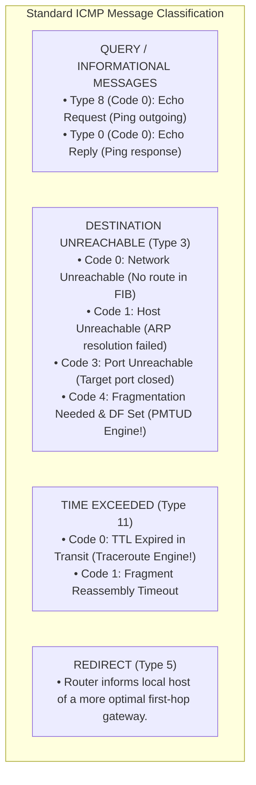
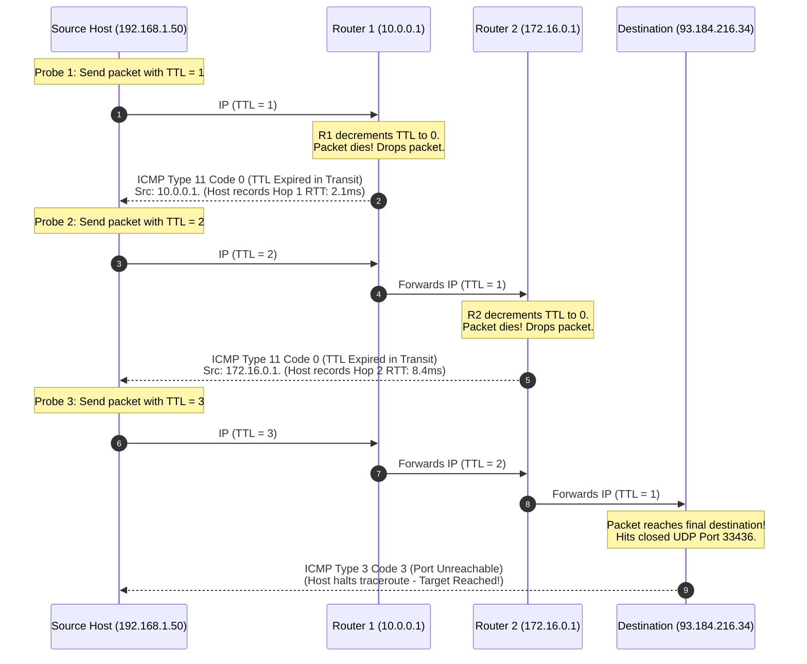

# Internet Control Message Protocol (ICMP) and Traceroute

> [!abstract] Mental Model
> - **The Network's Pain Receptors (ICMP - RFC 792)**: IP is connectionless, unreliable, and silent—it drops packets without notifying senders. ICMP is the **diagnostic sidecar** to IP. It never transports user application data; instead, it acts as the network's nervous system, firing error signals and telemetry back to the originating host when packets die.
> - **The Sonar Echo Locator (Traceroute)**: Exploits the **Time-to-Live (TTL)** field by deliberately starving packets of hops ($1, 2, 3\dots$), forcing each intermediate router along the path to reveal its identity via `ICMP Time Exceeded` error replies.

---

## 1. ICMP Header & Payload Architecture

ICMP is encapsulated directly inside an IP packet (**Protocol `0x01`** for IPv4, **Protocol `0x3A`** for ICMPv6):

```
 0                   1                   2                   3
 0 1 2 3 4 5 6 7 8 9 0 1 2 3 4 5 6 7 8 9 0 1 2 3 4 5 6 7 8 9 0 1
+-+-+-+-+-+-+-+-+-+-+-+-+-+-+-+-+-+-+-+-+-+-+-+-+-+-+-+-+-+-+-+-+
|     Type      |     Code      |          Checksum             |
+-+-+-+-+-+-+-+-+-+-+-+-+-+-+-+-+-+-+-+-+-+-+-+-+-+-+-+-+-+-+-+-+
|                 Rest of Header (Depends on Type)              |
+-+-+-+-+-+-+-+-+-+-+-+-+-+-+-+-+-+-+-+-+-+-+-+-+-+-+-+-+-+-+-+-+
|      Original IP Header (20 Bytes) + First 8 Bytes of Data     |
+-+-+-+-+-+-+-+-+-+-+-+-+-+-+-+-+-+-+-+-+-+-+-+-+-+-+-+-+-+-+-+-+
```

> [!IMPORTANT] Invariant: The 8-Byte Error Reflection
> When a router emits an ICMP error (e.g. *Destination Unreachable* or *Time Exceeded*), it **must copy the original 20-byte IP header plus the first 8 bytes of the offending payload** into the ICMP packet. Those 8 bytes contain the original **Source and Destination TCP/UDP Ports and Sequence Numbers**, allowing the sender's operating system kernel to identify exactly which local process/socket triggered the fault!

---

## 2. Canonical ICMP Types & Codes Taxonomy



---

## 3. How Traceroute Works (First-Principles Execution Trace)

Traceroute iteratively increments the IP TTL field to map each Layer 3 router hop:



---

### Traceroute Implementation Flavors Across Operating Systems:

| Implementation | Default Protocol | Target Port | Termination Signal |
| :--- | :--- | :--- | :--- |
| **Linux `traceroute`** | **UDP** | Ephemeral `33434+` | `ICMP Type 3 Code 3 (Port Unreachable)` |
| **Windows `tracert`** | **ICMP** | `Type 8 Echo` | `ICMP Type 0 (Echo Reply)` |
| **TCP `tcptraceroute`**| **TCP SYN** | Port `80` or `443` | `TCP SYN-ACK` or `TCP RST` (Bypasses firewalls!) |

---

## 4. Path MTU Discovery & The "PMTUD Black Hole" Outage

```mermaid
flowchart TD
    Sender["Sender (Host A)<br/>Sends 1500B TCP packet with DF = 1"]
    -->|Traverses Gigabit LAN| R1["Router 1 (MTU 1500)"]
    -->|Enters VPN Tunnel (MTU 1400)| R2["Router 2<br/>• Packet > MTU and DF = 1!<br/>• Drops packet & sends ICMP Type 3 Code 4: 'MTU = 1400'"]
    
    R2 -.->|ICMP Type 3 Code 4| Firewall["Corporate Edge Firewall<br/>• Misconfigured Rule: Drops ALL ICMP!"]
    Firewall -.->|BLOCKED!| Sender

    Sender -->|Never receives MTU notice!<br/>Hangs infinitely in TCP retransmit loop!| Outage["THE PMTUD BLACK HOLE OUTAGE<br/>(Web pages hang indefinitely after initial TLS handshake)"]
```

---

## Production Diagnostics & Path Debugging

```bash
# 1. Standard ICMP Echo Ping with Latency & Packet Loss Stats:
ping -c 4 1.1.1.1

# 2. Modern TCP SYN Traceroute to Bypass Restrictive Firewalls:
sudo traceroute -T -p 443 -n google.com
# 1  192.168.1.1   1.214 ms
# 2  10.200.0.1    4.321 ms
# 3  142.250.190.46  12.450 ms

# 3. Interactive Real-Time Network Path & Jitter Diagnostics with MTR:
mtr --report --report-cycles=10 8.8.8.8

# Output:
# HOST: my-host           Loss%   Snt   Last   Avg  Best  Wrst StDev
#   1.|-- 192.168.1.1      0.0%    10    1.1   1.2   0.9   1.8   0.3
#   2.|-- 10.0.0.1         0.0%    10    5.2   5.4   4.8   6.1   0.4
#   3.|-- 72.14.215.85     0.0%    10   11.4  11.8  11.2  13.4   0.7
#   4.|-- 8.8.8.8          0.0%    10   12.1  12.3  11.9  14.2   0.6

# 4. Discover Exact Path MTU with Ping and DF bit:
ping -M do -s 1472 8.8.8.8
```

---

## Active Recall & Interview Perspective

### Reasoning Prompts
1. *Why does an ICMP error message include the original IP header and the first 8 bytes of the offending payload?*
   - **Answer**: When an intermediate router drops a packet due to an error (such as `TTL Expired` or `Fragmentation Needed`), it sends an ICMP error message back to the originating Source IP. However, because IP is a connectionless protocol, the source host's operating system kernel needs to know which specific process or network socket triggered the error. The first 8 bytes of an upper-layer transport payload (TCP or UDP) contain the **Source Port and Destination Port** (as well as Sequence Numbers for TCP). The OS kernel parses these 8 bytes to identify the exact local socket, wake up the waiting application thread, and deliver the appropriate error return code (e.g. `ECONNREFUSED` or `EMSGSIZE`).
2. *How does Linux `traceroute` differ fundamentally from Windows `tracert` in its probe mechanism and termination detection?*
   - **Answer**: Windows `tracert` transmits **ICMP Echo Requests (`Type 8`)** with incrementing TTLs. Intermediate routers respond with `ICMP Time Exceeded (Type 11)`, and the target host responds with an **`ICMP Echo Reply (Type 0)`**, indicating the destination has been reached. In contrast, Linux `traceroute` defaults to sending **UDP datagrams** targeted at randomized, unused high-numbered ports (starting at `33434`). Intermediate routers respond with `ICMP Time Exceeded (Type 11)`, but when the packet reaches the target destination host, the operating system detects that no process is listening on that UDP port and responds with **`ICMP Destination Unreachable - Port Unreachable (Type 3 Code 3)`**, which signals `traceroute` that the end host has been reached.
3. *What is a "PMTUD Black Hole" and why is indiscriminately dropping all ICMP traffic on firewalls a catastrophic network anti-pattern?*
   - **Answer**: Path MTU Discovery (PMTUD) relies on sending packets with the Don't Fragment (`DF=1`) bit set. If a packet exceeds the MTU of a transit link (e.g. an encapsulating IPsec or GRE VPN tunnel), the router drops the packet and sends an **`ICMP Type 3 Code 4 (Fragmentation Needed and DF set)`** containing the next-hop link MTU. If an enterprise firewall naively blocks all incoming ICMP traffic, this packet is dropped. The sender never learns that its packets are too large and continually retransmits the full-sized packet until the connection times out. Small packets (like TCP SYN/ACK handshakes) succeed, but the connection freezes immediately when large data payloads (like TLS certificates or HTTP responses) are transmitted.

---

## Key Takeaways
- **ICMP (RFC 792)** is the diagnostic error-reporting protocol for IP (Type/Code structure).
- **Traceroute** increments **TTL ($1, 2, 3\dots$)** to solicit **`ICMP Type 11 Code 0 (Time Exceeded)`** from intermediate routers.
- Blocking all ICMP causes **PMTUD Black Holes**; always allow `ICMP Type 3 Code 4`.

---

## Related Notes
- [[Computer Networks MOC]] — Master table of contents for Computer Networks.
- [[Encapsulation, De-encapsulation, and Protocol Data Units - PDUs]] — PMTUD sizing.
- [[Physical Layer - Transmission Media, Bandwidth, and Latency]] — Latency and RTT measurement.
- [[IPv4 Header Format and Packet Fragmentation]] — TTL decrements and Checksum changes.
- [[Firewalls - Packet Filtering, Stateful Inspection, NGFW]] — ICMP filtering best practices.
- [[Transmission Control Protocol - TCP Header, Features, and Invariants]] — TCP SYN traceroute mechanics.
