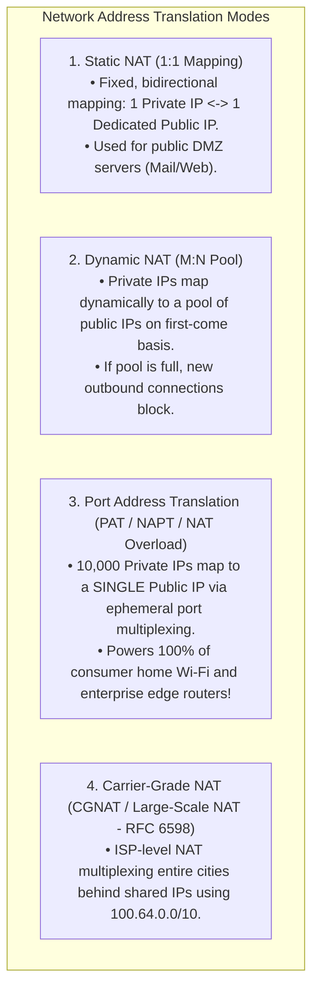
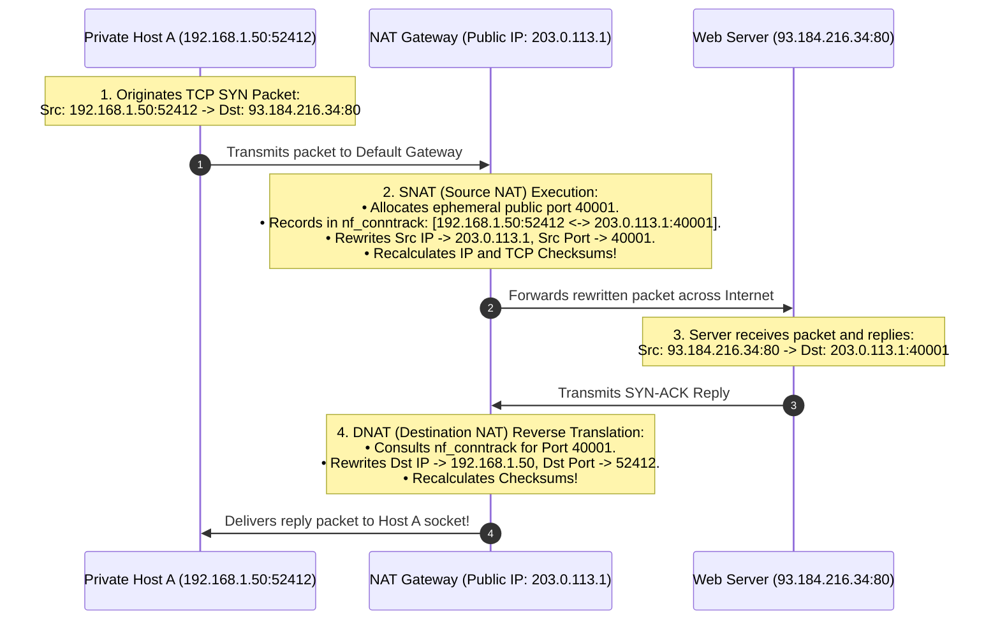
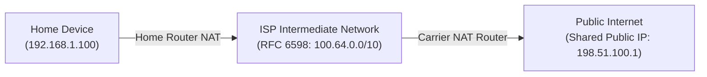
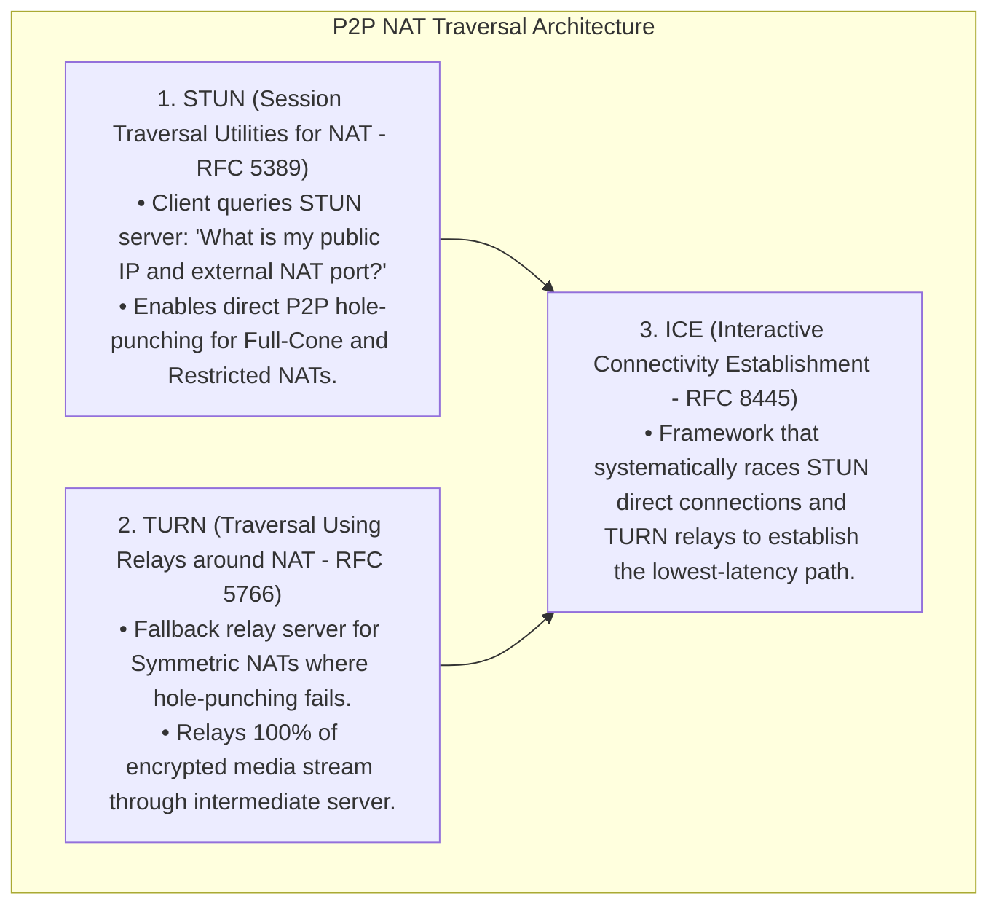

# Network Address Translation: NAT, PAT, and Carrier-Grade NAT (CGNAT)

> [!abstract] Mental Model
> NAT is **the corporate PBX switchboard and mailroom receptionist**:
> - Inside a high-rise office building, $5,000$ employees have private 3-digit desk extensions (**RFC 1918 Private IPs: `10.0.0.x`**).
> - When Alice dials an outside client, the PBX switchboard replaces Alice's internal extension with the company's single public phone number (**`203.0.113.1`**) and assigns an outbound line number (**Transport Port**).
> - When the client calls back on that line number, the receptionist consults the stateful call log (**`nf_conntrack` table**) and forwards the audio directly to Alice's desk.

---

## The Four Flavors of NAT



---

## 1. Port Address Translation (PAT) Deep-Dive

PAT multiplexes thousands of private hosts onto a single public IP by modifying **both Layer 3 (IP) and Layer 4 (TCP/UDP Port) headers**:



---

## 2. Carrier-Grade NAT (CGNAT / RFC 6598)

Due to global IPv4 depletion, cellular telcos and ISPs place users behind a **Double NAT** hierarchy:



> **The CGNAT Block**: `100.64.0.0/10` (`100.64.0.0` to `100.127.255.255`) provides **$4,194,304$ addresses** reserved exclusively for service provider carrier networks.

---

## 3. Linux Kernel Stateful Connection Tracking (`nf_conntrack`)

Linux Netfilter tracks active NAT sessions in a bidirectional kernel hash table:

```
# Linux Conntrack Session Tuple Representation:
tcp 6 431999 ESTABLISHED src=192.168.1.50 dst=93.184.216.34 sport=52412 dport=80 \
                         src=93.184.216.34 dst=203.0.113.1 sport=80 dport=40001 [ASSURED]
```

### The Fatal Outage: Conntrack Table Exhaustion
In high-throughput microservice or Kubernetes ingress nodes:
- When active sessions exceed `net.netfilter.nf_conntrack_max`, the kernel emits:
  `nf_conntrack: table full, dropping packet`
- **Result**: Immediate, silent connection dropping for all new TCP/UDP traffic!

---

## 4. NAT Traversal: Breaking Through NAT (STUN, TURN, ICE)

Because NAT gateways drop all unsolicited inbound packets from external hosts, Peer-to-Peer protocols (WebRTC, VoIP, Zoom) use traversal techniques:



---

## Production Diagnostics & Conntrack Tuning

```bash
# 1. Inspect Active Linux Kernel NAT Connections with conntrack:
sudo conntrack -L -p tcp

# 2. Check Current Conntrack Utilization vs System Limit:
sysctl net.netfilter.nf_conntrack_count net.netfilter.nf_conntrack_max

# Output:
# net.netfilter.nf_conntrack_count = 42105
# net.netfilter.nf_conntrack_max = 262144

# 3. Scale Conntrack Table Limits for High-Traffic Cloud Gateways:
sudo sysctl -w net.netfilter.nf_conntrack_max=1048576

# 4. View Active iptables NAT Masquerade Rules:
sudo iptables -t nat -L -n -v
# Chain POSTROUTING (policy ACCEPT)
# pkts bytes target     prot opt in     out     source               destination
# 14M  8.2G MASQUERADE  all  --  *      eth0    192.168.1.0/24       0.0.0.0/0
```

---

## Active Recall & Interview Perspective

### Reasoning Prompts
1. *Why does Port Address Translation (PAT) break the fundamental End-to-End Principle of the Internet?*
   - **Answer**: The End-to-End Principle states that intermediate network nodes should act as dumb packet forwarders, maintaining zero application/transport state while endpoints handle intelligence. PAT breaks this by making intermediate routers **statefully aware of Layer 4 transport ports** (`nf_conntrack`), rewriting IP addresses and port numbers on the fly, and recalculating L3/L4 checksums. This destroys end-to-end address transparency: external hosts cannot directly initiate unsolicited connections to internal servers without explicit port forwarding rules, and protocols that embed IP addresses inside their application payloads (such as legacy FTP `PORT` commands or SIP VoIP) fail completely without dedicated Application Layer Gateways (ALGs).
2. *What is the difference between "Full Cone NAT" and "Symmetric NAT", and why does Symmetric NAT prevent direct STUN P2P connections?*
   - **Answer**: In a **Full Cone NAT**, once an internal address/port (`192.168.1.50:5000`) is mapped to an external public port (`203.0.113.1:40000`), *any* external host on the internet can send packets to port 40000 to reach that internal host. In a **Symmetric NAT**, the NAT router allocates a *brand new, distinct public port for every unique destination IP/port* the internal host connects to. When the client queries a STUN server, the NAT assigns Port A; when the client attempts to talk to a peer, the NAT assigns a different Port B. Because the peer cannot guess the new randomized port, direct UDP hole punching fails, forcing the connection to fall back to a **TURN relay server**.
3. *What causes "nf_conntrack: table full, dropping packet" kernel errors and how do you resolve it in production Kubernetes clusters?*
   - **Answer**: Linux `nf_conntrack` maintains a state table tracking every active and recent network flow (including short-lived TCP `TIME_WAIT` connections and UDP DNS queries). In high-throughput microservice environments, a burst of short-lived connections can fill the table to `nf_conntrack_max`. Once full, the netfilter engine drops all new incoming and outgoing packets. It is resolved by **increasing `net.netfilter.nf_conntrack_max`** (e.g. to $1\text{ - }2\text{ million}$), scaling the hash bucket size (`net.netfilter.nf_conntrack_buckets`), reducing aggressive timeout values (`net.netfilter.nf_conntrack_tcp_timeout_established`), or using `NOTRACK` iptables rules to bypass tracking on trusted high-speed interfaces.

---

## Key Takeaways
- **PAT (NAT Overload)** multiplexes thousands of private hosts onto 1 public IP using **Transport Ports**.
- **CGNAT (`100.64.0.0/10`)** is ISP-level translation that creates Double NAT.
- **`nf_conntrack`** is the stateful engine; exhaustion drops packets. **STUN/TURN/ICE** solve NAT traversal for WebRTC/P2P.

---

## Related Notes
- [[Computer Networks MOC]] — Master table of contents for Computer Networks.
- [[Encapsulation, De-encapsulation, and Protocol Data Units - PDUs]] — Checksum recalculation.
- [[IPv4 Addressing - Classful, Classless, CIDR, and Subnetting]] — RFC 1918 private address ranges.
- [[IPv6 Architecture - 128-bit Addressing, Header Format, Transition]] — Elimination of NAT via IPv6.
- [[Transport Layer Fundamentals - Multiplexing, Demultiplexing, Ports]] — Ephemeral port spaces.
- [[Dynamic Host Configuration Protocol - DHCP]] — Private address assignment.
