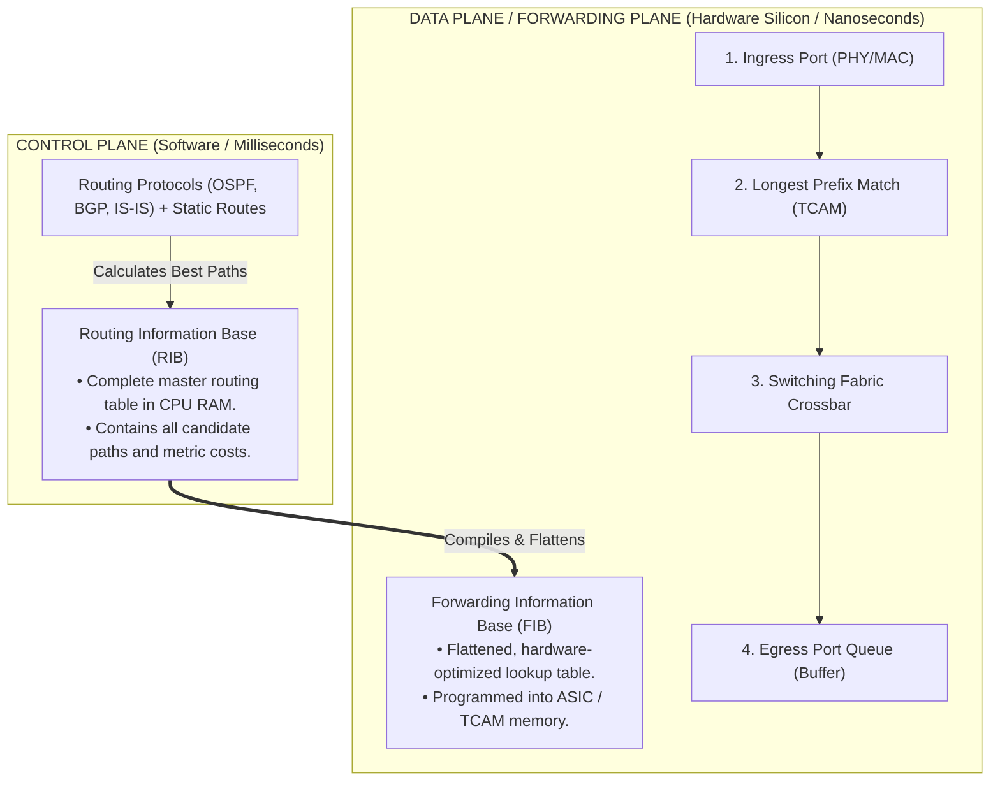
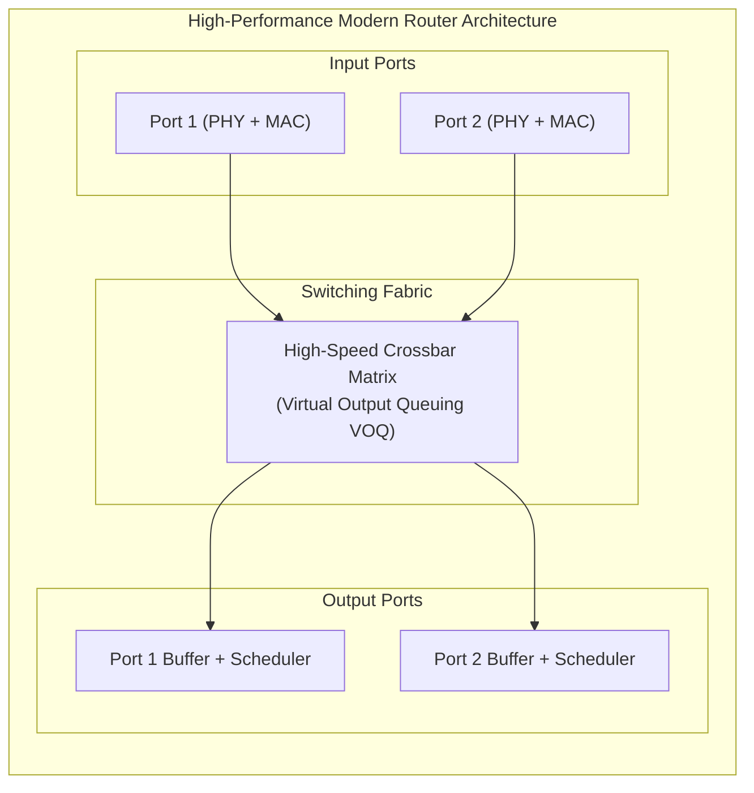
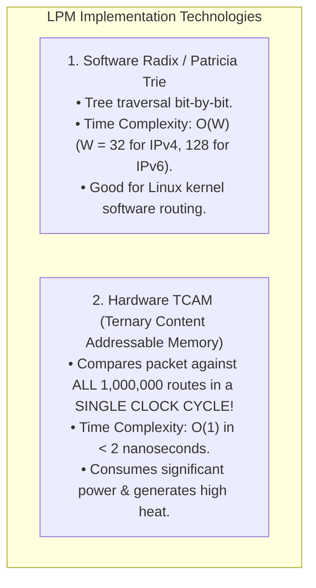
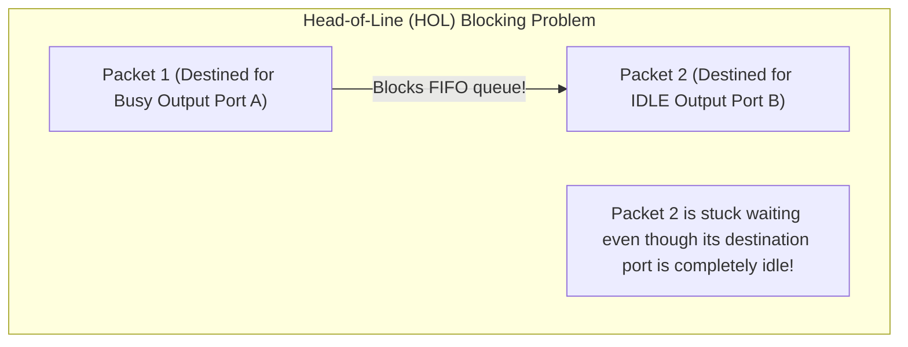

# Network Layer: Packet Forwarding vs Routing

> [!abstract] Mental Model
> - **Routing (The Control Plane - "The Navigator / GPS")**: The distributed, software-driven brain. Runs complex mathematical graph algorithms (OSPF Dijkstra, BGP Path Vector) on CPU cores to construct a global network map and compute the **Routing Information Base (RIB)**.
> - **Forwarding (The Data Plane - "The High-Speed Conveyor Belt")**: The nanosecond, line-rate hardware pipeline. Takes an incoming IP packet on an input port, performs a **Longest Prefix Match (LPM)** lookup against the **Forwarding Information Base (FIB)** in silicon ASIC memory (**TCAM**), updates the TTL, and shunts the packet across the switching fabric to the egress port in $< 10\text{ nanoseconds}$.

---

## Control Plane vs Data Plane Architecture



---

## Router Internal Architecture



### The Three Switching Fabric Generations:
1. **Memory Switching (1st Gen)**: Packets copied into shared CPU memory via system bus; bandwidth bottlenecked by memory bus speed.
2. **Bus Switching (2nd Gen)**: Ports communicate directly over a shared internal bus; limited by single-bus serialization contention.
3. **Crossbar Interconnect Matrix (Modern)**: An $N \times N$ grid of physical hardware crosspoints allowing up to $N$ packets to cross the fabric concurrently in parallel, achieving multi-terabit/sec throughput.

---

## Longest Prefix Match (LPM) & Hardware TCAM

When an IP packet arrives with Destination IP `192.168.1.130`, the router may have multiple matching subnets in its FIB:

```
FIB Table:
--------------------------------------------------------------
Prefix              Next Hop            Interface       Prefix Length
192.168.0.0/16      10.0.0.1            eth0            16
192.168.1.0/24      10.0.0.2            eth1            24
192.168.1.128/25    10.0.0.3            eth2            25  <-- LONGEST MATCH! (Matches 25 bits)
0.0.0.0/0           10.0.0.254          eth3            0   (Default Route)
--------------------------------------------------------------
```

> **The LPM Rule**: Always forward the packet out the interface corresponding to the **most specific route (longest prefix / highest subnet mask length)**. The packet is routed to `eth2`.

---

### Software Radix Tries vs Hardware TCAM:



---

## Queuing Dynamics: Head-of-Line (HOL) Blocking & Bufferbloat


- **Solution**: **Virtual Output Queuing (VOQ)**, where input ports maintain separate internal queues for each individual output port, preventing blocked ports from stalling idle traffic.

---

## Production Diagnostics & Linux Kernel Forwarding

```bash
# 1. Enable Linux Kernel as an IPv4 Packet Forwarding Router:
sudo sysctl -w net.ipv4.ip_forward=1
# (Persisted in /etc/sysctl.conf: net.ipv4.ip_forward = 1)

# 2. Inspect Linux Kernel Routing Information Base (RIB):
ip route show

# Output:
# default via 192.168.1.1 dev eth0 proto dhcp metric 100
# 10.0.0.0/24 dev eth1 proto kernel scope link src 10.0.0.1
# 172.16.0.0/16 via 10.0.0.2 dev eth1 proto static

# 3. Simulate Kernel FIB Longest Prefix Match Lookup for a Specific IP:
ip route get 172.16.50.4
# 172.16.50.4 via 10.0.0.2 dev eth1 src 10.0.0.1 uid 1000
#     cache

# 4. Inspect Packet Forwarding Drop Counters and Buffer Drops:
netstat -s | grep -iE "forward|drop|unreach"
# 1,420,591 packets forwarded
# 0 incoming packets dropped
# 42 output packets dropped
```

---

## Active Recall & Interview Perspective

### Reasoning Prompts
1. *What is the fundamental architectural difference between the Control Plane and the Data Plane in high-performance networking?*
   - **Answer**: The **Control Plane** is the "brain" of the network operating in software on general-purpose CPUs. It executes complex distributed routing protocols (BGP, OSPF, IS-IS) to discover network topology, manage neighbor adjacencies, and compute the master **Routing Information Base (RIB)** over milliseconds/seconds. The **Data Plane (Forwarding Plane)** is the "muscle" operating in dedicated hardware ASICs/TCAM. It takes the flattened **Forwarding Information Base (FIB)** compiled by the control plane and performs line-rate packet forwarding (LPM lookups, TTL decrements, checksum recalculations, and switching fabric transfers) in sub-10-nanosecond hardware clock cycles without involving the CPU.
2. *How does Ternary Content Addressable Memory (TCAM) achieve $O(1)$ Longest Prefix Match (LPM) lookups for over 1,000,000 internet routes?*
   - **Answer**: Standard RAM takes an address and returns data. CAM takes data and returns the address where that data is stored in a single cycle. Standard Binary CAM only stores `0` and `1`. **TCAM (Ternary CAM)** adds a third "Don't Care" wildcard state (`X`), which maps directly to subnet masks (e.g. `192.168.1.0/24` has 24 matching bits and 8 `X` bits). When an IP packet arrives, TCAM broadcasts the 32-bit destination IP across all silicon memory cells simultaneously, evaluating the entire routing table in **a single clock cycle ($O(1)$)** and outputting the index of the highest-priority matching rule.
3. *What is Head-of-Line (HOL) blocking in router input ports and how do Virtual Output Queues (VOQs) eliminate it?*
   - **Answer**: In a simple First-In-First-Out (FIFO) input buffer, if the packet at the head of the queue is destined for an output port that is currently congested or busy, that packet must wait. All subsequent packets in the FIFO buffer are blocked behind it—even if their intended destination output ports are completely idle (**Head-of-Line Blocking**), capping maximum switch throughput at $58.6\%$. **Virtual Output Queues (VOQs)** solve this by dividing the single input buffer into $N$ separate logical queues (one for each of the $N$ output ports). If Output Port A is busy, the scheduler simply services the VOQ for Output Port B, preventing head-of-line stalls.

---

## Key Takeaways
- **Routing (Control Plane)** builds the **RIB** in software; **Forwarding (Data Plane)** executes the **FIB** in hardware ASIC/TCAM.
- **Longest Prefix Match (LPM)** selects the most specific route (`/25` over `/24`).
- Modern routers use **Crossbar Fabrics** and **Virtual Output Queues (VOQ)** to prevent **HOL Blocking**.

---

## Related Notes
- [[Computer Networks MOC]] — Master table of contents for Computer Networks.
- [[Switches and VLANs - 802.1Q, Trunking, Spanning Tree Protocol STP]] — Layer 2 forwarding comparison.
- [[IPv4 Addressing - Classful, Classless, CIDR, and Subnetting]] — Prefix math and CIDR.
- [[IPv4 Header Format and Packet Fragmentation]] — IP header processing and TTL decrementing.
- [[Routing Algorithms - Distance Vector vs Link State vs Path Vector]] — Control plane algorithms.
- [[Open Shortest Path First - OSPF and Link State Advertisements]] — Link-state interior routing.
- [[Border Gateway Protocol - BGP, AS, BGP Peering, Path Attributes]] — Exterior internet routing.
- [[Software-Defined Networking - SDN and OpenFlow]] — Decoupled control plane architectures.
