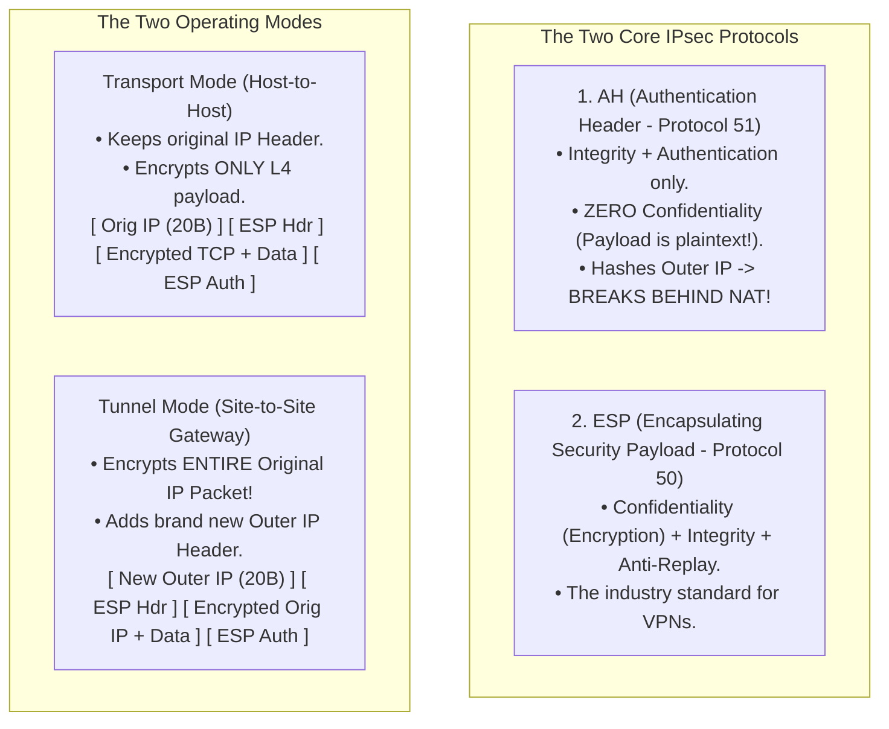
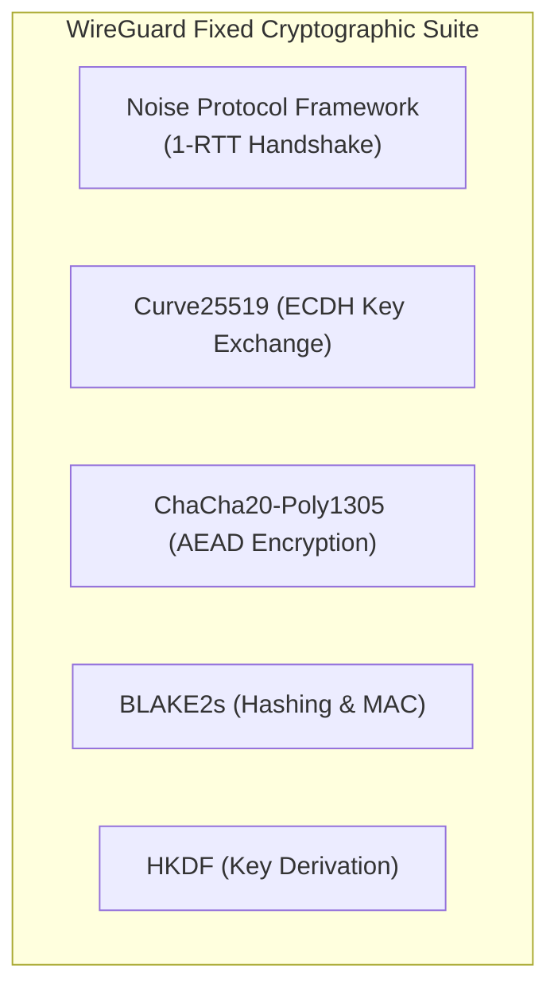

# Virtual Private Networks: IPsec, WireGuard, and GRE

> [!abstract] Mental Model
> - **The Armored Transport on Public Highways**: The public internet is an unencrypted, hostile roadway where any intermediary can sniff or tamper with packets. A **Virtual Private Network (VPN)** constructs a private, encrypted "tunnel" across this public infrastructure by encapsulating private packets inside new encrypted outer headers.
> - **Protocol Evolution**:
>   - **GRE**: A clear-glass pipe (encapsulates anything including multicast, but $0\%$ encryption).
>   - **IPsec**: A massive armored fortress (heavyweight, complex $100,000+$ lines of code, enterprise standard).
>   - **WireGuard**: A titanium electric hypercar (streamlined $\sim 4,000$ lines of kernel code, modern ChaCha20-Poly1305 cryptography, and instant connection roaming).

---

## 1. Protocol Architecture Comparison

| Dimension | GRE (RFC 2784) | IPsec (RFC 4301) | WireGuard |
| :--- | :--- | :--- | :--- |
| **Layer** | Layer 3 (IP-in-IP) | Layer 3 (Network Layer) | Layer 3 / UDP Overlay |
| **Encryption** | **None (Plaintext!)** | AES-GCM, AES-CBC, ChaCha20 | **ChaCha20-Poly1305** |
| **Key Exchange** | None (Static) | **IKEv2** (UDP 500 / 4500) | **Noise Protocol (Curve25519)** |
| **Kernel Footprint**| Tiny | Massive ($> 100,000$ lines) | **$\sim 4,000$ lines in Linux kernel** |
| **Multicast Support**| **Yes** (Runs OSPF/BGP) | No (Requires GRE-over-IPsec) | Route-based unicast |
| **Stealth / Port Scans**| Visible | Visible (IKE responder) | **100% Silent** (No reply to unauth packets) |
| **Header Overhead** | $24\text{ Bytes}$ | $56 - 72\text{ Bytes}$ | **$32\text{ Bytes}$** |

---

## 2. Generic Routing Encapsulation (GRE)

GRE encapsulates arbitrary Layer 3 protocols inside standard IP packets (**IP Protocol `0x2F` / `47`**):

```
[ Outer IP Header (20B) ] [ GRE Header (4B) ] [ Inner IP Header (20B) ] [ Inner Payload (TCP/UDP) ]
  (Src: 203.0.113.1)                            (Src: 10.0.1.50)
  (Dst: 198.51.100.2)                           (Dst: 10.0.2.100)
```

> **Why GRE Still Matters**: Standard IPsec Tunnel mode cannot encrypt multicast or broadcast traffic (such as **OSPF Hello packets** or **IS-IS**). Network engineers deploy **GRE over IPsec**: routing protocols run across GRE, which is then encapsulated and encrypted inside IPsec ESP.

---

## 3. IPsec Architecture: AH, ESP, and Operating Modes



---

### IPsec Key Exchange: IKEv2 & Kernel SAs
1. **Phase 1 (IKE SA)**: Endpoints authenticate (Certificates or Pre-Shared Keys) and establish an encrypted control channel via **Diffie-Hellman** over UDP Port 500.
2. **Phase 2 (Child SA)**: Negotiates symmetric encryption keys for data plane traffic, generating unidirectional **Security Associations (SAs)** stored in the Linux kernel **SAD (Security Association Database)** and governed by the **SPD (Security Policy Database)**.
3. **NAT-Traversal (NAT-T)**: Encapsulates ESP inside **UDP Port 4500** so NAT gateways can perform Port Address Translation without corrupting ESP headers.

---

## 4. Modern WireGuard Architecture

WireGuard discards legacy cipher agility in favor of a modern, audited cryptographic suite:



---

### Cryptokey Routing:
WireGuard associates public encryption keys directly with internal tunnel IP addresses:


> [!TIP] Seamless Client Roaming
> WireGuard endpoints update their peer IP table dynamically upon receiving authenticated packets. When a smartphone transitions from office Wi-Fi to a 5G mobile tower (changing its IP address), WireGuard updates the remote endpoint instantly without dropping active TCP connections or re-initiating handshakes!

---

## Production Diagnostics & VPN Administration

```bash
# 1. Inspect Active WireGuard Tunnel Configuration & Cryptokey Peers:
sudo wg show

# Output:
# interface: wg0
#   public key: aBcDeFgHiJkLmNoPqRsTuVwXyZ123456=
#   private key: (hidden)
#   listening port: 51820
# peer: xYzA1234567890BcDeFgHiJkLmNoPqRsTuVw=
#   endpoint: 198.51.100.10:51820
#   allowed ips: 10.0.0.2/32
#   latest handshake: 42 seconds ago
#   transfer: 1.42 GiB received, 3.89 GiB sent

# 2. Inspect Linux Kernel IPsec XFRM State & Security Policies:
sudo ip xfrm state
sudo ip xfrm policy

# 3. Create a Point-to-Point GRE Tunnel on Linux:
sudo ip link add gre1 type gre remote 203.0.113.2 local 198.51.100.1 ttl 255
sudo ip addr add 10.10.10.1/30 dev gre1
sudo ip link set gre1 up
```

---

## Active Recall & Interview Perspective

### Reasoning Prompts
1. *Why does IPsec Authentication Header (AH) fail when traversing a Network Address Translation (NAT) router, while Encapsulating Security Payload (ESP) with NAT-Traversal succeeds?*
   - **Answer**: **Authentication Header (AH)** calculates its cryptographic integrity hash across the *entire* IP packet—including the outer Source and Destination IP addresses in the IP header. When the packet passes through a NAT/PAT gateway, the router rewrites the Source IP and Port. When the receiving endpoint verifies the AH hash, the modified IP address causes the integrity check to fail, and the packet is dropped. **ESP** avoids this because its integrity hash covers only the ESP header and encrypted payload, omitting the outer IP header. To prevent NAT routers from dropping raw ESP packets (IP Protocol `50` has no port numbers for PAT), **NAT-Traversal (NAT-T)** encapsulates ESP inside standard **UDP Port 4500** packets.
2. *How does WireGuard's "Cryptokey Routing" simplify network configuration compared to traditional IPsec SPD/SAD policies?*
   - **Answer**: Traditional IPsec requires configuring complex separate policy databases (SPD) to define which traffic gets encrypted, paired with Security Association Databases (SAD) managing unidirectional SPI keys and IKE daemons. **WireGuard Cryptokey Routing** binds cryptographic public keys directly to specific IP addresses in a standard routing table interface (`wg0`). If a packet is routed out `wg0` to destination `10.0.0.2`, the kernel looks up which public key is authorized for `10.0.0.2`, encrypts it using that peer's symmetric session key, and emits a UDP datagram to the peer's latest known IP/port. When a packet arrives, the kernel decrypts it, verifies that the decrypted source IP matches the sending peer's `AllowedIPs`, and injects it into the networking stack.
3. *Why does WireGuard remain completely silent (sending zero responses) when probed by an unauthorized scanner, and how does this eliminate port scanning?*
   - **Answer**: WireGuard is designed around the principle of **cryptographic stealth** using the Noise Protocol. Unlike standard servers or IPsec IKE daemons that reply to initial handshake requests with challenge packets (allowing port scanners like `nmap` to discover open ports), a WireGuard endpoint will not respond to *any* UDP packet unless that packet contains a cryptographically valid handshake initiation authenticated by a recognized Curve25519 private key. If the MAC or key fails, the packet is silently discarded with zero error messages or ICMP replies, rendering the VPN server completely invisible to internet-wide reconnaissance scans.

---

## Key Takeaways
- **GRE** is a plaintext encapsulation pipe; essential for carrying **multicast routing protocols** across tunnels.
- **IPsec Tunnel Mode with ESP** encrypts entire packets; **NAT-T (UDP 4500)** enables NAT traversal.
- **WireGuard** is a streamlined $\sim 4,000$-line kernel VPN using **ChaCha20-Poly1305** and **Cryptokey Routing**.

---

## Related Notes
- [[Computer Networks MOC]] — Master table of contents for Computer Networks.
- [[Encapsulation, De-encapsulation, and Protocol Data Units - PDUs]] — Overhead and encapsulation.
- [[Physical Layer - Transmission Media, Bandwidth, and Latency]] — MTU clamping ($1420\text{B}$).
- [[IPv4 Header Format and Packet Fragmentation]] — Protocol fields (`47` GRE, `50` ESP, `51` AH).
- [[Network Address Translation - NAT, PAT, CGNAT]] — NAT-T UDP 4500 traversal.
- [[Transport Layer Security - TLS 1.2 vs TLS 1.3 Handshake]] — Application layer vs Network layer encryption.
- [[Zero Trust Network Architecture - Microsegmentation, mTLS]] — Modern network perimeter security.
