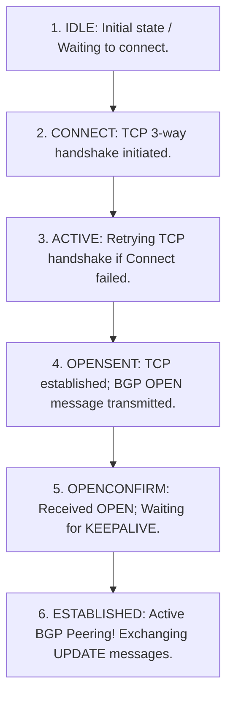
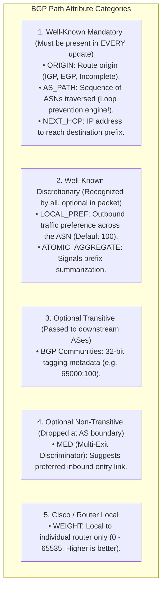
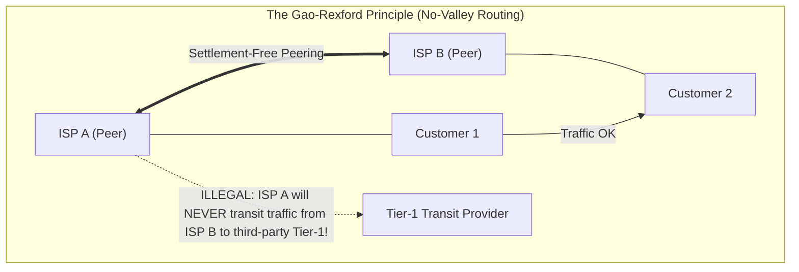
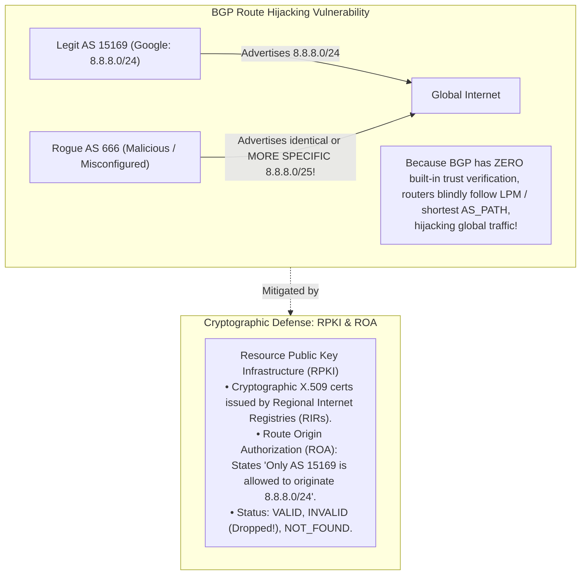

# Border Gateway Protocol (BGP), Autonomous Systems, and Path Selection

> [!abstract] Mental Model
> - **The Global Postal Treaty and Geopolitical Alliances**: The Internet is not a single monolithic network—it is an interconnected federation of over $75,000$ **Autonomous Systems (ASNs)** operated by hyperscalers (Google, Meta, AWS), Tier-1 transit carriers (Lumen, NTT), and regional ISPs.
> - **BGP-4 (RFC 4271)** is the protocol holding the global internet together. It does not search for the shortest physical cable; it enforces **commercial contractual agreements (Customer-Provider Transit vs Settlement-Free Peering)** using a customizable 13-step path attribute selection policy.

---

## 1. Autonomous Systems (ASNs) & BGP Peering Topology

An **Autonomous System (AS)** is a collection of IP networks under unified administrative control and technical routing policy:

```mermaid
flowchart TD
    subgraph AS100 ["AS 100: Tier-1 Global Transit Carrier"]
        R1["eBGP Border Router"] --- R2["iBGP Core Router"]
    end

    subgraph AS200 ["AS 200: Hyperscaler Cloud Provider"]
        R3["eBGP Border Router"]
    end

    subgraph AS300 ["AS 300: Enterprise Regional Customer"]
        R4["eBGP Border Router"]
    end

    R1 <==>|eBGP Peering (TCP 179)<br/>TTL = 1| R3
    R1 <==>|eBGP Transit Link (Paid)| R4
```

---

### eBGP vs iBGP Architecture:

| Dimension | eBGP (External BGP) | iBGP (Internal BGP) |
| :--- | :--- | :--- |
| **Peering Scope** | Between **Different ASNs** (AS 100 $\leftrightarrow$ AS 200) | Inside the **Same ASN** (AS 100 $\leftrightarrow$ AS 100) |
| **Default IP TTL** | `TTL = 1` (Requires directly connected link) | `TTL = 255` (Multi-hop across internal IGP) |
| **AS_PATH Modification**| **Prepends local ASN** to the path vector | **Does NOT modify `AS_PATH`** |
| **NEXT_HOP Modification**| Rewrites `NEXT_HOP` to local interface IP | **Preserves external `NEXT_HOP`** (Requires `next-hop-self`) |
| **Split Horizon Rule** | Advertises all best paths | **Never advertises an iBGP route to another iBGP peer** *(Requires Full Mesh or Route Reflectors!)* |

---

## 2. BGP Connection Lifecycle & Message Formats

BGP operates over **TCP Port 179** (eliminating need for custom fragmentation, retransmission, or sequencing):



### The 4 BGP Message Types:
1. **`OPEN`**: Negotiates BGP version (`4`), local ASN, Hold Time (default $180\text{s}$), and BGP Capabilities (IPv4, IPv6, BGP-EVPN).
2. **`UPDATE`**: Advertises new reachable IP prefixes (**NLRI - Network Layer Reachability Information**) with Path Attributes, or withdraws dead prefixes.
3. **`KEEPALIVE`**: Periodic heartbeat (default $60\text{s}$) to maintain session alive.
4. **`NOTIFICATION`**: Fatal error signaling (bad ASN, timeout, unparseable attribute); immediately terminates TCP session.

---

## 3. BGP Path Attributes Taxonomy



---

## 4. The 13-Step BGP Best-Path Decision Process

When a BGP router receives multiple paths to the exact same prefix, it evaluates them sequentially:

```
 1. Highest WEIGHT (Local to router - Cisco proprietary).
 2. Highest LOCAL_PREF (Global across entire Autonomous System).
 3. Prefer Locally Originated routes (via network/redistribute over BGP learned).
 4. Shortest AS_PATH length (Can be influenced via AS-Path Prepending).
 5. Lowest ORIGIN code (IGP < EGP < Incomplete).
 6. Lowest MED (Multi-Exit Discriminator - evaluated between routes from same neighbor AS).
 7. Prefer eBGP routes over iBGP routes.
 8. Lowest IGP metric cost to the BGP NEXT_HOP router.
 9. Prefer existing oldest route (Route Flap Damping stability).
10. Lowest BGP Router ID (RID) of the advertising neighbor.
11. Shortest Cluster List length (For BGP Route Reflector topologies).
12. Lowest neighbor IP address.
```

---

## 5. Commercial Peering Economics: Gao-Rexford Model

Global internet routing is governed by two business contract models:
1. **Customer-Provider (Transit)**: Customer pays Provider for access to the entire global internet table.
2. **Settlement-Free Peering**: Two networks of comparable size exchange traffic destined *only for each other's customers* for $\$0$ at an **Internet Exchange Point (IXP)**.



---

## 6. BGP Security: Hijacking, Leaks, and RPKI ROA



---

## Production Diagnostics & BGP Verification

```bash
# 1. Access FRRouting CLI Shell:
sudo vtysh

# 2. Inspect BGP Summary Table (Peering State & Prefixes Received):
show ip bgp summary

# Output:
# Neighbor        V  AS       MsgRcvd MsgSent  InQ OutQ  Up/Down  State/PfxRcd
# 198.51.100.1    4  65001      14205   14210    0    0 04:12:35       892410
# 198.51.100.2    4  65002       4510    4512    0    0 01:20:10           12

# 3. Inspect Specific BGP Route with Full Path Attributes:
show ip bgp 8.8.8.0/24

# Output:
# BGP routing table entry for 8.8.8.0/24
# Paths: (2 available, best #1, table default)
#   15169
#     198.51.100.1 from 198.51.100.1 (198.51.100.1)
#       Origin IGP, metric 0, localpref 100, weight 0, valid, external, best (AS Path)
#       Community: 65001:100 65001:200

# 4. Clear BGP Session with Soft Reconfiguration (Without dropping TCP session):
clear ip bgp * soft in
```

---

## Active Recall & Interview Perspective

### Reasoning Prompts
1. *Why does BGP run over TCP (Port 179) while OSPF runs directly over IP (Protocol 89) and RIP runs over UDP (Port 520)?*
   - **Answer**: OSPF and RIP operate within localized single-area enterprise networks, relying on direct link multicasts (`224.0.0.5` or UDP broadcast) and managing their own simple acknowledgment timers. In contrast, BGP manages the entire global internet routing table ($> 1,000,000$ prefixes). Transferring hundreds of megabytes of routing data across multi-hop transit backbones requires guaranteed, reliable, ordered byte streams with window flow control and congestion avoidance. Running over **TCP Port 179** delegates all retransmission, fragmentation, and session reliability directly to the mature TCP stack, allowing BGP to focus entirely on path attribute computation and policy enforcement.
2. *How does the Gao-Rexford model of "No-Valley Routing" prevent an ISP from inadvertently becoming a free transit provider for its competitors?*
   - **Answer**: Under the Gao-Rexford model, commercial routing policies dictate that an ISP only earns revenue when traffic originates from or terminates at its paying **Customers**. When an ISP receives an update for a route learned from a **Peer** (settlement-free) or a **Provider** (paid transit), the ISP's export policy **strictly forbids re-advertising that route to other Peers or Providers**. The ISP *only* advertises peer/provider routes to its paying customers, and only advertises customer routes to its peers/providers. This ensures that an ISP never carries transit traffic across its backbone for which it does not get paid.
3. *What is a BGP Route Leak vs a BGP Route Hijack, and how does RPKI Route Origin Authorization (ROA) prevent them?*
   - **Answer**: A **BGP Route Hijack** occurs when an unauthorized AS illegitimately originates an IP prefix it does not own (e.g. announcing `8.8.8.0/24` with its own ASN as origin), diverting global traffic to the attacker. A **BGP Route Leak** is a policy misconfiguration where an AS takes routes learned from one transit provider and mistakenly advertises them to another transit provider, creating an unintended, congested transit valley. **RPKI (Resource Public Key Infrastructure)** neutralizes hijacks using **Route Origin Authorizations (ROAs)**: cryptographically signed certificates registered with RIRs (ARIN, RIPE) explicitly defining which ASN is authorized to originate a given IP prefix and maximum prefix length. If an unauthorized AS originates the prefix, border routers mark the BGP update as **`Invalid`** and drop it immediately.

---

## Key Takeaways
- **BGP-4** runs on **TCP Port 179**; connects $> 75,000$ Autonomous Systems.
- **`AS_PATH`** provides loop prevention; **`LOCAL_PREF`** controls outbound exit routing.
- **13-Step Best Path Process** chooses routes; **RPKI ROA** defends against global BGP hijacking.

---

## Related Notes
- [[Computer Networks MOC]] — Master table of contents for Computer Networks.
- [[Network Layer - Packet Forwarding vs Routing]] — RIB to FIB compilation.
- [[Routing Algorithms - Distance Vector vs Link State vs Path Vector]] — Path Vector fundamentals.
- [[Open Shortest Path First - OSPF and Link State Advertisements]] — IGP interior companion to BGP.
- [[Multiprotocol Label Switching - MPLS]] — MP-BGP integration.
- [[Dynamic Routing of Web Traffic - Anycast, CDN Architecture, Edge Computing]] — BGP Anycast architecture.
