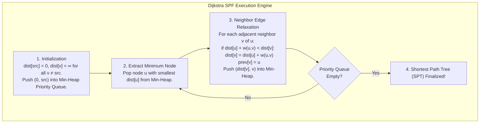
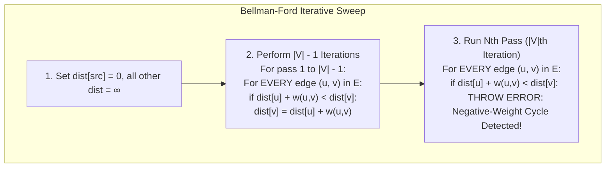

# Dijkstra's Shortest Path and Bellman-Ford Algorithms

> [!abstract] Mental Model
> - **Dijkstra's Algorithm (The Greedy Frontier Explorer - OSPF Engine)**: Maintains a tentative distance frontier, always finalizing the closest unvisited node via a **Min-Priority Queue**. Lightning-fast ($O((V+E)\log V)$), but strictly assumes non-negative edge costs.
> - **Bellman-Ford Algorithm (The Systematic Dynamic Programming Relaxer - RIP Engine)**: Performs $|V|-1$ exhaustive sweeps over all network links, iteratively propagating distance improvements. Slower ($O(V \cdot E)$), but naturally detects **negative-weight routing loops**.

---

## 1. Dijkstra's Algorithm (Link-State SPF)

Dijkstra computes the **Single-Source Shortest Path (SSSP)** on a directed weighted graph $G = (V, E)$ where all edge weights $w(u,v) \ge 0$.



---

### Step-by-Step Graph Relaxation Walkthrough

Given a 4-node network:
- Nodes: $S$ (Source), $A, B, D$ (Destination).
- Edges: $(S, A)=1$, $(S, B)=4$, $(A, B)=2$, $(A, D)=6$, $(B, D)=3$.

```
Iteration 0:
  PQ = [(0, S)]
  dist = {S: 0, A: ∞, B: ∞, D: ∞}

Iteration 1:
  Pop S (dist 0).
  Relax (S, A): dist[A] = 0 + 1 = 1.  PQ push (1, A)
  Relax (S, B): dist[B] = 0 + 4 = 4.  PQ push (4, B)

Iteration 2:
  Pop A (dist 1).
  Relax (A, B): dist[B] = min(4, 1 + 2) = 3.  PQ push (3, B)
  Relax (A, D): dist[D] = min(∞, 1 + 6) = 7.  PQ push (7, D)

Iteration 3:
  Pop B (dist 3).
  Relax (B, D): dist[D] = min(7, 3 + 3) = 6.  PQ push (6, D)

Iteration 4:
  Pop D (dist 6). Finalized!

Shortest Path: S -> A -> B -> D (Total Cost = 6)
```

---

### Complexity Breakdown:

| Data Structure | Extract-Min Cost | Decrease-Key Cost | Total Time Complexity |
| :--- | :---: | :---: | :--- |
| **Unordered Array** | $O(V)$ | $O(1)$ | $O(V^2)$ |
| **Binary Min-Heap** | $O(\log V)$ | $O(\log V)$ | $\mathbf{O((V + E) \log V)}$ *(Standard in OSPF)* |
| **Fibonacci Heap** | $O(\log V)$ | $O(1)$ amortized | $\mathbf{O(E + V \log V)}$ *(Theoretical Optimum)* |

---

## 2. Bellman-Ford Algorithm (Distance-Vector Engine)

Bellman-Ford solves SSSP using dynamic programming, supporting negative edge weights and discovering routing loops:



> **Why $|V|-1$ passes?** A simple shortest path in a graph with $|V|$ vertices can contain at most $|V|-1$ edges. Each pass of Bellman-Ford guarantees that paths of length $k$ edges are computed correctly.

---

## 3. Equal-Cost Multi-Path (ECMP) Extension

In production datacenter routing, Dijkstra is modified to support **ECMP**:

```python
# Modified Relaxation for ECMP:
if dist[u] + weight < dist[v]:
    dist[v] = dist[u] + weight
    next_hops[v] = next_hops[u]      # Overwrite with new optimal path
elif dist[u] + weight == dist[v]:
    next_hops[v].extend(next_hops[u]) # Append tied equal-cost next hop!
```
- When multiple equal-cost paths exist, hardware switches hash packet 5-tuples (`Src IP, Dst IP, Src Port, Dst Port, Proto`) across all candidate next-hops, multiplying available bandwidth without packet reordering.

---

## Complete Algorithmic Comparison

| Attribute | Dijkstra's Algorithm | Bellman-Ford Algorithm |
| :--- | :--- | :--- |
| **Algorithm Strategy** | Greedy with Priority Queue | Dynamic Programming Relaxation |
| **Time Complexity** | **$O((V + E) \log V)$** | **$O(V \cdot E)$** |
| **Space Complexity** | $O(V)$ | $O(V)$ |
| **Negative Weights** | **Fails / Invalid Output** | **Supported** |
| **Negative Cycles** | Cannot detect | **Explicitly Detects & Signals** |
| **Networking Protocol**| **OSPF, IS-IS (Link-State)** | **RIP, BGP internal metrics** |
| **Execution Model** | Centralized on complete LSDB | Distributed across neighbors |

---

## Production Python Implementation

```python
import heapq

def dijkstra_ecmp(graph: dict, source: str) -> tuple[dict, dict]:
    """
    Computes SSSP using Dijkstra with ECMP next-hop tracking.
    Graph format: { 'u': [('v', cost), ...] }
    """
    dist = {node: float('inf') for node in graph}
    dist[source] = 0
    next_hops = {node: [] for node in graph}
    pq = [(0, source)]

    while pq:
        d, u = heapq.heappop(pq)
        if d > dist[u]:
            continue

        for v, weight in graph[u]:
            new_dist = dist[u] + weight
            if new_dist < dist[v]:
                dist[v] = new_dist
                # First-hop calculation:
                next_hops[v] = [v] if u == source else list(next_hops[u])
                heapq.heappush(pq, (new_dist, v))
            elif new_dist == dist[v] and new_dist < float('inf'):
                # ECMP tie: merge next hops
                hops = [v] if u == source else next_hops[u]
                for h in hops:
                    if h not in next_hops[v]:
                        next_hops[v].append(h)

    return dist, next_hops
```

---

## Active Recall & Interview Perspective

### Reasoning Prompts
1. *Why does Dijkstra's algorithm fail when a graph contains negative-weight edges, whereas Bellman-Ford correctly handles them?*
   - **Answer**: Dijkstra relies on a **greedy invariant**: once a vertex $u$ is extracted from the Min-Priority Queue, its shortest distance `dist[u]` is assumed permanently finalized and will never be revisited. This assumption holds strictly if all edge weights are non-negative, because any alternative path through unvisited vertices would only add non-negative costs. If negative edge weights exist, a longer multi-hop path through an unvisited node could have a negative edge that reduces the total cost below `dist[u]`, violating Dijkstra's finality guarantee. **Bellman-Ford** avoids this by relaxing all $|E|$ edges $|V|-1$ times indiscriminately, allowing negative edge improvements to propagate through all possible path lengths.
2. *How does the Bellman-Ford algorithm detect the presence of a negative-weight cycle in a network?*
   - **Answer**: In a graph with $|V|$ vertices, the longest possible simple loop-free path consists of at most $|V|-1$ edges. After $|V|-1$ complete relaxation sweeps over all edges, every shortest path must have converged to its true minimum value. If the algorithm performs an $N^{\text{th}}$ iteration (iteration $|V|$) and discovers that any edge $(u,v)$ can *still* be relaxed (`dist[u] + w(u,v) < dist[v]`), it proves mathematically that a **negative-weight cycle exists**, which can be continuously traversed to reduce path cost to $-\infty$.
3. *What is Equal-Cost Multi-Path (ECMP) and how is Dijkstra's algorithm modified to support it in cloud datacenter switches?*
   - **Answer**: ECMP allows a router to split traffic evenly across multiple distinct shortest paths that share the exact same minimum cost metric, multiplying aggregate link bandwidth. In standard Dijkstra, when a neighboring node $v$ is relaxed and the new distance equals the existing tentative distance (`new_dist == dist[v]`), the tie is ignored. To support ECMP, the algorithm is modified so that when a tie occurs, the router does not overwrite the path but instead **appends the additional next-hop interface** to node $v$'s set of forwarding candidates. The hardware switch ASIC then uses a 5-tuple hash of incoming packet headers to distribute flows across all candidate egress ports.

---

## Key Takeaways
- **Dijkstra** is $O((V+E)\log V)$ greedy Link-State engine; requires $w(u,v) \ge 0$.
- **Bellman-Ford** is $O(V \cdot E)$ dynamic programming sweep ($|V|-1$ iterations); detects **negative cycles**.
- **ECMP** extends Dijkstra to balance flows across equal-cost ties.

---

## Related Notes
- [[Computer Networks MOC]] — Master table of contents for Computer Networks.
- [[Network Layer - Packet Forwarding vs Routing]] — Control plane path calculation.
- [[Routing Algorithms - Distance Vector vs Link State vs Path Vector]] — Architectural paradigms.
- [[Open Shortest Path First - OSPF and Link State Advertisements]] — Production Dijkstra implementation.
- [[Border Gateway Protocol - BGP, AS, BGP Peering, Path Attributes]] — Inter-AS path selection.
