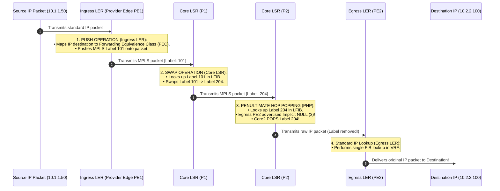
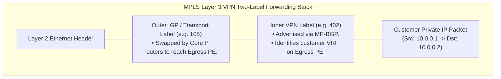
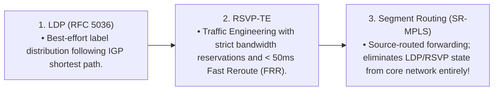

# Multiprotocol Label Switching (MPLS)

> [!abstract] Mental Model
> - **The Airline Baggage Barcode Tag**: In traditional IP routing, every intermediate router must open the luggage, read the passenger's full passport customs declaration (**32/128-bit IP address**), and perform an expensive Longest Prefix Match lookup in a massive routing table.
> - **MPLS ("Layer 2.5")**: The check-in desk attaches a small, fixed 4-byte **Barcode Label (Shim Header)** to the luggage. Transit conveyor belts (**Label Switch Routers**) never open the bag—they perform instant $O(1)$ hardware array lookups, **swapping labels** along a pre-programmed **Label Switched Path (LSP)** at line rate.

---

## 1. The 32-Bit MPLS Shim Header ("Layer 2.5")

Inserted between the Layer 2 Data Link frame header and the Layer 3 IP header:

```
[ Ethernet Header (L2) ] [ MPLS Label Stack Entry (4 Bytes) ] [ IP Header (L3) ] [ Payload ]
```

```
 0                   1                   2                   3
 0 1 2 3 4 5 6 7 8 9 0 1 2 3 4 5 6 7 8 9 0 1 2 3 4 5 6 7 8 9 0 1
+-+-+-+-+-+-+-+-+-+-+-+-+-+-+-+-+-+-+-+-+-+-+-+-+-+-+-+-+-+-+-+-+
|                Label (20 Bits)                | TC/EXP |S|TTL |
+-+-+-+-+-+-+-+-+-+-+-+-+-+-+-+-+-+-+-+-+-+-+-+-+-+-+-+-+-+-+-+-+
```

| Field Name | Bit Width | Technical Function |
| :--- | :---: | :--- |
| **Label** | **$20\text{ Bits}$** | Forwarding tag ($0 - 1,048,575$). Values $0-15$ are reserved (e.g. `3` = Implicit NULL for PHP). |
| **TC / EXP** | $3\text{ Bits}$ | **Traffic Class (formerly Experimental)**: Quality of Service (QoS) DiffServ mapping. |
| **S (Bottom of Stack)**| $1\text{ Bit}$ | **`1` = Bottom of label stack** (IP payload follows); **`0` = Outer tunnel label** in stacked MPLS. |
| **TTL** | $8\text{ Bits}$ | Time-to-Live copied from inner IP packet; decremented by 1 at each hop to prevent loops. |

---

## 2. Router Roles & The Three Label Operations



---

## 3. Penultimate Hop Popping (PHP - RFC 3031)

```mermaid
flowchart TD
    subgraph WithoutPHP ["Without PHP: Double Lookup Penalty at Egress PE"]
        P1["Core LSR P2"] -->|Sends MPLS [Label 204]| PE["Egress PE<br/>1. Must POP Label 204 in LFIB.<br/>2. Must perform SECOND Longest Prefix Match lookup in IP FIB!"]
    end

    subgraph WithPHP ["With PHP (Standard Production Practice)"]
        P2["Core LSR P2<br/>(Penultimate Hop)<br/>POPS label before transmitting!"] -->|Sends Raw IP (or Inner VPN Label)| PE2["Egress PE<br/>Performs ONLY A SINGLE LOOKUP!"]
    end
```
- The Egress PE advertises **Implicit NULL (Label 3)** to the Penultimate Hop via LDP/BGP, offloading CPU decapsulation overhead from the busy edge router.

---

## 4. MPLS Layer 3 VPNs (BGP/MPLS IP VPNs - RFC 4364)

Service providers interconnect enterprise corporate branches with overlapping private IP subnets (`10.0.0.0/8`) using **Virtual Routing and Forwarding (VRF)** and **Two-Label Stacks**:



### Key BGP/MPLS VPN Concepts:
- **VRF (Virtual Routing and Forwarding)**: A dedicated, isolated routing and forwarding table per customer on the PE router (OS-level routing virtualization).
- **Route Distinguisher (RD)**: An 8-byte prefix (e.g. `65001:10`) prepended to customer IPv4 routes, creating a globally unique **VPN-IPv4 address** ($12\text{ bytes}$) to allow overlapping subnets.
- **Route Target (RT)**: Extended BGP community attributes that control which VRF instances import and export routes.

---

## 5. Label Distribution Evolution: LDP $\to$ RSVP-TE $\to$ Segment Routing



---

## Production Diagnostics & Linux Kernel MPLS Inspection

```bash
# 1. Enable MPLS Subsystem in Linux Kernel:
sudo modprobe mpls_router mpls_iptunnel
sudo sysctl -w net.mpls.conf.eth0.input=1
sudo sysctl -w net.mpls.platform_labels=1048575

# 2. Add an MPLS Encapsulation Route in Linux:
sudo ip route add 10.100.0.0/16 encap mpls 200 via 192.168.1.2 dev eth0

# 3. Access FRRouting CLI to Inspect MPLS LFIB:
sudo vtysh
show mpls lfib

# Output:
# Inbound Label  Type  Outbound Label  Next Hop     Outbound Interface
# 101            LDP   204             10.0.0.2     eth1
# 102            LDP   Implicit-Null   10.0.0.3     eth2 (PHP Enabled)

# 4. Inspect VRF Instances on PE Router:
show ip vrf
# Name      Id    RD                  Interfaces
# RED_CORP  1     65001:10            eth3
# BLUE_CORP 2     65001:20            eth4
```

---

## Active Recall & Interview Perspective

### Reasoning Prompts
1. *Why does Penultimate Hop Popping (PHP) significantly increase router forwarding throughput on edge PE routers?*
   - **Answer**: Without PHP, when an MPLS packet reaches the egress Label Edge Router (PE), the router must perform two separate lookup operations: first, it inspects the outer MPLS label in its **LFIB (Label Forwarding Information Base)** to determine that the label must be popped; second, it inspects the inner IPv4 header to perform a full **Longest Prefix Match (LPM)** lookup in its IP routing table (or customer VRF). In high-throughput provider edge routers, this double-lookup creates a CPU/ASIC pipeline bottleneck. With **PHP**, the egress router advertises an **Implicit NULL (Label 3)** to the penultimate (second-to-last) router. The penultimate router strips the outer label before transmission, so the egress PE router receives a raw IP packet (or VPN-labeled packet) and only has to execute **a single lookup operation**.
2. *How do MPLS Layer 3 VPNs allow two competing enterprise customers to use the exact same overlapping private IP subnet (`10.0.0.0/24`) across a shared provider core without collision?*
   - **Answer**: MPLS L3VPNs (RFC 4364) achieve customer isolation through two technologies: **VRFs** and **Multiprotocol BGP (MP-BGP)**. On the Provider Edge (PE) router, each customer is assigned a dedicated **Virtual Routing and Forwarding (VRF)** table, keeping their routing instances completely segregated in memory. To advertise these routes across the shared backbone, MP-BGP attaches an 8-byte **Route Distinguisher (RD)** to the customer's 32-bit IPv4 prefix (e.g. `65001:100:10.0.0.0/24` for Customer A vs `65001:200:10.0.0.0/24` for Customer B), transforming them into globally unique **VPN-IPv4 prefixes ($96\text{ bits}$)** that can coexist in the provider's BGP table without collision.
3. *What is the fundamental difference between the outer transport label and the inner VPN label in an MPLS Layer 3 VPN packet?*
   - **Answer**: An MPLS L3VPN uses a **Two-Label Stack**:
     - The **Outer Label (IGP / Transport Label)**: Used by intermediate provider core (P) routers to switch the packet across the provider backbone from the Ingress PE to the Egress PE. P routers only inspect and swap this outer label, remaining completely oblivious to the customer's private IP or VPN identity.
     - The **Inner Label (VPN / Service Label)**: Advertised by the Egress PE to the Ingress PE via MP-BGP. It remains untouched throughout transit across the core. When the packet arrives at the Egress PE (after the outer label is popped via PHP), the Egress PE reads this inner label to determine **which specific customer VRF instance** and outgoing local CE interface the packet belongs to.

---

## Key Takeaways
- MPLS inserts a **4-Byte Shim Header** between Layer 2 and Layer 3.
- **Operations**: **PUSH** (Ingress LER), **SWAP** (Core LSR), **POP** (Egress LER / Penultimate Hop).
- **PHP (Implicit NULL Label 3)** eliminates double lookup at egress.
- **L3VPNs** use **VRFs, MP-BGP, and a Two-Label Stack** for multi-tenant isolation.

---

## Related Notes
- [[Computer Networks MOC]] — Master table of contents for Computer Networks.
- [[Encapsulation, De-encapsulation, and Protocol Data Units - PDUs]] — Layer 2.5 encapsulation.
- [[Network Layer - Packet Forwarding vs Routing]] — FIB vs LFIB lookups.
- [[Open Shortest Path First - OSPF and Link State Advertisements]] — IGP underlay for LDP.
- [[Border Gateway Protocol - BGP, AS, BGP Peering, Path Attributes]] — MP-BGP VPNv4 address families.
- [[Software-Defined Networking - SDN and OpenFlow]] — Modern Segment Routing and OpenFlow controllers.
