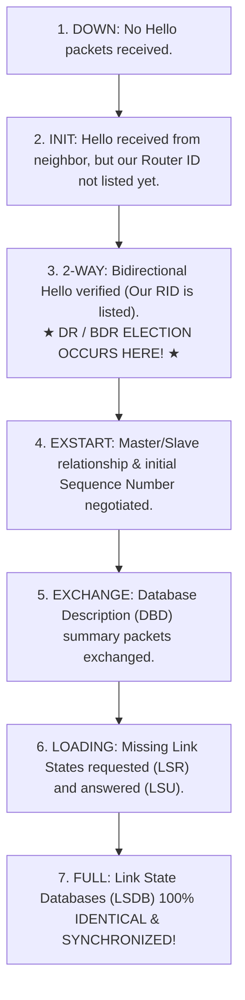
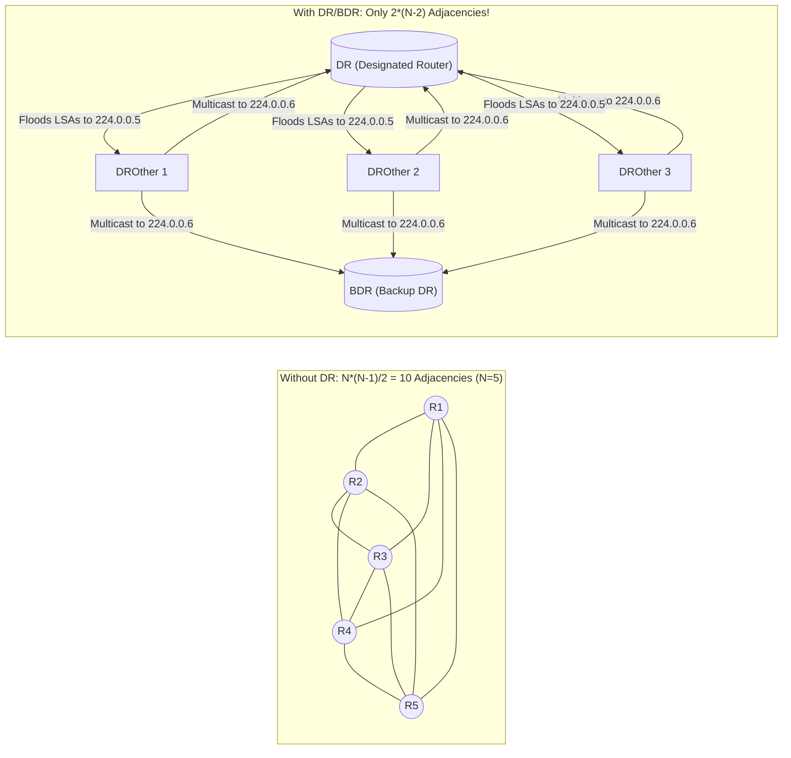
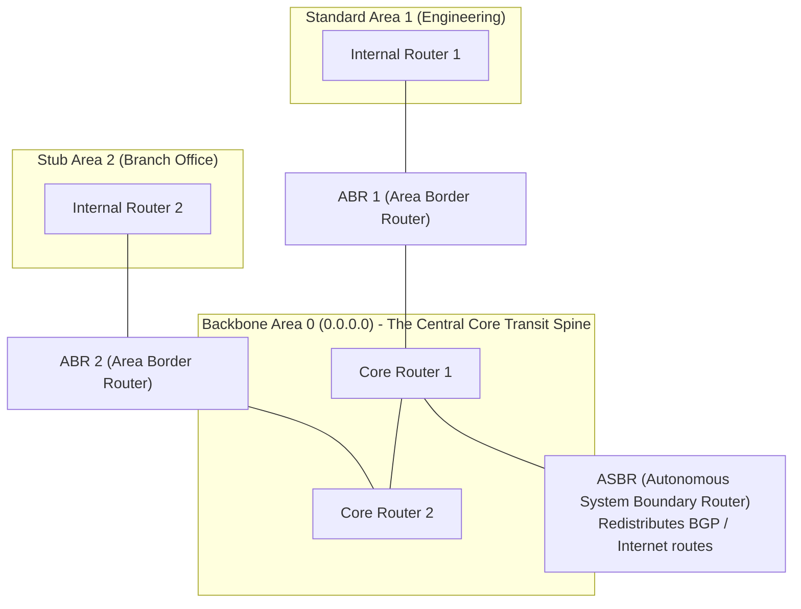

# Open Shortest Path First (OSPF) and Link State Advertisements

> [!abstract] Mental Model
> - **The Municipal Intelligence Network**: Instead of maintaining one massive flat global graph where a fluttering ethernet cable in Singapore forces CPU churn for routers in Frankfurt, OSPF partitions the enterprise into **Hierarchical Areas**.
> - All non-backbone areas connect to **Backbone Area 0**. Within each area, routers maintain an identical topographical map (**LSDB**) and elect a **Designated Router (DR)** to avoid an $O(N^2)$ explosion of mesh adjacencies.

---

## 1. OSPF Protocol Encapsulation & Multicast Addressing

OSPF operates directly on top of the IPv4 network layer (**IP Protocol `89`** - no TCP or UDP transport layer overhead!):

```
[ IP Header (Protocol 89) ] [ OSPF Header (24 Bytes) ] [ OSPF Message Payload (Hello / DBD / LSR / LSU / LSAck) ]
```

### Multicast Addresses:
- **`224.0.0.5` (`AllSPFRouters`)**: Monitored by all OSPF routers.
- **`224.0.0.6` (`AllDRouters`)**: Monitored exclusively by the **Designated Router (DR)** and **Backup Designated Router (BDR)**.

---

## 2. The 7-Step OSPF Neighbor Adjacency State Machine



---

## 3. Designated Router (DR) and Backup DR (BDR) Mechanics

On a multi-access broadcast network (Ethernet LAN) with $N$ routers, a full mesh would require $\frac{N(N-1)}{2}$ adjacencies and $O(N^2)$ LSA floods:



### DR / BDR Election Criteria:
1. **Highest Interface Priority** (`0` to `255`; `0` = *DROther* never eligible).
2. **Tie-Breaker: Highest Router ID (RID)** (Manually configured RID $\to$ Highest Loopback IP $\to$ Highest active physical IP).
3. **Non-Preemptive Invariant**: If a new router with higher priority joins an existing network with an active DR, **no preemption occurs** (maintains network stability).

---

## 4. OSPF Area Hierarchy & Router Taxonomy



---

## 5. The 5 Canonical LSA Types

| LSA Type | LSA Name | Generated By | Flooding Scope | Description |
| :---: | :--- | :--- | :--- | :--- |
| **Type 1** | **Router LSA** | Every Router | Local Area only | Describes the router's local links, states, and costs. |
| **Type 2** | **Network LSA** | **DR** only | Local Area only | Lists all routers connected to a multi-access broadcast segment. |
| **Type 3** | **Summary LSA** | **ABR** | Inter-Area (Floods across Area 0) | Summarizes internal prefixes from one area into other areas. |
| **Type 4** | **ASBR Summary LSA**| **ABR** | Inter-Area | Informs other areas how to reach an ASBR. |
| **Type 5** | **AS External LSA** | **ASBR** | **Entire OSPF Domain** | Advertises external routes redistributed from BGP or static routes. |

---

## 6. OSPF Cost Metric Formula

$$\mathbf{\text{Cost} = \frac{\text{Reference Bandwidth}}{\text{Interface Bandwidth}} = \frac{10^8 \text{ bps}}{\text{Interface bps}}}$$

> [!WARNING] Production Trap: Reference Bandwidth Saturation
> By default, the reference bandwidth is $100\text{ Mbps}$ ($10^8$). Under default settings, $100\text{ Mbps}$, $1\text{ Gbps}$, $10\text{ Gbps}$, and $100\text{ Gbps}$ interfaces all calculate to $\text{Cost} = 1$!
> **Production Fix**: Always configure:
> `auto-cost reference-bandwidth 100000` ($100\text{ Gbps}$) on all routers.

---

## Production Diagnostics & FRR CLI Verification

```bash
# 1. Access FRRouting CLI:
sudo vtysh

# 2. Inspect OSPF Neighbor Adjacency States (Verifying FULL / DR / BDR):
show ip ospf neighbor

# Output:
# Neighbor ID     Pri State           Dead Time Address         Interface
# 10.255.255.2      1 Full/DR          00:00:34 192.168.1.2     eth0:192.168.1.1
# 10.255.255.3      1 Full/BDR         00:00:38 192.168.1.3     eth0:192.168.1.1
# 10.255.255.4      0 2-Way/DROther    00:00:31 192.168.1.4     eth0:192.168.1.1

# 3. Inspect the Synchronized Link-State Database (LSDB):
show ip ospf database

# 4. Live Packet Capture of OSPF Hello/LSU Packets (Protocol 89):
sudo tcpdump -i eth0 -nn -vv "proto 89"
```

---

## Active Recall & Interview Perspective

### Reasoning Prompts
1. *Why does OSPF require all non-backbone areas to connect directly to Backbone Area 0?*
   - **Answer**: OSPF uses a two-level area hierarchy to prevent inter-area routing loops. Between areas, OSPF behaves essentially like a Distance Vector protocol: Area Border Routers (ABRs) generate **Type 3 Summary LSAs** advertising reachable prefixes without including internal topology details. To prevent routing loops between areas (such as Area 1 advertising a route to Area 2, which then advertises it back to Area 1), OSPF enforces a strict **hub-and-spoke topology**: all inter-area traffic must traverse **Backbone Area 0**. An ABR will never accept or forward a Type 3 LSA learned from a non-backbone area back into Area 0.
2. *Why are OSPF DR and BDR elections non-preemptive when a higher-priority router joins an active broadcast network?*
   - **Answer**: In OSPF, establishing full neighbor adjacencies across a multi-access network requires exchanging Database Description (DBD) packets and running Dijkstra's Shortest Path First (SPF) algorithm on every router. If DR election were preemptive, whenever a core router rebooted or an engineer plugged in a router with higher priority, the DR role would instantly switch, tearing down existing neighbor adjacencies across all routers in the subnet and triggering mass SPF recalculations (**network flapping**). Making the election non-preemptive ensures that once a DR/BDR pair is active, they retain their roles until they fail or their OSPF process is manually restarted.
3. *What is the difference between an OSPF Stub Area and a Not-So-Stubby Area (NSSA)?*
   - **Answer**: A standard **Stub Area** prevents external routing bloat by blocking **Type 4 (ASBR Summary) and Type 5 (AS External) LSAs** from entering the area, replacing them with a single default route injected by the ABR. However, a pure Stub Area forbids placing an ASBR inside the area (it cannot redistribute external routes). A **Not-So-Stubby Area (NSSA - RFC 3101)** solves this by allowing an ASBR to exist inside the stub area. The ASBR generates a special **Type 7 NSSA External LSA**, which is flooded strictly within the local NSSA. When the Type 7 LSA reaches the ABR, the ABR translates it into a standard **Type 5 External LSA** before flooding it across Backbone Area 0 and the rest of the enterprise.

---

## Key Takeaways
- OSPF runs on **IP Protocol `89`**; multicasts to `224.0.0.5` and `224.0.0.6`.
- **DR / BDR election** at **2-Way state** eliminates $O(N^2)$ adjacency scaling bottlenecks.
- **Area 0 Backbone** prevents inter-area routing loops; **LSAs 1 to 5** manage topological data.

---

## Related Notes
- [[Computer Networks MOC]] — Master table of contents for Computer Networks.
- [[Network Layer - Packet Forwarding vs Routing]] — RIB generation.
- [[Routing Algorithms - Distance Vector vs Link State vs Path Vector]] — Link-state vs distance-vector.
- [[Dijkstra's Shortest Path and Bellman-Ford Algorithms]] — Dijkstra SPF algorithm.
- [[Border Gateway Protocol - BGP, AS, BGP Peering, Path Attributes]] — Inter-AS exterior routing.
- [[Multiprotocol Label Switching - MPLS]] — OSPF Traffic Engineering extensions.
