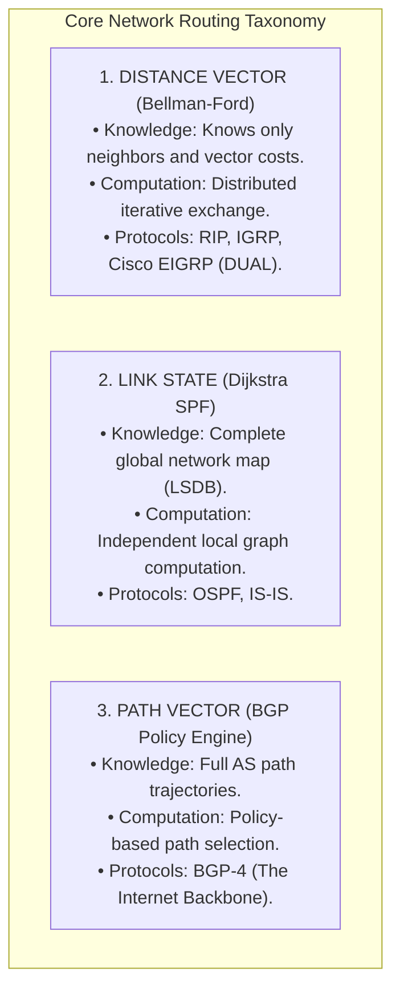
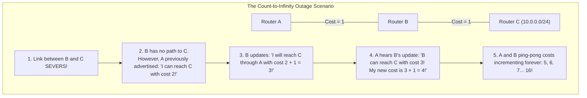
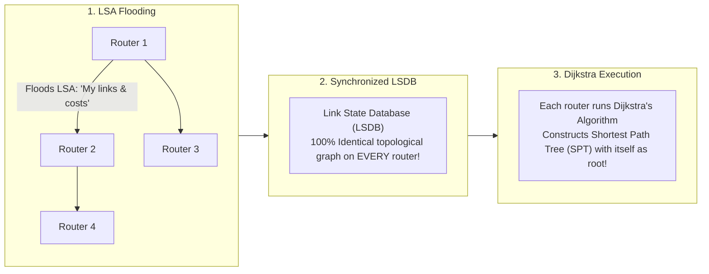

# Routing Algorithms: Distance Vector vs Link State vs Path Vector

> [!abstract] Mental Model
> How do nodes navigate across an unknown global topology?
> - **Distance Vector ("Rumor Routing / Road Signs")**: You stand at a crossroads and only read signs updated by immediate neighboring towns: *"Town X is 40 miles down Road A"*. You don't have a map of the continent; you trust your neighbors' math (**Bellman-Ford**).
> - **Link State ("Global GPS Satellite Map")**: Every router broadcasts its local road conditions to all routers in the area. Every router constructs an **identical, complete topological graph** of the entire network and independently computes the shortest path tree (**Dijkstra**).
> - **Path Vector ("Diplomatic Passport Stamps")**: When routing across sovereign nations (**Autonomous Systems**), physical distance is meaningless. Routers transmit the complete list of countries traversed (`AS 100 -> AS 200 -> AS 300`). If a router sees its own country on the list, it discards the route, providing absolute loop immunity and geopolitical policy control (**BGP**).

---

## The Three Fundamental Routing Paradigms



---

## 1. Distance Vector Routing & The Count-to-Infinity Flaw

Distance Vector algorithms solve the **Bellman-Ford Equation**:
$$D_x(y) = \min_v \left\{ c(x,v) + D_v(y) \right\}$$
*(Where $c(x,v)$ is the cost to neighbor $v$, and $D_v(y)$ is neighbor $v$'s reported cost to destination $y$).*



---

### Mitigating Distance Vector Loops:
1. **Defining Infinity ($\text{Metric} = 16$)**: Caps counting loop at 16 hops (RIP limits networks to 15 hops maximum).
2. **Split Horizon**: A router never advertises a route back out the same physical interface from which it learned it.
3. **Split Horizon with Poison Reverse**: If Router A learns a route from Router B, Router A advertises the route back to B with **Metric $=\infty$ (Poisoned)** to prevent mutual loops.
4. **Hold-Down Timers**: When a route fails, ignore all updates with equal or worse metrics for a stabilizing period (e.g. 180 seconds).

---

## 2. Link State Routing (Dijkstra Shortest Path First)

In Link State routing (OSPF / IS-IS), routers don't exchange routing tables; they flood raw **Link State Advertisements (LSAs)**:



- **Strengths**: Sub-second convergence, complete loop immunity, scales to tens of thousands of subnets via hierarchical **Areas (Area 0)**.
- **Costs**: Higher memory footprint ($O(V+E)$ LSDB) and CPU processing ($O(E + V \log V)$).

---

## 3. Path Vector Routing (Border Gateway Protocol)

When interconnecting thousands of competing Internet Service Providers (ISPs), routing is governed by **commercial policy and contract agreements (Transit vs Peering)** rather than lowest mathematical hop count:

```mermaid
flowchart LR
    AS100["AS 100 (Origin: 8.8.8.0/24)"] 
    -->|Advertises AS_PATH: [100]| AS200["AS 200 (Transit ISP)"]
    -->|Prepends ASN: [200, 100]| AS300["AS 300 (Regional ISP)"]
    -->|Prepends ASN: [300, 200, 100]| AS400["AS 400 (Target Enterprise)"]
```

> [!IMPORTANT] Invariant: Path Vector Loop Prevention
> If **AS 200** receives an update containing `AS_PATH: [300, 200, 100]`, it sees **its own ASN (200)** in the path vector list and **immediately drops the advertisement**. This guarantees $100\%$ loop prevention across arbitrary internet graph meshing without requiring global link synchronization!

---

## Architectural Comparison Matrix

| Dimension | Distance Vector (RIP, EIGRP) | Link State (OSPF, IS-IS) | Path Vector (BGP) |
| :--- | :--- | :--- | :--- |
| **Mathematical Engine** | **Bellman-Ford** | **Dijkstra SPF** | **Path Vector Policy Engine** |
| **Topology View** | Only immediate neighbors | **Complete global network map** | AS-level hop trajectory |
| **Update Mechanism** | Periodic / triggered routing tables | Event-triggered LSA flooding | Incremental BGP path updates |
| **Convergence Speed** | Slow (Minutes) | **Fast (Sub-second)** | Moderate (Configurable dampening) |
| **Loop Prevention** | Split Horizon, Poison Reverse | Loop-free SPF tree computation | **Explicit AS_PATH matching** |
| **Network Scope** | Small LANs / Small branch offices | **Enterprise intranets / Datacenters** | **The Global Internet Backbone** |

---

## Production Diagnostics & Routing Engine Inspection

```bash
# 1. Inspect Master Linux Routing Table & Protocol Origins:
ip route show

# Output:
# default via 192.168.1.1 dev eth0 proto dhcp metric 100
# 10.10.0.0/16 via 192.168.1.254 dev eth0 proto ospf metric 20
# 172.16.0.0/12 via 192.168.1.253 dev eth0 proto bgp metric 100

# 2. Access FRR (Free Range Routing) Routing Engine Shell:
sudo vtysh

# 3. Inside FRR Shell - Inspect OSPF Link-State Database (LSDB):
show ip ospf database

# 4. Inside FRR Shell - Inspect BGP Path Vector Table:
show ip bgp
#    Network          Next Hop            Metric LocPrf Weight Path
# *> 8.8.8.0/24       198.51.100.1             0    100      0 15169 i
```

---

## Active Recall & Interview Perspective

### Reasoning Prompts
1. *Why does the "Count-to-Infinity" problem occur in Distance Vector routing protocols, and how does Poison Reverse mitigate it?*
   - **Answer**: Distance Vector protocols operate on second-hand information ("routing by rumor"). When a link between Router B and destination network C fails, Router B invalidates its direct route. However, if Router A had previously advertised that it could reach C (via B), Router B may mistakenly assume A has an independent alternate route to C. B updates its cost to reach C through A ($c + 1$), and advertises this new cost back to A. A updates its cost to ($c + 2$), and both routers continually increment their metrics toward infinity. **Poison Reverse** breaks this cycle: whenever Router A routes to destination C via Router B, A advertises the route back to B with a cost of **Infinity ($\text{Metric} = 16$)**, ensuring B never attempts to use A to reach the broken link.
2. *Why do Link State protocols scale to far larger enterprise networks than Distance Vector protocols, despite requiring more CPU memory?*
   - **Answer**: Distance Vector protocols flood entire routing tables periodically, which consumes excessive bandwidth and converges slowly as network size grows, risking routing loops. In contrast, **Link State protocols (OSPF)** only flood small, localized **Link State Advertisements (LSAs)** upon link state changes. Furthermore, Link State architectures support **hierarchical sub-division (OSPF Areas)**, where detailed link-state topology is contained within local areas and summarized into Area 0 (Backbone), preventing routers in one area from needing the full graph details of another area.
3. *Why is BGP designed as a Path Vector protocol rather than a Link State protocol for the global Internet?*
   - **Answer**: The global internet comprises over $75,000$ independent commercial Autonomous Systems (ASNs) with over $1,000,000$ BGP routes. A Link State protocol would require every single router on Earth to maintain an identical, synchronized database of every fiber link in the world, causing router memory and CPU collapse whenever a single cable fluttered. Furthermore, Link State algorithms optimize strictly for physical shortest path, whereas internet transit is dictated by **business agreements and peering policies** (e.g. AS A refuses to carry transit traffic for rival AS B). **Path Vector (BGP)** allows each AS to apply autonomous local routing policies while enforcing loop-free forwarding via the explicit **`AS_PATH` attribute**.

---

## Key Takeaways
- **Distance Vector (Bellman-Ford)** routes by rumor; vulnerable to **Count-to-Infinity**.
- **Link State (Dijkstra)** synchronizes an identical **LSDB** and computes an independent SPF tree.
- **Path Vector (BGP)** uses **`AS_PATH`** for loop elimination and policy-driven global internet routing.

---

## Related Notes
- [[Computer Networks MOC]] — Master table of contents for Computer Networks.
- [[Network Layer - Packet Forwarding vs Routing]] — RIB to FIB compilation.
- [[IPv4 Addressing - Classful, Classless, CIDR, and Subnetting]] — Prefix aggregation.
- [[Dijkstra's Shortest Path and Bellman-Ford Algorithms]] — Algorithmic foundations.
- [[Open Shortest Path First - OSPF and Link State Advertisements]] — Enterprise Link State routing.
- [[Border Gateway Protocol - BGP, AS, BGP Peering, Path Attributes]] — Global Path Vector routing.
