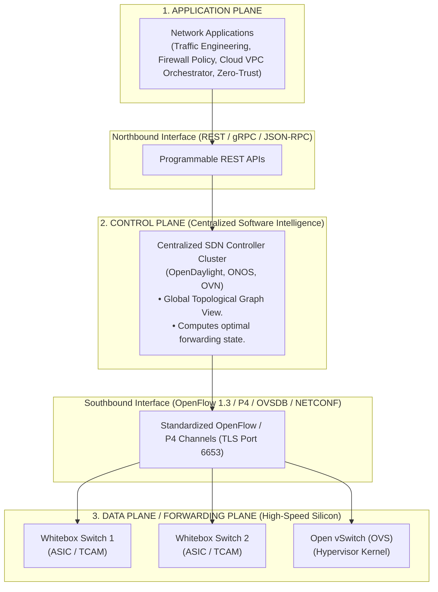
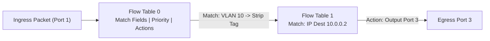
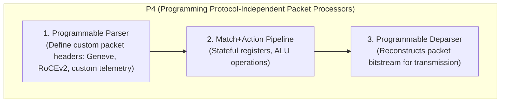
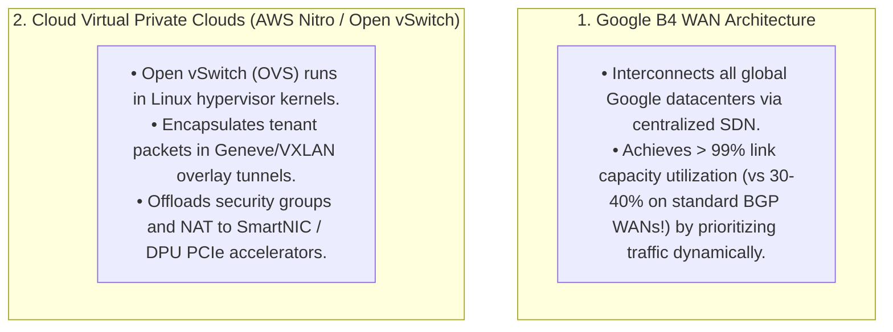

# Software-Defined Networking (SDN) and OpenFlow

> [!abstract] Mental Model
> - **The Disaggregation of the Black Box**: Traditional networking resembles proprietary mainframe computing: Cisco/Juniper switches permanently weld control plane software and silicon ASIC hardware into a single expensive appliance.
> - **SDN ("The Android OS of Networking")**: Breaks the box wide open. The **Control Plane (The Brain)** is centralized into a programmable software controller running on commodity Linux servers, while inexpensive "Whitebox" switches execute pure, hardware-accelerated **Match-Action forwarding pipelines** via standardized APIs (**OpenFlow / P4**).

---

## 1. The Three-Tier SDN Architectural Model (RFC 7426)



---

## 2. OpenFlow Protocol & The Match-Action Pipeline

An OpenFlow switch maintains a pipeline of sequenced **Flow Tables** ($0 \dots N$):



---

### Anatomy of an OpenFlow Flow Entry:

```
+---------------------------------------------------------------------------------------+
|  Match Fields  |  Priority  |  Counters  |  Instructions / Actions  |  Timeouts / Cookie|
+---------------------------------------------------------------------------------------+
```

| Flow Component | Technical Function & Bitfields |
| :--- | :--- |
| **Match Fields** | Ingress Port, Ethernet MACs, EtherType, VLAN ID, IPv4/IPv6 IPs, TCP/UDP Ports. |
| **Priority** | Evaluated from highest to lowest; first matching rule executes. |
| **Counters** | Packet count, byte count, flow duration (for telemetry and billing). |
| **Actions** | • `OUTPUT <port>` (Forward packet)<br/>• `DROP` (Discard packet)<br/>• `SET_FIELD` (Modify MAC/IP/Port headers)<br/>• `PUSH_VLAN / POP_VLAN`<br/>• `GOTO_TABLE <id>` (Pipeline execution) |

---

## 3. Reactive vs Proactive Flow Programming

```mermaid
sequenceDiagram
    autonumber
    participant Switch as OpenFlow Switch (Data Plane)
    participant Ctrl as SDN Controller (Control Plane)

    alt 1. Proactive Programming (Pre-populated - High Performance)
        Note over Ctrl,Switch: Controller pre-computes paths & pushes Flow-Mod rules into TCAM ahead of time.<br/>Zero packet latency; switches forward at 100Gbps line rate!
    else 2. Reactive Programming (On-Demand / First Packet Penalty)
        Note over Switch: Ingress Packet arrives; NO MATCH in Flow Table!
        Switch->>Ctrl: PACKET_IN Message (Buffering packet & sending headers to Controller)
        Note over Ctrl: Controller computes shortest path & policy.
        Ctrl->>Switch: FLOW_MOD (Installs new matching rule into Switch TCAM)
        Ctrl->>Switch: PACKET_OUT (Instructs switch to forward original buffered packet)
        Note over Switch: Subsequent packets in flow match TCAM rule directly in hardware!
    end
```

---

## 4. Beyond OpenFlow: P4 Programmable Data Planes

OpenFlow was limited because its match fields were **hardcoded to legacy protocols (Ethernet, IPv4, TCP)**.


- **Silicon Execution**: P4 compiles directly to hardware microcode on **Intel Tofino ASICs**, running custom protocols at **$12.8\text{ Terabits/sec}$**.

---

## 5. Hyperscaler Production Deployments



---

## Production Diagnostics & Open vSwitch (OVS) Management

```bash
# 1. Inspect Open vSwitch Bridge Configuration:
sudo ovs-vsctl show

# Output:
# Bridge br-int
#     Port br-int
#         Interface br-int
#             type: internal
#     Port patch-tun
#         Interface patch-tun
#             type: patch
#             options: {peer=patch-int}

# 2. Dump Active OpenFlow Match-Action Rules from Data Plane:
sudo ovs-ofctl dump-flows br-int -O OpenFlow13

# Output:
# cookie=0x0, duration=42.10s, table=0, n_packets=14205, n_bytes=1840291, priority=100,in_port=1,dl_type=0x0800,nw_dst=10.0.0.2 actions=output:2
# cookie=0x0, duration=42.10s, table=0, n_packets=0, n_bytes=0, priority=0 actions=drop

# 3. Manually Inject an OpenFlow Flow-Mod Rule:
sudo ovs-ofctl add-flow br-int -O OpenFlow13 "priority=200,ip,nw_dst=192.168.1.100,actions=mod_dl_dst:00:11:22:33:44:55,output:3"
```

---

## Active Recall & Interview Perspective

### Reasoning Prompts
1. *What is the fundamental architectural motivation for separating the Control Plane from the Data Plane in Software-Defined Networking?*
   - **Answer**: In traditional distributed networking, every switch independently computes routing decisions using localized protocol algorithms (OSPF, BGP). Because no single node has a global, real-time view of traffic matrix demands, networks must be significantly over-provisioned to prevent congestion (operating at only $30\text{ - }40\%$ utilization), and implementing new network features requires waiting years for IEEE standardization and vendor firmware upgrades. By **centralizing the Control Plane into software**, operators gain a global view of the entire topology, enabling fine-grained centralized traffic engineering (e.g. Google B4 achieving $> 95\%$ link utilization), programmatic API-driven provisioning of multi-tenant cloud VPCs in seconds, and vendor-agnostic hardware procurement of inexpensive "whitebox" switches.
2. *What is the difference between Reactive and Proactive flow entry installation in OpenFlow, and why do cloud datacenters avoid Reactive mode?*
   - **Answer**: In **Proactive mode**, the SDN controller calculates all forwarding paths in advance and pre-populates flow entries into switch TCAM tables before traffic arrives. In **Reactive mode**, when the first packet of a new flow arrives, the switch finds no matching rule, buffers the packet, and emits an OpenFlow **`Packet-In`** message across the network to the central controller. The controller computes the path and returns a **`Flow-Mod`** instruction to install the rule in the switch. Datacenters avoid reactive mode because the round-trip control channel latency ($1\text{ - }10\text{ ms}$) adds severe first-packet jitter, and a burst of thousands of new flows can completely overwhelm the SDN controller's CPU (**Controller DoS**).
3. *Why did the networking industry evolve from OpenFlow to P4 (Programming Protocol-Independent Packet Processors)?*
   - **Answer**: OpenFlow was constrained by a fixed, hardcoded schema of known protocol header fields (Ethernet, IPv4, TCP, UDP). Whenever the industry invented a new encapsulation header (such as VXLAN, Geneve, or SRv6), OpenFlow switches could not parse or match on those fields without waiting for new OpenFlow specification releases and new fixed-function ASIC silicon tape-outs. **P4** revolutionized the data plane by making packet parsing **fully programmable in software**. A network engineer writes a P4 program defining arbitrary header formats and pipeline match-action logic, which is then compiled directly onto programmable switching silicon (such as Intel Tofino ASICs) without needing new hardware.

---

## Key Takeaways
- SDN centralizes the **Control Plane** (software) and disaggregates the **Data Plane** (Whitebox hardware).
- **OpenFlow** uses **Match-Action tables** ($0 \dots N$); **P4** enables custom protocol parsing in silicon.
- Centralized SDN enables **cloud multi-tenancy (VPCs)** and **hyper-efficient WAN traffic engineering (Google B4)**.

---

## Related Notes
- [[Computer Networks MOC]] — Master table of contents for Computer Networks.
- [[Network Layer - Packet Forwarding vs Routing]] — Control plane vs data plane decoupling.
- [[Switches and VLANs - 802.1Q, Trunking, Spanning Tree Protocol STP]] — Virtualization of L2 fabrics.
- [[Multiprotocol Label Switching - MPLS]] — Segment Routing comparison.
- [[Border Gateway Protocol - BGP, AS, BGP Peering, Path Attributes]] — Centralized controller vs distributed BGP.
- [[Containers vs Virtual Machines]] — Network virtualization in Kubernetes CNI / OVN.
