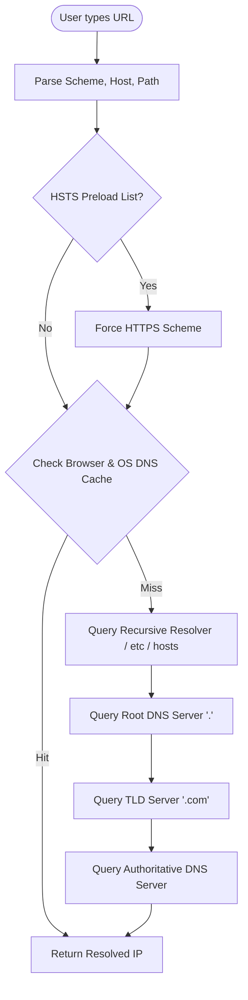
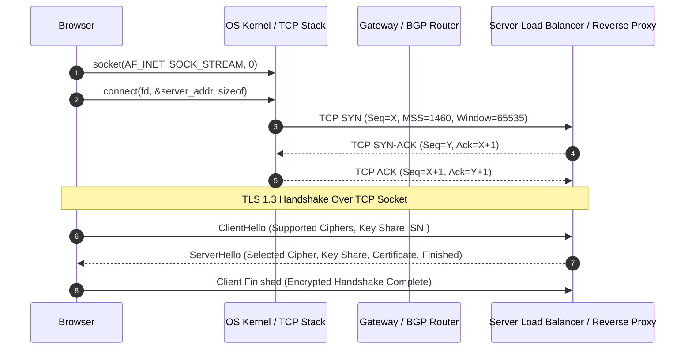
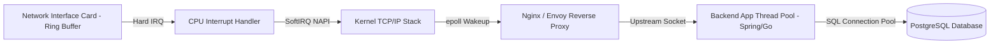

# What Happens When You Type a URL

> [!abstract] Mental Model
> Typing a URL (e.g., `https://example.com/api/v1/resource`) into a browser bar triggers an end-to-end execution cascade spanning user interface parsing, operating system socket calls, DNS resolution hierarchies, Layer 3/4 network routing, Layer 7 TLS security handshakes, reverse proxy routing, kernel event-driven I/O (`epoll`), thread pool scheduling, and database transaction commits. It is the ultimate capstone synthesis of modern computer science.

---

## 1. Phase 1: Browser Input Parsing & DNS Resolution

When the user hits `Enter`, the browser parses the scheme (`https`), hostname (`example.com`), port (`443`), and request path (`/api/v1/resource`).



### DNS Lookup Resolution Hierarchy
1. **Local Caches**: Browser DNS cache $\rightarrow$ OS resolver cache (`nscd`, `systemd-resolved`) $\rightarrow$ local `/etc/hosts` file.
2. **Recursive Resolver**: ISP or public resolver (`1.1.1.1`, `8.8.8.8`) processes the query over UDP port 53.
3. **Iterative Traversal**: Recursive resolver queries Root (`.`) $\rightarrow$ TLD (`.com`) $\rightarrow$ Authoritative DNS (`example.com`), returning the `A` (IPv4) or `AAAA` (IPv6) record.

---

## 2. Phase 2: Socket Creation & TCP / TLS Connection Handshake

With destination IP `93.184.216.34` resolved, the browser requests the OS kernel to establish a network socket connection.



### TCP Three-Way Handshake
- **SYN**: Client sends SYN packet containing Initial Sequence Number (ISN) $X$, TCP options (Maximum Segment Size, Window Scaling, Selective ACK).
- **SYN-ACK**: Server responds with SYN-ACK, sequence $Y$, acknowledgement $X+1$.
- **ACK**: Client acknowledges $Y+1$. Connection transitions to `ESTABLISHED`.

### TLS 1.3 Cryptographic Handshake
- **ClientHello**: Transmits Supported Cipher Suites, Elliptic Curve Diffie-Hellman (ECDHE) key shares, and Server Name Indication (SNI).
- **ServerHello**: Returns selected cipher, server ECDHE key share, digital certificate signed by a trusted CA, and Server Finished payload.
- **Symmetric Keys**: Both parties derive `Client Traffic Key` and `Server Traffic Key` using HKDF (HMAC-based Extract-and-Expand Key Derivation Function) without requiring a second RTT.

---

## 3. Phase 3: HTTP Request Generation & Protocol Multiplexing

The browser constructs an HTTP/2 or HTTP/3 GET request frame.

```http
GET /api/v1/resource HTTP/2
Host: example.com
User-Agent: Mozilla/5.0 (X11; Linux x86_64)
Accept: application/json
Accept-Encoding: gzip, deflate, br
Authorization: Bearer eyJhbGciOiJKV1Qi...
```

- **HTTP/2 Multiplexing**: Requests are binary-encoded into HEADERS and DATA frames over a single TCP connection stream.
- **HPACK Compression**: Headers are compressed via static and dynamic Huffman coding tables to eliminate redundancy.

---

## 4. Phase 4: Server Processing, Reverse Proxy & Kernel Handling



1. **NIC Packet Ingress**: Data frames arrive at Network Interface Card (NIC), triggering a hardware interrupt (HardIRQ) and DMA transfer to kernel RX ring buffers.
2. **Kernel Event Loop**: Linux NAPI (`epoll_wait`) wakes up Nginx worker threads.
3. **Reverse Proxy & Load Balancing**: Nginx terminates TLS, inspects HTTP headers, evaluates rate limits, and forwards the payload over a persistent gRPC or HTTP keep-alive connection to backend app nodes.
4. **Backend Application Execution**: Spring Boot / Go application worker thread extracts request claims, queries PostgreSQL via JDBC connection pool, executes transaction, renders JSON payload, and writes to socket output buffer.

---

## 5. Phase 5: Response Transmission & Browser Rendering

1. **HTTP 200 OK**: Response payload (`Content-Type: application/json` or `text/html`) travels back through kernel socket buffers, TCP congestion control algorithms (CUBIC / BBR), and network routers.
2. **DOM / CSSOM Construction**: Browser HTML parser constructs the DOM tree, fetches external JS/CSS assets in parallel, builds CSSOM, computes Layout tree, paints pixels to GPU framebuffer, and executes JavaScript via V8 engine.

---

## Technical Deep-Dive & Low-Level API Tracing

### C Socket System Calls Trace
```c
// 1. Resolve host
struct addrinfo hints = {0}, *res;
hints.ai_family = AF_INET; hints.ai_socktype = SOCK_STREAM;
getaddrinfo("example.com", "443", &hints, &res);

// 2. Open non-blocking socket
int sockfd = socket(res->ai_family, res->ai_socktype, res->ai_protocol);
fcntl(sockfd, F_SETFL, O_NONBLOCK);

// 3. Initiate TCP connection
connect(sockfd, res->ai_addr, res->ai_addrlen);

// 4. Register with epoll for readiness
int epfd = epoll_create1(0);
struct epoll_event ev = {.events = EPOLLOUT | EPOLLET, .data.fd = sockfd};
epoll_ctl(epfd, EPOLL_CTL_ADD, sockfd, &ev);
```

---

## Failure Modes & Architectural Trade-offs

| Component Failure | Symptom / Error | Mitigation / Root Cause |
| :--- | :--- | :--- |
| **DNS Server Down** | `NXDOMAIN` / `ERR_NAME_NOT_RESOLVED` | Redundant DNS providers, TTL tuning, local caching |
| **TCP Packet Loss** | High Tail Latency ($p99$) | TCP Fast Open (TFO), BBR congestion control, QUIC/HTTP3 |
| **TLS Certificate Expired** | `NET::ERR_CERT_DATE_INVALID` | Automated ACME protocol cert renewal (Let's Encrypt / Cert-Manager) |
| **Epoll Queue Starvation** | HTTP 504 Gateway Timeout | Asynchronous reactor worker pools, connection pool tuning |

---

## Active Recall & Self-Assessment

1. **Question**: Why does TLS 1.3 achieve 1-RTT handshake compared to TLS 1.2's 2-RTT handshake?
   - *Answer*: TLS 1.3 embeds the Diffie-Hellman key share directly inside the `ClientHello` message, allowing key agreement and symmetric key generation to complete in a single round trip alongside server certificate verification.
2. **Question**: What is the difference between HardIRQ and SoftIRQ during packet arrival at the NIC?
   - *Answer*: HardIRQ pauses CPU execution to copy incoming DMA frames into the kernel buffer and schedule a SoftIRQ, whereas SoftIRQ (via NAPI polling) processes packets up the TCP/IP stack asynchronously without starving user application processes.
3. **Question**: How does HPACK header compression save bandwidth in HTTP/2?
   - *Answer*: HPACK maintains client-side and server-side static/dynamic lookup tables, transmitting short integer indices instead of raw HTTP header strings for repeated keys and values.

---

## Related Notes
- [[Operating System|01 - Operating Systems]]
- [[System Calls|System Calls]]
- [[User Mode vs Kernel Mode|User Mode vs Kernel Mode]]
- [[Interrupts and Interrupt Handling|Interrupt Handling]]
- [[Computer Networks MOC|02 - Computer Networks]]
- [[TCP Congestion Control - AIMD, Slow Start, Reno, CUBIC, BBR|TCP Congestion Control]]
- [[Transport Layer Security - TLS 1.2 vs TLS 1.3 Handshake|TLS 1.3 Handshake]]
- [[Database Management Systems MOC|03 - DBMS]]
- [[High Level Design MOC|06 - High Level Design]]
