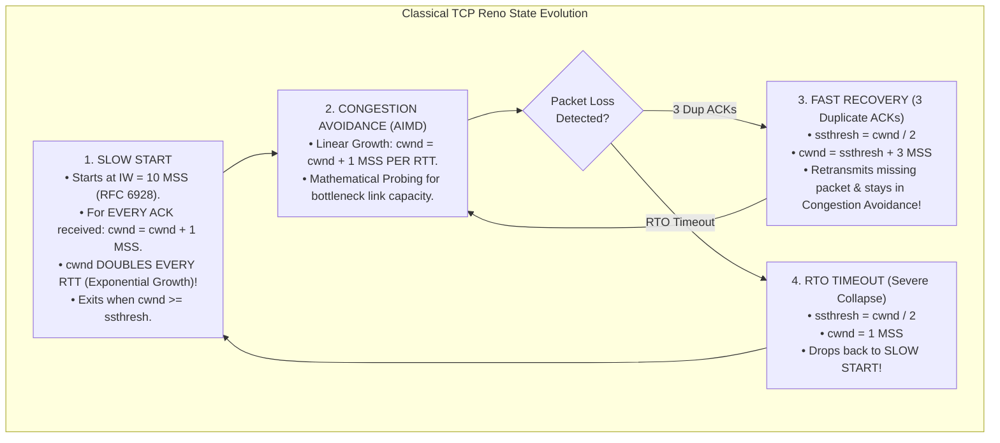
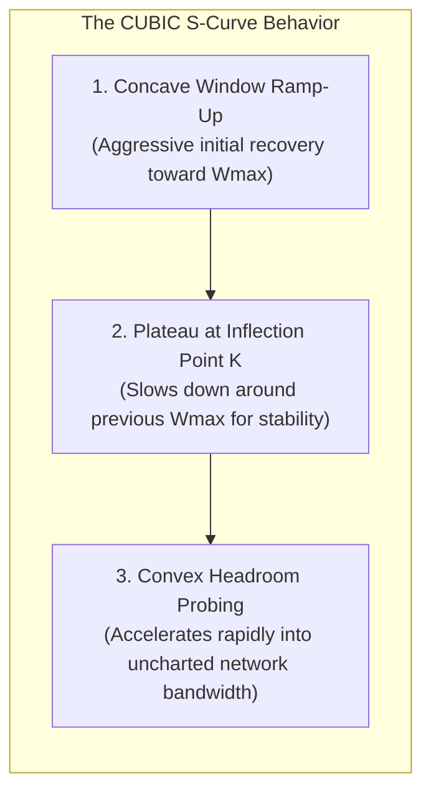
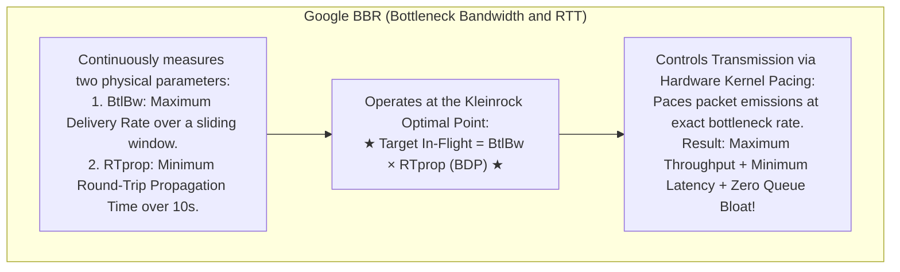
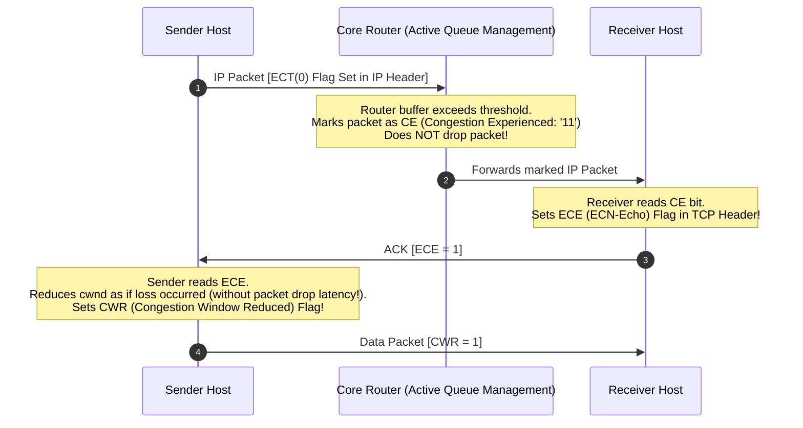

# TCP Congestion Control: AIMD, Slow Start, Reno, CUBIC, and Google BBR

> [!abstract] Mental Model
> - **Highway Traffic Without Centralized Signals**: The global internet is a shared public commons with zero reservations. If millions of independent senders transmit without restraint, intermediate router buffers overflow, resulting in **Congestion Collapse** (goodput plummets to near zero).
> - **TCP Congestion Control** is the decentralized game-theoretic engine sizing the **Congestion Window (`cwnd`)** to saturate available network bottleneck bandwidth while maintaining fairness and avoiding queue bloat.

---

## 1. Congestion Window (`cwnd`) vs Effective Window

$$\mathbf{\text{Effective Transmission Window} = \min(\text{rwnd}, \text{cwnd})}$$
- **`rwnd` (Receive Window)**: Protects the **Receiver's Memory Buffer** (Flow Control).
- **`cwnd` (Congestion Window)**: Protects the **Intermediate Network Path** (Congestion Control).

---

## 2. The Classical Evolution: Slow Start, AIMD, and TCP Reno



---

### Why AIMD? The Chiu-Jain Convergence Proof

Chiu & Jain (1989) proved mathematically that of all linear control laws, **Additive Increase Multiplicative Decrease (AIMD)** is the only scheme guaranteed to converge to both **Optimal Efficiency ($100\%$ link utilization)** and **Distributed Fairness ($50/50$ bandwidth split)** between competing flows:

```
Additive Increase (+1): Shifts operating point upward parallel to the Fairness Line.
Multiplicative Decrease (/2): Pulls operating point toward the origin along the Vector of Fairness!
```

---

## 3. Modern Linux Default: TCP CUBIC (RFC 8312)

### The Failure of Reno on 100GbE Links:
On a $100\text{ Gbps}$ cross-country link, if Reno drops its window by half upon loss, linear $+1\text{ MSS}$ per RTT requires **over $4\text{ hours}$** of uninterrupted transfer to ramp back up to line rate!

### The CUBIC Mathematical Equation:
CUBIC replaces linear RTT-dependent growth with a **Cubic Function of Real Elapsed Time ($t$)**:

$$\mathbf{W_{\text{cubic}}(t) = C(t - K)^3 + W_{\max}}$$

$$\text{Where } K = \sqrt[3]{\frac{W_{\max} \cdot \beta}{C}}, \quad \beta = 0.7, \quad C \approx 0.4$$


- **RTT-Independent Invariant**: Flows with long RTTs ($200\text{ms}$) scale up at the *exact same rate* as local flows ($5\text{ms}$), eliminating Reno's RTT unfairness bias!

---

## 4. The Modern Paradigm: Google BBR (Cardwell et al. - ACM Queue)

### The Fatal Flaw of Loss-Based Congestion Control (Bufferbloat):
Loss-based algorithms (Reno, CUBIC) push data until router buffers **overflow and drop packets**. In modern networks with deep router memory, this creates massive queue standing waves (**Bufferbloat**), inflating latency from $10\text{ms}$ to $2000\text{ms}$ without adding throughput!



---

## 5. Explicit Congestion Notification (ECN - RFC 3168)

ECN enables intermediate routers to signal impending buffer congestion **without dropping packets**:



---

## Production Diagnostics & Congestion Control Tuning

```bash
# 1. Check Active Linux TCP Congestion Control Algorithm:
sysctl net.ipv4.tcp_congestion_control
# net.ipv4.tcp_congestion_control = cubic

# 2. Switch Linux Kernel to Google BBR:
sudo modprobe tcp_bbr
sudo sysctl -w net.core.default_qdisc=fq
sudo sysctl -w net.ipv4.tcp_congestion_control=bbr

# 3. Inspect Live TCP Socket cwnd, BDP, and Pacing Telemetry:
ss -ti

# Output:
# ESTAB  0  0  192.168.1.50:54321  198.51.100.1:443
#     bbr wscale:7,7 rto:200 rtt:14.2/0.8 minrtt:13.8 mss:1460
#     bw:104.2Mbps mrtt:13.8 pacing_rate 124.8Mbps delivery_rate 98.4Mbps
#     cwnd:128 ssthresh:64
```

---

## Active Recall & Interview Perspective

### Reasoning Prompts
1. *Why does Chiu and Jain's vector model prove that Additive Increase Multiplicative Decrease (AIMD) converges to fairness and efficiency, while Multiplicative Increase Multiplicative Decrease (MIMD) does not?*
   - **Answer**: In a 2-user resource sharing phase plane where axes represent bandwidth allocations ($x_1, x_2$), the line $x_1 = x_2$ represents **Fairness**, and $x_1 + x_2 = C$ represents **Efficiency (Link Capacity)**. An **Additive Increase** step ($+1$) moves the state vector along a $45^\circ$ vector toward the efficiency line, improving efficiency without altering the absolute difference ($x_1 - x_2$) between users. A **Multiplicative Decrease** step ($\times 0.5$) pulls the state vector straight toward the origin $(0,0)$, shrinking the absolute difference between users by half and shifting the allocation ratio toward the $45^\circ$ fairness line. Alternating between Additive Increase and Multiplicative Decrease creates an oscillating trajectory that continually converges toward the optimal intersection of $100\%$ efficiency and perfect fairness. In contrast, **MIMD** multiplies and divides both allocations by scalar factors, which maintains the existing proportional inequality forever and never converges to fairness.
2. *What is Bufferbloat, and how does Google BBR resolve it where CUBIC and Reno fail?*
   - **Answer**: **Bufferbloat** occurs when intermediate network switches and home routers contain excessively large packet buffers. Loss-based congestion control algorithms (Reno, CUBIC) increase their congestion window until a packet drop occurs. Because deep buffers absorb massive packet bursts before overflowing, Reno/CUBIC continue pumping data until the buffer is $100\%$ saturated, creating multi-second queuing standing waves that inflate RTT latency without providing any additional throughput. **Google BBR** resolves this by completely abandoning packet loss as a congestion indicator. Instead, BBR directly measures the physical properties of the path: the maximum bottleneck delivery rate ($\text{BtlBw}$) and the minimum propagation delay ($\text{RTprop}$). BBR paces packet transmissions to hold in-flight data precisely at the **Bandwidth-Delay Product ($\text{BDP} = \text{BtlBw} \times \text{RTprop}$)**, achieving line-rate throughput while keeping intermediate router queues near zero.
3. *How does Explicit Congestion Notification (ECN) allow routers to signal congestion without the latency penalty of packet retransmissions?*
   - **Answer**: Traditionally, routers communicate network congestion implicitly by dropping packets once queues fill, forcing the sender to wait for duplicate ACKs or RTO timeouts and trigger expensive retransmissions. With **ECN (RFC 3168)**, when a router's queue exceeds a pre-set threshold, it uses Active Queue Management (AQM) to flip the 2-bit **Congestion Experienced (CE = `11`)** field in the IP header of transit packets instead of dropping them. When the receiving host receives the CE-marked IP packet, it sets the **`ECE (ECN-Echo)`** flag in its returning TCP ACK. The sender reads the `ECE` flag and halves its `cwnd` exactly as if a packet loss had occurred, and marks its next packet with **`CWR (Congestion Window Reduced)`** to acknowledge the signal. This provides instant congestion backoff with **zero packet loss, zero retransmissions, and zero latency jitter**.

---

## Key Takeaways
- **AIMD** is the only linear control scheme mathematically guaranteed to converge to **Fairness and Efficiency**.
- **Slow Start** doubles `cwnd` every RTT until `ssthresh`.
- **TCP CUBIC** uses real-time cubic curves, scaling efficiently on high-BDP pipes.
- **Google BBR** paces data at $\text{BDP} = \text{BtlBw} \times \text{RTprop}$, eliminating **Bufferbloat**.
- **ECN (RFC 3168)** signals congestion via IP header bits without dropping packets.

---

## Related Notes
- [[Computer Networks MOC]] — Master table of contents for Computer Networks.
- [[Transmission Control Protocol - TCP Header, Features, and Invariants]] — TCP Flags (ECE, CWR).
- [[TCP Reliability - Sequence Numbers, ACKs, Retransmission, SACK]] — Fast Retransmit triggers.
- [[TCP Flow Control - Sliding Window and Silly Window Syndrome]] — `rwnd` vs `cwnd` interplay.
- [[HTTP-3 and QUIC - UDP-Based Transport, Head-of-Line Blocking Elimination]] — User-space congestion control in QUIC.
- [[Dynamic Routing of Web Traffic - Anycast, CDN Architecture, Edge Computing]] — CDN edge optimization with BBR.
