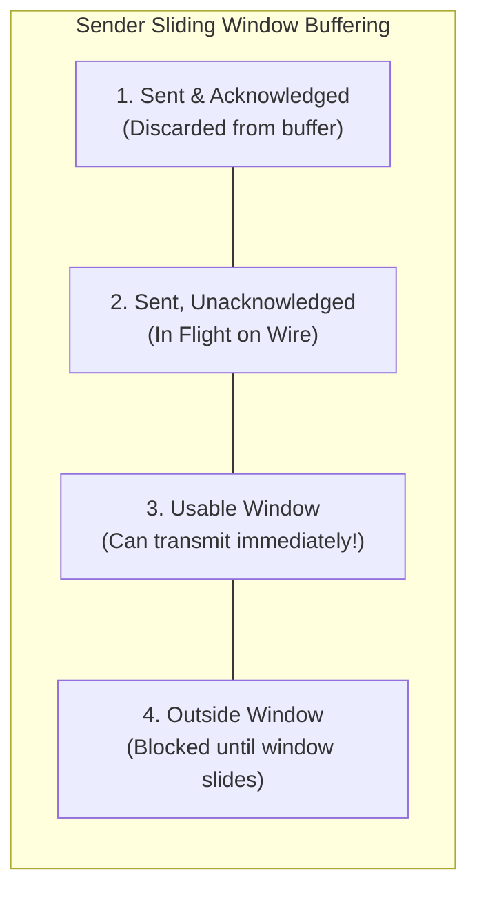
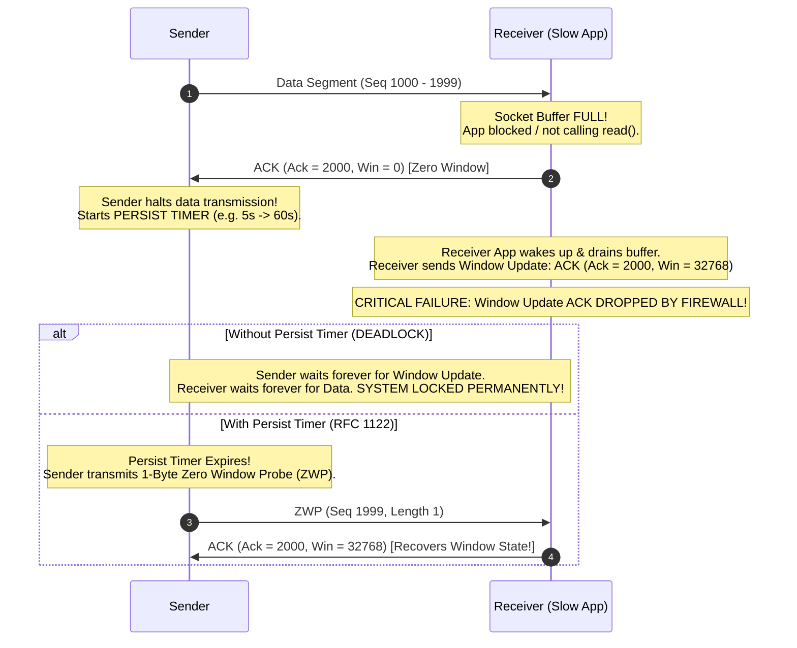
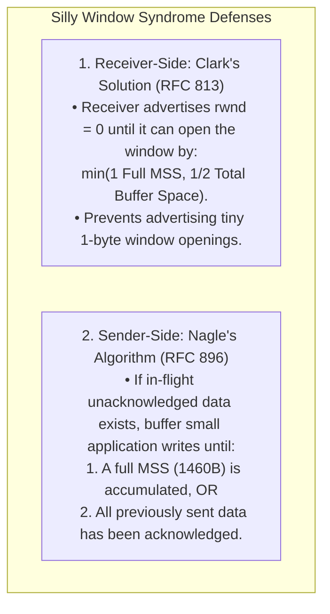
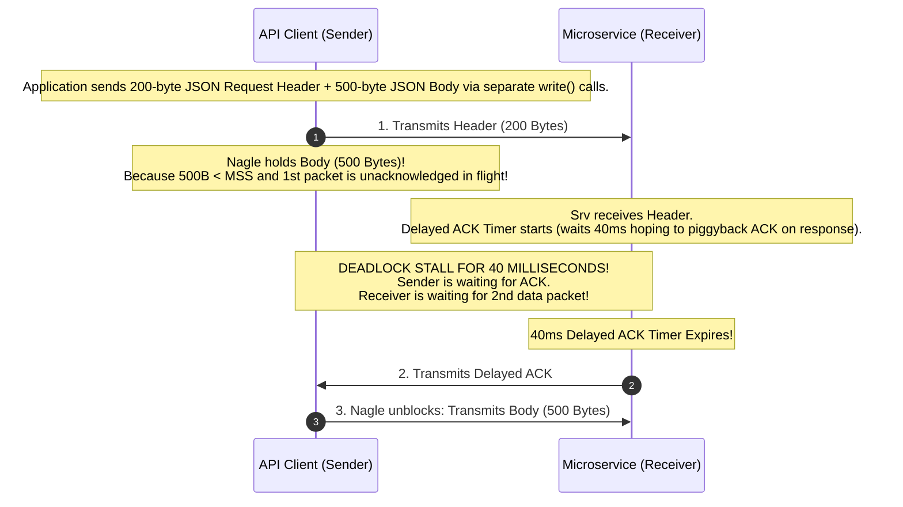

# TCP Flow Control: Sliding Window, Zero Window, and Silly Window Syndrome

> [!abstract] Mental Model
> - **The Pressure Regulator**: Flow Control protects a slow, resource-constrained receiver from being drowned by a high-speed sender transmitting at 100Gbps line rate.
> - The receiver advertises its real-time available buffer space (**Receive Window - `rwnd`**). The sender regulates its in-flight data so that $\text{Bytes in Flight} \le \text{rwnd}$. When buffers fill to capacity, TCP halts transmission via **Zero Window** and uses **Persist Timers** to avoid permanent deadlocks.

---

## 1. The Sliding Window State Architecture



$$\mathbf{\text{Usable Window} = \text{Advertised rwnd} - (\text{LastByteSent} - \text{LastByteAcked})}$$

---

## 2. Zero Window State & The Persist Timer Deadlock Solution

When the receiver application stops reading data, the kernel socket buffer (`sk_rcvbuf`) fills completely, causing the receiver to advertise **`rwnd = 0` (Zero Window)**:



---

## 3. Silly Window Syndrome (SWS) & Mitigations

If a slow receiver consumes data 1 byte at a time, or a slow application writes data 1 byte at a time, TCP degrades into transmitting **1 byte of payload inside a 40-byte TCP/IP header** ($2.4\%$ efficiency):



---

## 4. The Deadly 40ms Latency Outage: Nagle vs Delayed ACKs

In modern backend microservices, **Nagle's Algorithm and Delayed ACKs clash destructively**:



---

### The Production Fix: `TCP_NODELAY`
To eliminate the 40ms latency penalty in microservices, gRPC, and databases, disable Nagle's algorithm:

```c
// Disable Nagle's Algorithm (Set TCP_NODELAY on socket):
int enable = 1;
setsockopt(socket_fd, IPPROTO_TCP, TCP_NODELAY, (void *)&enable, sizeof(enable));
```

---

## 5. Linux Kernel Buffer Auto-Tuning

Modern Linux stacks dynamically scale socket buffers to match the **Bandwidth-Delay Product (BDP)**:

```bash
# View Default, Min, and Max Receive Buffer Memory (Bytes):
sysctl net.ipv4.tcp_rmem
# net.ipv4.tcp_rmem = 4096 (min)  87380 (default)  6291456 (max: 6MB)

# View Send Buffer Memory (Bytes):
sysctl net.ipv4.tcp_wmem
# net.ipv4.tcp_wmem = 4096 (min)  16384 (default)  4194304 (max: 4MB)
```

---

## Production Diagnostics & Flow Control Verification

```bash
# 1. Inspect Socket Flow Control Window & Buffer Space:
ss -ti

# Output:
# ESTAB  0  0  192.168.1.50:54321  198.51.100.1:443
#     cubic wscale:7,7 rto:200 rtt:12.4/0.4 ato:40 mss:1460
#     rcvspace:131072 rcv_ssthresh:64240 notsent:0

# 2. View Kernel Zero Window Drops and Outages:
nstat -z TcpExtTCPZeroWindowDrop* TcpExtTCPToZeroWindowAdv*
# TcpExtTCPToZeroWindowAdv: 142      <-- Receiver advertised Zero Window
# TcpExtTCPZeroWindowDrop: 0         <-- Packets dropped due to 0 window
```

---

## Active Recall & Interview Perspective

### Reasoning Prompts
1. *What is the difference between TCP Flow Control and TCP Congestion Control?*
   - **Answer**: **Flow Control** is an end-to-end mechanism that prevents a fast sender from overflowing the specific memory buffer of a slow **receiving host** (governed by `rwnd`). In contrast, **Congestion Control** is a global mechanism that prevents a sender from overwhelming the shared intermediate **routers and network links** across the transit path (governed by `cwnd`). The sender's effective transmission window is always bounded by the minimum of the two: $\text{Effective Window} = \min(\text{rwnd}, \text{cwnd})$.
2. *Why is the TCP Persist Timer necessary when a receiver advertises a Zero Window (`rwnd = 0`)?*
   - **Answer**: When a receiver's buffer fills completely, it transmits an ACK with `rwnd = 0`, instructing the sender to halt transmission. Later, when the receiver application reads data and frees buffer space, it emits a new "Window Update" ACK advertising `rwnd > 0`. Because this window update carries no data, it is not acknowledged by the sender. If this update packet is lost on the network, the sender remains stuck waiting indefinitely for a window opening, while the receiver waits indefinitely for incoming data, causing a **permanent silent deadlock**. The **Persist Timer** breaks this deadlock: when `rwnd = 0`, the sender periodically transmits a 1-byte **Zero-Window Probe (ZWP)**, forcing the receiver to reply with an ACK containing its latest `rwnd`.
3. *Why does the combination of Nagle's Algorithm and Delayed ACKs cause severe 40ms latency spikes in web APIs, and how is it resolved?*
   - **Answer**: Nagle's algorithm mandates that if there is unacknowledged in-flight data on the wire, the sender must buffer subsequent small data writes until all previous data is acknowledged. Concurrently, the receiver implements **Delayed ACKs**, which holds back sending an ACK for up to $40\text{ ms}$ in the hope of piggybacking the ACK onto an outbound response. When an application performs two consecutive small writes (such as an HTTP request header followed by a request body), the sender emits the first write and buffers the second write under Nagle. The receiver receives the first chunk, holds the ACK under Delayed ACKs, and waits. Neither host can proceed until the receiver's 40ms timer expires, creating an artificial 40ms stall. The industry solution is to set **`TCP_NODELAY`** on the socket, disabling Nagle's algorithm so that small segments are transmitted immediately without waiting for in-flight ACKs.

---

## Key Takeaways
- **Flow Control (`rwnd`)** protects receiver socket buffer memory.
- **Zero Window (`rwnd = 0`)** halts sender; **Persist Timers** prevent permanent deadlock.
- **Silly Window Syndrome (SWS)** is solved via **Clark's solution** (receiver) and **Nagle's algorithm** (sender).
- **Nagle + Delayed ACKs** causes **40ms latency stalls**; mitigated via **`TCP_NODELAY`**.

---

## Related Notes
- [[Computer Networks MOC]] — Master table of contents for Computer Networks.
- [[Flow Control - Stop-and-Wait, Go-Back-N, Selective Repeat]] — Sliding window fundamentals.
- [[Transmission Control Protocol - TCP Header, Features, and Invariants]] — Window Size and Scale options.
- [[TCP Reliability - Sequence Numbers, ACKs, Retransmission, SACK]] — ACK processing.
- [[TCP Congestion Control - AIMD, Slow Start, Reno, CUBIC, BBR]] — Congestion window interaction.
- [[HTTP-2 - Binary Framing, Multiplexing, Stream Priorities, HPACK]] — Stream-level flow control in application layer.
