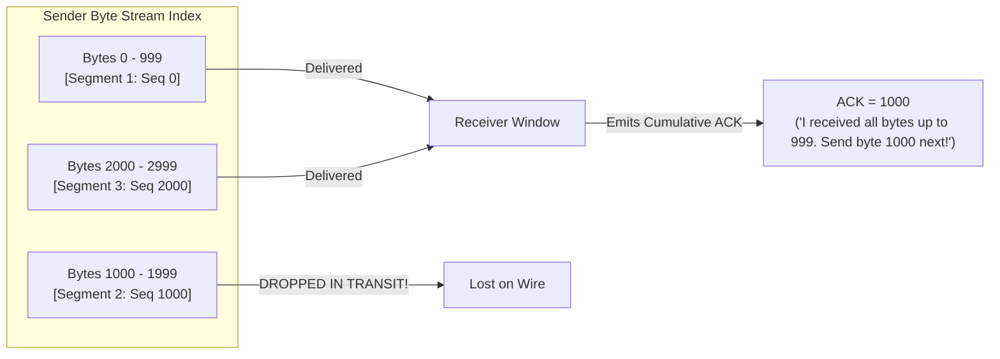
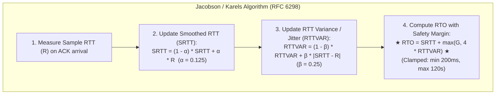
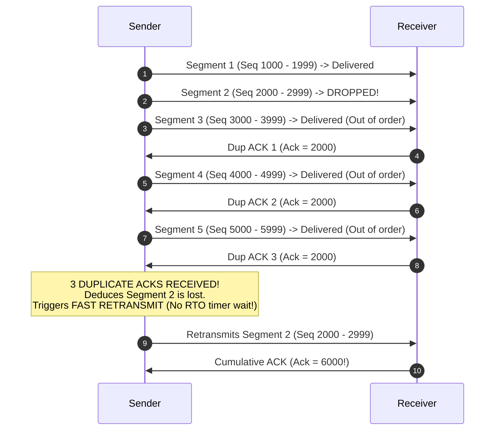
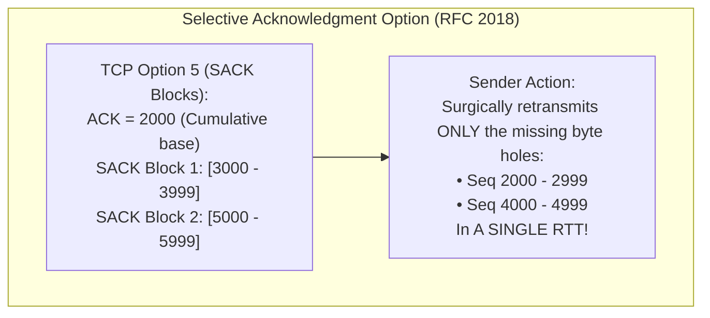

# TCP Reliability: Sequence Numbers, RTO Math, Fast Retransmit, and SACK

> [!abstract] Mental Model
> - **The Resilient Conveyor Belt**: The physical Internet is lossy, chaotic, and unordered—packets are dropped by congested switch buffers, duplicated by link re-routes, and scrambled by ECMP multipathing.
> - **TCP Reliability Architecture** transforms this chaos into an unbroken, flawless byte stream using **Byte-Level Sequence Offsets**, adaptive **Jacobson/Karels RTO timers**, **3-Duplicate-ACK Fast Retransmit**, and surgical **Selective Acknowledgments (SACK)**.

---

## 1. Byte-Stream Numbering vs Cumulative ACKs

TCP sequence numbers do **not** count packet frames—they count individual **octets (bytes)**:



---

## 2. Adaptive Retransmission Timeout (RTO) Math: Jacobson/Karels Algorithm

If the Retransmission Timeout ($\text{RTO}$) is too short, TCP floods the link with spurious duplicates. If $\text{RTO}$ is too long, the connection stalls during packet loss:



---

### Karn's Algorithm & Exponential Backoff (RFC 6298):
1. **Ambiguity Prohibition**: Never calculate Sample RTT ($R$) for a segment that was retransmitted (you cannot know if the ACK is for the original packet or the retransmission).
2. **Exponential Backoff**: If an RTO timer expires, double the RTO for each subsequent attempt ($\text{RTO} \leftarrow 2 \times \text{RTO}$) to relieve network congestion collapse.

---

## 3. Fast Retransmit & 3 Duplicate ACKs (RFC 5681)

Waiting for the RTO timer to expire ($200\text{ms}+$) destroys throughput. When a receiver gets an out-of-order segment, it immediately emits a **Duplicate ACK**:



> **Why 3 Duplicate ACKs?** Minor packet reordering (by 1 or 2 packets) is common over multi-core switches and ECMP links. Requiring 3 duplicate ACKs prevents premature, wasteful retransmissions while catching true packet loss in $< 1\text{ RTT}$.

---

## 4. Selective Acknowledgment (SACK - RFC 2018) & DSACK

### The Cumulative ACK Bottleneck (Reno / Tahoe):
If Segments 2 and 4 are dropped out of 10 packets, cumulative ACK can only ever report `Ack = 2000`. The sender is blind: it must either retransmit *all* segments $2 \dots 10$ (Go-Back-N bandwidth waste) or wait one full RTT per individual missing packet!



### Duplicate SACK (D-SACK - RFC 2883):
If a SACK block reports a sequence range **below the cumulative ACK number**, it explicitly informs the sender that a duplicate segment was received. This enables the sender to detect **Spurious Retransmissions** (caused by sudden network latency spikes) and restore its congestion window without penalty.

---

## Production Diagnostics & Retransmission Telemetry

```bash
# 1. Inspect Real-Time Socket RTO, RTT, and SACK Telemetry:
ss -ti

# Output:
# ESTAB  0  0  192.168.1.50:54321  198.51.100.1:443
#     cubic wscale:7,7 rto:224 rtt:24.1/1.2 rttvar:3.1 ssthresh:24 cwnd:32
#     retrans:0/4 reordering:3 sacked:12 lost:0

# 2. View Kernel System-Wide TCP Retransmission Counters:
nstat -z Tcp*Retrans* Tcp*Timeout*

# Output:
# TcpRetransSegs: 14205          <-- Total retransmitted segments
# TcpExtFastRetrans: 12040       <-- Fast Retransmit (3 dup ACKs - Healthy recovery)
# TcpExtTimeouts: 2165           <-- RTO Timeouts (Severe congestion / link drops)
# TcpExtSpuriousRtxHost: 412     <-- Spurious retransmissions detected via DSACK
```

---

## Active Recall & Interview Perspective

### Reasoning Prompts
1. *Why does Karn's algorithm explicitly forbid measuring RTT samples on retransmitted TCP segments?*
   - **Answer**: When a sender transmits a segment, times out, and retransmits it, an incoming ACK for that sequence number creates an **acknowledgment ambiguity**: the sender cannot determine whether the ACK was triggered by the delayed arrival of the *original* segment or the arrival of the *retransmitted* segment. If it assumes the ACK corresponds to the original segment, the calculated Sample RTT will be artificially inflated; if it assumes the ACK corresponds to the retransmission, the Sample RTT may be artificially deflated. **Karn's algorithm** eliminates this mathematical contamination by discarding RTT samples for all retransmitted packets and doubling the existing RTO via exponential backoff until a fresh segment is acknowledged cleanly without retransmission.
2. *How does Selective Acknowledgment (SACK) eliminate the performance cliff of TCP Go-Back-N retransmissions on high-bandwidth links?*
   - **Answer**: In classical TCP without SACK, the receiver's acknowledgment header contains only a single **Cumulative ACK** number. If multiple non-contiguous segments are dropped from a large in-flight window (e.g. packets 3 and 7 are lost out of 100), the receiver continually reports `Ack = 3`. The sender has no visibility into whether packets $4 \dots 6$ or $8 \dots 100$ were received, forcing it to either retransmit the entire window from packet 3 onward (wasting massive bandwidth) or recover one packet per RTT. With **SACK (RFC 2018)**, the receiver attaches up to 4 non-contiguous byte ranges in TCP Option 5 (e.g. `ACK=3000, SACK=[4000-6999, 8000-100000]`), allowing the sender to selectively retransmit only the missing packet holes (packets 3 and 7) in a **single round-trip time**.
3. *What is Fast Retransmit, and why does TCP require precisely three duplicate ACKs before triggering it?*
   - **Answer**: Fast Retransmit allows a TCP sender to detect and recover from packet loss significantly faster than waiting for the coarse Retransmission Timeout (RTO) timer ($200\text{ ms}+$). When a packet is lost in transit but subsequent packets arrive at the receiver, the receiver emits a Duplicate ACK for every out-of-order packet received. TCP waits for **three duplicate ACKs** (four identical ACKs total) before retransmitting because minor packet reordering (by 1 or 2 packets) frequently occurs in production networks due to router queuing and ECMP hashing. A threshold of 3 duplicate ACKs provides a robust heuristic: if 3 subsequent packets have arrived while the expected byte sequence is still missing, the probability of packet loss approaches $100\%$, triggering an immediate retransmission without suffering RTO latency stalls.

---

## Key Takeaways
- **Sequence/ACK Numbers** track individual **Bytes**, not packets.
- **Jacobson/Karels Algorithm** calculates $\text{RTO} = \text{SRTT} + 4 \times \text{RTTVAR}$.
- **Karn's Algorithm** drops RTT samples on retransmissions; uses **Exponential Backoff**.
- **3 Duplicate ACKs** trigger **Fast Retransmit**; **SACK (RFC 2018)** surgically repairs multiple byte holes in 1 RTT.

---

## Related Notes
- [[Computer Networks MOC]] — Master table of contents for Computer Networks.
- [[Flow Control - Stop-and-Wait, Go-Back-N, Selective Repeat]] — Sliding window fundamentals.
- [[Transmission Control Protocol - TCP Header, Features, and Invariants]] — Header format and options.
- [[TCP Three-Way Handshake and Connection Termination]] — Connection establishment and teardown.
- [[TCP Flow Control - Sliding Window and Silly Window Syndrome]] — Flow control receiver window.
- [[TCP Congestion Control - AIMD, Slow Start, Reno, CUBIC, BBR]] — Congestion window algorithms.
