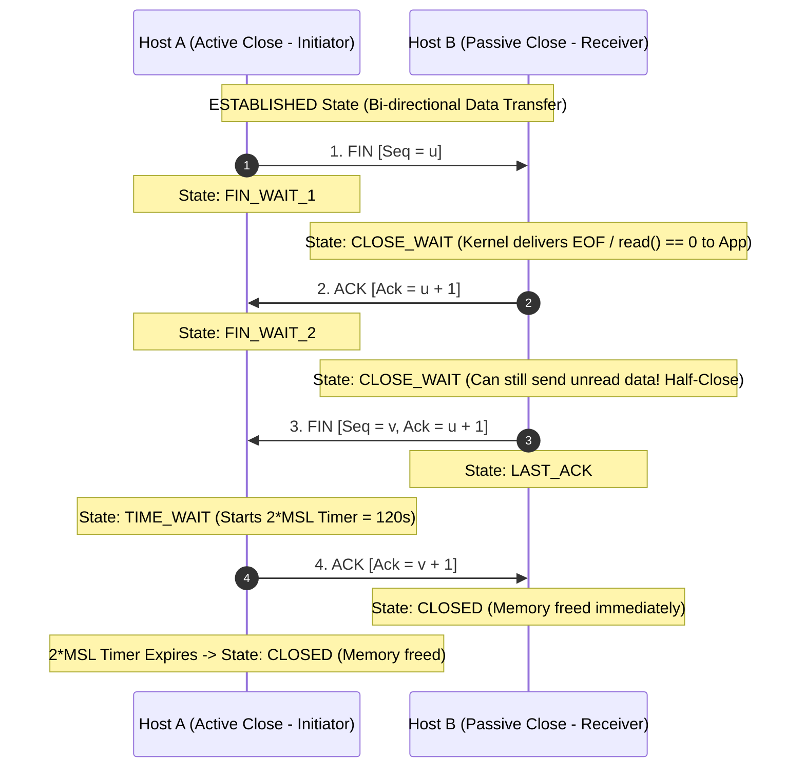
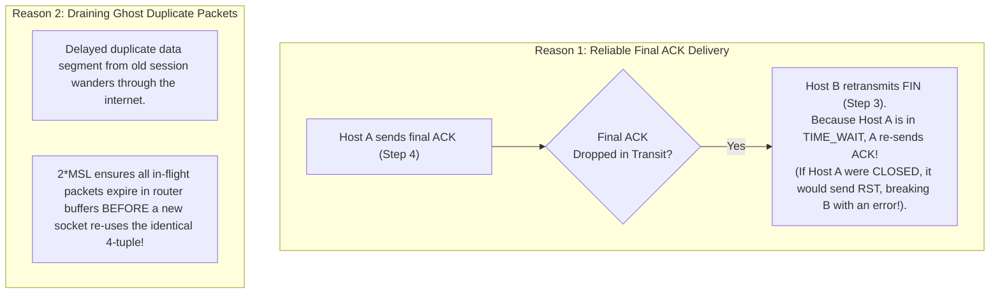

# TCP Three-Way Handshake and Connection Termination

> [!abstract] Mental Model
> - **The Bilateral Contract Negotiation & Dissolution**: A TCP connection cannot transmit a single byte of application data until both endpoints mutually agree on starting byte coordinates (**Initial Sequence Numbers - ISNs**), buffer scaling parameters, and allocate kernel memory buffers.
> - Teardown is independent in each direction: closing the transmission pipe does not close the receive pipe (**TCP Half-Close**), and the active closer must linger in **`TIME_WAIT`** for $120\text{ seconds}$ to drain ghost packets from the internet.

---

## 1. The 3-Way Handshake (Connection Establishment)

```mermaid
sequenceDiagram
    autonumber
    participant Client as Client (Active Open)
    participant Server as Server (Passive Open)

    Note over Server: LISTEN State (socket -> bind -> listen)
    Note over Client: CLOSED State

    Client->>Server: 1. SYN [Seq = ISN_c, MSS=1460, WScale=7, SACK_Perm]
    Note over Client: State: SYN_SENT
    Note over Server: State: SYN_RCVD (Placed in SYN Backlog Queue)

    Server->>Client: 2. SYN-ACK [Seq = ISN_s, Ack = ISN_c + 1, MSS=1460, WScale=7, SACK_Perm]
    Note over Client: State: ESTABLISHED (Kernel socket created!)

    Client->>Server: 3. ACK [Seq = ISN_c + 1, Ack = ISN_s + 1, (Optional Data Payload)]
    Note over Server: State: ESTABLISHED (Moved to Accept Queue; accept() returns)
```

---

### Why 3 Steps Instead of 2?
1. **Bidirectional Sequence Synchronization**: TCP is full-duplex. Client must verify Server received `ISN_c`, and Server must verify Client received `ISN_s`. A 2-way handshake leaves the server uncertain whether the client received its `ISN_s` before data arrives.
2. **Preventing Old Duplicate Connection Reincarnations**: Delayed duplicate SYN packets floating through the internet from old crashed sessions are detected and aborted via `RST` during the 3-way exchange.

---

## 2. Initial Sequence Number (ISN) Randomization & SYN Cookies

### The Security Threat: TCP Sequence Prediction Hijacking
If `ISN` simply started at `0` or incremented predictably by a fixed counter, an attacker could spoof IP packets and inject arbitrary commands into an active TCP session without seeing the server's replies (**Kevin Mitnick / Morris Worm attack**).

### Modern Cryptographic ISN Generation:
$$\mathbf{\text{ISN} = \text{MD5/SHA256}(\text{Src IP}, \text{Dst IP}, \text{Src Port}, \text{Dst Port}, \text{Secret Key}) + (t \times \text{Clock Frequency})}$$

---

### SYN Flood Attacks & SYN Cookies (RFC 4987)

```mermaid
flowchart TD
    subgraph Attack ["SYN Flood Attack"]
        Bot["Attacker Botnet"] -->|Floods millions of spoofed SYNs| Srv["Target Server"]
        Srv -->|Fills SYN Queue with half-open sockets| Overflow["SYN Queue Full! Drops legitimate users!"]
    end

    subgraph Defense ["SYN Cookies Defense (net.ipv4.tcp_syncookies = 1)"]
        Srv2["Server under SYN Flood"] -->|Stops allocating kernel memory!| Cookie["Encodes state into ISN_s:<br/>ISN_s = HMAC(4-tuple, Secret) + Timestamp + MSS Index"]
        Cookie -->|Sends SYN-ACK to Client| Client["Legitimate Client"]
        Client -->|Returns Step 3 ACK (Ack = ISN_s + 1)| Srv2
        Srv2 -->|Cryptographically verifies Cookie in Ack - 1| Create["Instantly constructs socket on-the-fly!"]
    end

    Attack -.->|Mitigated by| Defense
```

---

## 3. The 4-Way Connection Teardown & Half-Close



---

## 4. The Critical Invariants of `TIME_WAIT` ($2 \times \text{MSL}$)

The active closer **must** remain in `TIME_WAIT` for $2 \times \text{MSL}$ ($2 \times 60\text{s} = 120\text{ seconds}$ on Linux):



---

## 5. Production Outages: `CLOSE_WAIT` Leaks & `TIME_WAIT` Saturation

| Outage Scenario | Root Cause Mechanism | Production Resolution |
| :--- | :--- | :--- |
| **`CLOSE_WAIT` Accumulation** | Application receives `read() == 0` (EOF) from remote client, but **fails to call `close(fd)`** in code due to an uncaught exception or leaking connection pool. Socket stays in `CLOSE_WAIT` forever until file descriptors exhaust (`EMFILE`). | Fix application code to guarantee `close()` in `finally` / defer blocks. |
| **`TIME_WAIT` Port Exhaustion** | Client opens thousands of short-lived connections without HTTP Keep-Alive; all ephemeral ports trap in `TIME_WAIT` for $120\text{s}$, returning `EADDRNOTAVAIL`. | Enable connection pooling; enable `net.ipv4.tcp_tw_reuse = 1`. |

---

## Production Diagnostics & Socket State Inspection

```bash
# 1. Count TCP Sockets in Each State:
ss -ant | awk '{print $1}' | sort | uniq -c

# Output:
#    1204 CLOSE-WAIT    <-- Application file descriptor leak!
#      54 ESTAB
#       8 LISTEN
#    8410 TIME-WAIT     <-- High connection churn!

# 2. Inspect Kernel SYN Backlog Queue Limits:
sysctl net.ipv4.tcp_max_syn_backlog net.core.somaxconn
# net.ipv4.tcp_max_syn_backlog = 4096
# net.core.somaxconn = 4096

# 3. View TCP Handshake Drops via Kernel SNMP Counters:
nstat -z TcpExtSyncookies* TcpExtListen*
# TcpExtListenOverflows: 412      <-- Accept queue full (Application thread blocked)
# TcpExtListenDrops: 412
```

---

## Active Recall & Interview Perspective

### Reasoning Prompts
1. *Why does TCP require a 3-way handshake to establish a connection, but a 4-way handshake to terminate it?*
   - **Answer**: During connection establishment, the server can combine its sequence number synchronization (`SYN`) and its acknowledgment of the client's sequence number (`ACK`) into a single combined packet (**SYN-ACK**), completing the exchange in 3 steps. During termination, however, TCP is a **full-duplex byte stream** that supports **Half-Close**. When Host A sends a `FIN`, it indicates only that *Host A* has finished sending data. Host B acknowledges this with an `ACK` (entering `CLOSE_WAIT`), but Host B may still have pending outbound data in its buffer to transmit to Host A. Only when Host B finishes sending its own data does it emit its own separate `FIN`, requiring a 4th `ACK` from Host A to complete the teardown.
2. *Why is the `TIME_WAIT` state duration set to $2 \times \text{MSL}$, and why is it entered only by the active closer?*
   - **Answer**: Maximum Segment Lifetime (MSL) is the maximum time a packet can survive in the network before being discarded by IP TTL expiry (typically assumed to be $60\text{ seconds}$). Setting the timer to $2 \times \text{MSL} = 120\text{ seconds}$ guarantees enough time for **(1)** a final ACK to reach the peer ($1\text{ MSL}$) and **(2)** a retransmitted FIN from the peer to reach the closer ($1\text{ MSL}$) if the initial ACK was lost. Only the endpoint that sends the first `FIN` (the **active closer**) enters `TIME_WAIT` because it is the node responsible for transmitting the final 4th `ACK` and confirming that the passive closer has shut down cleanly.
3. *How do SYN Cookies defend against TCP SYN Flood Denial of Service attacks without allocating server memory?*
   - **Answer**: In a SYN flood, an attacker sends millions of SYN packets with spoofed source IPs, causing the server to allocate state in its **SYN Backlog Queue** until memory exhausts. When **SYN Cookies (RFC 4987)** are enabled and the SYN queue fills, the server stops allocating memory for half-open sockets entirely. Instead, it generates a cryptographically encoded 32-bit `ISN_s` composed of a coarse timestamp, an index of the client's negotiated MSS, and a cryptographic HMAC hash of the connection 4-tuple and a secret kernel key. When a legitimate client replies with the 3rd ACK (`Ack = ISN_s + 1`), the server subtracts 1, recalculates the HMAC, verifies the cookie, and instantiates the connected socket descriptor on-the-fly directly into the Accept Queue without ever having stored half-open state.

---

## Key Takeaways
- **3-Way Handshake** (`SYN -> SYN-ACK -> ACK`) establishes bidirectional sequence sync.
- **Cryptographic ISNs** and **SYN Cookies** protect against hijacking and SYN flood DoS.
- **4-Way Teardown** supports **Half-Close**; **`TIME_WAIT` ($2 \times \text{MSL} = 120\text{s}$)** guarantees reliable closing and drains ghost packets.
- **`CLOSE_WAIT` leaks** occur when application code fails to call `close(fd)`.

---

## Related Notes
- [[Computer Networks MOC]] — Master table of contents for Computer Networks.
- [[Transport Layer Fundamentals - Multiplexing, Demultiplexing, Ports]] — Port bindings and sockets.
- [[Transmission Control Protocol - TCP Header, Features, and Invariants]] — TCP flags and options.
- [[TCP Reliability - Sequence Numbers, ACKs, Retransmission, SACK]] — Sliding window reliability.
- [[TCP Flow Control - Sliding Window and Silly Window Syndrome]] — Receiver buffer flow control.
- [[TCP Congestion Control - AIMD, Slow Start, Reno, CUBIC, BBR]] — Network bandwidth throttling.
