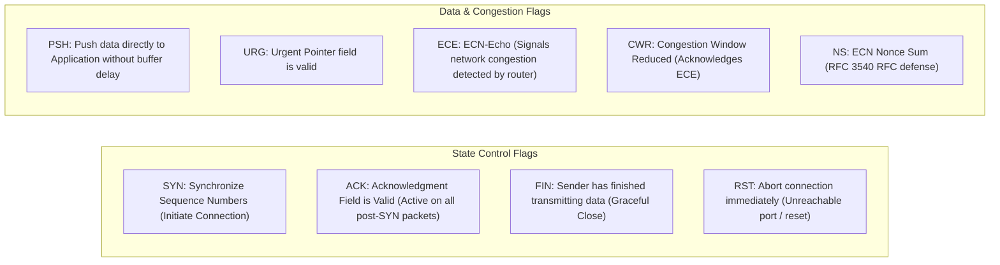
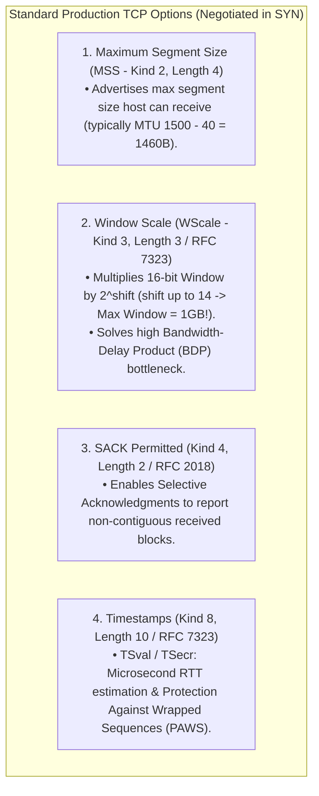
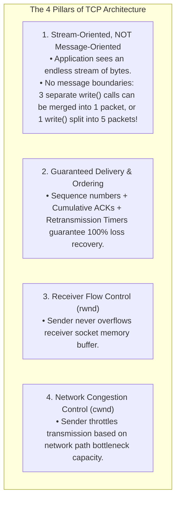

# Transmission Control Protocol (TCP): Header Format, Features, and Invariants

> [!abstract] Mental Model
> - **The Virtual Reliable Pipe**: The underlying IP substrate is fundamentally chaotic—unreliable, unordered, lossy, and packet-oriented (best-effort datagrams).
> - **TCP (RFC 793 / RFC 9293)** constructs an unbroken, reliable, full-duplex **ordered byte stream** across this chaos, guaranteeing that bytes emitted via `write()` on Host A arrive bit-for-bit identical and in-order on Host B via `read()`.

---

## 1. The TCP Segment Header Format (20 to 60 Bytes)

```
 0                   1                   2                   3
 0 1 2 3 4 5 6 7 8 9 0 1 2 3 4 5 6 7 8 9 0 1 2 3 4 5 6 7 8 9 0 1
+-+-+-+-+-+-+-+-+-+-+-+-+-+-+-+-+-+-+-+-+-+-+-+-+-+-+-+-+-+-+-+-+
|          Source Port          |       Destination Port        |
+-+-+-+-+-+-+-+-+-+-+-+-+-+-+-+-+-+-+-+-+-+-+-+-+-+-+-+-+-+-+-+-+
|                        Sequence Number                        |
+-+-+-+-+-+-+-+-+-+-+-+-+-+-+-+-+-+-+-+-+-+-+-+-+-+-+-+-+-+-+-+-+
|                    Acknowledgment Number                      |
+-+-+-+-+-+-+-+-+-+-+-+-+-+-+-+-+-+-+-+-+-+-+-+-+-+-+-+-+-+-+-+-+
|  Data |           |C|E|U|A|P|R|S|F|                               |
| Offset| Reserved  |W|C|R|C|S|S|Y|I|            Window             |
| (4b)  |   (4b)    |R|E|G|K|H|T|N|N|                               |
+-+-+-+-+-+-+-+-+-+-+-+-+-+-+-+-+-+-+-+-+-+-+-+-+-+-+-+-+-+-+-+-+
|           Checksum            |        Urgent Pointer         |
+-+-+-+-+-+-+-+-+-+-+-+-+-+-+-+-+-+-+-+-+-+-+-+-+-+-+-+-+-+-+-+-+
|                    Options (Variable 0-40 Bytes)              |
+-+-+-+-+-+-+-+-+-+-+-+-+-+-+-+-+-+-+-+-+-+-+-+-+-+-+-+-+-+-+-+-+
|                            Payload                            |
+-+-+-+-+-+-+-+-+-+-+-+-+-+-+-+-+-+-+-+-+-+-+-+-+-+-+-+-+-+-+-+-+
```

---

## 2. Field-by-Field Technical Breakdown

| Field Name | Bit Width | Technical Mechanics & Invariants |
| :--- | :---: | :--- |
| **Source Port** | $16\text{ Bits}$ | Local port on sending host ($0 - 65535$). |
| **Destination Port** | $16\text{ Bits}$ | Target port on receiving host. |
| **Sequence Number** | $32\text{ Bits}$ | Byte-stream index of the first data byte in this segment. During SYN, contains the **Initial Sequence Number (ISN)**. |
| **Acknowledgment Number** | $32\text{ Bits}$ | **Cumulative ACK**: The next byte index expected from the peer ($ACK = N \implies$ all bytes up to $N-1$ received). Valid when `ACK=1`. |
| **Data Offset (HLEN)** | $4\text{ Bits}$ | Number of 32-bit ($4\text{B}$) words in header. Min: `5` ($20\text{B}$), Max: `15` ($60\text{B}$). |
| **Control Flags** | $9\text{ Bits}$ | Bitmask signaling connection state transitions and flow mechanics (see below). |
| **Window Size** | $16\text{ Bits}$ | **Receive Window (`rwnd`)**: Available buffer space in bytes for flow control ($0 - 65,535\text{B}$). Scaled via Window Scale option. |
| **Checksum** | $16\text{ Bits}$ | **Mandatory** 1's complement checksum over Pseudo-Header + TCP Header + Data. |
| **Urgent Pointer** | $16\text{ Bits}$ | Offset to urgent out-of-band data when `URG=1` (Legacy; telnet `Ctrl+C`). |

---

## 3. The 9 TCP Control Flags



---

## 4. Critical TCP Options (Variable 0 to 40 Bytes)

TCP options use **TLV (Type-Length-Value)** encoding:



---

## 5. The Four Fundamental TCP Invariants



---

## Production Diagnostics & Packet Capture

```bash
# 1. Live Packet Capture of TCP Handshakes & Resets:
sudo tcpdump -i eth0 -nn -vv "tcp[tcpflags] & (tcp-syn|tcp-fin|tcp-rst) != 0"

# Output:
# 192.168.1.50.54321 > 192.168.1.1.443: Flags [S], seq 3840192410, win 64240, options [mss 1460,sackOK,TS val 294012 ecr 0,nop,wscale 7], length 0
# 192.168.1.1.443 > 192.168.1.50.54321: Flags [S.], seq 1049281042, ack 3840192411, win 65160, options [mss 1460,sackOK,TS val 891024 ecr 294012,nop,wscale 7], length 0

# 2. Inspect Active Kernel TCP Socket Statistics:
ss -ti

# Output:
# ESTAB  0  0  192.168.1.50:54321  198.51.100.1:443
#     cubic wscale:7,7 rto:200 rtt:14.2/0.8 ato:40 mss:1460 rcvspace:14600 ssthresh:10 cwnd:10
```

---

## Active Recall & Interview Perspective

### Reasoning Prompts
1. *Why does the TCP header include a "Data Offset" field, and how is its numeric value interpreted?*
   - **Answer**: The TCP header has a variable length ranging between $20\text{ bytes}$ (base header with zero options) and $60\text{ bytes}$ (maximum $40\text{ bytes}$ of TCP Options). The receiver's transport layer must know exactly where the header ends and the data payload begins. The **Data Offset (Header Length)** is a 4-bit field representing the header size in **32-bit (4-byte) words**. A minimal 20-byte TCP header has a Data Offset value of `5` ($5 \times 4 = 20\text{ bytes}$), while a fully loaded 60-byte header with options has a value of `15` ($15 \times 4 = 60\text{ bytes}$).
2. *Why was the TCP Window Scale Option (RFC 7323) introduced, and what failure occurs on modern gigabit networks without it?*
   - **Answer**: The standard TCP header allocates a 16-bit field for the **Receive Window (`rwnd`)**, capping the maximum unacknowledged in-flight data at $2^{16}-1 = 65,535\text{ bytes}$ ($64\text{ KB}$). On modern high Bandwidth-Delay Product (BDP) networks (e.g. a $10\text{ Gbps}$ cross-country link with an RTT of $50\text{ ms}$, where $\text{BDP} = 10\text{ Gbps} \times 0.05\text{s} = 62.5\text{ MB}$), a sender limited to $64\text{ KB}$ of in-flight data will exhaust its window in $52\text{ microseconds}$ and sit idle for the remaining $49.95\text{ ms}$ waiting for an ACK, collapsing throughput from $10\text{ Gbps}$ to just $10.4\text{ Mbps}$ ($\frac{65535\text{B}}{0.05\text{s}}$). **Window Scale** solves this by establishing a left-shift multiplier during the SYN handshake (up to $14\text{ bits}$), expanding the maximum window size from $64\text{ KB}$ to **$1\text{ Gigabyte}$**.
3. *What is the difference between how UDP and TCP preserve application data boundaries?*
   - **Answer**: **UDP is message-oriented (datagram-oriented)**: each `sendto()` syscall emits a distinct UDP datagram that preserves packet boundaries. If a sender transmits three 100-byte UDP packets, the receiver must perform three separate `recvfrom()` calls, each receiving exactly one 100-byte packet. In contrast, **TCP is a continuous, unstructured byte stream**: it has zero concept of application record boundaries. If a sender calls `write()` three times with 100 bytes each, the receiver's single `read()` call may return all 300 bytes at once, or three 100-byte chunks, or 300 1-byte chunks. Applications using TCP must implement their own application-layer framing (e.g. Length-Prefixing in Protobuf/gRPC, or Delimiters like `\r\n` in HTTP/1.1) to parse distinct messages.

---

## Key Takeaways
- TCP provides a **Reliable, Ordered Byte Stream** with no message boundaries.
- Header is **20 to 60 Bytes**; **Data Offset** specifies header size in 4-byte words.
- **Sequence/ACK Numbers** track individual **Bytes**, not packets.
- **Window Scale (RFC 7323)** scales window up to $1\text{ GB}$ for high BDP pipes.

---

## Related Notes
- [[Computer Networks MOC]] — Master table of contents for Computer Networks.
- [[Encapsulation, De-encapsulation, and Protocol Data Units - PDUs]] — Layer 4 PDU structure.
- [[Transport Layer Fundamentals - Multiplexing, Demultiplexing, Ports]] — 4-tuple socket demuxing.
- [[User Datagram Protocol - UDP Architecture and Checksum]] — Minimalist transport comparison.
- [[TCP Three-Way Handshake and Connection Termination]] — Handshake & teardown mechanics.
- [[TCP Reliability - Sequence Numbers, ACKs, Retransmission, SACK]] — Byte-level reliability.
- [[TCP Flow Control - Sliding Window and Silly Window Syndrome]] — Flow control windowing.
- [[TCP Congestion Control - AIMD, Slow Start, Reno, CUBIC, BBR]] — Congestion windowing.
