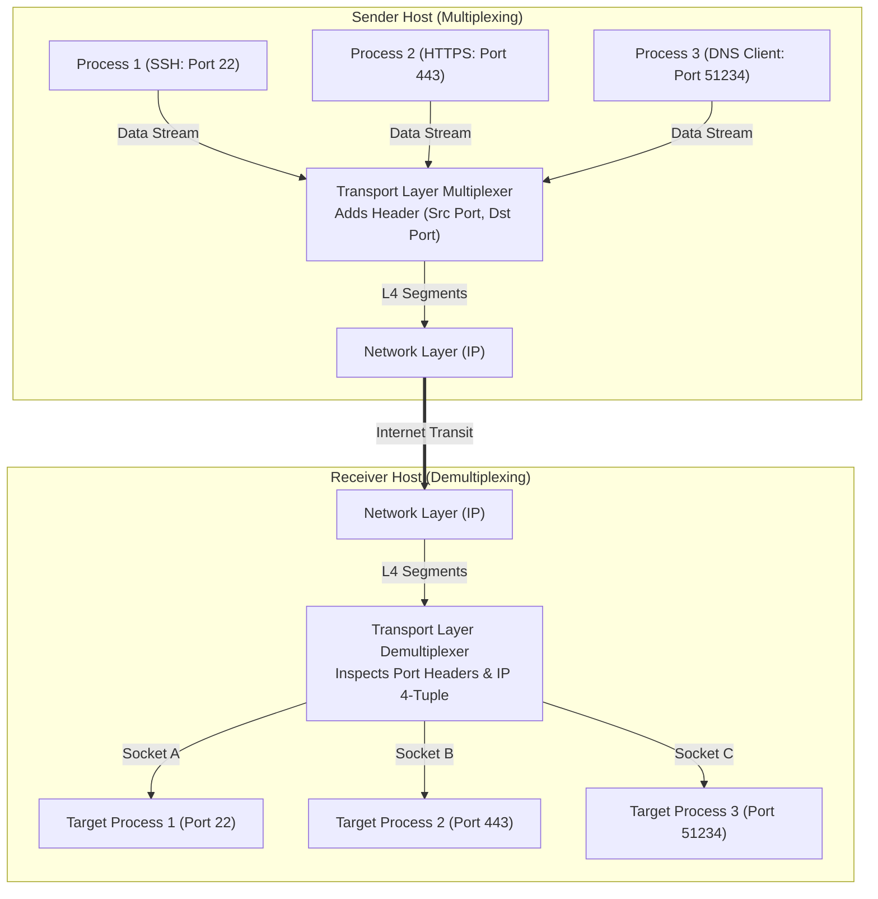
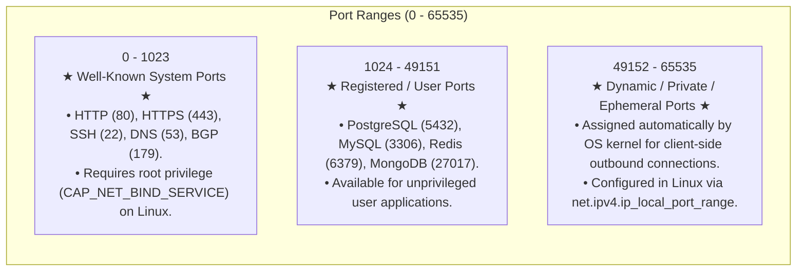
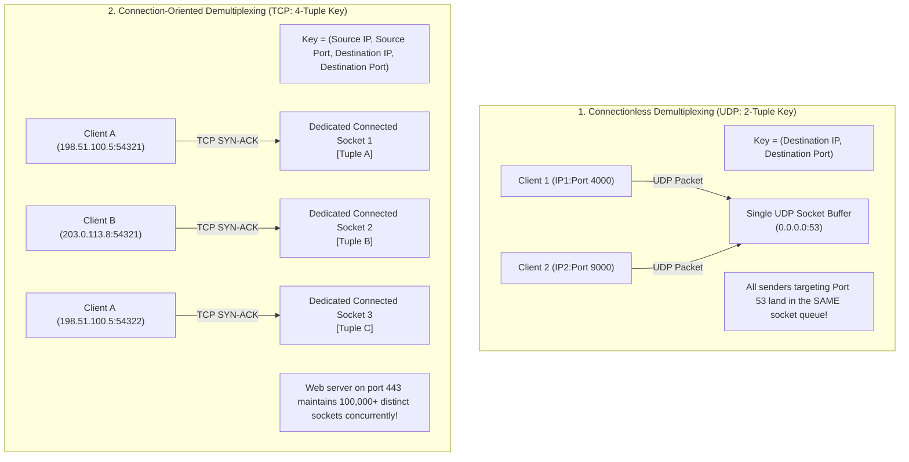
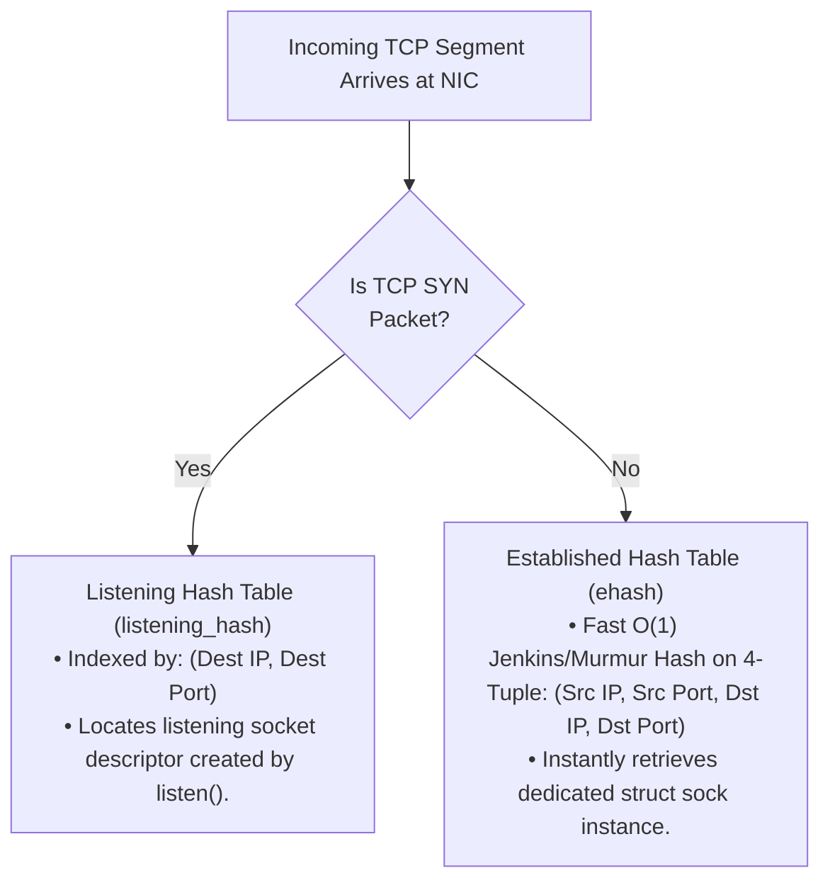
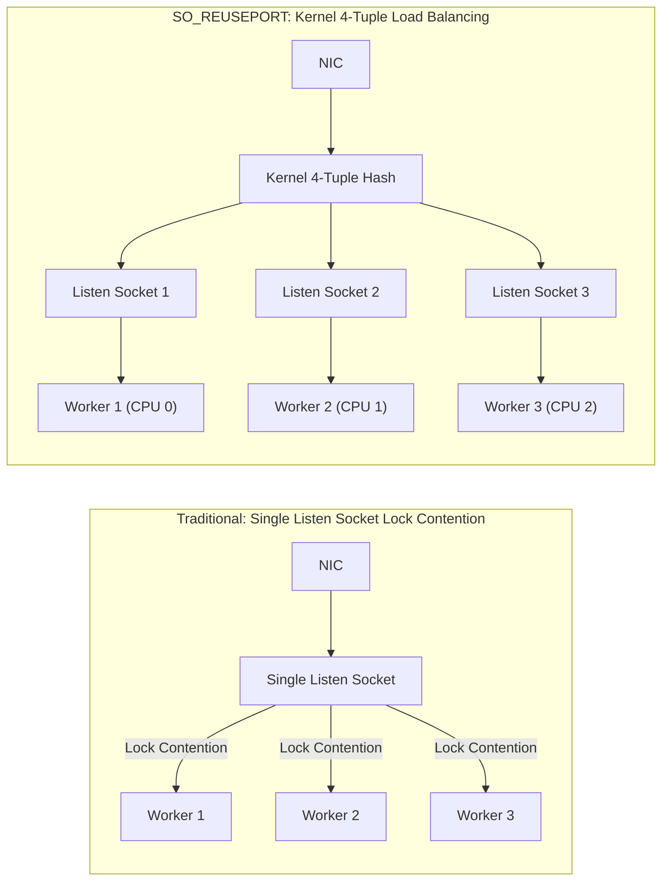

# Transport Layer Fundamentals: Multiplexing, Demultiplexing, and Ports

> [!abstract] Mental Model
> - **Host-to-Host (IP) vs Process-to-Process (Transport)**: The Network Layer (IPv4/IPv6) delivers a shipping crate to the front door of a massive high-rise apartment building (**Host IP Address**).
> - The Transport Layer (Layer 4) reads the apartment/room number (**Port Number**) and delivers the payload directly into the hands of the specific resident process (**Socket Descriptor**).

---

## 1. Multiplexing & Demultiplexing Mechanics



---

## 2. Port Number Taxonomy (RFC 6335 - 16-Bit Address Space)

Port numbers are unsigned 16-bit integers ranging from **$0$ to $65,535$**:



---

## 3. Connectionless vs Connection-Oriented Demultiplexing



---

## 4. Linux Kernel Socket Lookup Architecture

The Linux network stack maintains two high-performance hash tables inside `net/ipv4/tcp_ipv4.c`:



---

### High-Concurrency Scaling: `SO_REUSEPORT` (Linux 3.9+)

Without `SO_REUSEPORT`, multiple worker threads compete on a single listening socket with lock contention (`accept()` thundering herd):



---

## 5. Ephemeral Port Exhaustion Outages

```
HTTP Microservice A (Client) ==========> Microservice B (Backend API: 10.0.0.2:8080)
```
- When Microservice A opens thousands of short-lived TCP connections without HTTP Keep-Alive / connection pooling, all ephemeral ports ($32,768 - 60,999 \approx 28,000\text{ ports}$) get trapped in `TIME_WAIT` state ($120\text{ seconds}$).
- **Failure Mode**: Kernel returns **`errno 99: EADDRNOTAVAIL (Cannot assign requested address)`**.
- **Production Resolution**:
  1. Enable HTTP Connection Pooling / Keep-Alive in application client.
  2. Expand local port range: `sysctl -w net.ipv4.ip_local_port_range="1024 65535"`.
  3. Enable TCP timestamp reuse: `sysctl -w net.ipv4.tcp_tw_reuse=1`.

---

## Production Diagnostics & Socket Inspection

```bash
# 1. Inspect Active Listening & Established Sockets with Process Inodes:
sudo ss -tulpn

# Output:
# Netid State  Recv-Q Send-Q Local Address:Port  Peer Address:Port Process
# tcp   LISTEN 0      128          0.0.0.0:443        0.0.0.0:*    users:(("nginx",pid=1204,fd=6))
# tcp   LISTEN 0      128          0.0.0.0:22         0.0.0.0:*    users:(("sshd",pid=842,fd=3))
# udp   UNCONN 0      0            0.0.0.0:53         0.0.0.0:*    users:(("named",pid=910,fd=512))

# 2. Inspect Linux Kernel Ephemeral Port Range:
sysctl net.ipv4.ip_local_port_range
# net.ipv4.ip_local_port_range = 32768 60999

# 3. View TCP Hash Table Memory Allocation in Kernel dmesg:
sudo dmesg | grep -i "TCP established hash table"
# [    0.124891] TCP established hash table entries: 65536 (order: 7, 524288 bytes, linear)
```

---

## Active Recall & Interview Perspective

### Reasoning Prompts
1. *Why can a web server host hundreds of thousands of concurrent TCP connections on port 443, yet a UDP server on port 53 handles all incoming traffic on a single socket?*
   - **Answer**: Demultiplexing keys differ fundamentally between transport protocols. UDP is connectionless and uses a **2-tuple key (`Destination IP, Destination Port`)**. All incoming UDP datagrams matching that destination port are placed into a single shared socket receive buffer. In contrast, TCP is connection-oriented and uses a **4-tuple key (`Source IP, Source Port, Destination IP, Destination Port`)**. When a client initiates a connection, the web server's listening socket accepts the SYN and creates a brand-new, dedicated connected socket data structure (`struct sock`) indexed by the full 4-tuple in the kernel's established hash table (`ehash`). Because each client connection has a unique source IP and/or source ephemeral port, tens of thousands of unique 4-tuples can coexist simultaneously on port 443 without collision.
2. *Why does binding to port numbers below 1024 require `CAP_NET_BIND_SERVICE` or root privileges on UNIX operating systems?*
   - **Answer**: Historically on multi-user UNIX systems, ports $0 - 1023$ were designated as **Privileged / Well-Known Ports** (e.g. port 21 for FTP, port 22 for SSH, port 80 for HTTP). Restricting binding privileges to the root superuser prevented unprivileged local users from spinning up rogue daemon processes that could impersonate critical system services, harvest user passwords, or intercept incoming authentication traffic. Modern Linux systems enforce this security boundary via POSIX capabilities (`CAP_NET_BIND_SERVICE`).
3. *What is `SO_REUSEPORT` and how does it resolve multi-core CPU scaling bottlenecks in web servers like Nginx and HAProxy?*
   - **Answer**: Traditionally, when multiple worker processes shared a listening port, they either contended over a single listening socket file descriptor (causing kernel spinlock contention and cache line bouncing during `accept()`) or suffered from thundering herd wakeups. The **`SO_REUSEPORT` socket option (Linux 3.9+)** allows multiple independent worker processes to bind directly to the exact same IP:Port tuple. The Linux kernel allocates an independent listening socket queue for each worker and automatically load-balances incoming TCP connections across the sockets by computing an $O(1)$ hash on the incoming 4-tuple, eliminating lock contention and distributing CPU load linearly across cores.

---

## Key Takeaways
- Transport layer provides **Process-to-Process** delivery via 16-bit **Port Numbers** ($0-65535$).
- **UDP** demuxes via **2-Tuple**; **TCP** demuxes via **4-Tuple** (`ehash` table in Linux kernel).
- **`SO_REUSEPORT`** enables lock-free multi-core socket scaling.
- Connection pooling prevents **`EADDRNOTAVAIL` Ephemeral Port Exhaustion**.

---

## Related Notes
- [[Computer Networks MOC]] — Master table of contents for Computer Networks.
- [[Encapsulation, De-encapsulation, and Protocol Data Units - PDUs]] — Transport segment encapsulation.
- [[Network Layer - Packet Forwarding vs Routing]] — Host-to-Host IP layer underlay.
- [[User Datagram Protocol - UDP Architecture and Checksum]] — 2-tuple connectionless transport.
- [[Transmission Control Protocol - TCP Header, Features, and Invariants]] — 4-tuple connection-oriented byte stream.
- [[TCP Three-Way Handshake and Connection Termination]] — Socket state transitions and `TIME_WAIT`.
