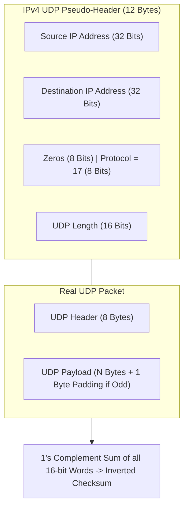
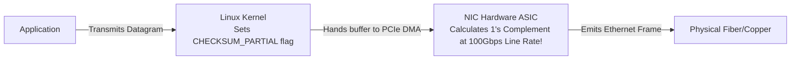
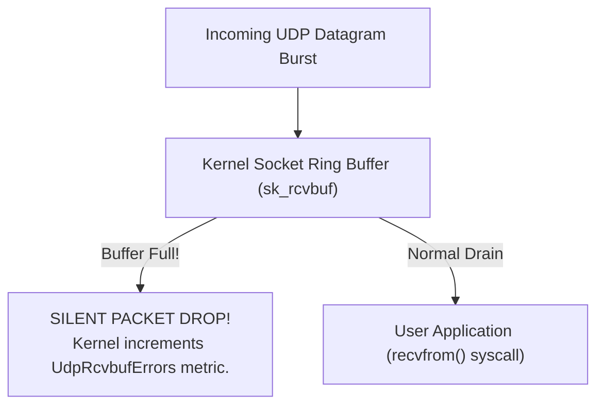
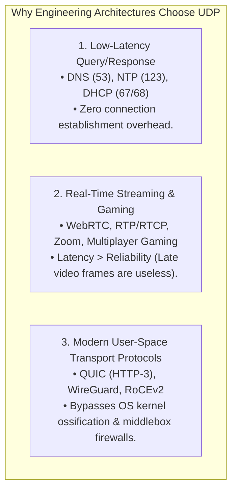

# User Datagram Protocol (UDP): Architecture, Checksum, and Kernel Buffers

> [!abstract] Mental Model
> - **The Postcard vs The Certified Courier**: TCP is a certified courier requiring identity checks, signatures, tracking, and receipts.
> - **UDP (RFC 768)** is a lightweight postcard dropped into a mailbox. It provides the **bare minimum abstraction** over raw IP datagrams: adding only **Process-to-Process Ports** and **Optional/Mandatory Checksum validation**, with zero connection state, zero handshakes, zero flow control, and zero head-of-line blocking.

---

## 1. The Minimalist 8-Byte (64-Bit) UDP Header Format

```
 0                   1                   2                   3
 0 1 2 3 4 5 6 7 8 9 0 1 2 3 4 5 6 7 8 9 0 1 2 3 4 5 6 7 8 9 0 1
+-+-+-+-+-+-+-+-+-+-+-+-+-+-+-+-+-+-+-+-+-+-+-+-+-+-+-+-+-+-+-+-+
|          Source Port          |       Destination Port        |
+-+-+-+-+-+-+-+-+-+-+-+-+-+-+-+-+-+-+-+-+-+-+-+-+-+-+-+-+-+-+-+-+
|            Length             |           Checksum            |
+-+-+-+-+-+-+-+-+-+-+-+-+-+-+-+-+-+-+-+-+-+-+-+-+-+-+-+-+-+-+-+-+
|                            Payload                            |
+-+-+-+-+-+-+-+-+-+-+-+-+-+-+-+-+-+-+-+-+-+-+-+-+-+-+-+-+-+-+-+-+
```

| Field Name | Width | Technical Description |
| :--- | :---: | :--- |
| **Source Port** | $16\text{ Bits}$ | Ephemeral client port (or server service port). Set to `0` if no reply is expected. |
| **Destination Port**| $16\text{ Bits}$ | Target service port (e.g. `53` for DNS, `123` for NTP, `443` for QUIC). |
| **Length** | $16\text{ Bits}$ | Total byte length of **UDP Header ($8\text{B}$) + Payload**. Max theoretical: $65,535 - 20 (\text{IP}) = 65,507\text{ bytes}$. |
| **Checksum** | $16\text{ Bits}$ | 1's complement sum of **Pseudo-Header + UDP Header + UDP Payload**. |

---

## 2. The UDP Pseudo-Header & Checksum Calculation

To prevent misrouted packets (caused by corrupted destination IP addresses or NAT translation errors) from corrupting application memory, the UDP Checksum covers an imaginary **Pseudo-Header**:



> [!IMPORTANT] Invariant: IPv4 vs IPv6 UDP Checksums
> - **In IPv4**: Checksum is **Optional**. If unused, it is transmitted as `0x0000`. (If calculated checksum evaluates to `0x0000`, it is transmitted as `0xFFFF`).
> - **In IPv6**: Checksum is **Strictly Mandatory**! Because IPv6 removed the IP header checksum to optimize router forwarding, end-to-end Layer 4 checksumming is mandatory.

---

## 3. Hardware Checksum Offloading (NIC RX/TX Offload)

Modern high-speed NICs compute UDP checksums directly inside hardware ASICs:



---

## 4. Kernel Socket Buffers & `UdpRcvbufErrors` Outages

Because UDP has no sliding window flow control, if a sender transmits datagrams faster than the userland application thread can invoke `recvfrom()`, the Linux kernel socket buffer (`sk_rcvbuf`) overflows:



### Production Tuning & Resolution:
```bash
# 1. Expand System-Wide Max UDP Receive Buffer to 32MB:
sudo sysctl -w net.core.rmem_max=33554432
sudo sysctl -w net.core.rmem_default=33554432

# 2. In Application Code (C / Python):
# setsockopt(sock, SOL_SOCKET, SO_RCVBUF, 33554432)
```

---

## 5. UDP Application Taxonomy



---

## Production Diagnostics & Packet Capture

```bash
# 1. Inspect UDP Socket Buffers & Drop Errors:
netstat -su

# Output:
# Udp:
#     142054 packets received
#     0 packets to unknown port received
#     4521 packet receive errors          <-- Buffer overflow drops!
#     142054 packets sent
#     RcvbufErrors: 4521

# 2. View Active UDP Sockets and Memory Queues:
ss -u -a

# 3. Live Packet Capture of UDP Traffic on Port 53 (DNS):
sudo tcpdump -i eth0 -nn -vv "udp port 53"
```

---

## Active Recall & Interview Perspective

### Reasoning Prompts
1. *Why is the UDP Checksum optional in IPv4 but strictly mandatory in IPv6?*
   - **Answer**: In IPv4, the network-layer IPv4 header includes its own dedicated **Header Checksum** field, which verifies the integrity of IP addresses and header fields at every hop. Consequently, designers of RFC 768 made the UDP checksum optional for IPv4 to conserve CPU cycles in resource-constrained systems. However, when **IPv6** was designed, the network-layer checksum was completely eliminated to accelerate router forwarding performance in hardware ASICs. Without an IP-layer checksum, bit-flips in transit would pass undetected unless Layer 4 performed validation. Therefore, IPv6 made the **UDP Checksum strictly mandatory** to prevent silent data corruption.
2. *Why does the UDP Checksum calculation include a "Pseudo-Header", and what specific failure mode does this prevent?*
   - **Answer**: The UDP header only contains port numbers and packet length, with no record of the source or destination IP addresses. If an intermediate router or hardware bug corrupts an IP packet's destination address, or if a stateful NAT firewall mis-translates an IP mapping, the IP packet could be delivered to the wrong physical host. Without the pseudo-header, that host's transport layer would inspect only the destination port, find a matching socket, and deliver corrupted data to an unsuspecting application. The **Pseudo-Header incorporates the 32/128-bit Source and Destination IP addresses** into the checksum computation, ensuring that if the packet arrives at the wrong host IP, the checksum calculation fails and the packet is immediately discarded.
3. *Why does modern HTTP-3 / QUIC operate on top of UDP rather than inventing a brand new Layer 4 protocol?*
   - **Answer**: Over the past 30 years, internet middleboxes (NATs, firewalls, load balancers, and ISP routers) have suffered from severe **Protocol Ossification**: any IP packet with a protocol number other than `6` (TCP) or `17` (UDP) is aggressively blocked or dropped by intermediate enterprise firewalls. Furthermore, modifying TCP behavior requires kernel upgrades across billions of end-user operating systems. Building **QUIC on top of UDP** allowed engineers to deploy modern transport features (stream multiplexing, zero RTT handshakes, connection migration, and custom congestion control) entirely in **User Space** as application software, while traversing existing global internet firewalls seamlessly as standard UDP datagrams.

---

## Key Takeaways
- UDP is an **8-Byte Header** providing **Ports** and **Checksum**.
- **Pseudo-Header** protects against IP routing/NAT delivery corruption.
- **Mandatory in IPv6**; **Optional in IPv4**.
- Unchecked socket buffer overflow causes **`UdpRcvbufErrors` silent packet drops**.
- Foundation of **DNS, WebRTC, WireGuard, and HTTP-3 / QUIC**.

---

## Related Notes
- [[Computer Networks MOC]] — Master table of contents for Computer Networks.
- [[Encapsulation, De-encapsulation, and Protocol Data Units - PDUs]] — Transport PDU encapsulation.
- [[Transport Layer Fundamentals - Multiplexing, Demultiplexing, Ports]] — 2-tuple socket demuxing.
- [[Transmission Control Protocol - TCP Header, Features, and Invariants]] — Reliable byte-stream counterpart.
- [[Domain Name System - DNS Hierarchy, Recursive Resolution, EDNS, DNSSEC]] — Core UDP application.
- [[HTTP-3 and QUIC - UDP-Based Transport, Head-of-Line Blocking Elimination]] — Next-generation UDP transport.
