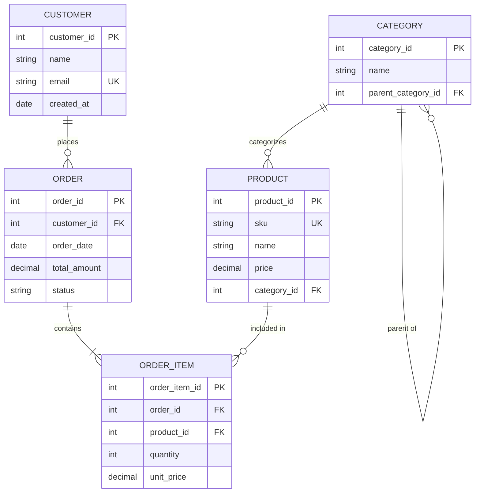
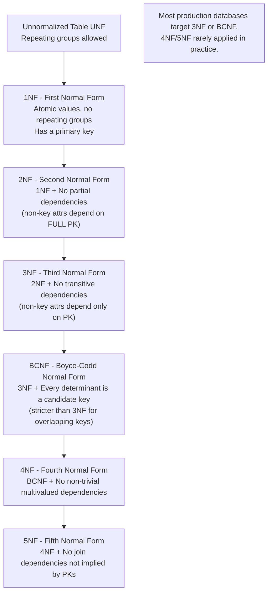

---
title: "Relational Model - Tables, Keys, Functional Dependencies, Normalization"
subject: "DBMS"
module: "01 - Relational Model & SQL Foundations"
difficulty: "Intermediate"
prerequisites:
  - "Basic set theory"
  - "Logic and predicates"
related:
  - "SQL Foundations - DDL, DML, Joins, Subqueries, Window Functions"
  - "Transactions and ACID Properties"
  - "B-Tree and B+ Tree Indexes - Structure, Search, Insert, Split"
  - "Cost-Based Optimizer - Statistics, Cardinality Estimation, Join Ordering"
aliases:
  - "Relational Model"
  - "Normalization"
  - "1NF"
  - "2NF"
  - "3NF"
  - "BCNF"
  - "Functional Dependencies"
  - "Entity-Relationship"
  - "ER Diagram"
tags:
  - dbms
  - relational-model
  - normalization
  - functional-dependencies
  - sql
  - keys
  - er-diagram
  - bcnf
  - codd
status: "complete"
---

# Relational Model — Tables, Keys, Functional Dependencies, and Normalization

## Mental Model

The relational model, proposed by Edgar Codd in 1970, is built on a beautiful mathematical insight: **all data can be represented as relations (tables) and all operations on that data can be expressed as set operations**. Think of each table like a spreadsheet with two crucial constraints: (1) every row is unique (no duplicates — set property), and (2) the meaning of each column is fixed and consistent across all rows (schema). The model's power comes from its mathematical foundation in first-order predicate logic — every relational query is a logical formula over data.

Normalization is the process of **decomposing a messy "wide" table into smaller, well-structured tables** to eliminate redundancy and prevent update anomalies. Think of it like organizing a cluttered room into labeled drawers — each fact lives in exactly one place. If you change it, you change it once. If you leave it in multiple places, inconsistency is inevitable.

---

## Core Concepts / Architecture

### Key Terminology

| Term | Formal Definition | Informal |
|------|------------------|----------|
| Relation | Named set of tuples (rows) with a fixed schema | Table |
| Tuple | Ordered list of attribute values; member of a relation | Row / Record |
| Attribute | Named domain-typed column in the schema | Column / Field |
| Domain | Set of valid values for an attribute | Data type + constraints |
| Relation Schema | R(A1, A2, ..., An) — name + attribute list | Table definition |
| Relation Instance | Specific set of tuples satisfying the schema | Table contents at a point in time |
| Cardinality | Number of tuples in the relation | Row count |
| Arity / Degree | Number of attributes | Column count |
| NULL | Absent / unknown value — not zero, not empty string | NULL |

### Keys

| Key Type | Definition | Properties |
|----------|-----------|------------|
| Superkey | Any attribute set that uniquely identifies a tuple | Uniqueness, may have extras |
| Candidate Key | Minimal superkey — removing any attribute loses uniqueness | Uniqueness + minimality |
| Primary Key (PK) | Chosen candidate key, enforced by DBMS | Unique + NOT NULL |
| Alternate Key | Candidate key not chosen as primary | Unique, may allow NULL |
| Foreign Key (FK) | Attribute(s) referencing PK of another relation | Referential integrity |
| Composite Key | Key consisting of 2+ attributes | Multi-column uniqueness |
| Surrogate Key | System-generated artificial key (e.g., SERIAL, UUID) | No business meaning |
| Natural Key | Derived from real-world data (e.g., SSN, email) | Has business meaning |

---

## Visual Diagram

### Entity-Relationship (ER) Diagram → Relational Schema Mapping



### Normalization Progression



---

## Deep Dive

### 1. Functional Dependencies

A **functional dependency (FD)** X → Y (read: "X determines Y" or "Y is functionally dependent on X") means: for any two tuples in the relation with the same X values, they must have the same Y values.

```
Notation: X → Y
Meaning: "Knowing X's value tells you Y's value with certainty"
Example: StudentID → StudentName (knowing student ID determines their name)

Trivial FD: X → Y where Y ⊆ X (Y is a subset of X — always true, not interesting)
Non-trivial FD: X → Y where Y ⊄ X (genuinely informative)
```

#### Armstrong's Axioms (Complete and Sound Inference Rules)

```
Reflexivity:  If Y ⊆ X, then X → Y        (trivial FDs)
Augmentation: If X → Y, then XZ → YZ      (add same attrs to both sides)
Transitivity: If X → Y and Y → Z, then X → Z

Derived rules:
  Union:        If X → Y and X → Z, then X → YZ
  Decomposition: If X → YZ, then X → Y and X → Z
  Pseudotransitivity: If X → Y and WY → Z, then WX → Z

Use to find closure of X (all attributes determined by X):
  X+ = closure of X under given FDs
```

#### Closure Computation Example

```
Relation: R(A, B, C, D, E)
FDs: {A → B, B → C, A → D, D → E}

Find closure of {A}:
  Start: {A}+  = {A}
  Apply A → B:  {A}+ = {A, B}
  Apply B → C:  {A}+ = {A, B, C}
  Apply A → D:  {A}+ = {A, B, C, D}
  Apply D → E:  {A}+ = {A, B, C, D, E}
  
  {A}+ = {A, B, C, D, E} = all attributes
  Therefore: A is a superkey (and candidate key since minimal)
```

#### Finding Candidate Keys Algorithm

```
Input: Relation R(A1...An), FD set F
Output: All candidate keys of R

Step 1: Find attributes that appear ONLY on right side of FDs (never left alone)
        These must be in EVERY superkey (they can't determine anything by themselves)
        
Step 2: Find attributes that appear ONLY on left side of FDs (or not at all)
        These must be in EVERY candidate key (nothing determines them)
        
Step 3: For remaining attributes, test subsets

Example:
R(A, B, C, D, E)
FDs: {AB → C, C → D, D → E}

Left-only: A, B (only appear on left side => must be in every CK)
Right-only: E (only on right => need not be in CK)

Start with {A, B}:
  {AB}+ = {A, B} -> apply AB → C -> {A,B,C} -> apply C → D -> {A,B,C,D} -> apply D → E -> {A,B,C,D,E}
  {AB}+ = all attrs => AB is a superkey
  Is it minimal? Remove A: {B}+ = {B} (not full) => A needed. Remove B: {A}+ = {A} (not full) => B needed.
  => AB is a candidate key
```

---

### 2. Normal Forms

#### 1NF (First Normal Form)
**Violation**: Repeating groups, multi-valued attributes, non-atomic values.

```sql
-- VIOLATES 1NF: 'phones' is multi-valued (comma-separated list)
CREATE TABLE bad_customers (
    customer_id INT PRIMARY KEY,
    name        VARCHAR(100),
    phones      VARCHAR(500)  -- '555-1234, 555-5678, 555-9012'  ← VIOLATION
);

-- 1NF-compliant:
CREATE TABLE customers (
    customer_id INT PRIMARY KEY,
    name        VARCHAR(100)
);
CREATE TABLE customer_phones (
    customer_id INT REFERENCES customers(customer_id),
    phone       VARCHAR(20),
    PRIMARY KEY (customer_id, phone)  -- composite PK
);
```

#### 2NF (Second Normal Form)
**Requirement**: 1NF + all non-key attributes fully depend on the ENTIRE primary key (eliminates partial dependencies).
**Only relevant** when PK is composite.

```sql
-- VIOLATES 2NF: PK is (order_id, product_id), but product_name depends only on product_id
CREATE TABLE bad_order_items (
    order_id     INT,
    product_id   INT,
    product_name VARCHAR(100),  -- ← Partial dependency: product_id → product_name
    quantity     INT,
    PRIMARY KEY (order_id, product_id)
);

-- 2NF-compliant: separate product_name into its own table
CREATE TABLE products (
    product_id   INT PRIMARY KEY,
    product_name VARCHAR(100)
);
CREATE TABLE order_items (
    order_id   INT,
    product_id INT REFERENCES products(product_id),
    quantity   INT,
    PRIMARY KEY (order_id, product_id)
);
```

#### 3NF (Third Normal Form)
**Requirement**: 2NF + no transitive dependencies (non-key attribute Y depends on non-key attribute X, which depends on PK).

```sql
-- VIOLATES 3NF: student_id → zipcode → city (transitive: city depends on zipcode, not directly on PK)
CREATE TABLE bad_students (
    student_id INT PRIMARY KEY,
    name       VARCHAR(100),
    zipcode    VARCHAR(10),
    city       VARCHAR(100),  -- ← Transitive dependency: zipcode → city
    state      VARCHAR(2)     -- ← Transitive dependency: zipcode → state
);

-- 3NF-compliant:
CREATE TABLE students (
    student_id INT PRIMARY KEY,
    name       VARCHAR(100),
    zipcode    VARCHAR(10) REFERENCES zip_codes(zipcode)
);
CREATE TABLE zip_codes (
    zipcode VARCHAR(10) PRIMARY KEY,
    city    VARCHAR(100),
    state   VARCHAR(2)
);
```

#### BCNF (Boyce-Codd Normal Form)
**Requirement**: For every FD X → Y, X must be a superkey.
**Difference from 3NF**: Handles cases with overlapping candidate keys where 3NF still allows non-superkey determinants of prime attributes.

```
Example where 3NF ≠ BCNF:
R(Student, Course, Instructor)
FDs: 
  {Student, Course} → Instructor  (PK)
  Instructor → Course              (each instructor teaches exactly one course)

Candidate keys: {Student, Course} and {Student, Instructor}
Prime attributes: Student, Course, Instructor (all in some CK)

3NF check: "Instructor → Course" — is Course a prime attr? YES.
           => 3NF allows this FD (prime attribute on right)
           => R is in 3NF

BCNF check: "Instructor → Course" — is Instructor a superkey? NO (Instructor alone doesn't determine Student).
           => R violates BCNF!

BCNF decomposition:
  R1(Instructor, Course)  — FD: Instructor → Course
  R2(Student, Instructor) — FD: {Student, Instructor} is PK

Trade-off: BCNF decomposition may lose FD preservation!
  (The FD {Student, Course} → Instructor cannot be checked in either R1 or R2 alone)
```

---

### 3. Update Anomalies (Why Normalization Matters)

```sql
-- Denormalized table (3NF violation):
CREATE TABLE employee_departments (
    emp_id      INT,
    emp_name    VARCHAR(100),
    dept_id     INT,
    dept_name   VARCHAR(100),  -- Repeated for every employee in dept!
    dept_budget DECIMAL(15,2)  -- Repeated for every employee in dept!
);

-- Insert anomaly:
-- Cannot add a department until at least one employee assigned to it
-- (dept_id + dept_name + dept_budget requires emp_id to have a row)

-- Update anomaly:
-- If dept_name changes, must update it in ALL rows for that dept.
-- Updating some but not all rows => INCONSISTENCY

-- Delete anomaly:
-- If last employee in a dept is deleted, dept info is LOST

-- Fix: Separate tables (3NF):
CREATE TABLE employees (
    emp_id  INT PRIMARY KEY,
    name    VARCHAR(100),
    dept_id INT REFERENCES departments(dept_id)
);
CREATE TABLE departments (
    dept_id INT PRIMARY KEY,
    name    VARCHAR(100),
    budget  DECIMAL(15,2)
);
```

---

## Production Example: Schema Design for an E-Commerce System

### Starting from Requirements

```
Business rules:
1. Customers place orders
2. Orders contain multiple products
3. Products belong to categories (hierarchical)
4. Each order has shipping address (may differ from customer address)
5. Products have variant attributes (size, color) with separate inventory per variant
6. Track order status history (created, confirmed, shipped, delivered, returned)
```

### Normalized Schema (3NF)

```sql
-- Core tables:
CREATE TABLE customers (
    customer_id   SERIAL PRIMARY KEY,
    email         VARCHAR(255) UNIQUE NOT NULL,  -- Natural alternate key
    name          VARCHAR(255) NOT NULL,
    created_at    TIMESTAMPTZ NOT NULL DEFAULT NOW(),
    password_hash CHAR(60)    -- bcrypt hash, fixed length
);

CREATE TABLE addresses (
    address_id   SERIAL PRIMARY KEY,
    customer_id  INT REFERENCES customers(customer_id) ON DELETE CASCADE,
    street       VARCHAR(255) NOT NULL,
    city         VARCHAR(100) NOT NULL,
    state        CHAR(2)      NOT NULL,
    zipcode      VARCHAR(10)  NOT NULL,
    country_code CHAR(2)      NOT NULL DEFAULT 'US',
    is_default   BOOLEAN      NOT NULL DEFAULT FALSE
);
-- Constraint: at most one default per customer
CREATE UNIQUE INDEX idx_one_default_per_customer
    ON addresses (customer_id) WHERE is_default = TRUE;

CREATE TABLE categories (
    category_id       SERIAL PRIMARY KEY,
    name              VARCHAR(100) NOT NULL,
    parent_category_id INT REFERENCES categories(category_id)  -- Self-referential (hierarchical)
);

CREATE TABLE products (
    product_id   SERIAL PRIMARY KEY,
    sku          VARCHAR(50)    UNIQUE NOT NULL,
    name         VARCHAR(255)   NOT NULL,
    description  TEXT,
    category_id  INT            REFERENCES categories(category_id),
    base_price   NUMERIC(10,2)  NOT NULL,
    created_at   TIMESTAMPTZ    NOT NULL DEFAULT NOW()
);

-- Product variants (size, color, etc.):
CREATE TABLE product_variants (
    variant_id     SERIAL PRIMARY KEY,
    product_id     INT         REFERENCES products(product_id) ON DELETE CASCADE,
    sku_suffix     VARCHAR(20) NOT NULL,  -- e.g., '-RED-L' appended to product SKU
    attributes     JSONB       NOT NULL,  -- {"color": "red", "size": "L"}
    price_delta    NUMERIC(10,2) NOT NULL DEFAULT 0,  -- Premium/discount vs base price
    stock_qty      INT         NOT NULL DEFAULT 0,
    UNIQUE (product_id, sku_suffix)
);

CREATE TABLE orders (
    order_id         SERIAL PRIMARY KEY,
    customer_id      INT         NOT NULL REFERENCES customers(customer_id),
    shipping_address_id INT      NOT NULL REFERENCES addresses(address_id),
    status           VARCHAR(20) NOT NULL DEFAULT 'pending',
    created_at       TIMESTAMPTZ NOT NULL DEFAULT NOW(),
    total_amount     NUMERIC(12,2),
    CONSTRAINT chk_status CHECK (status IN ('pending','confirmed','shipped','delivered','cancelled','returned'))
);

-- Order items (associative entity between orders and product variants):
CREATE TABLE order_items (
    order_item_id SERIAL PRIMARY KEY,
    order_id      INT           NOT NULL REFERENCES orders(order_id) ON DELETE CASCADE,
    variant_id    INT           NOT NULL REFERENCES product_variants(variant_id),
    quantity      INT           NOT NULL CHECK (quantity > 0),
    unit_price    NUMERIC(10,2) NOT NULL,  -- Snapshot of price at time of purchase (not REFERENCES!)
    UNIQUE (order_id, variant_id)          -- Each variant once per order
);

-- Order status history (instead of single status column — audit trail):
CREATE TABLE order_status_history (
    history_id  SERIAL PRIMARY KEY,
    order_id    INT         NOT NULL REFERENCES orders(order_id),
    status      VARCHAR(20) NOT NULL,
    changed_at  TIMESTAMPTZ NOT NULL DEFAULT NOW(),
    changed_by  INT         REFERENCES customers(customer_id),  -- Or admin user ID
    note        TEXT
);

-- Functional dependencies verified (3NF):
-- orders: order_id → {customer_id, shipping_address_id, status, created_at, total_amount} ✓
-- order_items: order_item_id → {order_id, variant_id, quantity, unit_price}
--   Also: (order_id, variant_id) → {quantity, unit_price} (alternate CK) ✓
--   No transitive deps: unit_price is a SNAPSHOT (not determined by variant_id alone at query time) ✓
```

### Checking Normalization

```sql
-- Verify no partial dependencies:
-- order_items PK candidates: order_item_id, (order_id, variant_id)
-- All non-key attrs {quantity, unit_price} depend on full composite key ✓

-- Verify no transitive dependencies in orders:
-- order_id → customer_id → customer.email (transitive!)
-- But customer.email is in ANOTHER TABLE (customers), not in orders table.
-- Within orders: customer_id is a FK, not an attribute with its own dependencies. ✓

-- unit_price in order_items: Could be: variant_id → current price? 
-- No — it's a snapshot of the price AT ORDER TIME, not a reference.
-- This is intentional denormalization for historical accuracy ✓

EXPLAIN (ANALYZE, BUFFERS) 
SELECT 
    o.order_id,
    c.email,
    SUM(oi.quantity * oi.unit_price) as total
FROM orders o
JOIN customers c ON c.customer_id = o.customer_id
JOIN order_items oi ON oi.order_id = o.order_id
WHERE o.created_at >= '2026-01-01'
GROUP BY o.order_id, c.email;
```

---

## Failure Modes / Trade-offs

1. **Over-Normalization Causes Join Explosion**
   - Problem: Strict 5NF may require 8+ table joins for a simple query; each join is expensive (hash join, sort-merge join); latency and optimizer complexity skyrocket
   - Mitigation: Target 3NF/BCNF for OLTP; deliberately denormalize read-heavy paths (materialized views, summary tables, JSONB for flexible attrs); separate OLAP schema (star schema, denormalized fact tables)

2. **BCNF Decomposition Loses FD Preservation**
   - Problem: Some BCNF decompositions cannot preserve all functional dependencies; enforcing lost FDs requires multi-table constraint triggers, which are expensive
   - Mitigation: If FD preservation is critical, accept 3NF (which always allows lossless, dependency-preserving decomposition); document unenforceable FDs; use application-level validation

3. **NULL Proliferation in Sparse Schemas**
   - Problem: Highly normalized schemas with optional attributes result in many NULL values; NULLs complicate three-valued logic in SQL (NULL != NULL, NULL comparisons return UNKNOWN not FALSE)
   - Mitigation: Use separate tables for optional attribute groups (subtype tables); or use JSONB/HSTORE for truly sparse attributes; document NULL semantics carefully

4. **Surrogate Key Drawbacks**
   - Problem: Surrogate PKs (SERIAL, UUID) have no business meaning; uniqueness constraints on natural keys still needed as UNIQUE; UUID primary keys fragment B+ tree index pages
   - Mitigation: Always add UNIQUE constraint on natural key; for UUID PKs, use UUIDv7 (time-ordered) to reduce index fragmentation; or use BIGSERIAL for sequential insertions

5. **Foreign Key Constraint Performance**
   - Problem: FK constraints require an index lookup on the referenced table for every INSERT/UPDATE; high-write throughput systems can spend 20-30% of write time on FK validation
   - Mitigation: Ensure FK columns are always indexed on BOTH sides; consider deferred FK checking (`DEFERRABLE INITIALLY DEFERRED`) for bulk loads; in extreme cases, enforce FK semantics at application layer and drop DB-level FK constraints

6. **Schema Migration Complexity**
   - Problem: As requirements change, adding columns to normalized tables is easy; but restructuring normalized tables (splitting, merging) requires complex data migrations that are difficult to rollback
   - Mitigation: Use schema migration tools (Flyway, Liquibase, Alembic) with versioned migrations; test migrations on production-sized datasets; use `NOT NULL DEFAULT` strategies for zero-downtime column additions

---

## Active-Recall Prompts

1. **What is the difference between a candidate key and a primary key? Can a relation have more than one candidate key?**
   *(Answer: A candidate key is any minimal set of attributes that uniquely identifies tuples — minimal means removing any attribute destroys uniqueness. A primary key is the ONE candidate key chosen to be the "official" identifier, enforced as NOT NULL + UNIQUE by the DBMS. Yes, a relation can have multiple candidate keys (e.g., employee table with both employee_id and social_security_number as candidate keys). The non-chosen candidate keys are called alternate keys.)*

2. **Explain the difference between 2NF and 3NF violations with concrete examples.**
   *(Answer: 2NF violation = partial dependency = non-key attribute depends on PART of composite PK. Example: In (OrderID, ProductID, ProductName, Quantity), ProductName depends only on ProductID (part of PK), not the full (OrderID, ProductID). 3NF violation = transitive dependency = non-key attribute depends on another non-key attribute. Example: In (StudentID, ZipCode, City), City depends on ZipCode, which depends on StudentID — City is not directly determined by the PK but transitively through ZipCode.)*

3. **When does BCNF differ from 3NF? Give an example of a relation in 3NF but not BCNF.**
   *(Answer: BCNF differs from 3NF when there are overlapping candidate keys and a non-superkey determines a prime attribute. Example: R(Student, Course, Instructor) with FDs: {Student,Course}→Instructor and Instructor→Course. Candidate keys: {Student,Course} and {Student,Instructor}. The FD Instructor→Course has Course on the right — Course is a prime attribute (part of a CK), so 3NF allows it. But Instructor is NOT a superkey, so BCNF forbids it. The relation is in 3NF but not BCNF.)*

4. **What are the three types of update anomalies that normalization eliminates?**
   *(Answer: (1) Insert anomaly: Cannot insert a fact without inserting related facts (e.g., cannot add a department without having at least one employee). (2) Update anomaly: Changing a fact requires updating multiple rows; failure to update all rows creates inconsistency (e.g., changing dept_name in a denormalized employee table must be done for every employee in that dept). (3) Delete anomaly: Deleting a row loses other facts (e.g., deleting the last employee in a dept loses all dept information if stored in same table).)*

---

## Related Notes

- [[SQL Foundations - DDL, DML, Joins, Subqueries, Window Functions]]
- [[B-Tree and B+ Tree Indexes - Structure, Search, Insert, Split]]
- [[Transactions and ACID Properties - Atomicity, Consistency, Isolation, Durability]]
- [[Cost-Based Optimizer - Statistics, Cardinality Estimation, Join Ordering]]
- [[PostgreSQL Internals - MVCC Implementation, Tuple Header, VACUUM, Toast]]
- [[Database Management Systems MOC]]

---

> **Interview Question**: *You are designing the schema for a multi-tenant SaaS application with 10,000 tenants, each with up to 1 million users. The application has a user table, subscription plans, and feature flags per plan. Walk through your normalization process from requirements to a fully normalized schema, and then justify any deliberate denormalizations for read performance.*
>
> **Model Answer**: Start with requirements: users belong to tenants; tenants have subscription plans; plans have feature flags; feature flags can be overridden per tenant; users have profiles. **Raw unnormalized table**: (tenant_id, tenant_name, plan_id, plan_name, plan_features_csv, user_id, user_email, user_name, override_features_csv) — massive 1NF and 3NF violations. **1NF**: Split multi-valued plan_features into separate rows; make plan_features its own table. **2NF**: Separate tenant_name from user rows (partial dep on tenant_id only); separate plan_name (partial dep on plan_id only). **3NF**: tenant_name should not appear in subscriptions table (transitive via tenant_id→tenant_name). Resulting normalized schema: `tenants(tenant_id PK, name, created_at)`, `plans(plan_id PK, name, price, billing_period)`, `features(feature_id PK, name, description)`, `plan_features(plan_id FK, feature_id FK, enabled BOOL, PRIMARY KEY(plan_id, feature_id))`, `tenant_subscriptions(tenant_id FK, plan_id FK, start_date, end_date)`, `tenant_feature_overrides(tenant_id FK, feature_id FK, enabled BOOL, PRIMARY KEY(tenant_id, feature_id))`, `users(user_id PK, tenant_id FK, email UNIQUE, name, created_at)`. **Deliberate denormalizations**: (1) Cache the current plan_id on the tenant row (denormalization) to avoid joining subscriptions on every request check — write-through on plan changes. (2) Materialize resolved feature flags per tenant into a `tenant_effective_features(tenant_id, feature_id, enabled)` table, populated via trigger or background job — eliminates the plan_features + override join on every API request. (3) Add a `plan_name` column to invoices table (snapshot) so historical invoices are not affected by plan renames.

---
*Last updated: 2026-08-18 | Status: Complete | Module 1 — Relational Model & SQL Foundations*
