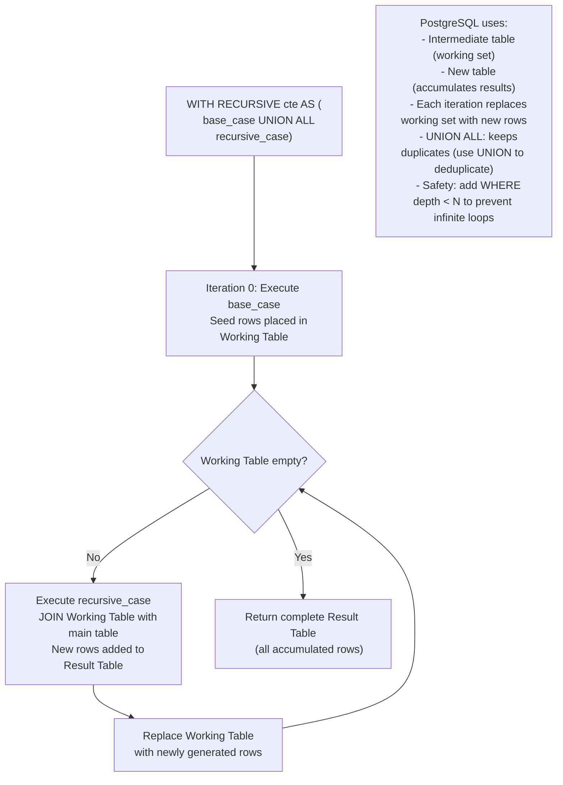
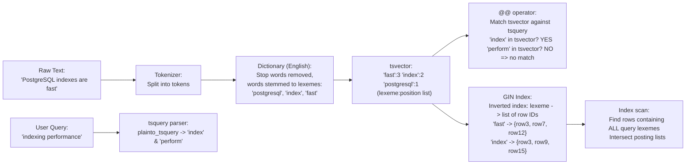

---
title: "SQL Advanced - CTEs, Recursive Queries, JSON Operations, Full-Text Search"
subject: "DBMS"
module: "01 - Relational Model & SQL Foundations"
difficulty: "Advanced"
prerequisites:
  - "SQL Foundations - DDL, DML, Joins, Subqueries, Window Functions"
  - "Relational Model - Tables, Keys, Functional Dependencies, Normalization"
  - "B-Tree and B+ Tree Indexes - Structure, Search, Insert, Split, Balancing"
related:
  - "SQL Foundations - DDL, DML, Joins, Subqueries, Window Functions"
  - "Query Processing Pipeline - Parser, Rewriter, Planner, Executor"
  - "Cost-Based Optimizer - Statistics, Cardinality Estimation, Join Ordering"
  - "B-Tree and B+ Tree Indexes - Structure, Search, Insert, Split, Balancing"
aliases:
  - "CTE"
  - "Recursive CTE"
  - "WITH RECURSIVE"
  - "JSONB"
  - "Full-Text Search"
  - "tsvector"
  - "tsquery"
  - "GIN index"
  - "Bill of Materials"
tags:
  - dbms
  - sql
  - cte
  - recursive-cte
  - jsonb
  - full-text-search
  - tsvector
  - gin-index
  - postgresql
  - advanced-sql
status: "complete"
---

# SQL Advanced — CTEs, Recursive Queries, JSON Operations, Full-Text Search

## Mental Model

Three powerful SQL features that extend the base relational model into real-world complexity:

**CTEs** are like naming intermediate steps in a recipe — instead of one giant nested expression, you name each step (`WITH step1 AS (...), step2 AS (...)`), making complex queries readable and maintainable. Recursive CTEs add a loop: start with a seed, apply a rule repeatedly until done — exactly how you walk a tree or graph.

**JSONB** is the escape hatch from rigid relational schema. When your data has variable structure (user preferences, product attributes, event payloads), JSONB lets you store and query structured documents inside a relational column with full indexing support. Think of it as a labeled filing cabinet within a drawer.

**Full-Text Search (FTS)** transforms the brute-force `LIKE '%keyword%'` (sequential scan of character-by-character matching) into a linguistic search engine. PostgreSQL parses text into lexemes (dictionary-normalized word roots), stores them as `tsvector`, and matches queries expressed as `tsquery` using an inverted GIN index — similar to how a book index works: find the concept, jump to the pages.

---

## Core Concepts / Architecture

### CTE Types

| CTE Type | Syntax | Behavior | Use Case |
|----------|--------|----------|---------|
| Simple CTE | `WITH name AS (SELECT ...)` | Inline view; may or may not materialize | Readability, reuse of subquery |
| Materialized CTE | `WITH name AS MATERIALIZED (...)` | Always executes once; result cached | Force single execution, side-effect isolation |
| Not-Materialized CTE | `WITH name AS NOT MATERIALIZED (...)` | Inlined by optimizer | Allow optimizer to push predicates down |
| Recursive CTE | `WITH RECURSIVE name AS (base UNION ALL recursive)` | Iterative execution until empty | Trees, graphs, sequences |
| DML CTE | `WITH del AS (DELETE ... RETURNING ...)` | Modifying CTE; exactly-once DML | Atomic move/archive operations |

### JSONB vs JSON in PostgreSQL

| Feature | `json` | `jsonb` |
|---------|--------|---------|
| Storage | Exact text copy | Decomposed binary |
| Write speed | Faster (no parse) | Slower (must parse + serialize) |
| Read speed | Slower (re-parse on each access) | Faster (pre-parsed) |
| Key order | Preserved | Not preserved (alphabetical) |
| Duplicate keys | Allowed (last wins on read) | Not allowed (deduplicated) |
| Indexing | Cannot index keys | GIN index on all keys/values |
| Operators | `->`, `->>`, `#>`, `#>>` | All json ops + `@>`, `<@`, `?`, `?|`, `?&` |
| Recommendation | Legacy only | **Always use jsonb** |

---

## Visual Diagram

### Recursive CTE Execution Model



### Full-Text Search Pipeline



---

## Deep Dive

### 1. CTEs — Detailed Usage

#### Multiple CTEs and CTE Reuse

```sql
-- Multiple CTEs: each can reference the previous ones
WITH 
-- Step 1: Get all orders from last 90 days
recent_orders AS (
    SELECT order_id, customer_id, total_amount, created_at
    FROM orders
    WHERE created_at > NOW() - INTERVAL '90 days'
      AND status IN ('delivered', 'completed')
),
-- Step 2: Aggregate per customer (references recent_orders)
customer_totals AS (
    SELECT 
        customer_id,
        COUNT(*)          AS order_count,
        SUM(total_amount) AS total_spent,
        AVG(total_amount) AS avg_order
    FROM recent_orders
    GROUP BY customer_id
),
-- Step 3: Segment customers (references customer_totals)
customer_segments AS (
    SELECT 
        customer_id,
        total_spent,
        order_count,
        CASE
            WHEN total_spent > 1000 AND order_count > 5 THEN 'VIP'
            WHEN total_spent > 500  OR  order_count > 3 THEN 'Regular'
            ELSE 'Occasional'
        END AS segment
    FROM customer_totals
)
-- Final query: join back to customers table
SELECT 
    c.email, c.name,
    cs.segment, cs.total_spent, cs.order_count
FROM customers c
JOIN customer_segments cs ON cs.customer_id = c.customer_id
ORDER BY cs.total_spent DESC;
```

#### Materialized vs Non-Materialized CTEs (PostgreSQL 12+)

```sql
-- Default in PostgreSQL 12+: optimizer decides based on cost
-- Non-materialized: CTE inlined like a subquery (allows predicate pushdown)
WITH top_products AS NOT MATERIALIZED (
    SELECT product_id, name, price, category_id
    FROM products
    WHERE is_active = TRUE
)
-- Optimizer can push "WHERE category_id = 5" INTO the CTE
SELECT * FROM top_products WHERE category_id = 5;

-- Materialized: CTE executed EXACTLY ONCE regardless of how many times referenced
-- Useful when CTE has expensive computation or side effects
WITH expensive_computation AS MATERIALIZED (
    SELECT customer_id, SUM(total_amount) AS lifetime_value
    FROM orders
    WHERE status = 'delivered'
    GROUP BY customer_id   -- Aggregates 50M rows; computed once
)
SELECT c.name, ec.lifetime_value
FROM customers c
JOIN expensive_computation ec ON ec.customer_id = c.customer_id
WHERE ec.lifetime_value > 1000
UNION ALL
SELECT 'TOTAL', SUM(lifetime_value)::NUMERIC FROM expensive_computation;
-- Without MATERIALIZED: would compute the aggregation TWICE!
```

#### DML CTEs — Atomic Operations

```sql
-- Move cancelled orders to archive table atomically:
WITH cancelled AS (
    DELETE FROM orders 
    WHERE status = 'cancelled' 
      AND created_at < NOW() - INTERVAL '1 year'
    RETURNING *   -- Return all columns of deleted rows
),
archived AS (
    INSERT INTO orders_archive
    SELECT *, NOW() AS archived_at FROM cancelled
    RETURNING order_id
)
SELECT COUNT(*) AS orders_archived FROM archived;
-- DELETE and INSERT happen in the same transaction — atomic

-- Update + log: Update product prices and record the change
WITH updated AS (
    UPDATE products
    SET price = price * 1.10,
        updated_at = NOW()
    WHERE category_id = 5 AND is_active = TRUE
    RETURNING product_id, name, 
              (price / 1.10) AS old_price,   -- Note: returning NEW values by default
              price          AS new_price
)
INSERT INTO price_change_log (product_id, product_name, old_price, new_price, changed_at)
SELECT product_id, name, old_price, new_price, NOW() FROM updated;
```

---

### 2. Recursive CTEs — Tree and Graph Traversal

#### Employee Org Chart (Downward Traversal)

```sql
-- Table: employees(employee_id, name, manager_id, department)
-- Find all subordinates of employee 42 at any depth:

WITH RECURSIVE subordinates AS (
    -- Base case: seed with the target employee
    SELECT 
        employee_id, 
        name, 
        manager_id, 
        department,
        0 AS depth,
        ARRAY[employee_id] AS path    -- Track path to detect cycles
    FROM employees
    WHERE employee_id = 42
    
    UNION ALL
    
    -- Recursive step: find direct reports of current working set
    SELECT 
        e.employee_id,
        e.name,
        e.manager_id,
        e.department,
        s.depth + 1,
        s.path || e.employee_id    -- Append current ID to path
    FROM employees e
    INNER JOIN subordinates s ON s.employee_id = e.manager_id
    WHERE e.employee_id <> ALL(s.path)   -- Cycle detection: skip if already visited
      AND s.depth < 10                   -- Depth limit safety net
)
SELECT 
    depth,
    REPEAT('  ', depth) || name AS indented_name,  -- Visual hierarchy
    department,
    array_length(path, 1) - 1 AS levels_from_root
FROM subordinates
ORDER BY path;  -- Topological sort by path array
```

#### Bill of Materials (BOM) — Part Explosion

```sql
-- parts(part_id, part_name, unit_cost)
-- bom(parent_part_id, child_part_id, quantity)
-- "Explode" a finished product into all constituent raw parts

WITH RECURSIVE part_explosion AS (
    -- Base case: the top-level assembly
    SELECT 
        b.parent_part_id,
        b.child_part_id,
        p.part_name,
        b.quantity           AS qty_per_parent,
        b.quantity           AS total_qty,   -- Accumulates as we go deeper
        p.unit_cost,
        1                    AS depth
    FROM bom b
    JOIN parts p ON p.part_id = b.child_part_id
    WHERE b.parent_part_id = 1001  -- Product ID to explode
    
    UNION ALL
    
    SELECT 
        b.parent_part_id,
        b.child_part_id,
        p.part_name,
        b.quantity,
        pe.total_qty * b.quantity AS total_qty,  -- Multiply quantities down the tree
        p.unit_cost,
        pe.depth + 1
    FROM bom b
    JOIN part_explosion pe ON pe.child_part_id = b.parent_part_id
    JOIN parts p ON p.part_id = b.child_part_id
    WHERE pe.depth < 20
)
SELECT 
    part_name,
    total_qty,
    unit_cost,
    total_qty * unit_cost AS total_cost,
    depth
FROM part_explosion
ORDER BY depth, part_name;
```

#### Generating a Date Series (Useful Recursive Pattern)

```sql
-- Generate all dates in a range (alternatively: generate_series in PostgreSQL)
WITH RECURSIVE date_series AS (
    SELECT '2026-01-01'::DATE AS d
    UNION ALL
    SELECT d + 1 FROM date_series WHERE d < '2026-12-31'::DATE
)
SELECT d FROM date_series;

-- PostgreSQL built-in equivalent (more efficient):
SELECT generate_series('2026-01-01'::DATE, '2026-12-31'::DATE, '1 day')::DATE AS d;
```

---

### 3. JSONB Operations

#### Core JSONB Operators

```sql
-- Sample data:
INSERT INTO products (name, attributes) VALUES (
    'Trail Running Shoe',
    '{"brand": "Nike", "colors": ["red", "blue"], "sizes": [8, 9, 10, 11], 
      "specs": {"weight_oz": 9.5, "drop_mm": 6}, "tags": ["trail", "waterproof"]}'::jsonb
);

-- Arrow operators:
SELECT attributes -> 'brand'          -- Returns JSONB: "Nike"
SELECT attributes ->> 'brand'         -- Returns TEXT: Nike (no quotes)
SELECT attributes -> 'specs' -> 'weight_oz'     -- Returns JSONB: 9.5
SELECT attributes #> '{specs,weight_oz}'        -- Path operator: 9.5 (JSONB)
SELECT attributes #>> '{specs,weight_oz}'       -- Path operator: "9.5" (TEXT)

-- Array element access:
SELECT attributes -> 'colors' -> 0    -- First color: "red" (JSONB)
SELECT attributes -> 'colors' ->> 1   -- Second color: blue (TEXT)

-- Containment operators:
SELECT * FROM products
WHERE attributes @> '{"brand": "Nike", "tags": ["trail"]}';  -- Contains both? YES

-- Existence operator:
SELECT * FROM products WHERE attributes ? 'brand';        -- Key exists?
SELECT * FROM products WHERE attributes ?| ARRAY['brand', 'color'];  -- Any key exists?
SELECT * FROM products WHERE attributes ?& ARRAY['brand', 'specs'];  -- All keys exist?

-- Modify JSONB:
UPDATE products
SET attributes = jsonb_set(attributes, '{specs,drop_mm}', '8')   -- Update nested key
WHERE product_id = 42;

UPDATE products
SET attributes = attributes - 'brand'     -- Remove key
WHERE product_id = 42;

UPDATE products  
SET attributes = attributes || '{"new_key": "new_value"}'::jsonb  -- Merge/add key
WHERE product_id = 42;

-- Expand JSONB array to rows:
SELECT p.name, color
FROM products p,
     jsonb_array_elements_text(p.attributes -> 'colors') AS color;

-- Expand JSONB object to key-value pairs:
SELECT p.name, key, value
FROM products p,
     jsonb_each_text(p.attributes -> 'specs') AS kv(key, value);
```

#### GIN Indexing for JSONB

```sql
-- General GIN index (supports @>, ?, ?|, ?& operators):
CREATE INDEX idx_products_attrs_gin ON products USING GIN (attributes);

-- JSON path-specific operator class (supports @? and @@ operators, smaller index):
CREATE INDEX idx_products_attrs_jsonb_path ON products USING GIN (attributes jsonb_path_ops);

-- jsonb_path_ops is faster and smaller but ONLY supports containment @> queries
-- Default GIN supports @>, ?, ?|, ?& — use if you need key existence checks

-- Query that uses GIN index:
EXPLAIN SELECT * FROM products WHERE attributes @> '{"brand": "Nike"}';
-- Index Scan using idx_products_attrs_gin on products
-- Index Cond: (attributes @> '{"brand": "Nike"}'::jsonb)

-- JSON Path queries (PostgreSQL 12+):
SELECT * FROM products
WHERE attributes @? '$.colors[*] ? (@ == "red")';   -- Any color is "red"

SELECT jsonb_path_query_array(attributes, '$.colors[*]')
FROM products WHERE name = 'Trail Running Shoe';
```

---

### 4. Full-Text Search

#### tsvector and tsquery Fundamentals

```sql
-- tsvector: normalized lexeme representation with positions
SELECT to_tsvector('english', 'PostgreSQL indexes are extremely fast for searching');
-- 'extrem':4 'fast':5 'index':2 'postgresql':1 'search':7
-- Note: "are" removed (stop word), "indexes"→"index", "extremely"→"extrem", "fast"→"fast"

-- tsquery: search expression
SELECT to_tsquery('english', 'indexing & performance');        -- 'index' & 'perform'
SELECT plainto_tsquery('english', 'indexing performance');     -- Same, from plain text
SELECT phraseto_tsquery('english', 'fast search');             -- 'fast' <-> 'search' (adjacent)
SELECT websearch_to_tsquery('english', '"fast search" -slow'); -- Google-style syntax

-- Match operator:
SELECT to_tsvector('english', 'PostgreSQL is fast') @@ to_tsquery('english', 'fast');
-- true

-- ts_rank: relevance scoring (0.0 to 1.0):
SELECT 
    name, 
    ts_rank(to_tsvector('english', description), query) AS rank
FROM products, to_tsquery('english', 'waterproof & trail') query
WHERE to_tsvector('english', description) @@ query
ORDER BY rank DESC;

-- ts_headline: highlight matching terms in original text:
SELECT ts_headline(
    'english',
    'PostgreSQL full-text search is extremely fast and powerful',
    to_tsquery('english', 'fast & powerful'),
    'MaxWords=10, MinWords=5, StartSel=<b>, StopSel=</b>'
);
-- Returns: 'is extremely <b>fast</b> and <b>powerful</b>'
```

#### Production FTS Schema

```sql
-- Dedicated tsvector column for performance (avoid recomputing on each search):
ALTER TABLE products ADD COLUMN search_vector tsvector;

-- Populate (weighted: 'A'=title, 'B'=description, 'C'=tags):
UPDATE products SET search_vector =
    setweight(to_tsvector('english', coalesce(name, '')), 'A') ||
    setweight(to_tsvector('english', coalesce(description, '')), 'B') ||
    setweight(to_tsvector('english', coalesce(array_to_string(tags, ' '), '')), 'C');

-- GIN index on the tsvector column:
CREATE INDEX idx_products_fts ON products USING GIN (search_vector);

-- Trigger to auto-update search_vector on INSERT/UPDATE:
CREATE FUNCTION products_search_vector_trigger() RETURNS TRIGGER AS $$
BEGIN
    NEW.search_vector :=
        setweight(to_tsvector('english', coalesce(NEW.name, '')), 'A') ||
        setweight(to_tsvector('english', coalesce(NEW.description, '')), 'B');
    RETURN NEW;
END;
$$ LANGUAGE plpgsql;

CREATE TRIGGER tsvector_update BEFORE INSERT OR UPDATE ON products
FOR EACH ROW EXECUTE FUNCTION products_search_vector_trigger();

-- Production FTS query with ranking and highlighting:
SELECT 
    product_id,
    name,
    ts_rank_cd(search_vector, query) AS rank,
    ts_headline('english', description, query, 
                'MaxFragments=2, FragmentDelimiter=" ... "') AS snippet
FROM products, plainto_tsquery('english', 'waterproof trail running') query
WHERE search_vector @@ query
ORDER BY rank DESC
LIMIT 20;
-- Uses GIN index (bitmap index scan on search_vector GIN)
```

#### Text Search Configuration

```sql
-- List available configurations:
SELECT cfgname FROM pg_ts_config;
-- english, simple, french, german, spanish, etc.

-- 'english' configuration: removes stop words, applies Porter stemmer
-- 'simple' configuration: lowercase only, no stemming (use for codes/IDs)

SELECT to_tsvector('english', 'running runs runner');  -- 'run':1,2,3 (all stemmed to 'run')
SELECT to_tsvector('simple',  'running runs runner');  -- 'runner':3 'running':1 'runs':2

-- Phrase search (word proximity):
SELECT to_tsvector('english', 'full text search') @@ phraseto_tsquery('english', 'text search');
-- true: "text" immediately followed by "search"

SELECT to_tsvector('english', 'full text search') @@ to_tsquery('english', 'text <2> search');
-- <2> = within 2 positions of each other
```

---

## Production Example: Org Chart API + Product Search

### 1. Org Chart — Get Full Reporting Tree

```sql
-- API endpoint: GET /org-chart/{employee_id}/tree
-- Returns entire subtree for display

CREATE OR REPLACE FUNCTION get_org_tree(root_employee_id INT)
RETURNS TABLE(
    employee_id INT,
    name TEXT,
    title TEXT,
    manager_id INT,
    depth INT,
    path INT[]
) AS $$
    WITH RECURSIVE org AS (
        SELECT e.employee_id, e.name, e.title, e.manager_id, 0, ARRAY[e.employee_id]
        FROM employees e
        WHERE e.employee_id = root_employee_id
        
        UNION ALL
        
        SELECT e.employee_id, e.name, e.title, e.manager_id, org.depth + 1, org.path || e.employee_id
        FROM employees e
        JOIN org ON org.employee_id = e.manager_id
        WHERE e.employee_id <> ALL(org.path) AND org.depth < 15
    )
    SELECT * FROM org ORDER BY path;
$$ LANGUAGE sql STABLE;

-- Usage:
SELECT * FROM get_org_tree(42);
```

### 2. Product Search with Filters + FTS

```sql
-- E-commerce search: FTS + structured filters combined
-- API: GET /search?q=waterproof+trail&category=5&price_max=150&sort=relevance

CREATE OR REPLACE FUNCTION search_products(
    query_text TEXT,
    category_id_filter INT DEFAULT NULL,
    price_max NUMERIC DEFAULT NULL,
    page_num INT DEFAULT 1,
    page_size INT DEFAULT 20
)
RETURNS TABLE(
    product_id INT,
    name TEXT,
    price NUMERIC,
    snippet TEXT,
    rank REAL,
    total_count BIGINT
) AS $$
DECLARE
    ts_query tsquery;
BEGIN
    ts_query := plainto_tsquery('english', query_text);
    
    RETURN QUERY
    WITH results AS (
        SELECT 
            p.product_id,
            p.name,
            p.price,
            ts_headline('english', p.description, ts_query,
                       'MaxFragments=1, MaxWords=20, MinWords=5') AS snippet,
            ts_rank_cd(p.search_vector, ts_query, 32) AS rank,  -- 32 = normalize by doc length
            COUNT(*) OVER() AS total_count
        FROM products p
        WHERE 
            p.search_vector @@ ts_query                                -- FTS filter
            AND (category_id_filter IS NULL OR p.category_id = category_id_filter)
            AND (price_max IS NULL OR p.price <= price_max)
            AND p.is_active = TRUE
        ORDER BY rank DESC
    )
    SELECT * FROM results
    LIMIT page_size
    OFFSET (page_num - 1) * page_size;
END;
$$ LANGUAGE plpgsql STABLE;

-- Usage:
SELECT * FROM search_products('waterproof trail shoe', category_id_filter := 5, price_max := 150);
```

---

## Failure Modes / Trade-offs

1. **Recursive CTE Infinite Loop**
   - Problem: Circular references in data (A → B → C → A) cause recursive CTE to loop forever until memory exhausted or timeout
   - Mitigation: Always include a depth limit (`WHERE depth < 100`); use path-tracking array with cycle detection (`WHERE node_id <> ALL(path)`); add `UNION` instead of `UNION ALL` to deduplicate (but changes semantics)

2. **CTE Materialization Prevents Predicate Pushdown (PostgreSQL < 12)**
   - Problem: PostgreSQL < 12 always materializes CTEs (executes even if outer WHERE eliminates all rows); `WITH big_table AS (...) SELECT * FROM big_table WHERE id = 1` scans all of big_table
   - Mitigation: Upgrade to PostgreSQL 12+; use `NOT MATERIALIZED`; or rewrite as derived table (inline subquery)

3. **JSONB GIN Index Bloat**
   - Problem: GIN indexes on JSONB index every key and value; for highly variable JSON with many unique string values (e.g., UUIDs in JSON), GIN index grows extremely large and slows write performance
   - Mitigation: Use `jsonb_path_ops` operator class for smaller index; index only specific JSON paths with expression indexes: `CREATE INDEX ON products ((attributes->>'brand'))`; consider normalizing frequently-queried fields into dedicated columns

4. **Full-Text Search Ranking Pitfalls**
   - Problem: `ts_rank` is frequency-based; short, dense documents outscore long documents with more relevant content; a 10-word product name with 3 keyword hits ranks higher than a 1000-word detailed description with 10 hits
   - Mitigation: Use `ts_rank_cd` with normalization flag 32 (divide by document length); use weight classes (A/B/C/D) to boost title matches over body; combine FTS rank with business signals (popularity score, conversion rate) via weighted sum

5. **FTS Language Configuration Mismatch**
   - Problem: Documents indexed with `'english'` configuration cannot be searched with `'simple'` configuration; lexemes will not match; search returns zero results
   - Mitigation: Consistently use same configuration for both indexing and querying; store configuration name in `tsvector` column comment; use `pg_catalog.english` explicitly (not `'english'` string which resolves to `search_path` default)

6. **Recursive CTE Memory Consumption**
   - Problem: Very deep or wide trees (millions of nodes) accumulate all rows in the result table during recursion; can consume gigabytes of working memory
   - Mitigation: Add depth limit; use iterative application-side traversal for massive graphs; consider using specialized graph databases (Neo4j) for large-scale graph workloads

---

## Active-Recall Prompts

1. **What is the difference between `WITH name AS MATERIALIZED (...)` and `WITH name AS NOT MATERIALIZED (...)` in PostgreSQL 12+? Give an example where each is preferable.**
   *(Answer: MATERIALIZED: CTE executes exactly once; result is cached in memory and reused if CTE referenced multiple times. Useful when: CTE contains expensive aggregation referenced twice in final query (avoids double computation); CTE has side effects (DML CTEs). NOT MATERIALIZED: CTE is inlined by optimizer as if it were a subquery; optimizer can push predicates into the CTE from the outer WHERE. Useful when: CTE references a large table but outer query heavily filters (predicate pushdown reduces rows scanned). Default in PG12+: optimizer chooses based on cost.)*

2. **Explain how cycle detection works in recursive CTEs. What data structure do you use and why?**
   *(Answer: Use a PATH array that accumulates visited node IDs as the recursion proceeds. In the recursive step, add condition `WHERE child_id <> ALL(path)` — this skips any node already in the current path, preventing the recursive step from re-visiting it. Additionally append the current node to path: `path || current_id`. The array grows one element per depth level. PostgreSQL's `<> ALL(array)` uses a linear scan of the array — for very deep trees (100+ levels), this is O(depth^2); for large graphs, consider tracking visited nodes in a separate worktable or use a UNION (which automatically deduplicates).)*

3. **What is the difference between `->` and `->>` JSONB operators? When does this matter for query correctness?**
   *(Answer: `->` returns the value as JSONB type (e.g., `"Nike"` as a JSON string value, `42` as a JSON number). `->>` returns the value as PostgreSQL TEXT type (e.g., `Nike` as plain text, `42` as the string "42"). Matters for: (1) Comparisons: `attributes ->> 'price' > 50` compares strings lexicographically ("9" > "50" because "9" > "5") — wrong! Use `(attributes -> 'price')::numeric > 50` instead. (2) NULL: `attributes -> 'missing_key'` returns JSON null value (not PostgreSQL NULL); `attributes ->> 'missing_key'` returns PostgreSQL NULL. (3) Nesting: `->` result can be further navigated with `->/->>` operators; `->>` result is plain text, no further navigation possible.)*

4. **Explain how PostgreSQL Full-Text Search GIN index avoids a sequential scan. What is stored in the index?**
   *(Answer: A GIN (Generalized Inverted Index) on a tsvector column stores an inverted index: for each unique lexeme across all rows, it stores a sorted list (posting list) of document IDs (row ctids) that contain that lexeme. Query: `search_vector @@ to_tsquery('fast & reliable')`. PostgreSQL: (1) Parse query into lexemes: {'fast', 'reliab'}. (2) Look up 'fast' in GIN → posting list {3, 7, 12, 45}. (3) Look up 'reliab' in GIN → posting list {7, 23, 45, 67}. (4) Intersect posting lists (AND query): {7, 45}. (5) Fetch heap pages for rows 7 and 45 only. Total: O(log(distinct_lexemes) + result_size) instead of O(table_size) for sequential scan.)*

---

## Related Notes

- [[SQL Foundations - DDL, DML, Joins, Subqueries, Window Functions]]
- [[Relational Model - Tables, Keys, Functional Dependencies, Normalization]]
- [[B-Tree and B+ Tree Indexes - Structure, Search, Insert, Split]]
- [[Query Processing Pipeline - Parser, Rewriter, Planner, Executor]]
- [[PostgreSQL Internals - MVCC Implementation, Tuple Header, VACUUM, Toast]]
- [[Database Management Systems MOC]]

---

> **Interview Question**: *You are building a job board. Jobs have a title, description, required_skills (array), and location. Users search by keyword and filter by skills and location. Current LIKE-based search is slow (2M jobs, 500ms+ queries). Design a fast search solution using PostgreSQL native features only (no Elasticsearch).*
>
> **Model Answer**: Use PostgreSQL Full-Text Search + JSONB for skills. Schema changes: (1) Add `search_vector tsvector` column: `setweight(to_tsvector('english', title), 'A') || setweight(to_tsvector('english', coalesce(description,'')), 'B')`. (2) Add `skills jsonb` column storing skill array: `'["python","postgresql","docker"]'::jsonb`. (3) Create `CREATE INDEX idx_jobs_fts ON jobs USING GIN(search_vector)` for FTS. (4) Create `CREATE INDEX idx_jobs_skills ON jobs USING GIN(skills)` for skills filtering. (5) Create `CREATE INDEX idx_jobs_location ON jobs(location)` for location filter. (6) Create trigger to auto-maintain search_vector on INSERT/UPDATE. Query: `WHERE search_vector @@ plainto_tsquery('english', :query) AND skills @> :required_skills::jsonb AND location = :location ORDER BY ts_rank_cd(search_vector, query) DESC`. PostgreSQL executes: GIN bitmap scan on search_vector + GIN bitmap scan on skills + BTree index scan on location; BitmapAnd combines all three bitmap scans; heap fetch for matching rows only. Expected: sub-10ms for typical searches on 2M rows.

---
*Last updated: 2026-08-18 | Status: Complete | Module 1 — Relational Model & SQL Foundations*
