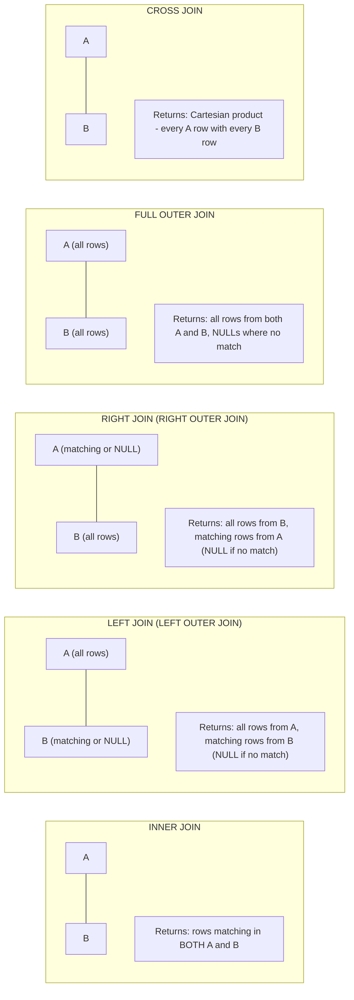
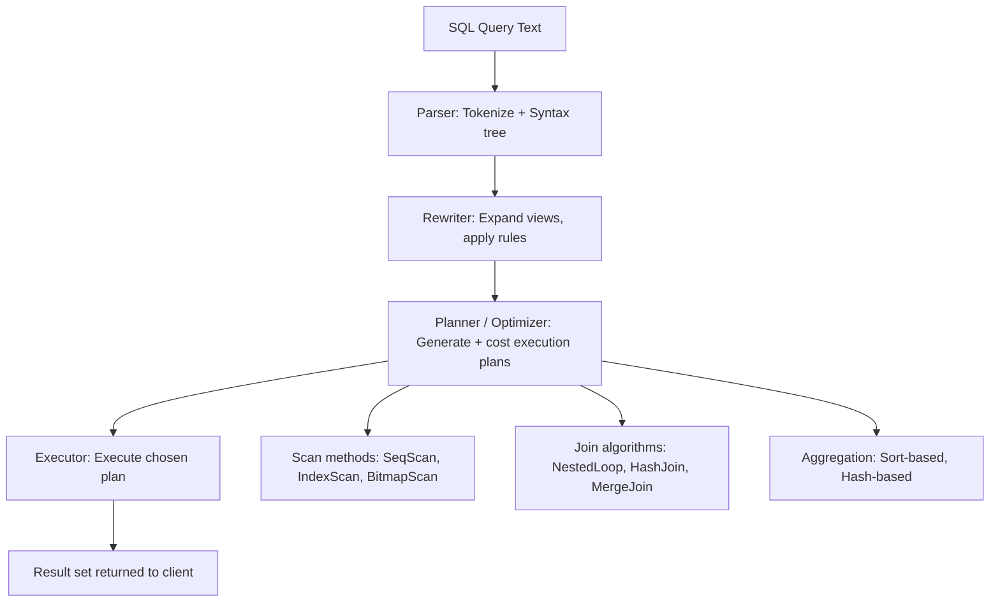

---
title: "SQL Foundations - DDL, DML, Joins, Subqueries, Window Functions"
subject: "DBMS"
module: "01 - Relational Model & SQL Foundations"
difficulty: "Intermediate"
prerequisites:
  - "Relational Model - Tables, Keys, Functional Dependencies, Normalization"
related:
  - "Relational Model - Tables, Keys, Functional Dependencies, Normalization"
  - "Query Processing Pipeline - Parser, Rewriter, Planner, Executor"
  - "Cost-Based Optimizer - Statistics, Cardinality Estimation, Join Ordering"
  - "Transactions and ACID Properties"
  - "B-Tree and B+ Tree Indexes - Structure, Search, Insert, Split"
aliases:
  - "SQL"
  - "DDL"
  - "DML"
  - "SQL Joins"
  - "Window Functions"
  - "CTEs"
  - "Subqueries"
  - "EXPLAIN"
  - "GROUP BY"
  - "HAVING"
tags:
  - dbms
  - sql
  - ddl
  - dml
  - joins
  - window-functions
  - cte
  - subquery
  - postgresql
  - mysql
  - query-optimization
status: "complete"
---

# SQL Foundations — DDL, DML, Joins, Subqueries, and Window Functions

## Mental Model

SQL (Structured Query Language) is a **declarative language** — you describe WHAT data you want, and the database engine figures out HOW to retrieve it efficiently. This is fundamentally different from procedural code where you specify each step. Writing `SELECT * FROM orders WHERE status = 'shipped'` says "give me all shipped orders" without specifying whether to use an index scan, a sequential scan, or a hash join. The optimizer decides. Understanding SQL deeply means understanding both the **logical semantics** (what the query means) and the **physical execution** (how it runs), so you can write queries that the optimizer can execute efficiently.

Think of SQL as four distinct languages bundled together:
- **DDL** (Data Definition): Blueprint — creates and modifies the structure of tables
- **DML** (Data Manipulation): CRUD — reads and writes data  
- **DCL** (Data Control): Access control — GRANT and REVOKE
- **TCL** (Transaction Control): ACID guarantees — BEGIN, COMMIT, ROLLBACK

---

## Core Concepts / Architecture

### SQL Command Categories

| Category | Commands | Purpose |
|----------|----------|---------|
| DDL | CREATE, ALTER, DROP, TRUNCATE | Schema definition |
| DML | SELECT, INSERT, UPDATE, DELETE, MERGE | Data manipulation |
| DCL | GRANT, REVOKE | Permissions |
| TCL | BEGIN, COMMIT, ROLLBACK, SAVEPOINT | Transaction control |

### SELECT Query Logical Execution Order

```
Logical order (NOT written order):
  1. FROM + JOIN        — Identify source tables, apply joins
  2. WHERE              — Filter rows BEFORE grouping (cannot use aliases or window funcs)
  3. GROUP BY           — Group remaining rows by specified columns
  4. HAVING             — Filter GROUPS (after aggregation; can use aggregate functions)
  5. SELECT             — Compute expressions, aliases, window functions
  6. DISTINCT           — Remove duplicate result rows
  7. ORDER BY           — Sort result set (can use SELECT aliases)
  8. LIMIT / OFFSET     — Paginate result set

IMPORTANT: Aliases defined in SELECT cannot be used in WHERE (processed before SELECT).
           Can be used in ORDER BY and HAVING (in most databases).
```

---

## Visual Diagram

### SQL JOIN Types



### Query Execution Flow



---

## Deep Dive

### 1. DDL — Schema Management

```sql
-- CREATE TABLE with constraints:
CREATE TABLE products (
    product_id   SERIAL PRIMARY KEY,          -- Auto-increment PK
    sku          VARCHAR(50)  NOT NULL UNIQUE, -- Natural alternate key
    name         VARCHAR(255) NOT NULL,
    price        NUMERIC(10,2) NOT NULL,
    category_id  INT REFERENCES categories(category_id) ON DELETE SET NULL,
    is_active    BOOLEAN      NOT NULL DEFAULT TRUE,
    created_at   TIMESTAMPTZ  NOT NULL DEFAULT NOW(),
    metadata     JSONB,                        -- Flexible attributes
    
    -- Table-level constraints:
    CONSTRAINT chk_positive_price CHECK (price > 0),
    CONSTRAINT chk_sku_format     CHECK (sku ~ '^[A-Z]{3}-[0-9]{6}$')  -- Regex check
);

-- Create index:
CREATE INDEX idx_products_category ON products(category_id);
CREATE INDEX idx_products_active_category ON products(category_id) WHERE is_active = TRUE;  -- Partial index
CREATE INDEX idx_products_name_search ON products USING gin(to_tsvector('english', name));  -- Full-text search

-- ALTER TABLE:
ALTER TABLE products ADD COLUMN weight_kg NUMERIC(8,3);
ALTER TABLE products ALTER COLUMN name TYPE TEXT;
ALTER TABLE products ADD CONSTRAINT fk_supplier FOREIGN KEY (supplier_id) REFERENCES suppliers(supplier_id);
ALTER TABLE products DROP COLUMN metadata;

-- Rename:
ALTER TABLE products RENAME TO catalog_products;
ALTER TABLE catalog_products RENAME COLUMN sku TO product_sku;
```

### 2. DML — CRUD Operations

```sql
-- INSERT:
INSERT INTO products (sku, name, price, category_id)
VALUES ('ABC-123456', 'Widget Pro', 29.99, 5);

-- Multi-row INSERT (much more efficient than individual INSERTs):
INSERT INTO products (sku, name, price, category_id) VALUES
    ('ABC-123457', 'Widget Basic', 9.99, 5),
    ('ABC-123458', 'Widget Elite', 49.99, 5),
    ('DEF-789012', 'Gadget Plus',  19.99, 7);

-- UPSERT (INSERT or UPDATE on conflict):
INSERT INTO product_inventory (product_id, warehouse_id, qty)
VALUES (42, 1, 100)
ON CONFLICT (product_id, warehouse_id)
DO UPDATE SET qty = EXCLUDED.qty + product_inventory.qty,
              updated_at = NOW();

-- UPDATE with JOIN (PostgreSQL syntax):
UPDATE order_items oi
SET unit_price = p.price
FROM products p
WHERE oi.product_id = p.product_id
  AND oi.order_id IN (SELECT order_id FROM orders WHERE status = 'pending');

-- DELETE with subquery:
DELETE FROM order_items
WHERE order_id IN (
    SELECT order_id FROM orders
    WHERE status = 'cancelled' AND created_at < NOW() - INTERVAL '1 year'
);

-- RETURNING clause (PostgreSQL — get values of affected rows):
INSERT INTO orders (customer_id, status)
VALUES (42, 'pending')
RETURNING order_id, created_at;  -- Get auto-generated ID immediately

UPDATE products SET price = price * 1.10
WHERE category_id = 5
RETURNING product_id, name, price;  -- See updated values
```

### 3. Joins — Deep Dive

```sql
-- INNER JOIN: Only matching rows
SELECT o.order_id, c.name, o.total_amount
FROM orders o
INNER JOIN customers c ON c.customer_id = o.customer_id
WHERE o.status = 'shipped';

-- LEFT JOIN: All orders, even those with no customer (data integrity issue indicator)
SELECT o.order_id, c.name, o.total_amount
FROM orders o
LEFT JOIN customers c ON c.customer_id = o.customer_id;
-- c.name will be NULL for orders with no matching customer

-- ANTI-JOIN: Customers who have NEVER placed an order
-- Method 1: LEFT JOIN with NULL check
SELECT c.customer_id, c.email
FROM customers c
LEFT JOIN orders o ON o.customer_id = c.customer_id
WHERE o.order_id IS NULL;

-- Method 2: NOT EXISTS (often faster; optimizer may use better plan)
SELECT c.customer_id, c.email
FROM customers c
WHERE NOT EXISTS (
    SELECT 1 FROM orders o WHERE o.customer_id = c.customer_id
);

-- Method 3: NOT IN (DANGER: if subquery can return NULL, entire result may be empty!)
SELECT c.customer_id, c.email
FROM customers c
WHERE c.customer_id NOT IN (
    SELECT o.customer_id FROM orders o WHERE o.customer_id IS NOT NULL  -- NULL guard required!
);

-- SELF JOIN: Find employees and their managers
SELECT e.name AS employee, m.name AS manager
FROM employees e
LEFT JOIN employees m ON m.employee_id = e.manager_id;

-- Multi-table join with aggregation:
SELECT
    c.name                           AS customer,
    COUNT(o.order_id)                AS total_orders,
    SUM(oi.quantity * oi.unit_price) AS lifetime_value,
    MAX(o.created_at)                AS last_order_date
FROM customers c
LEFT JOIN orders o     ON o.customer_id = c.customer_id
LEFT JOIN order_items oi ON oi.order_id = o.order_id
GROUP BY c.customer_id, c.name
HAVING COUNT(o.order_id) > 0
ORDER BY lifetime_value DESC NULLS LAST
LIMIT 100;
```

### 4. Subqueries

```sql
-- Correlated subquery: For each product, find its % of category revenue
SELECT
    p.name,
    p.price,
    p.category_id,
    ROUND(p.price / (
        SELECT AVG(p2.price) FROM products p2
        WHERE p2.category_id = p.category_id  -- Correlated: references outer p.category_id
    ), 2) AS price_to_category_avg_ratio
FROM products p;
-- PROBLEM: Correlated subquery executes ONCE PER ROW of outer query. Very slow for large tables.
-- BETTER: Use window function or JOIN with pre-aggregated subquery.

-- Scalar subquery in WHERE:
SELECT * FROM orders
WHERE total_amount > (SELECT AVG(total_amount) FROM orders WHERE status = 'delivered');

-- Derived table (inline view) — executes once, result used as virtual table:
SELECT cat.name AS category, top_products.name AS product, top_products.price
FROM (
    SELECT name, price, category_id,
           RANK() OVER (PARTITION BY category_id ORDER BY price DESC) AS price_rank
    FROM products
    WHERE is_active = TRUE
) AS top_products
JOIN categories cat ON cat.category_id = top_products.category_id
WHERE top_products.price_rank = 1;  -- Highest-priced product per category

-- EXISTS vs IN performance:
-- EXISTS short-circuits after first match (efficient for large sets)
-- IN loads entire subquery result into memory first
SELECT * FROM customers c
WHERE EXISTS (
    SELECT 1 FROM orders o
    WHERE o.customer_id = c.customer_id
      AND o.total_amount > 1000
);
```

### 5. CTEs (Common Table Expressions)

```sql
-- Simple CTE (readability; may or may not materialize in optimizer depending on DB):
WITH high_value_orders AS (
    SELECT order_id, customer_id, total_amount
    FROM orders
    WHERE total_amount > 500 AND status = 'delivered'
),
customer_stats AS (
    SELECT
        customer_id,
        COUNT(*)         AS order_count,
        SUM(total_amount) AS total_spent
    FROM high_value_orders
    GROUP BY customer_id
)
SELECT c.name, cs.order_count, cs.total_spent
FROM customers c
JOIN customer_stats cs ON cs.customer_id = c.customer_id
ORDER BY cs.total_spent DESC;

-- Recursive CTE: Walk category hierarchy (finding all ancestors of a category):
WITH RECURSIVE category_ancestors AS (
    -- Base case: start with target category
    SELECT category_id, name, parent_category_id, 0 AS depth
    FROM categories
    WHERE category_id = 42   -- Starting category
    
    UNION ALL
    
    -- Recursive case: join to parent
    SELECT c.category_id, c.name, c.parent_category_id, ca.depth + 1
    FROM categories c
    INNER JOIN category_ancestors ca ON ca.parent_category_id = c.category_id  -- Walk UP
    WHERE ca.depth < 10  -- Safety: prevent infinite loop if circular reference
)
SELECT * FROM category_ancestors ORDER BY depth;

-- CTE for data modification (PostgreSQL):
WITH deleted_orders AS (
    DELETE FROM orders WHERE status = 'cancelled' AND created_at < NOW() - INTERVAL '2 years'
    RETURNING order_id, customer_id, total_amount
)
INSERT INTO orders_archive (order_id, customer_id, total_amount, archived_at)
SELECT order_id, customer_id, total_amount, NOW() FROM deleted_orders;
```

### 6. Window Functions

Window functions compute values across a "window" of related rows without collapsing them into groups (unlike GROUP BY).

```sql
-- Syntax:
-- function() OVER (PARTITION BY ... ORDER BY ... ROWS/RANGE ...)

-- ROW_NUMBER, RANK, DENSE_RANK:
SELECT
    product_id,
    name,
    price,
    category_id,
    ROW_NUMBER()  OVER (PARTITION BY category_id ORDER BY price DESC) AS row_num,
    RANK()        OVER (PARTITION BY category_id ORDER BY price DESC) AS price_rank,   -- gaps on tie
    DENSE_RANK()  OVER (PARTITION BY category_id ORDER BY price DESC) AS dense_rank    -- no gaps on tie
FROM products;

-- LAG / LEAD — access previous/next row value:
SELECT
    order_id,
    customer_id,
    total_amount,
    created_at,
    LAG(total_amount) OVER (PARTITION BY customer_id ORDER BY created_at) AS prev_order_amt,
    total_amount - LAG(total_amount) OVER (PARTITION BY customer_id ORDER BY created_at) AS delta
FROM orders;

-- SUM with ROWS frame — running total:
SELECT
    order_id,
    created_at,
    total_amount,
    SUM(total_amount) OVER (
        PARTITION BY customer_id
        ORDER BY created_at
        ROWS BETWEEN UNBOUNDED PRECEDING AND CURRENT ROW
    ) AS cumulative_spend
FROM orders;

-- Moving average (7-day):
SELECT
    date_trunc('day', created_at) AS day,
    SUM(total_amount) AS daily_revenue,
    AVG(SUM(total_amount)) OVER (
        ORDER BY date_trunc('day', created_at)
        ROWS BETWEEN 6 PRECEDING AND CURRENT ROW   -- 7-day window
    ) AS moving_avg_7d
FROM orders
GROUP BY date_trunc('day', created_at);

-- NTILE — divide rows into N equal buckets:
SELECT
    customer_id,
    total_lifetime_value,
    NTILE(4) OVER (ORDER BY total_lifetime_value DESC) AS quartile
FROM customer_lifetime_values;
-- quartile=1: top 25%, quartile=4: bottom 25%

-- FIRST_VALUE / LAST_VALUE:
SELECT
    product_id, name, category_id, price,
    FIRST_VALUE(name)  OVER (PARTITION BY category_id ORDER BY price DESC) AS most_expensive_in_category,
    LAST_VALUE(price)  OVER (
        PARTITION BY category_id
        ORDER BY price DESC
        ROWS BETWEEN UNBOUNDED PRECEDING AND UNBOUNDED FOLLOWING  -- Important: default is CURRENT ROW
    ) AS cheapest_price_in_category
FROM products;
```

---

## Production Example: Analytical Reporting Query

### Problem: Monthly Revenue Report with YoY Comparison

```sql
-- Monthly revenue with year-over-year comparison using window functions:
WITH monthly_revenue AS (
    SELECT
        DATE_TRUNC('month', created_at)       AS month,
        EXTRACT(YEAR FROM created_at)::INT    AS year,
        EXTRACT(MONTH FROM created_at)::INT   AS month_num,
        SUM(total_amount)                     AS revenue,
        COUNT(DISTINCT customer_id)           AS unique_customers,
        COUNT(order_id)                       AS order_count
    FROM orders
    WHERE status IN ('delivered', 'completed')
      AND created_at >= '2024-01-01'
    GROUP BY DATE_TRUNC('month', created_at)
)
SELECT
    month,
    year,
    month_num,
    revenue,
    unique_customers,
    order_count,
    ROUND(revenue / order_count, 2)                AS avg_order_value,
    
    -- YoY comparison: same month, prior year
    LAG(revenue, 12) OVER (ORDER BY month)         AS revenue_year_ago,
    ROUND(
        (revenue - LAG(revenue, 12) OVER (ORDER BY month))
        / NULLIF(LAG(revenue, 12) OVER (ORDER BY month), 0) * 100,
        1
    )                                              AS yoy_growth_pct,
    
    -- MoM comparison:
    LAG(revenue, 1) OVER (ORDER BY month)          AS revenue_prev_month,
    
    -- Cumulative revenue for the year:
    SUM(revenue) OVER (
        PARTITION BY year
        ORDER BY month
        ROWS BETWEEN UNBOUNDED PRECEDING AND CURRENT ROW
    )                                              AS ytd_revenue,
    
    -- Running rank this year:
    RANK() OVER (PARTITION BY year ORDER BY revenue DESC) AS rank_in_year

FROM monthly_revenue
ORDER BY month;
```

### EXPLAIN ANALYZE Output Interpretation

```sql
EXPLAIN (ANALYZE, BUFFERS, FORMAT JSON)
SELECT c.name, COUNT(o.order_id) as order_count
FROM customers c
JOIN orders o ON o.customer_id = c.customer_id
WHERE o.created_at > '2026-01-01'
GROUP BY c.customer_id, c.name
HAVING COUNT(o.order_id) > 5
ORDER BY order_count DESC
LIMIT 20;

-- Key metrics to check in EXPLAIN output:
-- -> actual time: 0.123..45.678   (startup_ms..total_ms) — actual execution time
-- -> actual rows: 1234            — rows returned by this node
-- -> loops: 1                     — how many times this node executed
-- -> Buffers: shared hit=12345 read=678  — cache hits vs disk reads
-- -> cost: 0..1234.56             — estimated startup..total cost (in abstract units)
-- -> rows: 5000                   — estimated rows (compare to actual rows!)

-- Red flags:
-- actual rows >> estimated rows: stale statistics => run ANALYZE
-- Seq Scan on large table: missing index
-- Nested Loop with large outer + large inner: prefer Hash Join (lack of statistics?)
-- High "read" buffers: cold cache or no index (hitting disk)
```

---

## Failure Modes / Trade-offs

1. **N+1 Query Problem**
   - Problem: Application code fetches parent records then issues one query per parent to fetch children in a loop. 100 orders => 100 separate queries for order_items. Each round-trip adds latency.
   - Mitigation: Use JOINs or batch fetching (`WHERE order_id IN (...)`) to fetch all children in one query. In ORMs: eager loading (`.includes()` in ActiveRecord, `prefetch_related()` in Django).

2. **Non-SARGable WHERE Conditions**
   - Problem: Applying functions to indexed columns in WHERE prevents index use: `WHERE YEAR(created_at) = 2026` cannot use index on `created_at`; requires full table scan
   - Mitigation: Rewrite to range conditions: `WHERE created_at >= '2026-01-01' AND created_at < '2027-01-01'` — allows index range scan

3. **SELECT * in Production**
   - Problem: `SELECT *` fetches all columns including large BLOBs/TEXT/JSONB; increases network bandwidth, prevents covering-index-only scans; breaks when schema changes
   - Mitigation: Always specify needed columns; use covering indexes aligned with SELECT list

4. **Implicit Type Coercions Break Indexes**
   - Problem: `WHERE user_id = '42'` where user_id is INT — database may cast every row value rather than the literal, preventing index use
   - Mitigation: Always use matching types; use parameterized queries with typed parameters

5. **OFFSET Pagination Performance Degradation**
   - Problem: `LIMIT 20 OFFSET 10000` requires scanning and discarding 10,000 rows before returning 20 — gets slower with larger offsets (O(n))
   - Mitigation: Keyset/cursor-based pagination: `WHERE created_at < :last_seen_timestamp ORDER BY created_at DESC LIMIT 20` — O(log n) with index

6. **NOT IN with NULLs Returns Empty Set**
   - Problem: `WHERE id NOT IN (SELECT customer_id FROM banned_customers)` returns ZERO rows if any `customer_id` is NULL in the subquery — three-valued logic: `x NOT IN {1, NULL}` evaluates as UNKNOWN
   - Mitigation: Use `NOT EXISTS` instead; or add `WHERE customer_id IS NOT NULL` to subquery

---

## Active-Recall Prompts

1. **What is the logical execution order of SQL clauses and why does it matter for WHERE vs HAVING?**
   *(Answer: FROM → JOIN → WHERE → GROUP BY → HAVING → SELECT → DISTINCT → ORDER BY → LIMIT. It matters because: WHERE filters individual rows BEFORE aggregation (cannot use aggregate functions like SUM() in WHERE). HAVING filters GROUPS after aggregation (can use aggregates). Aliases defined in SELECT are not available in WHERE (processed before SELECT) but are available in ORDER BY (processed after SELECT).)*

2. **Explain the difference between RANK(), DENSE_RANK(), and ROW_NUMBER() in window functions.**
   *(Answer: All three assign sequential numbers to rows within a PARTITION per ORDER BY. ROW_NUMBER: always unique, no ties — 1,2,3,4,5. RANK: ties get same rank, next rank skips numbers — 1,1,3,3,5 (two items tied for 1st, next rank is 3). DENSE_RANK: ties get same rank, but no gaps — 1,1,2,2,3. Use ROW_NUMBER for pagination. Use RANK for "top N per group" where ties should be included. Use DENSE_RANK when you want to count distinct rank positions.)*

3. **What is the N+1 query problem and how do you detect and fix it?**
   *(Answer: N+1 occurs when code fetches N parent records then issues one additional query per parent for related children — total N+1 queries instead of 1. Detection: ORM query logging showing repeated queries with different IDs; APM traces showing query count proportional to result set size; slow endpoint despite simple logic. Fix: Use JOIN to fetch parents and children together; or use batched loading (WHERE parent_id IN (id1, id2, ...)); in ORMs, use eager loading directives.)*

4. **Why is OFFSET pagination problematic for large datasets, and what is the alternative?**
   *(Answer: LIMIT n OFFSET k requires the database to scan and discard k rows before returning n rows — O(k) scan regardless of index. For page 10,000 of 20 results per page (OFFSET 199,980), the DB discards ~200K rows on every page request. Gets slower as users page deeper. Alternative: Keyset (cursor) pagination uses an indexed column condition instead of OFFSET. E.g., after fetching rows with created_at, the next page is WHERE created_at < :last_page_created_at ORDER BY created_at DESC LIMIT 20. This uses an index seek (O(log n)) regardless of page depth.)*

---

## Related Notes

- [[Relational Model - Tables, Keys, Functional Dependencies, Normalization]]
- [[Query Processing Pipeline - Parser, Rewriter, Planner, Executor]]
- [[Cost-Based Optimizer - Statistics, Cardinality Estimation, Join Ordering]]
- [[Transactions and ACID Properties - Atomicity, Consistency, Isolation, Durability]]
- [[B-Tree and B+ Tree Indexes - Structure, Search, Insert, Split]]
- [[PostgreSQL Internals - MVCC Implementation, Tuple Header, VACUUM, Toast]]
- [[Database Management Systems MOC]]

---

> **Interview Question**: *You have a query that runs in 200ms in staging (100K rows) but 45 seconds in production (50M rows). The query joins orders, customers, and order_items, with a WHERE clause on orders.created_at and a GROUP BY. Walk through your diagnostic process and optimization strategy.*
>
> **Model Answer**: (1) **Get the query plan**: Run `EXPLAIN (ANALYZE, BUFFERS)` in production (or with `enable_seqscan=off` first to see index options). (2) **Check for Seq Scans**: If orders table is 50M rows and there's a Seq Scan on it, the created_at index is missing or not being used. Verify: `\d orders` to check indexes. If index exists but unused, check if WHERE clause is SARGable — `WHERE YEAR(created_at) = 2026` is not; `WHERE created_at BETWEEN '2026-01-01' AND '2026-12-31'` is. (3) **Check row estimates**: If estimated rows = 1000 but actual = 500,000, statistics are stale — run `ANALYZE orders customers order_items`. (4) **Join method**: For 50M orders, Nested Loop is catastrophic if inner side has no index. Verify Hash Join or Sort-Merge Join is chosen. Check `enable_nestloop = off` temporarily to force alternative. (5) **Index coverage**: Add composite index on `orders(created_at, customer_id)` if filtering by date and joining on customer_id. Check if `order_items(order_id)` index exists. (6) **GROUP BY performance**: GROUP BY on high-cardinality column may prefer hash aggregation — check if sorting is happening unnecessarily. (7) **Partition table**: If orders is 50M rows and queries always filter by created_at range, partition the table by month — each query hits only 1-2 partitions. (8) **Materialized view**: For repeated reports, cache the result in a materialized view refreshed daily.

---
*Last updated: 2026-08-18 | Status: Complete | Module 1 — Relational Model & SQL Foundations*
