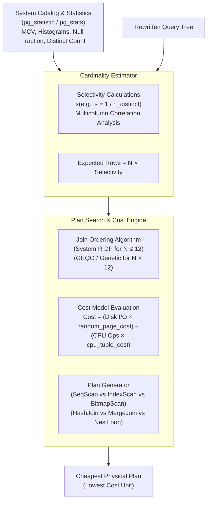
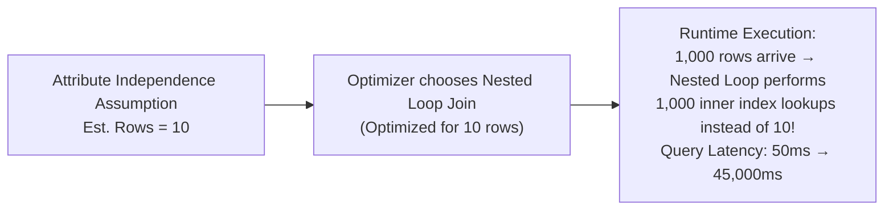
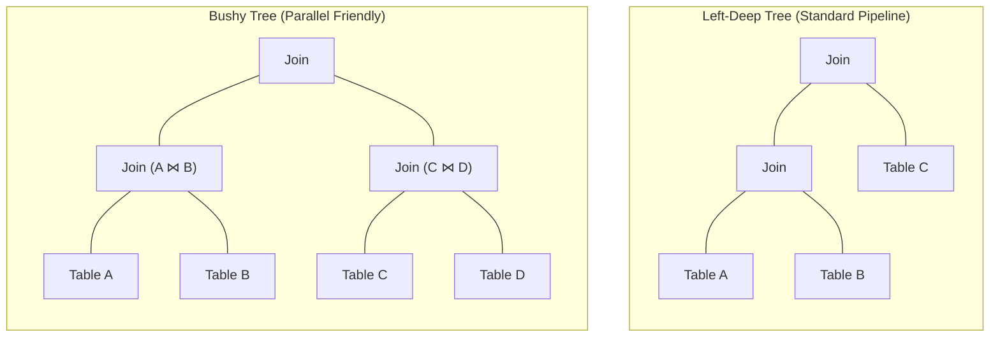

# Cost-Based Optimizer — Statistics, Cardinality Estimation, Join Ordering

## Mental Model

Think of a **Cost-Based Optimizer (CBO)** as a high-tech GPS navigation engine for database queries. Given a user query (destination), there are millions of mathematically valid ways (routes) to join tables, utilize indexes, and process data. The CBO does not execute queries blindly; instead, it uses a **statistical map of the database landscape** (row counts, histograms, value distributions) to estimate the CPU and I/O cost of every candidate query plan, ultimately selecting the plan with the lowest estimated cost.

If the optimizer's statistical map is outdated or assumes independence where correlation exists, it chooses a catastrophic route—turning a 50ms query into a 10-minute disk-thrashing nightmare.

---

## 1. Core Architecture of a Cost-Based Optimizer

The CBO operates in three tightly coupled phases: **Statistics Collection**, **Cardinality Estimation**, and **Plan Search / Join Ordering**.



### The Database Cost Model Formula

In relational engines like PostgreSQL, the cost of a physical plan operator is measured in arbitrary cost units (typically normalized to one sequential disk page read = 1.0).

$$\text{Total Cost} = (\text{Page Reads} \times \text{seq\_page\_cost}) + (\text{Random Page Reads} \times \text{random\_page\_cost}) + (\text{Tuples Processed} \times \text{cpu\_tuple\_cost}) + (\text{Operators Evaluated} \times \text{cpu\_operator\_cost})$$

| Parameter | PostgreSQL Default | Meaning & Tuning Impact |
|---|---|---|
| `seq_page_cost` | `1.0` | Cost of a sequential disk page read. Base reference unit. |
| `random_page_cost` | `4.0` (HDD) / `1.1` (SSD) | Cost of a random disk page access. Set to `1.1` for NVMe/SSDs to favor index scans over seq scans. |
| `cpu_tuple_cost` | `0.01` | CPU cost to process one tuple during a scan or join. |
| `cpu_operator_cost` | `0.0025` | CPU cost to evaluate a single WHERE clause operator or expression. |
| `cpu_index_tuple_cost` | `0.005` | CPU cost to process one index entry during an index scan. |

---

## 2. Statistics & Distribution Metadata

Without accurate statistics, cost estimation collapses. Database systems maintain detailed metadata for every table column via asynchronous background tasks (`ANALYZE` or `autovacuum`).

### Anatomy of `pg_statistic` / `pg_stats`

| Field in `pg_stats` | Description | Optimization Utility |
|---|---|---|
| `null_frac` | Fraction of column entries that are `NULL`. | Adjusts base selectivity: $N_{non\_null} = N \times (1 - null\_frac)$. |
| `n_distinct` | Estimated count of unique values ($>0$ = absolute count, $<0$ = fraction of total rows). | Used for equality predicates when value is not in MCV. |
| `most_common_vals` (MCV) | Array of the most frequently occurring values in the column. | Direct lookups for skewed data distributions. |
| `most_common_freqs` (MCF) | Array of frequencies corresponding to each MCV. | Exact selectivity calculation for common values. |
| `histogram_bounds` | Equi-depth histogram bin boundaries for non-MCV values. | Range query selectivity (`>`, `<`, `BETWEEN`). |
| `correlation` | Statistical correlation between physical disk order and logical value order ($-1.0$ to $+1.0$). | Drives decision between Index Scan (high correlation) and Bitmap Index Scan (low correlation). |

---

## 3. Cardinality Estimation Mathematics

Cardinality estimation computes the expected number of output tuples for relational operators. **Selectivity ($s$)** is the fraction of rows expected to satisfy a predicate ($0 \le s \le 1$).

### Single-Attribute Selectivity Formulas

#### 1. Equality Predicate (`column = 'value'`)
- **If value is in Most Common Values (MCV):**
  $$s = \text{MCF}[i] \quad \text{where } \text{MCV}[i] = \text{'value'}$$
- **If value is NOT in MCV:**
  $$s = \frac{1 - \sum \text{MCF}}{n\_distinct - |\text{MCV}|}$$

#### 2. Range Predicate (`column < Constant`)
Using an **Equi-Depth Histogram** where each bin contains an equal number of tuples ($1 / B$ of remaining data):

$$s = (1 - \sum \text{MCF}) \times \left[ \frac{\text{Bin}_{index}}{B} + \frac{\text{Constant} - \text{Bin}_{lower}}{\text{Bin}_{upper} - \text{Bin}_{lower}} \times \frac{1}{B} \right]$$

#### 3. Conjunction (`WHERE A AND B`) — The Independence Assumption
Traditional optimizers assume attribute independence:

$$s(A \land B) = s(A) \times s(B)$$

#### 4. Disjunction (`WHERE A OR B`)
$$s(A \lor B) = s(A) + s(B) - (s(A) \times s(B))$$

---

## 4. Multicolumn Correlation & The Independence Trap

The **Attribute Independence Assumption (AIA)** is the single largest source of cardinality estimation errors in modern production databases.

### The Classic Correlation Failure Scenario

Consider an `automobiles` table with 1,000,000 rows, containing `make` and `model`.
- $s(\text{make} = \text{'Porsche'}) = 0.01$ (1% of cars)
- $s(\text{model} = \text{'911'}) = 0.001$ (0.1% of cars)

If a query requests: `WHERE make = 'Porsche' AND model = '911'`:
- **Naive Optimizer Estimate (AIA):**
  $$\text{Expected Rows} = 1,000,000 \times (0.01 \times 0.001) = 10 \text{ rows}$$
- **Actual Reality:**
  Every Porsche 911 is a Porsche! The true matching count is **1,000 rows** (a **100x underestimation**).



### Solution: Extended Statistics (`CREATE STATISTICS`)

PostgreSQL allows engineers to capture functional dependencies and multivariate statistics explicitly across correlated columns:

```sql
-- Create multivariate statistics object for correlated columns
CREATE STATISTICS stats_auto_make_model (dependencies, mcv) 
ON make, model FROM automobiles;

ANALYZE automobiles;
```

This constructs a **multivariate MCV list** that tracks frequencies of `(make, model)` tuples jointly, restoring exact cardinality estimation.

---

## 5. Join Ordering & Search Space Algorithms

Joining $N$ tables requires choosing a join order. Because joins are associative and commutative:

$$(A \bowtie B) \bowtie C \equiv A \bowtie (B \bowtie C) \equiv (B \bowtie A) \equiv C$$

The search space of possible join trees grows exponentially:

| Join Tree Type | Search Space Complexity for $N$ Tables | $N=4$ | $N=10$ | $N=15$ |
|---|---|---|---|---|
| **Left-Deep Trees** (Linear) | $\frac{N!}{2} \times 2^{N-1} = N!$ | 24 | 3,628,800 | $1.3 \times 10^{12}$ |
| **Bushy Trees** (Flexible) | $\frac{(2N-2)!}{(N-1)!}$ | 120 | $1.76 \times 10^{10}$ | $7.7 \times 10^{17}$ |



### 1. Dynamic Programming (System R Algorithm)
For $N \le 12$ tables (configurable via `join_collapse_limit` and `from_collapse_limit`):
1. **Size 1 Subproblems:** Find cheapest access path for each table individually ($A, B, C, D$).
2. **Size 2 Subproblems:** Find cheapest join for every pair ($\{A,B\}, \{A,C\}, \{B,C\}, \dots$). Retain lowest cost plan per subset and per **Interesting Order** (e.g., if output is pre-sorted for later `ORDER BY` or `MergeJoin`).
3. **Size $k$ Subproblems:** Build size $k$ plans by joining size $k-1$ solutions with size 1 tables or smaller subsets.
4. **Pruning:** Discard sub-plans that cost more than another plan covering the exact same set of relations with the same sort order.

### 2. Genetic Query Optimizer (GEQO)
For $N > 12$ tables, dynamic programming exceeds CPU time limits during compilation. The database switches to **GEQO (Genetic Algorithm)**:
- Encodes table join orders as chromosomes (permutations).
- Runs generations of selection, crossover, and mutation to search the non-linear space in $O(G \times P)$ time where $G$ = generations, $P$ = population size.

---

## 6. Production Operations & Inspection Commands

### Inspecting Detailed Column Statistics

```sql
-- View top Most Common Values (MCVs) and frequencies for a column
SELECT 
    tablename, 
    attname, 
    null_frac, 
    n_distinct, 
    most_common_vals::text::varchar(80) AS mcv,
    most_common_freqs::text::varchar(80) AS mcf,
    histogram_bounds::text::varchar(80) AS histogram
FROM pg_stats
WHERE tablename = 'orders' AND attname = 'status';
```

### Analyzing Optimizer Choice with EXPLAIN (BUFFERS, ANALYZE)

```sql
-- Execute query and compare ESTIMATED rows vs ACTUAL rows
EXPLAIN (ANALYZE, BUFFERS, COSTS, VERBOSE)
SELECT o.order_id, c.customer_name, p.amount
FROM orders o
JOIN customers c ON o.customer_id = c.customer_id
JOIN payments p ON o.order_id = p.order_id
WHERE o.status = 'PENDING' 
  AND o.created_at >= '2026-01-01';
```

#### Interpreting Misestimations in EXPLAIN Output:

```text
Hash Join  (cost=1254.50..8450.10 rows=12 width=45) (actual time=12.401..450.120 rows=45000 loops=1)
  Hash Cond: (p.order_id = o.order_id)
  Buffers: shared hit=4210 read=18500
```
> ⚠️ **RED ALERT:** The optimizer estimated **rows=12**, but actual execution produced **rows=45000** (a 3,750x misestimation!). Because it expected 12 rows, it chose an in-memory Hash Join with a tiny hash table, causing severe hash collisions or disk spilling.

### Tuning Planner Cost Parameters

```sql
-- Tell optimizer we are running on fast NVMe SSD storage (reduce random I/O penalty)
ALTER DATABASE production_db SET random_page_cost = 1.1;

-- Increase statistics target for highly skewed columns (default is 100, max 10000)
ALTER TABLE orders ALTER COLUMN status SET STATISTICS 1000;
ANALYZE orders;
```

---

## 7. Failure Modes and Trade-offs

1. **Stale Statistics Outage** — High-volume `INSERT`/`UPDATE`/`DELETE` activity changes value distributions before `autovacuum` runs. *Mitigation*: Trigger explicit `ANALYZE` after batch ETL jobs; lower `autovacuum_analyze_scale_factor` (e.g., from `0.1` to `0.02`).
2. **Correlation Masking (AIA Fallacy)** — Predicates on correlated attributes multiply selectivities, underestimating rows by orders of magnitude. *Mitigation*: Create multivariate statistics (`CREATE STATISTICS stats_name ON col1, col2 FROM table`).
3. **Parameter Sniffing / Prepared Statement Plan Cache Pollution** — In PostgreSQL, generic plans are cached after 5 executions. If parameters vary widely (e.g., tenant ID 1 has 5 rows, tenant ID 2 has 10,000,000 rows), the generic plan causes catastrophic regression for large tenants. *Mitigation*: Set `plan_cache_mode = force_custom_plan` for parameter-sensitive endpoints.
4. **Memory Limitation during Join Search (GEQO Degradation)** — Joining 20+ tables triggers GEQO, which is non-deterministic and can miss obvious index join paths. *Mitigation*: Structure queries using CTEs (`WITH` clauses) to introduce explicit optimization boundaries or increase `join_collapse_limit`.
5. **Over-Optimizing Cost Parameters** — Setting `random_page_cost = 1.0` on slow spinning HDDs forces the planner to pick index scans that saturate disk head seek bandwidth. *Mitigation*: Benchmark storage I/O profile with `fio` before lowering `random_page_cost`.

---

## 8. Active-Recall Prompts

1. **Why does the independence assumption ($s(A \land B) = s(A) \times s(B)$) fail for correlated columns, and how does PostgreSQL `CREATE STATISTICS` resolve it?**
2. **What is the mathematical definition of `random_page_cost`, and how does reducing it from `4.0` to `1.1` alter the optimizer's choice between a Sequential Scan and an Index Scan?**
3. **Explain the difference between Dynamic Programming (System R) and GEQO for join ordering. What triggers the transition between them in PostgreSQL?**
4. **If EXPLAIN ANALYZE shows `(cost=10.00..50.00 rows=1 actual rows=50000)`, what structural problem has occurred, and what execution side-effects will result?**

---

## Related Notes

- [[Query Processing Pipeline - Parser, Rewriter, Planner, Executor]]
- [[Query Execution - Join Algorithms, Aggregation, Sorting, Parallel Query]]
- [[Relational Model - Tables, Keys, Functional Dependencies, Normalization]]
- [[B-Tree and B+ Tree Indexes - Structure, Search, Insert, Split]]
- [[Database Performance Tuning - EXPLAIN ANALYZE, Slow Query Log, Connection Pooling]]

> **Interview Style Question:** *"You observe a production query whose latency suddenly jumped from 15ms to 35 seconds following a bulk data import. An EXPLAIN ANALYZE reveals the planner switched from a Hash Join to a Nested Loop Join due to an estimated row count of 3 versus an actual row count of 250,000. Walk through your step-by-step diagnostic workflow, root cause identification, and permanent production remediation."*

---
