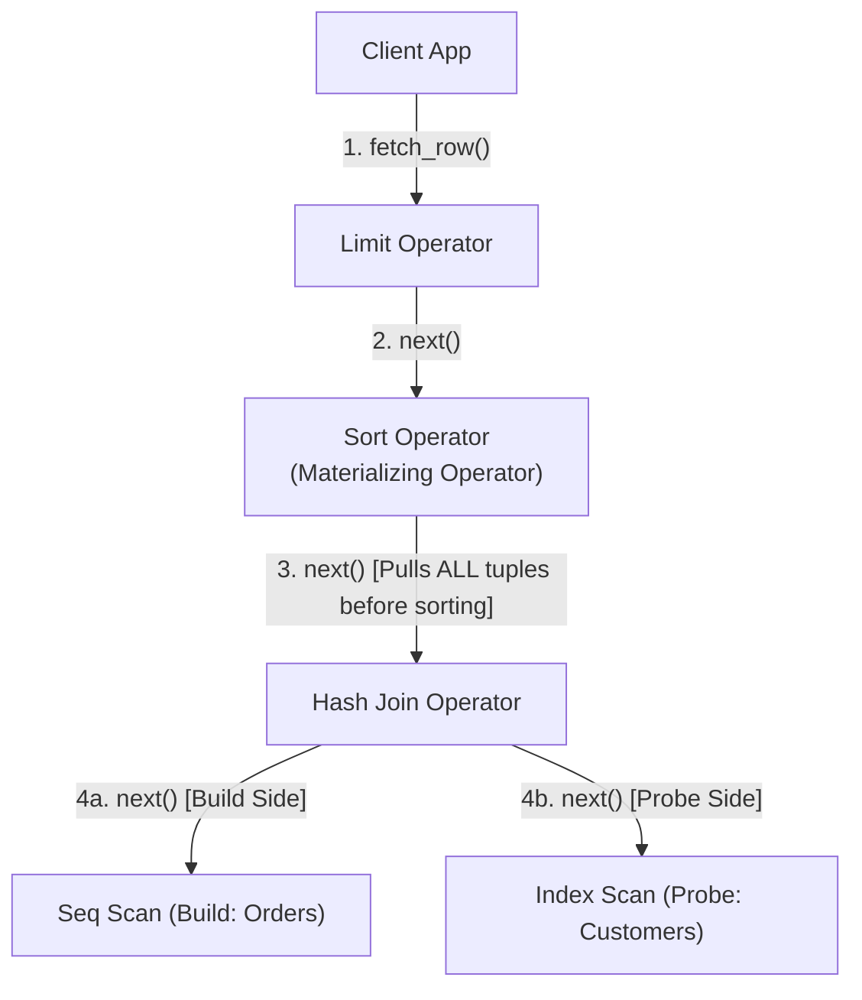
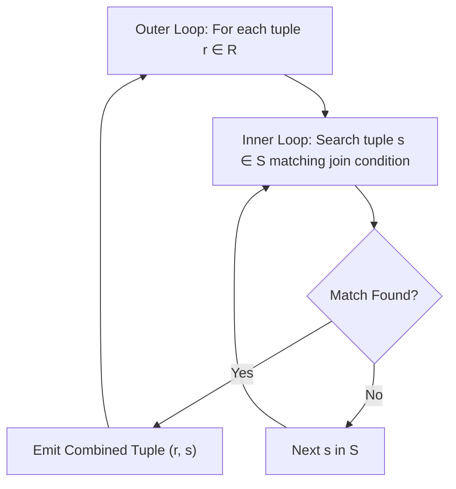
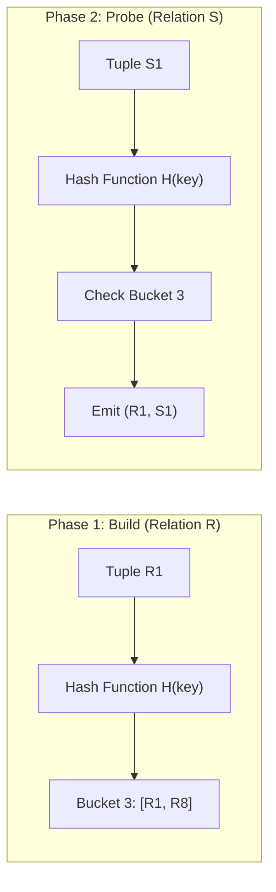
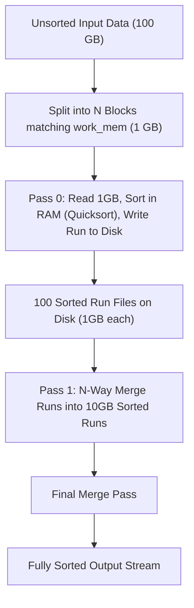
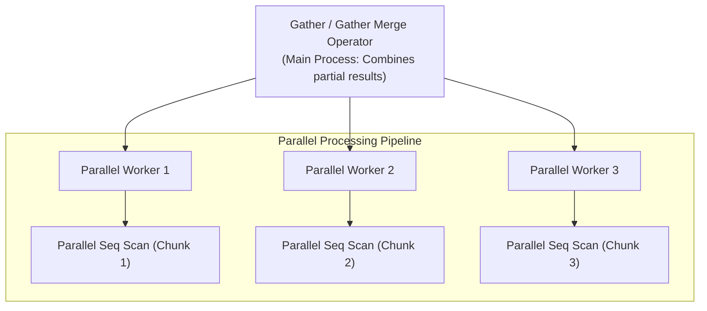

# Query Execution — Join Algorithms, Aggregation, Sorting, Parallel Query

## Mental Model

While the Query Optimizer creates the architectural blueprint for a query, the **Query Execution Engine** is the factory floor where data tuples are physically streamed, filtered, joined, aggregated, and sorted. 

The execution engine evaluates physical operator trees using standard execution models like the **Volcano iterator model** (`next()`), streaming tuples through pipelines. When relational operations (like large joins or sorts) exceed available memory (`work_mem`), the execution engine transitions dynamically into out-of-core algorithm execution (spilling to disk via 2-pass Grace Hash Joins or External Merge Sorts).

---

## 1. Iterator Execution Model (Volcano Model)

Most classic relational database engines (PostgreSQL, MySQL, SQLite) implement the **Volcano / Demand-Driven Iterator Model**.



### Iterator Interface Protocol

Every physical operator implements a simple uniform interface:
```cpp
class TupleIterator {
public:
    virtual void Init() = 0;
    virtual Tuple* Next() = 0; // Returns next tuple or nullptr if EOF
    virtual void Close() = 0;
};
```

### Pipelining vs. Materialization
- **Pipelined Operators (Streaming):** Produce output tuples one-by-one as requested (`Filter`, `Project`, `NestedLoopJoin`, `IndexScan`). Memory consumption is $O(1)$.
- **Materializing Operators (Pipeline Breakers):** Must consume **all** input tuples from child nodes before emitting the first output tuple (`Sort`, `HashJoin` build phase, `HashAggregate`). Memory consumption is $O(N)$.

---

## 2. Physical Join Algorithms Deep Dive

Joining two relations $R$ (outer relation, $|R| = M$ pages, $m$ tuples) and $S$ (inner relation, $|S| = N$ pages, $n$ tuples):

| Join Algorithm | Time Complexity | I/O Cost (Pages) | Memory Needed | Best Use Case |
|---|---|---|---|---|
| **Simple Nested Loop** | $O(m \times n)$ | $M + (m \times N)$ | $O(1)$ | Tiny datasets only |
| **Block Nested Loop** | $O(m \times n)$ | $M + \left(\lceil \frac{M}{B-2} \rceil \times N\right)$ | $B$ pages | No index available, small tables |
| **Index Nested Loop** | $O(m \times \log n)$ | $M + (m \times \text{Cost}_{index})$ | $O(1)$ | Small outer table, indexed inner table |
| **Hash Join (In-Memory)** | $O(m + n)$ | $M + N$ | $O(|R|)$ | Equi-joins, medium-to-large unindexed tables |
| **Grace Hash Join (Disk)** | $O(m + n)$ | $3(M + N)$ | $O(\sqrt{M})$ | Large equi-joins exceeding `work_mem` |
| **Sort-Merge Join** | $O(m \log m + n \log n)$ | $M + N$ (if pre-sorted) | $O(1)$ (if pre-sorted) | Large joins where inputs are pre-sorted by index/B-Tree |

---

### A. Nested Loop Join Mechanics



- **Index Nested Loop Optimization:** Instead of scanning all of $S$ for every tuple $r \in R$, the engine performs an index lookup on $S$ using the join key $r.A$. This makes cost proportional to $m \times \text{IndexLookupCost}$.

---

### B. Hash Join Mechanics & Grace Hash Join

Hash Join is designed exclusively for **equi-joins** ($R.id = S.r\_id$).

#### Phase 1: Build Phase
The smaller relation $R$ (Build relation) is read into memory, and a hash table is constructed by hashing the join key: $H(R.key) \to \text{Bucket}$.

#### Phase 2: Probe Phase
The larger relation $S$ (Probe relation) is scanned. For each tuple $s \in S$, the join key is hashed $H(s.key)$. The bucket is inspected, and matching tuples are emitted.



#### Grace Hash Join (Handling Disk Spills)
If relation $R$ exceeds available memory (`work_mem`):
1. **Partitioning:** Hash both $R$ and $S$ into $K$ matching buckets on disk using hash function $H_1(key)$.
2. **Recursive Hash Join:** For each matching pair of disk partitions $(R_k, S_k)$, load $R_k$ into memory, build an in-memory hash table using a second hash function $H_2(key)$, and probe with $S_k$.

---

### C. Sort-Merge Join Mechanics

1. **Sort Phase:** Sort relation $R$ and $S$ on the join key (if not already sorted by a B-Tree index).
2. **Merge Phase:** Advance pointers through both sorted streams simultaneously in a single linear pass.

```text
Stream R (Sorted):  [1,  3,  5,  5,  7]
                    ▲
Stream S (Sorted):  [2,  5,  5,  8,  9]
                    ▲
Step 1: Pointer R(1) < S(2) → Advance Pointer R
Step 2: Pointer R(3) > S(2) → Advance Pointer S
Step 3: Pointer R(5) == S(5) → Emit matches, handle duplicates, advance both
```

---

## 3. Physical Aggregation & Sorting Algorithms

### Aggregation (`GROUP BY`) Algorithms

#### 1. Hash Aggregate (`HashAgg`)
- Constructs an in-memory hash table: `GroupKey -> AggregateAccumulator` (e.g., `SUM`, `COUNT`).
- As tuples stream in, the group key is hashed, and the running aggregate values are updated in place.
- **Fastest**, but requires memory proportional to the number of distinct group keys.

#### 2. Group Aggregate (`GroupAgg`)
- Requires the input stream to be pre-sorted by the `GROUP BY` keys.
- Scans sequentially; whenever the group key changes, the current accumulated result is emitted, and counters reset.
- Memory consumption is $O(1)$.

---

### External Merge Sort (Out-of-Core Sorting)

When data being sorted exceeds `work_mem`, databases use N-Way External Merge Sort.



#### Total I/O Cost of External Merge Sort:
$$\text{Total Page I/O} = 2N \times \left( 1 + \lceil \log_{B-1} \lceil \frac{N}{B} \rceil \rceil \right)$$
where $N$ is total pages, and $B$ is buffer pages available in `work_mem`.

---

## 4. Parallel Query Execution Architecture

Modern multi-core hardware allows execution engines to parallelize sequential scans, hash joins, and aggregations across worker processes.



### PostgreSQL Parallel Query Nodes

- **Gather:** Collects tuples from parallel worker processes in arbitrary order.
- **Gather Merge:** Collects tuples from workers that are producing pre-sorted streams, maintaining global sort order.
- **Parallel Hash Join:** Shared memory hash table built concurrently by all worker processes, followed by parallel probing.

---

## 5. Production Diagnostics & Configuration

### Tuning Memory for Execution (`work_mem`)

`work_mem` defines the maximum memory used by **each** sort or hash table operation before writing to temporary disk files.

```sql
-- View current work_mem (default is often 4MB)
SHOW work_mem;

-- Increase work_mem for current session (e.g., for complex analytical queries)
SET work_mem = '256MB';

-- Check temporary file usage in EXPLAIN ANALYZE
EXPLAIN (ANALYZE, BUFFERS)
SELECT customer_id, COUNT(*), SUM(amount)
FROM orders
GROUP BY customer_id
ORDER BY SUM(amount) DESC;
```

#### Interpreting Spill to Disk in EXPLAIN Output:

```text
Sort  (cost=145020.10..148000.00 rows=100000 width=32) (actual time=1200.40..1850.12 rows=100000 loops=1)
  Sort Key: sum(amount) DESC
  Sort Method: external merge  Disk: 4256kB
  Buffers: shared hit=8420 read=12400, temp read=532 written=533
```
> ⚠️ **WARNING:** `Sort Method: external merge Disk: 4256kB` indicates `work_mem` was too small. The execution engine was forced to write 4.2 MB of temporary sort runs to disk (`temp read=532 written=533`), adding 600ms of I/O latency.

### Parallel Query Tuning Parameters

```sql
-- Set maximum parallel workers per gather node
SET max_parallel_workers_per_gather = 4;

-- Cost thresholds to trigger parallelism
SET parallel_setup_cost = 1000.0;
SET parallel_tuple_cost = 0.1;
```

---

## 6. Failure Modes and Trade-offs

1. **`work_mem` OOM (Out-of-Memory) Crashing** — Setting `work_mem` too high globally (e.g., `4GB`) when `max_connections = 500`. Since `work_mem` is allocated **per operator per query**, a single complex query with 5 joins and sorts can allocate $5 \times 4\text{GB} = 20\text{GB}$, triggering the Linux OOM Killer. *Mitigation*: Set `work_mem` moderately globally (e.g., `32MB–64MB`), and override `SET work_mem` specifically in dedicated batch reporting sessions.
2. **Grace Hash Join Disk Spill Thrashing** — When `work_mem` is undersized for a Hash Join, recursive partitioning writes and re-reads the entire dataset to disk twice, multiplying I/O by 3x. *Mitigation*: Monitor `pg_stat_database.temp_bytes` for spike alerts.
3. **Sort-Merge Join Regressions on Unindexed Streams** — If the optimizer incorrectly chooses Sort-Merge Join without an underlying B-Tree index, both inputs must undergo expensive `External Merge Sort`, causing heavy CPU and temp disk usage. *Mitigation*: Verify join keys have matching B-Tree indexes or force Hash Joins.
4. **Parallel Worker Starvation** — Setting `max_parallel_workers_per_gather` high while `max_worker_processes` is depleted by other concurrent queries causes queries to execute sequentially with fallback plans, creating erratic performance spikes. *Mitigation*: Tune `max_worker_processes` to match CPU core count.

---

## 7. Active-Recall Prompts

1. **What is the fundamental difference between a Pipelined operator and a Materializing operator (pipeline breaker) in the Volcano iterator model? Give two examples of each.**
2. **Under what specific conditions will a relational database engine choose a Sort-Merge Join over a Hash Join?**
3. **Walk through the two phases of a Grace Hash Join when the build relation exceeds available `work_mem`. How does it avoid keeping the entire table in memory?**
4. **Why is setting `work_mem = 2GB` globally dangerous in a high-concurrency OLTP database server? How should `work_mem` be safely managed instead?**

---

## Related Notes

- [[Query Processing Pipeline - Parser, Rewriter, Planner, Executor]]
- [[Cost-Based Optimizer - Statistics, Cardinality Estimation, Join Ordering]]
- [[B-Tree and B+ Tree Indexes - Structure, Search, Insert, Split]]
- [[Buffer Pool Manager - Page Cache, Replacement Policies, Dirty Pages]]
- [[PostgreSQL Internals - MVCC Implementation, Tuple Header, VACUUM, Toast]]

> **Interview Style Question:** *"During peak load, a critical API endpoint running an analytical query spikes from 200ms execution time to 18 seconds. An EXPLAIN (ANALYZE, BUFFERS) trace shows `Sort Method: external merge Disk: 185MB` and `temp read=23680 written=23681`. Explain the exact mechanics of what happened in the execution engine, how temporary files were generated, and how you would remediate this issue safely without risking OOM errors on the database server."*

---
