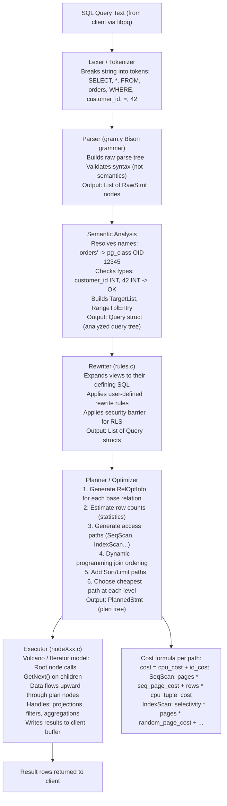
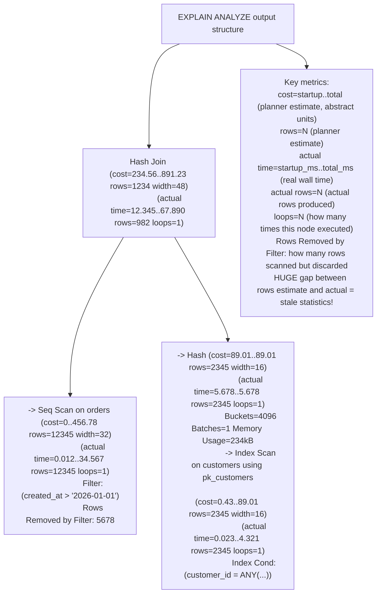

# Query Processing Pipeline — Parser, Rewriter, Planner, Executor

## Mental Model

When you type `SELECT * FROM orders WHERE customer_id = 42` and press Enter, the database does NOT just "find the data." It runs your text through a **four-stage manufacturing pipeline** before a single row is returned:

1. **Parser** — The compiler front-end. Turns your SQL text into an Abstract Syntax Tree (AST), checking grammar but not semantics.
2. **Rewriter** — The preprocessor. Expands views, applies rules (INSERT/UPDATE/DELETE rules), rewrites subqueries.
3. **Planner (Optimizer)** — The strategist. Generates all possible execution plans, estimates the cost of each using statistics, and picks the cheapest. This is the most complex stage.
4. **Executor** — The factory floor. Runs the chosen plan node-by-node, pulling rows from storage.

Understanding this pipeline is the key to writing queries the optimizer can handle efficiently, and to diagnosing slow queries by reading EXPLAIN ANALYZE output.

---

## Core Concepts / Architecture

### Query Lifecycle Overview

| Stage | Input | Output | Key Work |
|-------|-------|--------|----------|
| Wire Protocol | SQL text bytes | String | Client connection, authentication, protocol handling |
| Parser | SQL string | Parse tree (raw AST) | Lexical tokenization, syntax checking, `pg_parse_query` |
| Analyzer/Semantic | Parse tree | Query tree (analyzed) | Name resolution, type checking, `pg_analyze_and_rewrite` |
| Rewriter | Query tree | Query tree(s) | View expansion, rule application, subquery rewriting |
| Planner | Query tree + statistics | Plan tree (cheapest) | Cost-based optimization, join ordering, access path selection |
| Executor | Plan tree | Result rows | Iterates plan nodes in Volcano model, returns data |

### Plan Node Catalog

| Node Type | When Used | Cost | Key Parameter |
|-----------|-----------|------|---------------|
| SeqScan | No usable index, large fraction of table | High for filters | seq_page_cost |
| IndexScan | Selective filter, indexed column, small result | Low for selective | random_page_cost |
| IndexOnlyScan | All needed columns in index (covering) | Very low | Avoids heap fetch |
| BitmapIndexScan + BitmapHeapScan | Medium selectivity, multiple indexes | Medium | Batches I/O |
| NestLoopJoin | Small outer, indexed inner | Low if inner indexed | Loop count |
| HashJoin | Both sides large, equality join | Medium, needs memory | work_mem |
| MergeJoin | Both inputs sorted/sortable, equality join | Medium | Sort cost |
| Sort | ORDER BY, sort-required merge join | O(N log N) | work_mem |
| HashAggregate | GROUP BY — hash table per group | Memory-bound | work_mem |
| SortAggregate | GROUP BY — sort then scan | Sort + linear scan | work_mem |
| Gather | Parallel query: collect from workers | Coordination overhead | max_parallel_workers |
| Gather Merge | Parallel ORDER BY — merge sorted streams | Lower than Sort+Gather | max_parallel_workers |

---

## Visual Diagram

### Full Query Planning Pipeline



### EXPLAIN ANALYZE Output Anatomy



---

## Deep Dive

### 1. Parser — Lexical Analysis and Syntax Tree

```
PostgreSQL parser is generated from gram.y (a Bison/YACC grammar file).

Lexer (scan.l / flex):
  Input: "SELECT name FROM customers WHERE id = 42"
  Output stream of tokens:
    SELECT keyword
    name    identifier
    FROM    keyword
    customers identifier
    WHERE   keyword
    id      identifier
    =       operator
    42      integer constant

Parser (gram.y):
  Assembles tokens into a parse tree (raw AST):
  SelectStmt {
    targetList: [ResTarget {val: ColumnRef {fields: ["name"]}}]
    fromClause: [RangeVar {relname: "customers"}]
    whereClause: A_Expr {
      kind: AEXPR_OP,
      name: ["="],
      lexpr: ColumnRef {fields: ["id"]},
      rexpr: Integer {ival: 42}
    }
  }

Parser checks: SYNTAX only (grammar rules). Does NOT check if table "customers" exists.
```

### 2. Semantic Analysis and Rewriter

```sql
-- Semantic analysis:
-- "customers" -> looks up pg_class, gets OID, relation type, permissions
-- "id" -> looks up pg_attribute for relation, gets type INT4, atttypid
-- "42" -> INTEGER literal, compatible with INT4? YES
-- Type coercion: none needed (INT4 = INT4)
-- Permission check: does current user have SELECT on customers? Inline ACL check

-- View expansion example:
CREATE VIEW active_customers AS
    SELECT * FROM customers WHERE is_active = TRUE;

-- Query: SELECT * FROM active_customers WHERE id = 42
-- After rewriter:
SELECT * FROM customers WHERE is_active = TRUE AND id = 42;
-- View is transparently substituted by its defining query
-- Security barrier views (WITH (security_barrier = true)):
-- Ensures security predicates evaluated BEFORE user predicates (prevent information leakage)

-- Row-Level Security rewrite:
-- If RLS policy: USING (customer_id = current_setting('app.current_user_id')::INT)
-- Rewriter appends: AND customer_id = current_setting('app.current_user_id')::INT
-- to every query on the table
```

### 3. Planner — Cost Model and Statistics

#### Cost Formula Components

```
PostgreSQL cost model uses these GUC parameters (tunable):

seq_page_cost     = 1.0    (cost to read one 8KB page sequentially — baseline)
random_page_cost  = 4.0    (cost to read one page randomly — SSD: set to 1.1-2.0)
cpu_tuple_cost    = 0.01   (cost to process one row in CPU)
cpu_index_tuple_cost = 0.005 (cost to process one index tuple)
cpu_operator_cost = 0.0025 (cost to evaluate one operator/function)
parallel_tuple_cost = 0.1  (cost to transfer tuple to parallel leader)
parallel_setup_cost = 1000 (fixed overhead to start parallel workers)

Sequential scan cost formula:
  cost = seq_pages * seq_page_cost + rows * cpu_tuple_cost
  
Index scan cost formula (simplified):
  selectivity = rows_matching / total_rows
  cost = height_of_index * random_page_cost               -- B-tree traversal
       + selectivity * heap_pages * random_page_cost     -- heap fetches
       + selectivity * rows * cpu_index_tuple_cost       -- index tuple processing
       + selectivity * rows * cpu_tuple_cost             -- heap tuple processing

-- Example: table with 10,000 pages, 1,000,000 rows, selectivity 0.01%:
-- SeqScan:  10000 * 1.0 + 1000000 * 0.01 = 20,000
-- IndexScan: 3 * 4.0 + 0.0001 * 10000 * 4.0 + 0.0001 * 1000000 * 0.005 = 12 + 4 + 0.5 = 16.5
-- Optimizer picks IndexScan (cost 16.5 vs 20,000 for SeqScan)
```

#### Statistics — pg_statistic

```sql
-- View statistics for a column:
SELECT * FROM pg_stats WHERE tablename = 'orders' AND attname = 'status';

-- Key pg_stats columns:
-- null_frac:    Fraction of NULLs (0.0 to 1.0)
-- n_distinct:   Estimated distinct values (negative = fraction of rows if > 1000 distinct)
--               n_distinct=-0.01 means 1% of rows are distinct (100,000 distinct in 10M row table)
-- correlation:  Physical ordering correlation (-1 to 1)
--               1.0 = perfectly ordered (index-only scan very efficient)
--               0.0 = random order (index scan requires many random I/Os)
-- most_common_vals: Array of most common values
-- most_common_freqs: Corresponding frequency array
-- histogram_bounds: Quantile boundaries for range estimation

-- Example pg_stats output for orders.status:
-- null_frac:          0.0 (no NULLs)
-- n_distinct:         5   (5 distinct values: pending/confirmed/shipped/delivered/cancelled)
-- most_common_vals:   {delivered, shipped, pending, confirmed, cancelled}
-- most_common_freqs:  {0.65, 0.20, 0.08, 0.04, 0.03}
-- Planner estimate for WHERE status = 'delivered': 65% of rows

-- Update statistics after large data loads:
ANALYZE orders;          -- Update stats for one table
ANALYZE;                 -- Update all tables
VACUUM ANALYZE orders;   -- Vacuum dead tuples + update stats

-- Control statistics target (default 100 MCV entries):
ALTER TABLE orders ALTER COLUMN status SET STATISTICS 500;
```

#### Extended Statistics — Multi-Column Correlations

```sql
-- Problem: two predicates on correlated columns
-- WHERE status = 'delivered' AND payment_method = 'credit_card'
-- Planner assumes INDEPENDENCE: P(A AND B) = P(A) * P(B)
-- If 65% delivered, 50% credit_card: 0.65 * 0.50 = 32.5% estimated
-- Reality: 90% of delivered orders use credit_card: 90% * 65% = 58.5% actual
-- Underestimate => planner chooses wrong plan!

-- Fix: Create extended statistics for correlated columns:
CREATE STATISTICS orders_status_payment (dependencies)
    ON status, payment_method
    FROM orders;

ANALYZE orders;  -- Populate the extended stats

-- Now planner knows functional dependency between status and payment_method
-- and adjusts row estimates accordingly

-- Also: MCV list for multi-column combinations:
CREATE STATISTICS orders_status_payment_mcv (mcv)
    ON status, payment_method
    FROM orders;
```

### 4. Executor — Volcano / Iterator Model

```
The Volcano execution model (Graefe 1994):
  Every plan node implements three functions:
    Init()  — initialize state, allocate memory
    Next()  — return one tuple (pull model)
    End()   — clean up resources

Execution is DEMAND-DRIVEN (lazy):
  Root node calls Next() on its child
  Child calls Next() on ITS child
  Recursively, leaf nodes (SeqScan, IndexScan) fetch from storage
  Data flows UP the plan tree one tuple at a time

Example plan execution:
  Limit(n=10)
    Sort(ORDER BY price DESC)
      HashJoin(condition: o.customer_id = c.customer_id)
        SeqScan(orders)    <- produces tuples one at a time
        Hash(customers)    <- entire customers relation loaded into hash table in Init()

Execution sequence:
  1. Limit.Init() -> Sort.Init() -> HashJoin.Init()
  2. HashJoin.Init() first calls Hash.Init() which calls SeqScan(customers).Init()
     Hash.Init() EAGERLY loads ALL customer rows into hash table (build phase)
  3. Then HashJoin.Next() calls SeqScan(orders).Next() for each order row (probe phase)
  4. Each matching row flows up: HashJoin -> Sort (buffers all) -> Limit (returns 10)
```

---

## Production Example: Reading EXPLAIN ANALYZE Output

```sql
-- Example query:
EXPLAIN (ANALYZE, BUFFERS, FORMAT TEXT)
SELECT c.email, COUNT(o.order_id) as order_count, SUM(o.total_amount) as revenue
FROM customers c
JOIN orders o ON o.customer_id = c.customer_id
WHERE o.created_at > '2026-01-01'
  AND c.country = 'US'
GROUP BY c.customer_id, c.email
HAVING SUM(o.total_amount) > 500
ORDER BY revenue DESC
LIMIT 50;

-- Example EXPLAIN ANALYZE output and how to read it:
/*
Limit  (cost=2341.56..2341.69 rows=50 width=48) (actual time=234.123..234.145 rows=50 loops=1)
  ->  Sort  (cost=2341.56..2344.06 rows=1000 width=48) (actual time=234.120..234.132 rows=50 loops=1)
        Sort Key: (sum(o.total_amount)) DESC
        Sort Method: top-N heapsort  Memory: 28kB       ← Only needed top 50, not full sort
      ->  HashAggregate  (cost=2287.12..2297.12 rows=1000 width=48) (actual time=229.456..233.234 rows=987 loops=1)
            Group Key: c.customer_id, c.email
            Filter: (sum(o.total_amount) > '500'::numeric)
            Rows Removed by Filter: 2345                ← HAVING clause removed 2345 groups
            Batches: 1  Memory Usage: 1024kB
          ->  Hash Join  (cost=156.78..2156.78 rows=26134 width=40) (actual time=12.345..189.234 rows=26134 loops=1)
                Hash Cond: (o.customer_id = c.customer_id)
                Buffers: shared hit=1234 read=567        ← 1234 pages from buffer cache, 567 from disk!
              ->  Index Scan using idx_orders_created_at on orders  (cost=0.43..1823.45 rows=26134 width=24)
                    (actual time=0.023..156.789 rows=26134 loops=1)
                    Index Cond: (created_at > '2026-01-01 00:00:00+00'::timestamptz)
                    Buffers: shared hit=234 read=456     ← 456 disk reads: index not well-cached
              ->  Hash  (cost=89.23..89.23 rows=5404 width=24) (actual time=8.901..8.901 rows=5404 loops=1)
                    Buckets: 8192  Batches: 1  Memory Usage: 378kB
                  ->  Seq Scan on customers  (cost=0..89.23 rows=5404 width=24)
                        (actual time=0.012..7.234 rows=5404 loops=1)
                        Filter: ((country)::text = 'US'::text)
                        Rows Removed by Filter: 1596    ← 1596 non-US customers scanned but discarded

Planning Time: 2.345 ms
Execution Time: 234.567 ms

DIAGNOSIS:
  1. read=456 for index scan on orders: cold cache; add pg_prewarm or ensure buffer pool is warm
  2. 1596 rows removed by Filter on customers: SeqScan + filter; add index on customers(country) 
     if country selectivity is high enough for index scan
  3. Rows Removed by Filter: 2345 in HashAgg: HAVING filters 2345 groups; expected for this query
  4. actual rows=987 vs estimated rows=1000: good estimate (< 2x error)
  5. Batches=1 for HashAgg: fits in work_mem; no disk spill
*/

-- Fix: Add index on customers.country
CREATE INDEX CONCURRENTLY idx_customers_country ON customers(country);
-- After: Seq Scan becomes Index Scan; 1596 rows not scanned at all
```

```bash
# Useful PostgreSQL diagnostic queries:
# Find queries with worst planner estimation error:
SELECT 
    query,
    calls,
    mean_exec_time,
    rows,
    rows / calls AS avg_rows_per_call
FROM pg_stat_statements
ORDER BY mean_exec_time DESC
LIMIT 20;

# Check if autovacuum is keeping statistics fresh:
SELECT 
    schemaname, relname,
    last_analyze, last_autoanalyze,
    n_live_tup, n_dead_tup,
    n_dead_tup * 100.0 / GREATEST(n_live_tup + n_dead_tup, 1) AS dead_ratio_pct
FROM pg_stat_user_tables
WHERE n_dead_tup > 1000
ORDER BY dead_ratio_pct DESC;
```

---

## Failure Modes / Trade-offs

1. **Stale Statistics Causing Wrong Plan**
   - Problem: After loading 10M new rows into a table without running ANALYZE, planner thinks table has 100K rows; chooses Nested Loop (good for small tables) instead of Hash Join; query runs 100x slower
   - Mitigation: Run `ANALYZE table_name` after bulk loads; configure `autovacuum_analyze_scale_factor = 0.01` (analyze after 1% change, not default 20%) for large tables; use `pg_stat_user_tables.last_autoanalyze` to monitor

2. **random_page_cost Misconfigured for SSDs**
   - Problem: Default `random_page_cost=4.0` is calibrated for spinning HDDs where random I/O is 4x slower than sequential. On SSDs, ratio is ~1.1. Planner severely overestimates IndexScan cost, chooses SeqScan when IndexScan would be faster
   - Mitigation: Set `random_page_cost=1.1` for SSD storage; `random_page_cost=1.0` for NVMe; can set at tablespace level: `ALTER TABLESPACE ssd_tablespace SET (random_page_cost=1.1)`

3. **Plan Cache Pollution (Prepared Statements)**
   - Problem: `PREPARE stmt AS SELECT ... WHERE status = $1`. Plan cached after first execution with `status='delivered'` (65% of rows → SeqScan chosen). Subsequent execution with `status='cancelled'` (3% of rows) uses same SeqScan plan — should use IndexScan
   - Mitigation: PostgreSQL uses generic vs custom plans based on 5 executions + cost comparison; `plan_cache_mode=force_custom_plan` disables caching (allows per-execution planning); or use `SET enable_seqscan=off` for specific critical queries

4. **GEQO Genetic Optimizer for Many Tables**
   - Problem: For queries joining >8 tables (default `geqo_threshold`), PostgreSQL switches from exact dynamic programming to GEQO genetic algorithm which may not find optimal join order; plan quality is non-deterministic
   - Mitigation: Rewrite query to reduce join count; use `SET geqo_threshold=20` to extend DP range; use `SET join_collapse_limit=1` to force manual join order from query text

5. **Parallel Query Not Triggered**
   - Problem: Parallel query disabled by default for small tables; `max_parallel_workers_per_gather=2` limits parallelism; non-parallelizable nodes (functions marked VOLATILE, certain aggregates) prevent parallelism
   - Mitigation: Set `min_parallel_table_scan_size` lower for smaller tables; mark custom functions PARALLEL SAFE; use `EXPLAIN` to check if Gather node present; set `max_parallel_workers_per_gather=4` or higher

6. **High Planning Time for Complex Queries**
   - Problem: Queries with 12+ tables, 100+ possible join orderings, and many index alternatives can take 50-200ms just in PLANNING phase — before executing a single row
   - Mitigation: Pre-aggregate into materialized views; use CTEs with `MATERIALIZED` to limit optimizer scope; set `join_collapse_limit=1` for known-optimal manually-ordered joins; cache plans with prepared statements

---

## Active-Recall Prompts

1. **What are the four stages of PostgreSQL query processing? What does each stage take as input and produce as output?**
   *(Answer: (1) Parser: SQL text → parse tree (raw AST). Checks syntax only. (2) Analyzer+Rewriter: parse tree → analyzed query tree → rewritten query trees. Resolves names, checks types, expands views, applies rules. (3) Planner: analyzed query tree + pg_statistic → plan tree (cheapest plan). Generates all access paths, estimates costs, selects minimum cost path. (4) Executor: plan tree → result tuples. Runs plan using Volcano iterator model (Next() calls), fetches from storage, applies projections/filters, returns rows to client.)*

2. **Explain the Volcano iterator model. How does data flow through a plan tree?**
   *(Answer: Every plan node implements Init(), Next(), End(). The model is demand-driven / pull-based. The root node (e.g., Limit) calls Next() on its child (e.g., Sort). Sort calls Next() on HashJoin. HashJoin during Init() builds a hash table by eagerly consuming ALL rows from one child (Hash/SeqScan). Then HashJoin.Next() calls Next() on the other child (SeqScan on orders), one row at a time, probes the hash table for matches, and returns matching tuples upward. Data flows from leaf to root, one tuple per Next() call. Exception: Hash node is BLOCKING (must consume all input before producing any output). Sort is also blocking. SeqScan and IndexScan are non-blocking (streaming).)*

3. **What does `random_page_cost` represent in PostgreSQL's cost model, and how should it be tuned for SSD vs HDD?**
   *(Answer: `random_page_cost` represents the estimated cost of fetching one 8KB page from storage via a non-sequential (random) I/O, relative to `seq_page_cost=1.0`. For HDDs: random I/O requires disk seek (5-15ms) vs sequential (near zero seek time); ratio ~4:1, so `random_page_cost=4.0` (default). For SSDs: no seek time; sequential vs random difference is ~10-20%; set `random_page_cost=1.1`. For NVMe: set `random_page_cost=1.0`. Incorrect value causes planner to overestimate IndexScan cost → chooses SeqScan when IndexScan would be faster → 10-100x slower queries.)*

4. **When does PostgreSQL choose BitmapHeapScan over IndexScan, and why is it sometimes better?**
   *(Answer: IndexScan fetches heap pages one at a time in index order — requires random I/O for each row. If selectivity is ~1-5% (many rows matching), IndexScan needs many random page fetches. BitmapIndexScan: first pass through index creates a BITMAP of matching heap page numbers. BitmapHeapScan: second pass fetches heap pages in PHYSICAL ORDER (sorted by TID), converting random I/Os to sequential-ish I/Os. Better for medium selectivity (0.5-5%): enough rows that IndexScan's random I/Os are expensive, but not so many that SeqScan is faster. Multiple BitmapIndexScans can be combined with BitmapAnd/BitmapOr for multi-index conditions.)*

---

## Related Notes

- [[Cost-Based Optimizer - Statistics, Cardinality Estimation, Join Ordering]]
- [[Query Execution - Join Algorithms, Aggregation, Sorting, Parallel Query]]
- [[B-Tree and B+ Tree Indexes - Structure, Search, Insert, Split]]
- [[PostgreSQL Internals - MVCC Implementation, Tuple Header, VACUUM, Toast]]
- [[Buffer Pool Manager - Page Cache, Replacement Policies, Dirty Pages]]
- [[Database Management Systems MOC]]

---

> **Interview Question**: *After a data migration that loaded 50M rows into the `events` table, your application starts seeing 30-second queries that previously ran in 50ms. The query hasn't changed: `SELECT user_id, COUNT(*) FROM events WHERE event_type = 'purchase' AND created_at > NOW() - INTERVAL '30 days' GROUP BY user_id`. What is the most likely cause, and what is your remediation sequence?*
>
> **Model Answer**: Most likely cause: stale statistics after bulk load. PostgreSQL's planner still thinks `events` has the pre-migration row count (say 1M rows). It sees the existing indexes as overkill and chooses SeqScan. With 50M rows, SeqScan takes 30 seconds. (1) **Confirm diagnosis**: Run `EXPLAIN (ANALYZE, BUFFERS)` on the query. If you see `Seq Scan on events` with `actual rows=5000000` but `rows=50000` (estimate), statistics are stale. (2) **Immediate fix**: `ANALYZE events;` — updates statistics for the table (takes 1-5 minutes for 50M rows, non-blocking). (3) **Re-check plan**: Re-run EXPLAIN. Should now see `IndexScan using idx_events_type_created on events`. (4) **Verify indexes exist**: `\d events` — confirm index on `(event_type, created_at)` exists. If not: `CREATE INDEX CONCURRENTLY idx_events_type_created ON events(event_type, created_at)`. (5) **Long-term fix**: Reduce `autovacuum_analyze_scale_factor` for large tables: `ALTER TABLE events SET (autovacuum_analyze_scale_factor=0.01)` — auto-analyze after 1% change (500K rows) instead of default 20% (10M rows). (6) **Monitor**: Set up alert on `pg_stat_user_tables.last_autoanalyze` for tables where last analyze is >24h old.

---
*Last updated: 2026-08-18 | Status: Complete | Module 2 — Query Processing & Optimization*
