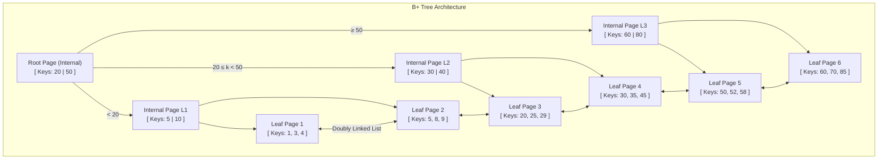
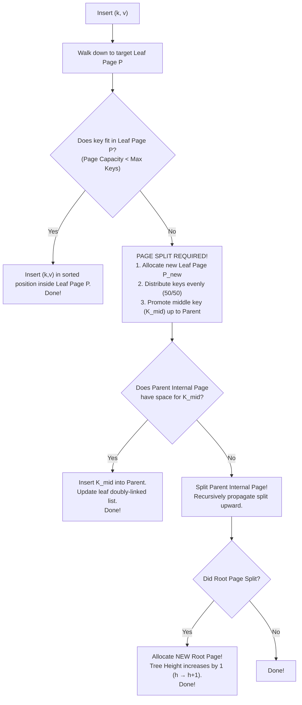
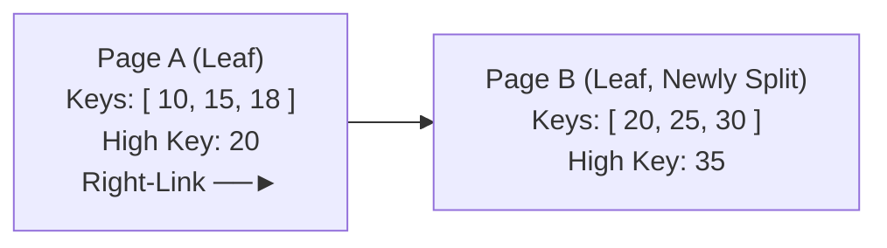

# B-Tree and B+ Tree Indexes — Structure, Search, Insert, Split

## Mental Model

Think of a **B+ Tree** as a multi-tiered corporate organization directory. 

The top management levels (Internal / Index Nodes) hold no actual employee files; they hold only routing signs ("Names A–G go to Floor 2, H–M to Floor 3"). Only the bottom floor (Leaf Nodes) contains actual employee folders (data records or row pointers). Crucially, all offices on the bottom floor are connected by a long contiguous hallway (doubly linked list of leaf pages). 

When searching for a single person, you follow the floor signs from top to bottom in $O(\log N)$ steps. When looking for all employees whose names start with "D" through "K", you find "D" at the bottom floor and simply walk down the hallway until you hit "K"—never needing to return to upper floors.

---

## 1. Structural Comparison: B-Tree vs. B+ Tree

Both structures are self-balancing multi-way search trees of order $m$, designed to minimize disk I/O operations for secondary storage.

| Feature | Classic B-Tree | B+ Tree (Standard DB Index) |
|---|---|---|
| **Data Storage Location** | Data records/pointers stored in **all** nodes (internal and leaf). | Data records/pointers stored **exclusively in leaf nodes**. |
| **Internal Node Role** | Stores keys AND associated record pointers. | Stores ONLY keys and child page pointers (routing keys). |
| **Leaf Node Structure** | Isolated leaf nodes (no sibling links). | Leaf nodes are connected via **doubly linked list** pointers (`prev` / `next`). |
| **Search Performance** | Variable: $O(1)$ best case (key in root), $O(\log N)$ worst. | Predictable: Always exactly $h$ (height) disk page reads. |
| **Range Queries** | Expensive: Requires tree traversal (in-order tree walk). | Efficient: $O(\log N)$ to find start key, then sequential scan along leaf chain. |
| **Fan-out per Page** | Lower (data pointers consume page byte space in internal nodes). | **Much Higher** (internal nodes hold more routing keys per 8KB page). |



---

## 2. Mathematical Properties & Fan-Out Calculation

A B+ Tree of order $m$ guarantees:
1. Every internal node (except root) has at least $\lceil m / 2 \rceil$ children.
2. The root node has at least 2 children (unless total entries $< m$).
3. All leaf nodes are located at the exact same depth $h$.

### Mathematical Fan-Out & Depth Formula

Let $P$ be the database page size (e.g., 8,192 bytes in PostgreSQL, 16,384 bytes in MySQL InnoDB).
Let $K$ be key size in bytes (e.g., 8-byte `BIGINT`), and $V$ be child pointer size (8 bytes).

$$\text{Fan-Out } (F) = \left\lfloor \frac{P - \text{PageHeaderSize}}{K + V} \right\rfloor$$

#### Example Calculation (PostgreSQL 8KB Page, `BIGINT` Key):
$$\text{Fan-Out } (F) = \left\lfloor \frac{8192 - 24}{8 + 8} \right\rfloor = \left\lfloor \frac{8168}{16} \right\rfloor \approx 510 \text{ keys per page}$$

#### Table Size Supported by Tree Height ($h$):

| Height ($h$) | Max Leaf Nodes ($F^{h-1}$) | Total Entries (at 70% Fill Factor) | Disk Search I/Os |
|---|---|---|---|
| $h = 1$ (Root only) | 1 | ~350 entries | 1 page read |
| $h = 2$ | 510 | ~180,000 entries | 2 page reads |
| $h = 3$ | 260,100 | **~92,000,000 entries** | 3 page reads |
| $h = 4$ | 132,651,000 | **~47,000,000,000 entries** | 4 page reads |

> **Key takeaway:** A B+ Tree with height $h=3$ can index nearly 100 million records while requiring **only 3 page I/O reads** to locate any arbitrary key!

---

## 3. Core Algorithms: Search, Insert, Split

### A. Search Algorithm

To locate key $k$:
1. Start at Root Page.
2. Perform binary search on keys within page to find child pointer $c_i$ where $K_i \le k < K_{i+1}$.
3. Traverse down to child page $c_i$.
4. Repeat until reaching a Leaf Page.
5. Perform binary search within Leaf Page. If found, return data tuple pointer / record ID.

---

### B. Insert & Page Split Algorithm

Inserting key $k$ with value $v$:



---

## 4. Concurrent Access: B-Link Trees & Latch Crabbing

High-throughput multi-threaded databases cannot lock the entire index during insertions.

### Latch Crabbing (Lock Coupling)
- **Search (Read):** Acquire Shared (S) latch on Parent $\to$ Acquire S latch on Child $\to$ Release S latch on Parent ("crabbing" down the tree).
- **Insert (Write):** Acquire Exclusive (X) latch on Parent. If Child is "safe" (will not split upon insertion), release X latch on Parent.

### PostgreSQL `nbtree` (Lehman-Yao B-Link Tree)
PostgreSQL implements the **Lehman-Yao B-link tree algorithm**. 

Every internal and leaf node contains a **High Key** (the upper bound key stored in that page) and a **Right Link** pointer directly to its right sibling page.



> **Why this matters:** If Process 1 is searching for key `22` and reads Page A just as Process 2 splits Page A, Process 1 notices key `22 > High Key (20)`. Without re-traversing from the root, Process 1 simply follows the **Right-Link pointer** directly to Page B! This eliminates read-locks on parent nodes during page splits.

---

## 5. PostgreSQL & MySQL Storage Implementation

### PostgreSQL `nbtree` Page Layout (8KB)

```text
+-------------------------------------------------------------+
| PageHeaderData (24 bytes: LSN, checksum, flags, pd_lower...) |
+-------------------------------------------------------------+
| ItemIdData array (line pointers to index tuples)            |
+-------------------------------------------------------------+
|                     <--- Free Space --->                    |
+-------------------------------------------------------------+
| Index Tuples Data (grows upward from bottom of page)        |
| - High Key (BTPageOpaque)                                   |
| - Index Tuples (IndexAttribute + Heap Tuple Pointer tid)    |
+-------------------------------------------------------------+
| Special Space (BTPageOpaqueData: btpo_prev, btpo_next, etc)  |
+-------------------------------------------------------------+
```

### MySQL InnoDB Clustered vs. Secondary B+ Tree

- **Clustered Index (Primary Key):** Leaf pages contain the **actual row data** (`PRIMARY KEY` + all table columns).
- **Secondary Index:** Leaf pages store the secondary key values plus the **Primary Key value** (not physical row pointers). Secondary index lookups require a two-pass **Bookmark Lookup / Double Search**:

$$\text{Secondary B+ Tree Lookup} \to \text{Primary Key} \to \text{Clustered B+ Tree Lookup} \to \text{Row Data}$$

---

## 6. Production Operations & Inspection Commands

### Inspecting B+ Tree Structure & Bloat in PostgreSQL

```sql
-- Enable pgstattuple extension to inspect internal B-Tree page fill factors
CREATE EXTENSION IF NOT EXISTS pgstattuple;

-- Inspect B-Tree physical page stats
SELECT 
    tree_level,
    index_size,
    leaf_pages,
    empty_pages,
    avg_leaf_density AS fill_factor_percent,
    leaf_fragmentation
FROM pgstatindex('idx_orders_customer_id');
```

### Rebuilding B-Tree Indexes Concurrently

Page splits cause **index bloat** over time (pages remaining 50% empty after deletions).

```sql
-- Rebuild index concurrently without blocking writes/reads in production
REINDEX INDEX CONCURRENTLY idx_orders_customer_id;
```

---

## 7. Failure Modes and Trade-offs

1. **Random Insertion Page Split Storms** — Inserting random UUIDv4 keys into a B+ tree forces random page lookups and continuous 50/50 page splits, degrading fill factor to ~50% and causing extreme write amplification. *Mitigation*: Use sequential key generation (UUIDv7, ULID, or `BIGSERIAL`).
2. **Index Bloat from MVCC Updates** — In PostgreSQL, `UPDATE` statements create new tuple versions. If indexed columns are updated, new index entries are created, causing index bloat. *Mitigation*: Enable HOT (Heap-Only Tuple) updates by keeping indexed columns out of update paths, or schedule `REINDEX CONCURRENTLY`.
3. **Write Amplification under High Write Loads** — Every B+ Tree modification requires in-place updates to 8KB/16KB disk pages, causing heavy random I/O and WAL write volume. *Mitigation*: Switch high-ingest write workloads to LSM-tree databases (RocksDB/Cassandra).

---

## 8. Active-Recall Prompts

1. **Why do database engines use B+ Trees instead of classic B-Trees for secondary storage indexing? Give two architectural reasons.**
2. **What is the mathematical definition of Fan-Out, and how does it explain why a 3-level B+ Tree can index 90 million rows in 3 page reads?**
3. **How does the Lehman-Yao B-Link tree (used in PostgreSQL `nbtree`) allow read operations to continue without holding locks on parent nodes during a page split?**
4. **Explain why inserting UUIDv4 keys causes index bloat and performance degradation in B+ Trees compared to UUIDv7 or BIGINT autoincrement keys.**

---

## Related Notes

- [[LSM Tree - Log-Structured Merge Tree, Compaction, RocksDB]]
- [[Index Design Patterns - Composite, Covering, Partial, Expression Indexes]]
- [[Buffer Pool Manager - Page Cache, Replacement Policies, Dirty Pages]]
- [[PostgreSQL Internals - MVCC Implementation, Tuple Header, VACUUM, Toast]]

> **Interview Style Question:** *"Your engineering team switched a high-throughput primary key column from autoincrement `BIGINT` to random `UUIDv4`. Within two weeks, write latency increased 8x, and database storage grew by 300%. Explain the underlying B+ tree page mechanics causing this behavior and propose two alternative architectural solutions."*

---
