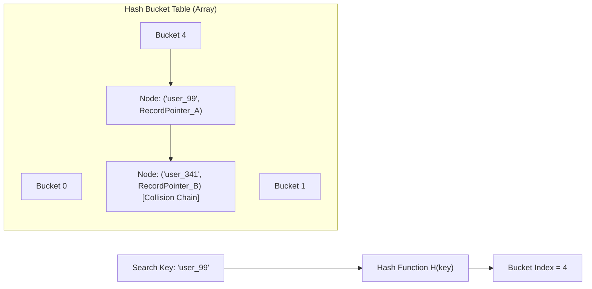
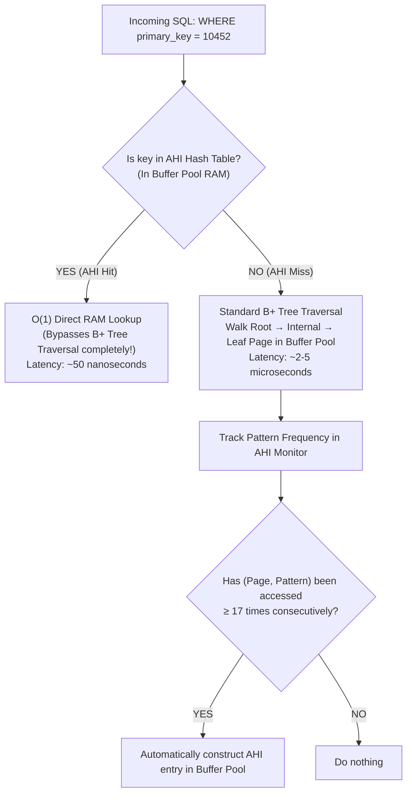

# Hash Indexes and Adaptive Hash Index in MySQL InnoDB

## Mental Model

Think of a **Hash Index** as an automated reception desk with a huge wall of numbered mail slots (buckets). 

When given a key (e.g., SSN `"987-65-4321"`), a mathematical hash function instantly calculates the exact slot number (e.g., Slot `#412`), allowing you to fetch the document in $O(1)$ constant time. However, if someone asks for "all people with SSNs starting with 987", the receptionist must inspect **every single slot on the wall** because hash functions scatter sequential values randomly across slots.

MySQL InnoDB's **Adaptive Hash Index (AHI)** acts as an intelligent AI layer observing B+ Tree traversals. If it notices queries frequently traversing down the 4-level B+ Tree to find the exact same hot keys, it dynamically builds an in-memory hash index in the buffer pool, bypassing the B+ Tree search entirely ($O(\log N) \to O(1)$).

---

## 1. Hash Index Mechanics vs. B+ Tree

A Hash Index maps index key values to bucket pointers using a hash function $H(\text{key}) \pmod N$.



### Feature Comparison Matrix

| Feature | Hash Index | B+ Tree Index |
|---|---|---|
| **Point Lookup (`=`) Time** | $O(1)$ Average | $O(\log N)$ (Typically 3–4 page I/Os) |
| **Range Queries (`>`, `<`, `BETWEEN`)** | **Unsupported** ($O(N)$ full table scan required) | **Supported** ($O(\log N) + \text{Leaf Scan}$) |
| **Prefix Matching (`LIKE 'abc%'`)** | **Unsupported** (Hash function requires full key) | **Supported** (Leading column matching) |
| **Sorting (`ORDER BY`)** | **Unsupported** (Hash values are unordered) | **Supported** (Keys stored in sorted order) |
| **Storage Overhead** | Array of buckets + collision chain nodes | Page tree structure with high fan-out |

---

## 2. PostgreSQL Hash Index Implementation

Historically (prior to PostgreSQL 10), PostgreSQL Hash indexes were not WAL-logged and thus crash-unsafe. Modern PostgreSQL 10+ hash indexes are fully WAL-logged and crash-safe.

### Dynamic Hash Bucket Management
PostgreSQL uses **Linear Hashing** to dynamically split individual buckets when load factor increases, avoiding full hash table allocation locks.

```sql
-- Create explicit Hash Index in PostgreSQL for equality-only lookups
CREATE INDEX idx_users_session_token ON users USING HASH (session_token);
```

> **When to use in PostgreSQL:** High-cardinality long string keys (e.g., 128-byte UUIDs or SHA-256 tokens) evaluated **exclusively** with `=` equality operators. The Hash Index is smaller than a B-Tree index because it stores 4-byte hash codes instead of full 128-byte string keys.

---

## 3. MySQL InnoDB Adaptive Hash Index (AHI)

In MySQL InnoDB, users **cannot** manually create an explicit `HASH` index on InnoDB disk tables. Instead, InnoDB provides an internal, self-tuning feature called the **Adaptive Hash Index (AHI)**.

### AHI Architecture & Operating Mechanism



### When AHI Builds Automatically
InnoDB monitors index searches on B+ Tree pages. If it observes:
1. A page is accessed repeatedly with the exact same search pattern (e.g., `WHERE col1 = x AND col2 = y`).
2. The page access pattern occurs **at least 17 times** (or $1/16$ of total page reads).

InnoDB builds a hash index entry mapping `(Key Prefix) -> (Page Buffer Pointer)` directly inside the Buffer Pool memory.

---

## 4. Production Operations & Inspection Commands

### Monitoring Adaptive Hash Index Performance in MySQL

```sql
-- Check AHI status and hit rate in InnoDB Status
SHOW ENGINE INNODB STATUS\G

----------------------------------------
-- ADAPTIVE HASH INDEX SECTION IN OUTPUT:
----------------------------------------
-- Hash table size 34679, node heap has 1 buffer(s)
-- 1245.50 hash searches/s, 42.10 non-hash searches/s
-- AHI Hit Ratio = 1245.50 / (1245.50 + 42.10) ≈ 96.7%
```

```sql
-- View AHI memory usage via Information Schema
SELECT 
    EVENT_NAME, 
    CURRENT_NUMBER_OF_BYTES_USED / 1024 / 1024 AS MB_USED
FROM performance_schema.memory_summary_global_by_event_name
WHERE EVENT_NAME LIKE '%adaptive hash%';
```

### Disabling AHI on High-Concurrency Write Workloads

On high-core servers (e.g., 64+ vCPUs) undergoing massive concurrent write/insert workloads, AHI can become a **severe lock contention bottleneck** due to mutex locking (`btr_search_latch`).

```sql
-- Disable Adaptive Hash Index dynamically (no restart required)
SET GLOBAL innodb_adaptive_hash_index = OFF;

-- In my.cnf / my.ini for permanent configuration
[mysqld]
innodb_adaptive_hash_index = OFF
innodb_adaptive_hash_index_parts = 8  # Or partition AHI into 8 parts (MySQL 5.7+)
```

---

## 5. Failure Modes and Trade-offs

1. **`btr_search_latch` Mutex Contention** — Under extreme concurrent `INSERT`/`UPDATE` workloads in MySQL InnoDB, multiple threads attempt to update the AHI hash table simultaneously, causing threads to stall on `btr_search_latch` or `rw-lock`. *Mitigation*: Partition AHI (`innodb_adaptive_hash_index_parts = 8` or `16`) or disable AHI entirely (`innodb_adaptive_hash_index = OFF`).
2. **Buffer Pool Memory Waste** — In workloads with random, non-repeating point queries, AHI allocates hash nodes in the buffer pool that are never reused, stealing memory from dirty page caching. *Mitigation*: Turn OFF AHI for unpredictable point-query access patterns.
3. **Misusing Hash Indexes for Range Queries** — Creating a Hash Index in PostgreSQL on columns subjected to `ORDER BY` or range predicates (`>`, `<`) forces the planner to fall back to expensive full table sequential scans. *Mitigation*: Restrict Hash Indexes strictly to high-cardinality equality token lookups.

---

## 6. Active-Recall Prompts

1. **Why are Hash Indexes completely unable to optimize `SELECT * FROM users WHERE age > 30` or `ORDER BY age` queries?**
2. **Explain how MySQL InnoDB's Adaptive Hash Index (AHI) converts an $O(\log N)$ B+ Tree lookup into an $O(1)$ memory lookup. What threshold triggers AHI creation?**
3. **Why does high concurrent write activity in MySQL sometimes cause severe throughput drops due to AHI, and what configuration parameter resolves it?**
4. **When would a PostgreSQL engineer choose an explicit `HASH` index over a `B-TREE` index for an API session token column?**

---

## Related Notes

- [[B-Tree and B+ Tree Indexes - Structure, Search, Insert, Split]]
- [[Index Design Patterns - Composite, Covering, Partial, Expression Indexes]]
- [[Buffer Pool Manager - Page Cache, Replacement Policies, Dirty Pages]]
- [[MySQL InnoDB Architecture - Clustered Index, Buffer Pool, Doublewrite Buffer]]

> **Interview Style Question:** *"During a 100,000 requests/sec performance test on a 64-core MySQL database server, CPU utilization hit 100%, but throughput collapsed. InnoDB mutex metrics show thousands of threads waiting on `btr_search_latch`. Diagnose the root cause and explain the architectural trade-offs of the fix."*

---
